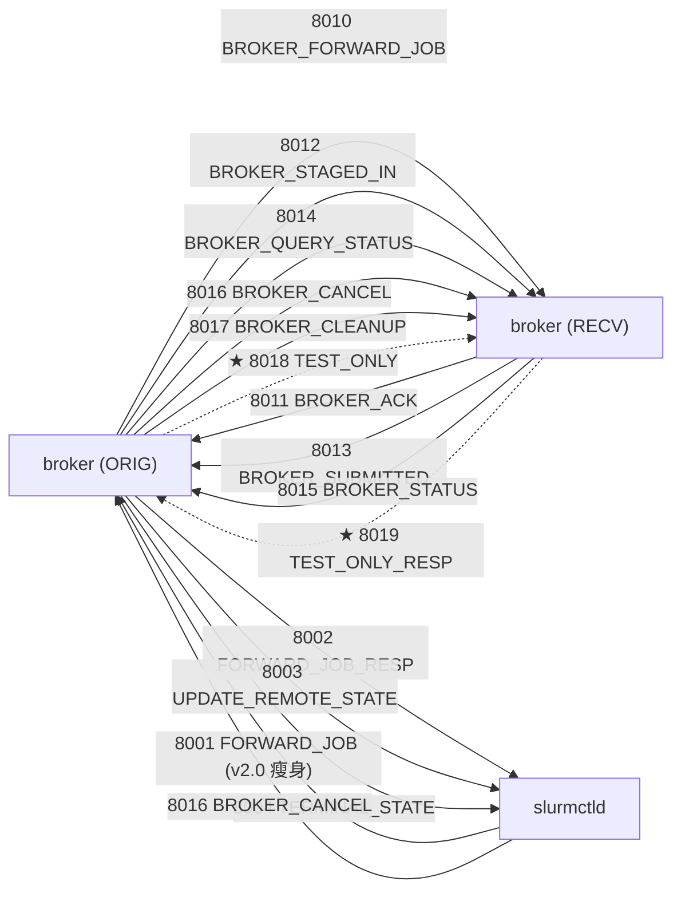

# M04 RPC 协议 pack/unpack Checklist (broker · v2.0)

> 配套: [doc/Broker详细设计文档MVP_v2.md](../Broker详细设计文档MVP_v2.md) §6
> 差异蓝图: [doc/跨域调度详设-差异变更说明.md](../跨域调度详设-差异变更说明.md) §2.6
> Sprint: S1
> 依赖: M02 (broker_conf), M03 (broker_job_t)
> 下游: M05 / M06 / M07 / M08 / M09 / M13 / M16 全部使用本模块定义的 msg_type / payload 结构
> **跨模块单一源头**: 本文档定义所有 13 个 broker `BROKERD_REQUEST_*` / `BROKERD_RESPONSE_*` msg_type 与 payload 字段顺序，**其它文档只引用不重复**。

> **v1.5 → v2.0 增量**:
> 1. ★ 新增 8018 / 8019 (`BROKERD_REQUEST_BROKER_TEST_ONLY` / `BROKERD_RESPONSE_BROKER_TEST_ONLY`)
> 2. ★ 8001 (`BROKERD_REQUEST_FORWARD_JOB`) payload 瘦身：删除 `target_cluster` / `target_partition` / `account` / `job_desc`；新增 `src_cluster_name` / `src_partition`；`app_name` → `cd_app_name`
> 3. ★ 8003 (`BROKERD_REQUEST_BROKER_UPDATE_REMOTE_STATE`) 字段未变，但**首次包**必带 `remote_cluster_name` + `remote_partition_name`（语义约束，由 M13 保证）
> 4. ★ 新增 5 个错误码：9010 (`NO_VIABLE_ROUTE`) / 9011 (`TEST_ONLY_REJECTED`) / 9012 (`TEST_ONLY_TIMEOUT`) / 9013 (`ALL_ROUTES_EXHAUSTED`) / 9020 (`CAP_FULL_SOFT_WAIT`)
> 5. ★ 8018 / 8019 标 `LEGACY_M04_TRANSITIONAL`，与 8001~8004 一同等待 ctld 同事在 `src/common/` 注册后机械删除

---

## 1. 模块概述与目标

### 1.1 一句话定位

为 broker 自定义 RPC 申请 msg_type 段位、定义 payload C 结构、实现 pack/unpack；**完全自包含**于 `src/slurmbrokerd/`。复用 Slurm 公共的 pack 原子函数（`pack8/16/32`、`packstr`、`pack_msg`、`auth_g_pack` 等）但不挂到 Slurm 主线 `pack_msg()` 大 switch；自带 wire frame 让 broker 进程互发的 RPC 不依赖任何 ctld 端改造即可独立编译、单测、部署。

### 1.2 v2.0 MVP 范围

- **13 个** `BROKERD_*` msg_type 段位（8000-8099, v2.0 扩 8018/8019）
- **14 个** `BROKERD_ERR_*` 错误码段位（9001-9020, v2.0 扩 9010~9013/9020）
- 13 套 `brokerd_*_msg_t` 结构 + `brokerd_free_*_msg()` 释放
- 13 套 `_pack_*_msg` / `_unpack_*_msg` + `brokerd_pack_msg` / `brokerd_unpack_msg` dispatcher
- 自定义 wire frame：`[magic 'BRKR'][proto_ver][msg_type][auth_blob][payload]`（不变）
- broker 内部 wrapper `proto.c::proto_init` / `proto_send_recv_to_peer`（不变）

### 1.3 不在 MVP 范围

- ~~v0.2 自定义 wire format / mTLS~~（v1.5 已落地的 wire frame 沿用）
- ~~RPC schema 自动生成~~
- ~~复用 `slurm_msg_t.msg_type` 大 switch~~（违背 broker rule）

### 1.4 与 v1.5 的差异

| 维度 | v1.5 | v2.0 |
|---|---|---|
| msg_type 数量 | 11 | **13** (+8018/8019) |
| 错误码数量 | 9 | **14** (+9010~9013, 9020) |
| `BROKERD_REQUEST_FORWARD_JOB` payload | 10 字段含 `job_desc` | **6 字段瘦身, 删 job_desc** |
| 远端目的地决策位置 | ctld 用 `target_cluster/partition` 直填 | broker 端 `route_decide()` 用新字段 `src_cluster_name/src_partition` 查 routes.conf |
| `account` 字段传输 | 透传 | **删除**（v2.0 远端 sbatch 不带 --account, M07 用 `--export=NONE`） |
| test-only 探测 | n/a | **8018/8019 一对同步 RPC, 5s 超时** |
| 错误码 → ctld 错误码映射 | 5002~5008 | **+5010~5013, 5020 共 5 个新映射** (ctld 侧 ctld-M01 已落地) |

---

## 2. 接口契约

### 2.1 msg_type 枚举（**单一源头**, v2.0 共 13 个）

申请连续段 `8000 ~ 8099`。**全部宏定义**在 [src/slurmbrokerd/proto.h](../../src/slurmbrokerd/proto.h)，不再触碰 `slurm_protocol_defs.h`：

```c
/* === src/slurmbrokerd/proto.h ===
 * Range 8000-8099 reserved for slurmbrokerd. Numbers are wire-significant.
 */

/* ctld <-> broker (local munge socket, 走 LEGACY_M04_TRANSITIONAL) */
#define BROKERD_REQUEST_FORWARD_JOB                 8001
#define BROKERD_RESPONSE_FORWARD_JOB                8002
#define BROKERD_REQUEST_BROKER_UPDATE_REMOTE_STATE  8003
#define BROKERD_REQUEST_BROKER_TERMINAL_STATE       8004

/* broker <-> broker (peer port, PERMANENT) */
#define BROKERD_REQUEST_BROKER_FORWARD_JOB          8010
#define BROKERD_RESPONSE_BROKER_ACK                 8011
#define BROKERD_REQUEST_BROKER_STAGED_IN            8012
#define BROKERD_RESPONSE_BROKER_SUBMITTED           8013
#define BROKERD_REQUEST_BROKER_QUERY_STATUS         8014
#define BROKERD_RESPONSE_BROKER_STATUS              8015
#define BROKERD_REQUEST_BROKER_CANCEL               8016
#define BROKERD_REQUEST_BROKER_CLEANUP              8017

/* ★ v2.0 broker <-> broker test-only probe (LEGACY_M04_TRANSITIONAL) */
#define BROKERD_REQUEST_BROKER_TEST_ONLY            8018
#define BROKERD_RESPONSE_BROKER_TEST_ONLY           8019
```

> 任何其它 broker 模块（M05/M06/M07/M08/M09/M13/M16）若引用，**仅 include `src/slurmbrokerd/proto.h`**，不复制定义。

### 2.2 错误码（**单一源头**, v2.0 扩 5 个）

```c
/* src/slurmbrokerd/proto.h, 9001-9099 reserved for broker */
#define BROKERD_ERR_OVERLOAD                  9001 /* > MaxInFlightJobs */
#define BROKERD_ERR_NO_USER_MAPPING           9002
#define BROKERD_ERR_USER_MAPPING_MISMATCH     9003
#define BROKERD_ERR_HOP_EXCEEDED              9004
#define BROKERD_ERR_LOOKUP_FAILED             9005
#define BROKERD_ERR_LOOKUP_TIMEOUT            9006
#define BROKERD_ERR_STAGE_FAILED              9007
#define BROKERD_ERR_REMOTE_SUBMIT_FAILED      9008
#define BROKERD_ERR_NOT_FOUND                 9009

/* ★ v2.0 新增 5 个 */
#define BROKERD_ERR_NO_VIABLE_ROUTE           9010 /* routes.conf 无匹配 */
#define BROKERD_ERR_TEST_ONLY_REJECTED        9011 /* 远端 ctld 拒绝 (资源/ACL/QOS) */
#define BROKERD_ERR_TEST_ONLY_TIMEOUT         9012 /* test-only 5s 超时 */
#define BROKERD_ERR_ALL_ROUTES_EXHAUSTED      9013 /* 所有候选探测均失败 */
#define BROKERD_ERR_CAP_FULL_SOFT_WAIT        9020 /* 临时性容量满, 不置 cd_route_exhausted */
```

`brokerd_strerror(int rc)` 在 [src/slurmbrokerd/proto.c](../../src/slurmbrokerd/proto.c) 内自带映射（中英文双语），未知 rc 回退到 `slurm_strerror(rc)`。

### 2.3 13 个 payload 结构（字段顺序 wire-significant, v2.0 增 2）

> 全部定义在 [src/slurmbrokerd/proto.h](../../src/slurmbrokerd/proto.h)。下面只列**v2.0 变更**部分；其它 9 个 broker→broker 沿用 v1.5。

#### 2.3.1 `BROKERD_REQUEST_FORWARD_JOB` (8001) ★ v2.0 瘦身

```c
typedef struct {
	/* 身份信息 */
	uint32_t   src_job_id;
	uint32_t   src_uid;
	uint32_t   src_gid;
	char      *src_user_name;

	/* ★ v2.0 新增: 用于 broker route_decide() 查 routes.conf */
	char      *src_cluster_name;       /* 取代 v1.5 target_cluster */
	char      *src_partition;          /* 取代 v1.5 target_partition */

	/* 输入文件位置 */
	char      *src_work_dir;
	char      *script_path;

	/* 应用标识 */
	char      *cd_app_name;            /* 取代 v1.5 app_name */

	/* === v2.0 已删 (ctld 端 ctld-M04 已同步删除) ===
	 * char *target_cluster;
	 * char *target_partition;
	 * char *account;
	 * job_desc_msg_t *job_desc;
	 */
} brokerd_forward_job_msg_t;
```

#### 2.3.2 `BROKERD_RESPONSE_FORWARD_JOB` (8002) 不变

```c
typedef struct {
	uint32_t   error_code;
	char      *trace_id;
} brokerd_forward_job_resp_msg_t;
```

#### 2.3.3 `BROKERD_REQUEST_BROKER_UPDATE_REMOTE_STATE` (8003) ★ v2.0 字段不变, 仅语义约束

```c
typedef struct {
	uint32_t   src_job_id;
	char      *trace_id;
	char      *remote_cluster_name;     /* ★ v2.0: 首次包必填 (由 M13 sync_ticker 保证) */
	char      *remote_partition_name;   /* ★ v2.0: 首次包必填 */
	uint32_t   remote_job_id;
	uint32_t   remote_state;
	char      *remote_alloc_tres;
	time_t     remote_start_time;
} brokerd_remote_state_msg_t;
```

#### 2.3.4 ★ v2.0 新增 `BROKERD_REQUEST_BROKER_TEST_ONLY` (8018)

```c
typedef struct {
	char      trace_id[BROKER_TRACE_ID_LEN];   /* 定长 48 字节, 与 broker_job_t 一致 */
	uint32_t  src_uid;
	char     *src_user_name;
	uint32_t  remote_uid;
	char     *remote_user_name;        /* originator 端 LocalUser= 查表得到 */
	char     *remote_partition;        /* 候选 partition 名 */
	char     *cd_app_name;             /* 远端 broker 据此查 routes.conf::AllowApps 验证 */

	/* job_desc 关键字段抽取 (避免传完整 job_desc_msg_t, 保持版本解耦) */
	uint32_t  num_tasks;
	uint32_t  cpus_per_task;
	uint64_t  pn_min_memory;
	uint32_t  time_limit_min;
	uint32_t  min_nodes;
	uint32_t  max_nodes;
	char     *gres_per_node;
	char     *qos;
	char     *tres_per_task;
} brokerd_test_only_msg_t;
```

#### 2.3.5 ★ v2.0 新增 `BROKERD_RESPONSE_BROKER_TEST_ONLY` (8019)

```c
typedef struct {
	char      trace_id[BROKER_TRACE_ID_LEN];
	uint16_t  result;                  /* 0=OK, 1=REJECTED, 2=TIMEOUT */
	uint32_t  reject_reason_code;      /* 远端 ctld 返回的 ESLURM_*; 0=N/A */
	char     *reject_reason_text;
} brokerd_test_only_resp_msg_t;
```

> v1.5 已有的其它 8 个 payload（`brokerd_broker_forward_job_msg_t` ... `brokerd_broker_cleanup_msg_t`）字段顺序与 v1.5 完全一致，**禁止重排**。

### 2.4 自定义 wire frame（不变）

```text
+-----------------+--------------+--------------+----------------+----------------+
| magic (u32)     | proto_ver    | msg_type     | auth_blob      | payload_blob   |
| 'BRKR'/0x524B5242 | (u16)      | (u16)        | (auth_g_pack)  | (brokerd_pack) |
+-----------------+--------------+--------------+----------------+----------------+
```

> v2.0 不变；test-only 8018/8019 同样走该 frame。

### 2.5 broker 内部 wrapper API（v2.0 增 1 个 async wrapper）

```c
/* === src/slurmbrokerd/proto.h (v1.5 已有, 不变) === */
extern int  proto_init(void);
extern void proto_fini(void);
extern int  proto_send_recv_to_peer(uint16_t msg_type, void *req,
                                    int timeout_s,
                                    uint16_t resp_type, void **resp_out);
extern void brokerd_free_msg_data(uint16_t msg_type, void *data);
extern const char *brokerd_msg_type_str(uint16_t msg_type);
extern const char *brokerd_strerror(int rc);

/* === ★ v2.0 新增: 带显式目的地 + 回调的异步 wrapper, 用于 8018 ===
 * 实现在 M08 egress.c 内, 不在本模块; 此处仅记录 cross-ref。 */
typedef void (*test_only_callback_t)(broker_job_t *job, int rc,
                                     brokerd_test_only_resp_msg_t *resp,
                                     void *user_arg);

extern int  egress_test_only_async(broker_job_t *job,
                                   route_candidate_t *cand,
                                   test_only_callback_t cb, void *user_arg);
```

### 2.6 全局变量（不变）

| 名称 | 类型 | 用途 | 文件 |
|---|---|---|---|
| `g_peer_addr` | `slurm_addr_t`（static） | proto_init 时按 `g_broker_conf.remote_broker_host:port` 解析填好（仅 STATIC_LEGACY 路径用，FILE 路径走 routes.conf 动态查） | `proto.c` |
| `g_peer_host` / `g_peer_port` | `char *` / `uint16_t`（static） | 日志 | `proto.c` |

> ★ v2.0：`RouteSource=file` 时，每次 `proto_send_recv_to_peer` 的 peer 地址由 caller（M08 egress）从 `route_candidate_t` 拿出，**不**再依赖 g_peer_addr。本模块 API 增加 caller 参数 `slurm_addr_t *peer`（M08-T1 详细设计）。

---

## 3. 参考代码

| 用途 | 文件 | 说明 |
|---|---|---|
| `slurm_msg_t_init` | [src/common/slurm_protocol_defs.h](../../src/common/slurm_protocol_defs.h) | 初始化嵌套 `slurm_msg_t` |
| `slurm_open_msg_conn` | [src/common/slurm_protocol_api.h](../../src/common/slurm_protocol_api.h) | 创建 TCP 流 socket 并 connect |
| `slurm_msg_sendto` / `slurm_msg_recvfrom_timeout` | [src/common/slurm_protocol_socket.h](../../src/common/slurm_protocol_socket.h) | 自带 4 字节 length-prefix 收发 |
| `auth_g_*` | [src/interfaces/auth.h](../../src/interfaces/auth.h) | wire frame 的 munge auth |
| `pack8/16/32/str/time` | [src/common/pack.h](../../src/common/pack.h) | wire format 原子 |
| `slurm_strerror` | [slurm/slurm_errno.h](../../slurm/slurm_errno.h) | `brokerd_strerror` 兜底 |

---

## 4. 文件清单

| 文件 | 类型 | 用途 |
|---|---|---|
| [src/slurmbrokerd/proto.h](../../src/slurmbrokerd/proto.h) | 修改 | 新增 8018/8019 宏 + 5 错误码 + 2 payload struct + free 声明 + 1 callback typedef; 修改 8001 payload 瘦身; 新增 `BROKER_TRACE_ID_LEN` (M03 已 export) |
| [src/slurmbrokerd/proto_pack.c](../../src/slurmbrokerd/proto_pack.c) | 修改 | 新增 `_pack_test_only_msg` / `_unpack_test_only_msg` / `_pack_test_only_resp_msg` / `_unpack_test_only_resp_msg` 4 个 helper; dispatcher 增 2 case (8018/8019); 修改 `_pack_forward_job_msg` 删 job_desc + 改字段顺序 |
| [src/slurmbrokerd/proto.c](../../src/slurmbrokerd/proto.c) | 修改 | 新增 `brokerd_free_test_only_msg` / `brokerd_free_test_only_resp_msg`; `brokerd_free_msg_data` 增 2 case; `brokerd_strerror` 增 5 字符串映射; `brokerd_msg_type_str` 增 2 case |
| [src/slurmbrokerd/Makefile.am](../../src/slurmbrokerd/Makefile.am) | 不变 | proto* 文件已在 SOURCES |
| `tests/broker/test_proto_roundtrip_v2.c` | 新增（M04-T6 DoD）| 13 套 round-trip 单测；含 8018/8019 与 8001 v2.0 字段 |

> ⚠️ **不动** `src/common/slurm_protocol_*` 与 `src/common/slurm_errno.*`——broker rule 与本 checklist 的硬性约束。

---

## 5. 数据流图（v2.0 增 8018/8019）



---

## 6. 任务展开

### M04-T1 申请 8018/8019 段位与 5 个新错误码

- **依赖**: M02-T1 (`broker_conf_t`)
- **预估**: 0.25d
- **关键决策**:
  1. 8018/8019 紧接在 8017 (`BROKERD_REQUEST_BROKER_CLEANUP`) 之后，保留 8020-8099 给后续扩展。
  2. 9010~9013 是"路由域"错误，9020 是"容量域"错误（与路由域语义分离，避免误置 `cd_route_exhausted`）。
  3. `brokerd_strerror()` 表必须为每个新 `BROKERD_ERR_*` 写中英文（中文供运维，英文供 grep）。
- **代码草图**（差异部分）:

```c
const char *brokerd_strerror(int rc)
{
	switch (rc) {
	case 0:                                  return "Success / 成功";
	case BROKERD_ERR_OVERLOAD:               return "broker overloaded / broker 在途数超限";
	/* ... v1.5 9 个 (略) ... */

	/* ★ v2.0 新增 */
	case BROKERD_ERR_NO_VIABLE_ROUTE:
		return "no viable route in routes.conf / routes.conf 无匹配候选路由";
	case BROKERD_ERR_TEST_ONLY_REJECTED:
		return "remote ctld rejected test-only probe / 远端 ctld 拒绝 test-only 探测";
	case BROKERD_ERR_TEST_ONLY_TIMEOUT:
		return "test-only probe timeout / test-only 探测超时";
	case BROKERD_ERR_ALL_ROUTES_EXHAUSTED:
		return "all candidate routes exhausted / 所有候选路由均失败";
	case BROKERD_ERR_CAP_FULL_SOFT_WAIT:
		return "all candidate routes capacity full (soft, retryable) / "
		       "所有候选路由容量满 (临时, 可重试)";
	default:
		return slurm_strerror(rc);
	}
}
```

- **DoD**:
  - [ ] `brokerd_strerror(BROKERD_ERR_NO_VIABLE_ROUTE)` 返回非 NULL
  - [ ] `brokerd_strerror(BROKERD_ERR_CAP_FULL_SOFT_WAIT)` 返回含 "临时" 字样
  - [ ] `grep -c '^#define BROKERD_REQUEST_BROKER_TEST_ONLY' src/slurmbrokerd/proto.h` = 1

### M04-T2 ★ v2.0 修改 `brokerd_forward_job_msg_t` (8001) 瘦身

- **依赖**: M04-T1
- **预估**: 0.5d
- **关键决策**:
  1. 删除 4 个字段（`target_cluster` / `target_partition` / `account` / `job_desc`），新增 2 个（`src_cluster_name` / `src_partition`）。
  2. `app_name` 改名 `cd_app_name`，与 ctld 端 `job_record_t.cd_app_name` 一致。
  3. **wire format 不兼容** v1.5：本字段表是新版本的 wire format，对端必须同步升级（依赖 ctld-M01 / ctld-M04 同步落地）。
  4. `brokerd_free_forward_job_msg` 同步删除对 `target_cluster` 等 4 字段的 xfree，新增对 `src_cluster_name` / `src_partition` 的 xfree。
- **代码草图**（差异部分）:

```c
/* proto_pack.c, ★ v2.0 重写 */
static void _pack_forward_job_msg(brokerd_forward_job_msg_t *m,
                                   buf_t *buffer, uint16_t pv)
{
	pack32(m->src_job_id, buffer);
	pack32(m->src_uid, buffer);
	pack32(m->src_gid, buffer);
	packstr(m->src_user_name, buffer);
	packstr(m->src_cluster_name, buffer);    /* ★ v2.0 新 */
	packstr(m->src_partition, buffer);       /* ★ v2.0 新 */
	packstr(m->src_work_dir, buffer);
	packstr(m->script_path, buffer);
	packstr(m->cd_app_name, buffer);
	/* v2.0 已删: target_cluster / target_partition / account / job_desc */
}

static int _unpack_forward_job_msg(brokerd_forward_job_msg_t **out,
                                    buf_t *buffer, uint16_t pv)
{
	brokerd_forward_job_msg_t *m = xmalloc(sizeof(*m));

	safe_unpack32(&m->src_job_id, buffer);
	safe_unpack32(&m->src_uid, buffer);
	safe_unpack32(&m->src_gid, buffer);
	safe_unpackstr(&m->src_user_name, buffer);
	safe_unpackstr(&m->src_cluster_name, buffer);   /* ★ v2.0 */
	safe_unpackstr(&m->src_partition, buffer);      /* ★ v2.0 */
	safe_unpackstr(&m->src_work_dir, buffer);
	safe_unpackstr(&m->script_path, buffer);
	safe_unpackstr(&m->cd_app_name, buffer);
	*out = m;
	return SLURM_SUCCESS;

unpack_error:
	brokerd_free_forward_job_msg(m);
	*out = NULL;
	return SLURM_ERROR;
}

void brokerd_free_forward_job_msg(brokerd_forward_job_msg_t *m)
{
	if (!m) return;
	xfree(m->src_user_name);
	xfree(m->src_cluster_name);          /* ★ v2.0 */
	xfree(m->src_partition);             /* ★ v2.0 */
	xfree(m->src_work_dir);
	xfree(m->script_path);
	xfree(m->cd_app_name);
	/* v2.0 已删: target_cluster / target_partition / account / job_desc */
	xfree(m);
}
```

- **风险与坑**:
  - v1.5 ctld → v2.0 broker → 字段顺序不一致，unpack 解出垃圾 → broker 端记日志后 reject (`SLURM_ERROR` + 关闭连接)。运维必须**同时升级** ctld 与 broker。
  - 删 `job_desc` 后 broker 端 `_handle_forward_job` 不再持有完整 job_desc；M07 receiver 端通过 8018 test-only 单独传"关键字段抽取"。
- **DoD**:
  - [ ] `_pack` → `_unpack` round-trip 字段全等
  - [ ] valgrind: 1000 次 `_pack`/`_unpack`/`free` 0 byte still reachable
  - [ ] grep `target_cluster` in proto.h → 仅注释（"v2.0 已删"）

### M04-T3 ★ v2.0 新增 `brokerd_test_only_msg_t` (8018) 与 free

- **依赖**: M04-T1
- **预估**: 0.75d
- **关键决策**:
  1. `trace_id` 用**定长 char[BROKER_TRACE_ID_LEN]** 而非 `char *`，与 v2.0 设计文档 §6.3.2 一致；wire 上 pack 用 `packmem(m->trace_id, BROKER_TRACE_ID_LEN, buffer)`。
  2. 抽取的 9 个 job_desc 字段全部按字段顺序逐个 pack；**不**走嵌套 `pack_msg`（避免远端依赖完整 job_desc_msg_t 的版本契约）。
  3. `gres_per_node` / `qos` / `tres_per_task` 三个 char* 可为 NULL（packstr 自动处理）。
  4. `brokerd_free_test_only_msg` 内对 3 个 char* 字段 xfree，**不**对 `trace_id`（定长数组）xfree。
- **代码草图**:

```c
static void _pack_test_only_msg(brokerd_test_only_msg_t *m,
                                 buf_t *buffer, uint16_t pv)
{
	packmem(m->trace_id, BROKER_TRACE_ID_LEN, buffer);
	pack32(m->src_uid, buffer);
	packstr(m->src_user_name, buffer);
	pack32(m->remote_uid, buffer);
	packstr(m->remote_user_name, buffer);
	packstr(m->remote_partition, buffer);
	packstr(m->cd_app_name, buffer);

	pack32(m->num_tasks, buffer);
	pack32(m->cpus_per_task, buffer);
	pack64(m->pn_min_memory, buffer);
	pack32(m->time_limit_min, buffer);
	pack32(m->min_nodes, buffer);
	pack32(m->max_nodes, buffer);
	packstr(m->gres_per_node, buffer);
	packstr(m->qos, buffer);
	packstr(m->tres_per_task, buffer);
}

static int _unpack_test_only_msg(brokerd_test_only_msg_t **out,
                                  buf_t *buffer, uint16_t pv)
{
	brokerd_test_only_msg_t *m = xmalloc(sizeof(*m));
	uint32_t mem_len;
	char *mem_buf = NULL;

	safe_unpackmem_xmalloc(&mem_buf, &mem_len, buffer);
	if (mem_len != BROKER_TRACE_ID_LEN) {
		xfree(mem_buf); goto unpack_error;
	}
	memcpy(m->trace_id, mem_buf, BROKER_TRACE_ID_LEN);
	xfree(mem_buf);

	safe_unpack32(&m->src_uid, buffer);
	safe_unpackstr(&m->src_user_name, buffer);
	safe_unpack32(&m->remote_uid, buffer);
	safe_unpackstr(&m->remote_user_name, buffer);
	safe_unpackstr(&m->remote_partition, buffer);
	safe_unpackstr(&m->cd_app_name, buffer);

	safe_unpack32(&m->num_tasks, buffer);
	safe_unpack32(&m->cpus_per_task, buffer);
	safe_unpack64(&m->pn_min_memory, buffer);
	safe_unpack32(&m->time_limit_min, buffer);
	safe_unpack32(&m->min_nodes, buffer);
	safe_unpack32(&m->max_nodes, buffer);
	safe_unpackstr(&m->gres_per_node, buffer);
	safe_unpackstr(&m->qos, buffer);
	safe_unpackstr(&m->tres_per_task, buffer);
	*out = m;
	return SLURM_SUCCESS;

unpack_error:
	brokerd_free_test_only_msg(m);
	*out = NULL;
	return SLURM_ERROR;
}

void brokerd_free_test_only_msg(brokerd_test_only_msg_t *m)
{
	if (!m) return;
	xfree(m->src_user_name);
	xfree(m->remote_user_name);
	xfree(m->remote_partition);
	xfree(m->cd_app_name);
	xfree(m->gres_per_node);
	xfree(m->qos);
	xfree(m->tres_per_task);
	/* trace_id 是定长数组, 不 xfree */
	xfree(m);
}
```

- **风险与坑**:
  - `packmem` 写入会自动 prepend 长度前缀；解码时长度必须等于 `BROKER_TRACE_ID_LEN`，否则视为 wire 损坏。
  - v3 引入更多 job_desc 字段时需同步 bump `proto_ver` 或新增字段在尾部 append（兼容老对端解析时缺失的字段）。
- **DoD**:
  - [ ] round-trip 测试：构造 `trace_id="xian-12345"` + 9 字段全填 → pack → unpack → 字段全等
  - [ ] valgrind: 1000 次构造 → free 0 byte still reachable
  - [ ] `qos=NULL` 仍能正确 round-trip

### M04-T4 ★ v2.0 新增 `brokerd_test_only_resp_msg_t` (8019) 与 free

- **依赖**: M04-T3
- **预估**: 0.25d
- **关键决策**:
  1. `result` 用 uint16_t 枚举值：0=OK / 1=REJECTED / 2=TIMEOUT。
  2. `reject_reason_text` 可为 NULL（OK 时通常为空）。
- **代码草图**:

```c
static void _pack_test_only_resp_msg(brokerd_test_only_resp_msg_t *m,
                                      buf_t *buffer, uint16_t pv)
{
	packmem(m->trace_id, BROKER_TRACE_ID_LEN, buffer);
	pack16(m->result, buffer);
	pack32(m->reject_reason_code, buffer);
	packstr(m->reject_reason_text, buffer);
}

static int _unpack_test_only_resp_msg(brokerd_test_only_resp_msg_t **out,
                                       buf_t *buffer, uint16_t pv)
{
	brokerd_test_only_resp_msg_t *m = xmalloc(sizeof(*m));
	uint32_t mem_len;
	char *mem_buf = NULL;

	safe_unpackmem_xmalloc(&mem_buf, &mem_len, buffer);
	if (mem_len != BROKER_TRACE_ID_LEN) {
		xfree(mem_buf); goto unpack_error;
	}
	memcpy(m->trace_id, mem_buf, BROKER_TRACE_ID_LEN);
	xfree(mem_buf);

	safe_unpack16(&m->result, buffer);
	safe_unpack32(&m->reject_reason_code, buffer);
	safe_unpackstr(&m->reject_reason_text, buffer);
	*out = m;
	return SLURM_SUCCESS;

unpack_error:
	brokerd_free_test_only_resp_msg(m);
	*out = NULL;
	return SLURM_ERROR;
}

void brokerd_free_test_only_resp_msg(brokerd_test_only_resp_msg_t *m)
{
	if (!m) return;
	xfree(m->reject_reason_text);
	xfree(m);
}
```

- **DoD**:
  - [ ] result=0/1/2 三种 round-trip 全部 pass
  - [ ] reject_reason_text=NULL 时仍能正确 round-trip

### M04-T5 dispatcher 增 8018/8019 case 与 `brokerd_msg_type_str`

- **依赖**: M04-T3 / M04-T4
- **预估**: 0.25d
- **关键决策**:
  1. `brokerd_pack_msg` / `brokerd_unpack_msg` / `brokerd_free_msg_data` 三个 dispatcher 各加 2 case。
  2. `brokerd_msg_type_str` 增 2 case 用于日志友好显示。
- **代码草图**:

```c
int brokerd_pack_msg(uint16_t msg_type, void *payload,
                     uint16_t pv, buf_t *buffer)
{
	switch (msg_type) {
	/* ... v1.5 11 case ... */
	case BROKERD_REQUEST_BROKER_TEST_ONLY:
		_pack_test_only_msg(payload, buffer, pv); break;
	case BROKERD_RESPONSE_BROKER_TEST_ONLY:
		_pack_test_only_resp_msg(payload, buffer, pv); break;
	default:
		error("brokerd_pack_msg: unknown msg_type %hu", msg_type);
		return SLURM_ERROR;
	}
	return SLURM_SUCCESS;
}

const char *brokerd_msg_type_str(uint16_t msg_type)
{
	switch (msg_type) {
	/* ... v1.5 11 case ... */
	case BROKERD_REQUEST_BROKER_TEST_ONLY:    return "BROKER_TEST_ONLY";
	case BROKERD_RESPONSE_BROKER_TEST_ONLY:   return "BROKER_TEST_ONLY_RESP";
	default:                                   return "<unknown>";
	}
}
```

- **DoD**:
  - [ ] 13 个 case 全覆盖（grep `case BROKERD_` proto_pack.c | wc -l ≥ 13）
  - [ ] `brokerd_msg_type_str(8018)` 返回 "BROKER_TEST_ONLY"

### M04-T6 round-trip 单测覆盖 13 套 msg_type

- **依赖**: M04-T2 ~ M04-T5
- **预估**: 0.5d
- **关键决策**:
  1. 在 `tests/broker/test_proto_roundtrip_v2.c` 内新增 8018/8019 用例 + 8001 v2.0 字段用例。
  2. 复用 v1.5 已有 11 个用例的 helper（构造 → pack → unpack → 字段比对 → free）。
- **DoD**:
  - [ ] `13/13` 全部 pass
  - [ ] valgrind clean
  - [ ] 8018 边界值（trace_id 全 0xFF / qos = "" / pn_min_memory=UINT64_MAX）round-trip OK

### M04-T7 标记 8018/8019 为 LEGACY_M04_TRANSITIONAL（与 8001~8004 同等）

- **依赖**: M04-T5
- **预估**: 0.1d
- **关键决策**:
  1. 在 `proto.h` / `proto.c` / `proto_pack.c` 内 8018/8019 相关代码块上加注释 `/* LEGACY_M04_TRANSITIONAL: drop after ctld-side registration */`。
  2. 等 ctld-M01 PR（已在 ctld-M01 v2.0 checklist 中规划：9100~9105 段位）合并并 rebuild libslurm 后，broker 端做"机械删除 PR"。
- **DoD**:
  - [ ] `grep -c LEGACY_M04_TRANSITIONAL src/slurmbrokerd/proto*` ≥ 13（v1.5 已有 4 个 + v2.0 新增 ≥ 9 个相关注释行）
  - [ ] 删除 PR 路径文档化在 §11

---

## 7. 整体 DoD（汇总）

- [ ] 7 个子任务全部勾选
- [ ] 13 套 round-trip 单测全部 pass（无需起 socket，直接 buf_t 驱动）
- [ ] valgrind: pack/unpack 1000 次循环 clean
- [ ] **★ v2.0**: 8001 v2.0 字段 wire format 与 ctld-M04 完全对齐（bit-level diff）
- [ ] **★ v2.0**: `brokerd_strerror` 5 个新错误码均返回中英文双语
- [ ] **★ v2.0**: `brokerd_msg_type_str(8018/8019)` 返回正确字符串
- [ ] 与 slurm 主线 master rebase 无 wire format 冲突

## 8. 验证脚本

```bash
# === 单元 round-trip ===
gcc -I. -Isrc -o /tmp/test_proto_v2 \
    src/slurmbrokerd/proto.c \
    src/slurmbrokerd/proto_pack.c \
    tests/broker/test_proto_roundtrip_v2.c \
    -lslurm
/tmp/test_proto_v2

# 期望:
# [PASS] 8001 BROKERD_REQUEST_FORWARD_JOB (v2.0 slim) roundtrip
# [PASS] 8002 BROKERD_RESPONSE_FORWARD_JOB roundtrip
# [PASS] 8003 BROKERD_REQUEST_BROKER_UPDATE_REMOTE_STATE roundtrip
# [PASS] 8004 BROKERD_REQUEST_BROKER_TERMINAL_STATE roundtrip
# [PASS] 8010 BROKERD_REQUEST_BROKER_FORWARD_JOB roundtrip
# ... 8011-8017 ...
# [PASS] 8018 BROKERD_REQUEST_BROKER_TEST_ONLY roundtrip      ⭐ v2.0
# [PASS] 8019 BROKERD_RESPONSE_BROKER_TEST_ONLY roundtrip     ⭐ v2.0
# 13/13 PASS

# === 错误码字符串 ===
./tests/broker/test_strerror_v2
# 期望: 14 个 (BROKERD_ERR_OVERLOAD ~ BROKERD_ERR_CAP_FULL_SOFT_WAIT) 全部输出非空中英文

# === 跨进程 mock 联调 (M05/M07 落地后) ===
./tests/broker/proto_xprocess_test.sh --include-test-only
# 期望: 起两个 mock broker, 一个发 8018, 另一个回 8019, 5s 内完成
```

---

## 9. 风险与回滚

| 风险 | 触发 | 缓解 |
|---|---|---|
| 8001 v2.0 字段顺序与 ctld-M04 不一致 | 两侧 PR 评审遗漏 | 本 §2.3.1 与 ctld-M04 v2.0 §2.2.A bit-level diff 校对；CI 跑 `tests/cross_domain/test_8001_wire_compat.sh` |
| 8018 `trace_id` 定长数组 vs `char*` 混淆 | 后续工程师 typo | header 上方加注释 `/* fixed-size, NOT a pointer */`；`brokerd_free_test_only_msg` 内显式注释"不 free trace_id" |
| `BROKERD_ERR_CAP_FULL_SOFT_WAIT` 误置 `cd_route_exhausted` | ctld-M07 handler 误判 | 错误码命名带 `_SOFT_WAIT` 后缀；ctld-M07 v2.0 checklist 显式映射到 5020 → 不置 exhausted |
| protocol_version 跳变导致 8001 v2.0 wire 不识别 | 跨大版本升级 | 当前 wire frame 内 `pv` 字段已预留版本协商；M14/v0.2 增加 if-pv-else 分支保留两版兼容 |
| ctld 端忘记同步删 v1.5 字段 | 双侧 PR 漏审 | ctld-M04 v2.0 checklist 显式列出 4 个删除字段 |

回滚：本模块完全自包含于 `src/slurmbrokerd/`。

1. `git revert` proto.h / proto.c / proto_pack.c 三个文件中 v2.0 增量
2. broker 二进制重新编译；libslurm 不受影响
3. **注意**：8001 v2.0 字段瘦身**不可单独回滚**——ctld-M04 v2.0 必须同时回滚，否则 wire format 不兼容

> **重要**：8018/8019 与 8001 v2.0 的 wire format 一旦上线，变更需要协议版本升级机制，**不能**直接改字段顺序。

---

## 10. 跨进程协议契约（slurm 端 ↔ broker 端）

> 本节是给 **slurm 端工程师**与 **broker 端工程师**的共同契约（v1.5 §10 基础上扩 8018/8019）。两边各自 PR 互不交叉、各改各的文件；本 §10 是字段顺序、msg_type 段位、错误码段位的**单一文档源头**。

### 10.1 v2.0 段位扩展（与 ctld-M01 v2.0 严格对齐）

| 段位 | 名称 | 方向 | 注册位置 | v2.0 状态 |
|---|---|---|---|---|
| 8001 | `REQUEST_FORWARD_JOB` | ctld → broker | ctld PR：`src/common/slurm_protocol_defs.h` (ctld-M01 v2.0 sched 9100) | ★ payload 瘦身 |
| 8002 | `RESPONSE_FORWARD_JOB` | broker → ctld | 同 (9101) | 不变 |
| 8003 | `REQUEST_BROKER_UPDATE_REMOTE_STATE` | broker → ctld | 同 (9102) | 字段不变, 首次包语义新增 |
| 8004 | `REQUEST_BROKER_TERMINAL_STATE` | broker → ctld | 同 (9103) | 不变 |
| 8016 | `REQUEST_BROKER_CANCEL` | ctld → broker / broker → broker | 同 (9104) | 不变 |
| 8010-8015, 8017 | broker 私有 | broker → broker | broker PR：`src/slurmbrokerd/proto.h` | 不变 |
| **8018** ★ | `BROKERD_REQUEST_BROKER_TEST_ONLY` | broker → broker | broker PR：`src/slurmbrokerd/proto.h` | **新增** |
| **8019** ★ | `BROKERD_RESPONSE_BROKER_TEST_ONLY` | broker → broker | 同 | **新增** |

> 8018/8019 是 broker→broker 私有 RPC，**不需要 ctld 注册**（与 8010-8017 同等）。

### 10.2 v2.0 错误码扩展（ctld 端可选注册）

ctld 端如需把 broker 的 9010~9013/9020 映射给客户端 sbatch / squeue，需在 `slurm_errno.h` 注册 5 个 `ESLURM_CR_*` 错误码（详见 ctld-M01 v2.0 checklist §10.2）。**broker 端只在 `proto.h` 内定义这 5 个** `BROKERD_ERR_*`，不动 ctld 树。

### 10.3 hard requirement 清单（v2.0 增量, 两侧 review 时核对）

#### 10.3.1 slurmctld 端必须满足（v2.0 增量）

1. [ ] `forward_job_msg_t` 字段顺序与本 §2.3.1 一致（删 `target_cluster/partition/account/job_desc`，新增 `src_cluster_name/src_partition`）
2. [ ] `slurm_pack_msg(REQUEST_FORWARD_JOB)` 与 broker 端 `_pack_forward_job_msg` 字节级对齐（CI 用 `test_8001_wire_compat.sh` 校验）
3. [ ] handler 收到 `REQUEST_BROKER_UPDATE_REMOTE_STATE` 时，**首次包**必须把 `remote_cluster_name` / `remote_partition_name` 写入 `job_record_t`（详见 ctld-M03 v2.0）
4. [ ] 5 个新 `ESLURM_CR_*` 错误码已注册（5010~5013, 5020）

#### 10.3.2 broker 端必须满足（v2.0 增量）

1. [ ] 8018/8019 wire frame 与 v1.5 8010~8017 共用 `'BRKR' magic`，无 magic 错误
2. [ ] 8018 调用方（M08 `egress_test_only_async`）传 `timeout_s = g_broker_conf.test_only_timeout_sec`（默认 5）
3. [ ] 8019 响应必须**带与请求一致的 trace_id**（用于 caller 端 demux）
4. [ ] M07 `_handle_test_only` 在远端 ctld `submit_batch_job(test_only=1)` 5s 超时时返回 `result=2 (TIMEOUT)` 而非阻塞
5. [ ] **不**修改 `src/common/` 或 `src/slurmctld/` 下任何文件

### 10.4 联调验证脚本（v2.0 增量）

```bash
# === 跨进程 8018 / 8019 联调 (两端都升级 v2.0 后) ===
sudo systemctl restart slurmbrokerd@xian
sudo systemctl restart slurmbrokerd@wz

# 在 xian 端触发一个 sbatch --allow-remote 跨域
sbatch --allow-remote --app=lammps -p xahcnormal_virt run.sh

# 期望 xian broker 日志:
#   route_decide: trace_id=xian-1 candidates=[wz_cluster:wzhcnormal, hf_cluster:hfhcnormal]
#   egress_test_only_async: sending 8018 to wz_cluster (peer=wz-broker:8443)
#   _test_only_cb: trace_id=xian-1 result=0 (OK), select wz_cluster:wzhcnormal
#
# 期望 wz broker 日志:
#   _handle_test_only: received 8018 trace_id=xian-1, partition=wzhcnormal
#   slurm_submit_batch_job_test_only: rc=0 (OK)
#   sending 8019 trace_id=xian-1 result=0
```

---

## 11. broker 端代码切换路径（M04 → M05, v2.0 扩展）

> 本节是给 **broker 工程师未来自己**的备忘，说明当前 M04 v2.0 PR 中 8018/8019 与 8001~8004 的 `LEGACY_M04_TRANSITIONAL` 标记块在 M05 listener PR 中如何拆除。

### 11.1 v2.0 PR 已落地状态

| 类别 | 文件 | LEGACY 标记 |
|---|---|---|
| 8001~8004 + 8016 ctld↔broker payload + pack/unpack | `proto.{h,c,_pack.c}` | LEGACY_M04_TRANSITIONAL |
| **8018/8019 ★ v2.0 broker↔broker test-only** | `proto.{h,c,_pack.c}` | LEGACY_M04_TRANSITIONAL（按设计文档 §6.3 标注） |
| 8010-8015, 8017 broker↔broker | `proto.{h,c,_pack.c}` | PERMANENT |

### 11.2 M05 PR 删除步骤（v2.0 扩展）

ctld-M01 v2.0 PR 注册 5 段位（9100~9104, 对应 8001~8004+8016）合并后：

1. **proto.h**: 删除 8001/8002/8003/8004 宏 + payload + free 声明
2. **proto.c**: 删除 4 个 `brokerd_free_*_msg`; 从 dispatcher switch 删 4 case
3. **proto_pack.c**: 删除 4 套 `_pack/_unpack`; 从 dispatcher 删 4 case
4. **★ v2.0**: 8018/8019 **不删**——它们是 broker→broker 私有 RPC，与 8010-8017 同等永久保留；M05 只删 LEGACY 注释，把 8018/8019 标 PERMANENT
5. **handler 改造**: M07 `_handle_test_only` 继续用 broker 私有 wire frame（不变）

### 11.3 删除前置条件检查（v2.0 增量）

- [ ] ctld 端 v2.0 PR 已合并、libslurm.so 已 rebuild
- [ ] `nm libslurm.so | grep pack_forward_job_msg` 输出非空
- [ ] broker 端单元测试切换到 ctld 注册原生 struct 后 13 套 round-trip 仍 pass
- [ ] 两侧联调（§10.4）跑通含 8018/8019

### 11.4 删除后的 proto.h 预期形态（v2.0 ）

```c
/* M05 v2.0 PR 落地后 proto.h 的预期形态（仅保留 broker↔broker 9 个） */

/* 7 个 v1.5 broker↔broker msg_type */
#define BROKERD_REQUEST_BROKER_FORWARD_JOB          8010
#define BROKERD_RESPONSE_BROKER_ACK                 8011
#define BROKERD_REQUEST_BROKER_STAGED_IN            8012
#define BROKERD_RESPONSE_BROKER_SUBMITTED           8013
#define BROKERD_REQUEST_BROKER_QUERY_STATUS         8014
#define BROKERD_RESPONSE_BROKER_STATUS              8015
#define BROKERD_REQUEST_BROKER_CANCEL               8016 /* 段位与 ctld 端注册值相等 */
#define BROKERD_REQUEST_BROKER_CLEANUP              8017

/* ★ v2.0 broker↔broker 新增 2 个 (M05 后转为 PERMANENT) */
#define BROKERD_REQUEST_BROKER_TEST_ONLY            8018
#define BROKERD_RESPONSE_BROKER_TEST_ONLY           8019

/* 14 个 broker 内部错误码 */
#define BROKERD_ERR_OVERLOAD                  9001
/* ... */
#define BROKERD_ERR_NO_VIABLE_ROUTE           9010 /* ★ v2.0 */
#define BROKERD_ERR_TEST_ONLY_REJECTED        9011 /* ★ v2.0 */
#define BROKERD_ERR_TEST_ONLY_TIMEOUT         9012 /* ★ v2.0 */
#define BROKERD_ERR_ALL_ROUTES_EXHAUSTED      9013 /* ★ v2.0 */
#define BROKERD_ERR_CAP_FULL_SOFT_WAIT        9020 /* ★ v2.0 */
```
