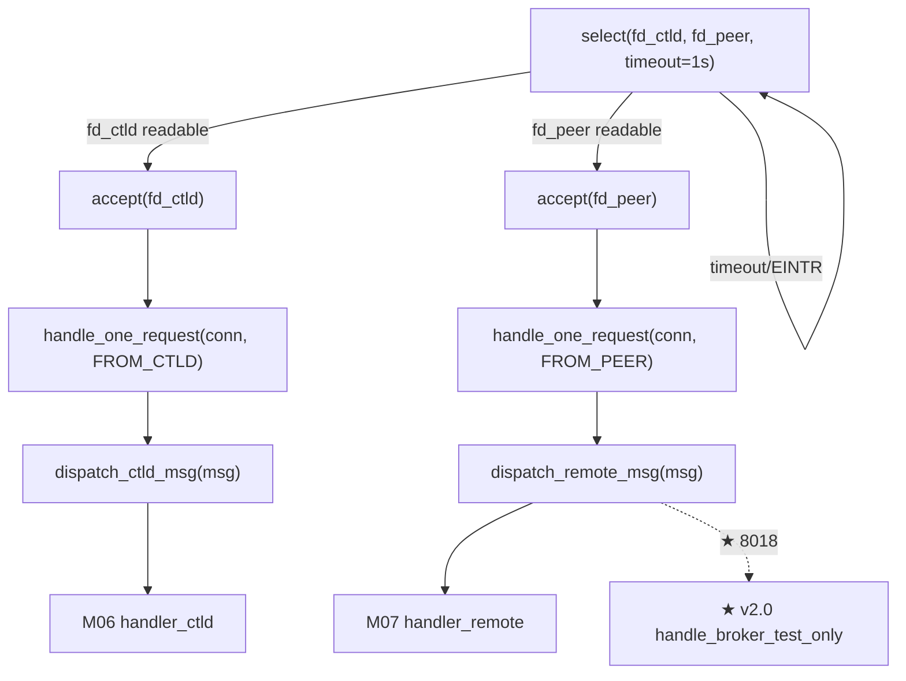

# M05 网络监听与分发 Checklist (broker · v2.0)

> 配套: [doc/Broker详细设计文档MVP_v2.md](../Broker详细设计文档MVP_v2.md) §8.3 / §6.3
> 差异蓝图: [doc/跨域调度详设-差异变更说明.md](../跨域调度详设-差异变更说明.md) §2.6
> Sprint: S1 → S2
> 依赖: M02-T3（端口配置）、M04-T3/T4/T5（dispatch 时识别 8018 msg_type）
> 下游: M06 / M07 通过 dispatch 路由调用

> **v1.5 → v2.0 增量**:
> 1. ★ `dispatch_remote_msg()` switch 增 1 case：`BROKERD_REQUEST_BROKER_TEST_ONLY` (8018) → `handle_broker_test_only` (M07 实现)
> 2. ★ ACL 不变：8018 与 8010-8017 都走 peer port (8443)，sender 必须是 `RemoteBrokerHost` 解析后 IP（v2.0 多对端时 `RouteSource=file`，sender 必须在 `routes.conf` 列出的 `Host=...` 集合内 → §M05-T4 v2.0 扩展）
> 3. ★ listener 主循环、accept、`_handle_one_request` 完全不变
> 4. ★ 8019 是响应消息，**不进入** dispatch（由 `egress_test_only_async` 在主动连接的同步路径上 demux）

---

## 1. 模块概述与目标

### 1.1 一句话定位

单线程 select 双端口监听 ctld 入站 (`BrokerCtldPort` 8442) 与远端 broker 入站 (`BrokerPeerPort` 8443)，accept 后**同步阻塞处理**单条 RPC，按 msg_type 分发到 M06 (`handler_ctld`) 或 M07 (`handler_remote`)。★ v2.0 dispatch_remote_msg 新增 8018 路由。

### 1.2 v2.0 MVP 范围

- **单 listener 线程**，不引入 worker pool（500 在途作业 × 10s/条 + 5 test-only/作业 ≈ 60 RPC/s 仍远低于单线程上限）。
- 双 fd 由 `select(timeout=1s)` 唤醒，accept 后阻塞 `slurm_recv_msg_blocking`。
- **★ v2.0 ACL**：
  - ctld 端口仅本机 `127.0.0.1`（不变）
  - peer 端口 v1.5 仅 `RemoteBrokerHost` 解析后 IP；**v2.0 `RouteSource=file` 时改为 `routes.conf` 列出的所有 `Host=` 解析后 IP set**
- shutdown 时 close 监听 fd 让 `select` 立即返回。

### 1.3 不在 MVP 范围

- ~~多线程 worker pool / `eio` 框架~~
- ~~mTLS / 自定义 wire 协议~~
- ~~accept 速率限制~~
- ~~test-only 同步路径增强 dispatch~~（8019 响应路径在 `proto_send_recv_to_peer` / `egress.c` 内同步收，不进 listener）

### 1.4 与 v1.5 的差异

| 维度 | v1.5 | v2.0 |
|---|---|---|
| listener 线程数 | 1 | 1（不变） |
| dispatch_ctld 路由 | 2 case (FORWARD_JOB, CANCEL) | 不变 |
| dispatch_remote 路由 | 5 case (8010,8012,8014,8016,8017) | **6 case** (+ 8018 TEST_ONLY) |
| ACL peer 来源 | `RemoteBrokerHost` 单 host | **routes.conf 多 host union**（M16 Routes API 提供 `routes_loader_get_known_peers()` 返回 IP set） |
| 8019 路径 | n/a | **不进 dispatch**, 由 caller 同步等响应 |

---

## 2. 接口契约

### 2.1 公共 API（v1.5 已落地, v2.0 不变）

```c
/* src/slurmbrokerd/listener.h */
extern int  listener_start(void);
extern void listener_stop(void);
```

### 2.2 全局变量（v1.5 已落地, v2.0 不变）

```c
/* listener.c */
static pthread_t listener_tid;
static int listen_fd_ctld = -1;
static int listen_fd_peer = -1;
static volatile bool listener_running = false;
```

### 2.3 端口绑定（v1.5 已落地, v2.0 不变）

| 端口 | bind 地址 | 来源 | 允许的对端 IP |
|---|---|---|---|
| `g_broker_conf.ctld_port` (默认 8442) | `0.0.0.0` | M02 | `127.0.0.1` 仅本机 |
| `g_broker_conf.peer_port` (默认 8443) | `0.0.0.0` | M02 | **★ v2.0**: `RouteSource=file` 时取 `routes_loader_get_known_peers()`；`STATIC_LEGACY` 时取 `RemoteBrokerHost` |

### 2.4 ★ v2.0 新增 dispatch case（仅修改 dispatch_remote_msg）

```c
extern void dispatch_remote_msg(slurm_msg_t *msg);
/* switch 增加: */
/*   case BROKERD_REQUEST_BROKER_TEST_ONLY:  handle_broker_test_only(msg);  break; */
```

> ★ v2.0：`BROKERD_RESPONSE_BROKER_TEST_ONLY` (8019) **不在** dispatch 中——它由 `proto_send_recv_to_peer` 在主动连接（`slurm_open_msg_conn` → `_build_wire_frame(8018)` → `_recv_wire_frame` 解出 8019）路径里处理，listener 永远收不到 8019。

---

## 3. 参考代码

| 用途 | 文件 | 说明 |
|---|---|---|
| `slurm_init_msg_engine_port` | [src/common/slurm_protocol_api.h](../../src/common/slurm_protocol_api.h) | listen + bind 工具函数（推荐复用） |
| `slurm_accept_msg_conn` | 同上 | accept + 返回 conn fd |
| `slurm_receive_msg` | 同上 | 阻塞读一条 slurm_msg_t（含 munge 解密）|
| `slurm_send_node_msg` 回响应 | 同上 | 复用响应路径 |
| select 双 fd 范式 | [src/slurmctld/agent.c](../../src/slurmctld/agent.c) | grep `FD_SET` |
| getpeername ACL | [src/slurmd/slurmd/req.c](../../src/slurmd/slurmd/req.c) | grep `getpeername` 范例 |
| `slurm_thread_create` | [src/common/macros.h](../../src/common/macros.h) | 替代 pthread_create |
| **★ v2.0**: `routes_loader_get_known_peers()` | [src/slurmbrokerd/routes_loader.h](../../src/slurmbrokerd/routes_loader.h) | M16 提供，返回 `list_t *` of `char *host_or_ip`（rwlock 内 snapshot） |

---

## 4. 文件清单

| 文件 | 类型 | 用途 |
|---|---|---|
| [src/slurmbrokerd/listener.h](../../src/slurmbrokerd/listener.h) | 不变 | start/stop API |
| [src/slurmbrokerd/listener.c](../../src/slurmbrokerd/listener.c) | 修改 | dispatch_remote_msg 增 1 case；★ v2.0 `_peer_ip_allowed` 改用 `routes_loader_get_known_peers()` |
| [src/slurmbrokerd/handler_remote.h](../../src/slurmbrokerd/handler_remote.h) | M07 修改 | 新增 `handle_broker_test_only` 声明 |
| [src/slurmbrokerd/Makefile.am](../../src/slurmbrokerd/Makefile.am) | 不变 | listener.c/.h 已在 SOURCES |

---

## 5. 数据流（v2.0 增 8018 分支）



---

## 6. 任务展开

### M05-T1 监听 socket 创建 + select 循环（不变, 沿用 v1.5）

- **依赖**: M02-T3
- **预估**: 0d (v1.5 已落地)
- **DoD**: v1.5 已通过

### M05-T2 单请求处理 `_handle_one_request`（不变）

- **依赖**: M04-T3 / M05-T1
- **预估**: 0d (v1.5 已落地)
- **DoD**: v1.5 已通过

### M05-T3 ★ v2.0 dispatch_remote_msg 增 1 case (8018)

- **依赖**: M05-T2, M04-T3 (8018 payload struct), M07-T2 (handle_broker_test_only)
- **预估**: 0.1d
- **关键决策**:
  1. 8018 走 peer port（broker→broker），故只在 `dispatch_remote_msg` 加 case，**不**碰 `dispatch_ctld_msg`。
  2. `handle_broker_test_only` 由 M07 提供（详见 broker-M07）；本 PR 内可先用 stub 占位（返回 SLURM_SUCCESS + 空响应）以解依赖。
  3. **8019 不进 dispatch**，dispatcher default 分支收到 8019 应当 warn + reject（防御性，正常情况不会发生）。
- **代码草图**（差异部分）:

```c
extern void dispatch_remote_msg(slurm_msg_t *msg)
{
	char addr_str[INET6_ADDRSTRLEN] = "";
	slurm_get_addr_string(&msg->address, addr_str, sizeof(addr_str));
	debug2("dispatch remote msg_type=%u (%s) from %s", msg->msg_type,
	       brokerd_msg_type_str(msg->msg_type), addr_str);

	switch (msg->msg_type) {
	case BROKERD_REQUEST_BROKER_FORWARD_JOB:
		handle_broker_forward_job(msg); break;
	case BROKERD_REQUEST_BROKER_STAGED_IN:
		handle_broker_staged_in(msg); break;
	case BROKERD_REQUEST_BROKER_QUERY_STATUS:
		handle_broker_query_status(msg); break;
	case BROKERD_REQUEST_BROKER_CANCEL:
		handle_broker_cancel(msg); break;
	case BROKERD_REQUEST_BROKER_CLEANUP:
		handle_broker_cleanup(msg); break;

	/* ★ v2.0 新增 */
	case BROKERD_REQUEST_BROKER_TEST_ONLY:
		handle_broker_test_only(msg); break;

	/* 8019 是响应, 不该走到这条路径 */
	case BROKERD_RESPONSE_BROKER_TEST_ONLY:
		warning("dispatch_remote: unexpected response 8019 from %s "
		        "(should be received via proto_send_recv_to_peer)",
		        addr_str);
		slurm_send_rc_msg(msg, SLURM_UNEXPECTED_MSG_ERROR);
		break;

	default:
		error("dispatch_remote: unknown msg_type %u from %s",
		      msg->msg_type, addr_str);
		slurm_send_rc_msg(msg, SLURM_UNEXPECTED_MSG_ERROR);
	}
}
```

- **风险与坑**:
  - M07 handler 还未实现时编译报 implicit-decl；本 PR 提交时需要 M07 已经至少有 stub。
  - 8019 防御性分支必须保留——若远端 broker 异常发起 8019 而非作为 8018 的响应，dispatcher 不能 crash。
- **DoD**:
  - [ ] grep `case BROKERD_REQUEST_BROKER_TEST_ONLY` listener.c → 1 行
  - [ ] mock client 发 8018 + payload，broker 进程不 crash，能调到 `handle_broker_test_only`（用 strace -e trace=write 看 stub 输出）
  - [ ] mock client 故意发 8019 到 peer port → broker 返回 SLURM_UNEXPECTED_MSG_ERROR，warn 日志含 "8019 from"

### M05-T4 ★ v2.0 ACL 与来源 IP 校验扩展（routes.conf 集合）

- **依赖**: M05-T3, M16-T2 (`routes_loader_get_known_peers()`)
- **预估**: 0.5d
- **关键决策**:
  1. v1.5 `_peer_ip_allowed(ipstr)` 仅查 `g_broker_conf.remote_broker_host`；v2.0 当 `routes_source == FILE` 时改用 `routes_loader_get_known_peers()` 拿到 host list 再 getaddrinfo 比对。
  2. `STATIC_LEGACY` 路径保持 v1.5 行为不变（兼容老部署）。
  3. **避免每次 accept 都解析 DNS**：在 `routes_loader_reload()` 内一次性把所有 `Host=` 解析成 IP set 缓存到 `g_routes_table.peer_ip_set`（rwlock 保护）。本 listener 每次 accept 取 snapshot 即可。
  4. DNS 持续 5min 失败时退化为放行 + warn（避免 DNS 抖动导致 broker 全网拒服务）。
- **代码草图**（差异部分）:

```c
static bool _peer_ip_allowed(const char *ipstr)
{
	if (g_broker_conf.routes_source == BROKER_ROUTE_SOURCE_STATIC_LEGACY) {
		/* v1.5 路径 */
		return _peer_ip_allowed_legacy(ipstr,
		                                g_broker_conf.remote_broker_host);
	}

	/* ★ v2.0 file 模式: 查 routes.conf 解析出的 IP set */
	list_t *peer_ips = routes_loader_get_known_peers_ipset();
	bool ok = false;

	if (!peer_ips || !list_count(peer_ips)) {
		warning("_peer_ip_allowed: empty peer IP set; degrade to "
		        "allow + warn (probably DNS down or routes.conf "
		        "Host= unresolved)");
		FREE_NULL_LIST(peer_ips);
		return true;        /* 退化策略, 详见 §6.4 关键决策 4 */
	}

	list_itr_t *it = list_iterator_create(peer_ips);
	char *ip;
	while ((ip = list_next(it))) {
		if (!strcmp(ip, ipstr)) { ok = true; break; }
	}
	list_iterator_destroy(it);
	FREE_NULL_LIST(peer_ips);
	return ok;
}
```

- **风险与坑**:
  - `routes_loader_get_known_peers_ipset()` 必须 thread-safe（M16 用 rwlock）。
  - DNS 失败"退化放行"是兼容策略；生产环境运维应当配 monitor 监控该 warn。
- **DoD**:
  - [ ] `routes.conf` 列出 `wz-broker / hf-broker / bj-broker` 三个 host → 三机连入均通过
  - [ ] `routes.conf` 删去 `bj-broker` 后 `routes_loader_reload` 触发 → bj-broker 连入立即被拒（warn 日志）
  - [ ] `routes_source=static_legacy` 时行为与 v1.5 完全一致（异机连接仍按 RemoteBrokerHost 校验）

---

## 7. 整体 DoD（汇总）

- [ ] 4 个子任务全部勾选（T1/T2 v1.5 已完成, T3/T4 v2.0 增量）
- [ ] dispatch_remote 路由覆盖 6 个 msg_type + 1 个 8019 防御
- [ ] **★ v2.0**: 8018 dispatch 测试通过；8019 误发被拒
- [ ] **★ v2.0**: `routes_source=file` 时 ACL 走 routes.conf 集合
- [ ] valgrind: 启动 → 收 100 RPC（含 10 个 8018）→ stop，0 still reachable
- [ ] kill -TERM ≤ 5s 内端口释放，listener thread join 干净

## 8. 验证脚本

```bash
# 启动
./src/slurmbrokerd/slurmbrokerd -D -v &
PID=$!

# 1) 端口监听
ss -lntp | grep -E "8442|8443"

# 2) ★ v2.0 8018 分发到 handle_broker_test_only
./tests/broker/send_test_only_rpc 127.0.0.1 8443 \
    --trace-id=xian-1 --partition=wzhcnormal --app=lammps
journalctl -u slurmbrokerd -n 20 | grep -E "_handle_test_only|test_only"
# 期望: handle_broker_test_only 被调用 (M07 stub 至少打印日志)

# 3) ★ v2.0 防御性: 故意发 8019 到 peer 端口
./tests/broker/send_unknown_rpc 127.0.0.1 8443 --type=8019
# 期望: 客户端收到 SLURM_UNEXPECTED_MSG_ERROR
journalctl -u slurmbrokerd -n 20 | grep "unexpected response 8019"

# 4) ★ v2.0 routes.conf 集合 ACL
echo "[Route id=r1] Host=allowed.example.com" | sudo tee /etc/slurm/routes.conf
sudo systemctl reload slurmbrokerd  # SIGHUP 触发 routes 重载
echo "" | nc -w1 not-allowed.example.com 8443; echo $?
# 期望: 立即被拒, journalctl 含 "rejecting peer conn from ..."

# 5) shutdown
kill -TERM $PID
sleep 6
ss -lntp | grep -E "8442|8443"  # expect: empty
```

---

## 9. 风险与回滚

| 风险 | 触发 | 缓解 |
|---|---|---|
| `routes_loader_get_known_peers()` 在 reload 时返回空 list | SIGHUP 期间瞬态 | M16 用 rwlock，reload 路径在写完整 snapshot 后才 swap，不会半写；listener 看到空 list 时退化放行 + warn |
| 8019 异常进入 dispatch | 远端 broker bug 或恶意攻击 | dispatcher 加防御 case，warn + reject |
| M07 handler 还未实现 | 本 PR 提早合入 | M07 stub 必须先合入；CI 跑 broker 启动 + send 8018 + 期望日志中含 "stub" |
| DNS 持续失败导致 ACL 全部拒绝 | 网络抖动 | 退化"放行 + warn" 策略；运维 monitor 该 warn |
| 单线程 dispatch 阻塞 | M07 `_handle_test_only` 内同步调 ctld submit_batch_job (耗时秒级) | M07 用独立 worker 子线程处理 (broker-M07 v2.0 详细决策) |

回滚：本模块独立。`git revert listener.c::dispatch_remote_msg case 调整 + _peer_ip_allowed v2.0 分支`。
