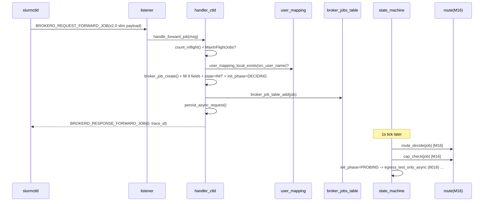

# M06 ctld 入站处理 Checklist (broker · v2.0)

> 配套: [doc/Broker详细设计文档MVP_v2.md](../Broker详细设计文档MVP_v2.md) §7.1.A
> 差异蓝图: [doc/跨域调度详设-差异变更说明.md](../跨域调度详设-差异变更说明.md) §2.7
> Sprint: S2
> 依赖: M02-T4（user_mapping）、M03-T1（broker_jobs 表 + init_phase 字段）、M04-T2（forward_job v2.0 瘦身 payload）、M05-T3（dispatch）
> 下游: M09 状态机消费 INIT.DECIDING → INIT.PROBING → INIT.SELECTED → STAGING_IN

> **v1.5 → v2.0 增量**:
> 1. ★ `forward_job_msg_t` payload 瘦身（删 `target_cluster/partition/account/job_desc`，增 `src_cluster_name/src_partition`）→ handler 字段抽取与赋值改写
> 2. ★ broker_job_t 不再设 `dst_cluster` / `target_partition`（这俩字段由 M16 路由决策时填）→ 入表时这俩字段保持 NULL
> 3. ★ broker_job_t 新增 `init_phase = BROKER_INIT_PHASE_DECIDING`
> 4. ★ broker_job_t 不再设 `account` / `job_desc`（v2.0 已删字段）
> 5. ★ user_mapping_lookup 时机推迟：v1.5 在 forward_job 内立刻按 `target_cluster` 查；v2.0 仅做"是否存在 broker 端的 LocalUser= 配置"宽校验，**真正的 (local→remote) mapping 由 M16 route_decide 时按 `route.send_to.cluster` 查表**
> 6. ★ `handle_cancel_from_ctld` 行为不变（cancel 走 trace_id / src_job_id 任一路径）

---

## 1. 模块概述与目标

### 1.1 一句话定位

处理来自本机 slurmctld 的两类 RPC：`BROKERD_REQUEST_FORWARD_JOB`（v2.0 瘦身后创建 broker_job + 进入 `INIT.DECIDING`）与 `BROKERD_REQUEST_BROKER_CANCEL`（用户 scancel 反向传播）。本模块只做"入表"+"置位"，真正的路由决策与状态推进交给 M16/M09。

### 1.2 v2.0 MVP 范围

- `handle_forward_job()`：溢出保护 + ★ v2.0 宽 ACL 校验（local user 在 broker 端 `LocalUser=` 列表存在即可，不要求一定有目标集群映射）+ broker_job 创建 + 入表 + 立即 ACK + persist_async_request；`init_phase = DECIDING`，**不**设 dst_cluster/target_partition。
- `handle_cancel_from_ctld()`：查表 + 置位 `cancel_requested` + ACK（不变）。
- ACL：`auth_uid == job.src_uid` 或 root/SlurmUser（不变）。

### 1.3 不在 MVP 范围

- ~~延迟 ACK（异步处理）~~：MVP 同步 ACK 简化语义
- ~~Job array 拆分~~
- ~~user_mapping 二次校验~~（移到 M16 route_decide 内做精确 (local, remote_cluster) 查表）

### 1.4 与 v1.5 的差异

| 维度 | v1.5 | v2.0 |
|---|---|---|
| forward_job 入参 | `target_cluster` + `target_partition` + `account` + `job_desc` | **删 4 字段**，新增 `src_cluster_name` + `src_partition` |
| broker_job_t 入表后字段 | `dst_cluster = req->target_cluster` 立即填 | **保持 NULL**（route_decide 之后填） |
| broker_job_t.init_phase | n/a | **`DECIDING`** |
| user_mapping 校验 | `lookup(local, target_cluster)` 缺则 reject | **宽校验：仅检查 broker 端 `LocalUser=local` 是否存在**；具体远端 mapping 由 M16 决策 |
| ACK error_code | 9001 (OVERLOAD) / 9002 (NO_USER_MAPPING) | 不变 + **9010 (NO_VIABLE_ROUTE 不在本 handler 返回, 由 M16 异步推进)** |
| job_desc ownership transfer | 是 | **不再** (字段已删) |

---

## 2. 接口契约

### 2.1 公共 API（不变）

```c
/* src/slurmbrokerd/handler_ctld.h */
extern int handle_forward_job(slurm_msg_t *msg);
extern int handle_cancel_from_ctld(slurm_msg_t *msg);
```

### 2.2 私有 helper

```c
static uint32_t _count_inflight(void);                     /* 不变 */
static bool     _local_user_exists(const char *local_user);/* ★ v2.0 新增 */
static bool     _acl_owner_or_root(uint32_t auth_uid, broker_job_t *job);
```

### 2.3 ACL 规则（不变）

| 来源 RPC | auth_uid 必须满足 |
|---|---|
| BROKERD_REQUEST_FORWARD_JOB | `auth_uid == 0` 或 `auth_uid == slurm_conf.slurm_user_id` |
| BROKERD_REQUEST_BROKER_CANCEL（来自 ctld）| `auth_uid == job.src_uid` 或 root / SlurmUser |

---

## 3. 参考代码

| 用途 | 文件 | 说明 |
|---|---|---|
| `slurm_send_response` 回响应 | [src/common/slurm_protocol_api.c](../../src/common/slurm_protocol_api.c) | 含错误码模式 |
| `slurm_msg_t.auth_uid` | [src/sackd/sackd.c](../../src/sackd/sackd.c) | grep `auth_uid` |
| `xstrfmtcat` 拼 trace_id | [src/common/xstring.h](../../src/common/xstring.h) | grep `xstrfmtcat` |
| **★ v2.0** `user_mapping_local_exists()` | [src/slurmbrokerd/user_mapping.h](../../src/slurmbrokerd/user_mapping.h) | M02 v2.0 新增（仅按 local 名查是否任何 entry 存在） |

---

## 4. 文件清单

| 文件 | 类型 | 用途 |
|---|---|---|
| [src/slurmbrokerd/handler_ctld.h](../../src/slurmbrokerd/handler_ctld.h) | 不变 | API |
| [src/slurmbrokerd/handler_ctld.c](../../src/slurmbrokerd/handler_ctld.c) | 修改 | ★ v2.0 重写 `handle_forward_job` 字段映射 + 删 user_mapping 严格校验 + 新增 `init_phase = DECIDING` |
| [src/slurmbrokerd/user_mapping.h](../../src/slurmbrokerd/user_mapping.h) | 修改 | ★ v2.0 新增 `user_mapping_local_exists(local_user)` |
| [src/slurmbrokerd/user_mapping.c](../../src/slurmbrokerd/user_mapping.c) | 修改 | ★ v2.0 实现新 helper（遍历 g_user_mappings 找前缀 `"local|"` 即返回 true） |
| [src/slurmbrokerd/Makefile.am](../../src/slurmbrokerd/Makefile.am) | 不变 | 已在 SOURCES |

---

## 5. 流程图



---

## 6. 任务展开

### M06-T1 ★ v2.0 重写 `handle_forward_job` (字段映射 + DECIDING)

- **依赖**: M02-T4 / M03-T1 / M04-T2 (forward_job v2.0 瘦身) / M05-T3
- **预估**: 1.5d
- **关键决策**:
  1. **溢出保护**：`count_inflight() >= max_inflight` 立即 `BROKERD_ERR_OVERLOAD` (9001)，不入表（不变）。
  2. **★ v2.0 宽 user 校验**：`user_mapping_local_exists(req->src_user_name)`；找不到则 `BROKERD_ERR_NO_USER_MAPPING` (9002)。**不再**按 `target_cluster` 严格查 (`(local, target)` 二元组)，因为 v2.0 ctld 不传 target，broker 在 M16 决策后才知道 target_cluster。
  3. **同步 ACK**：handler 内同步回 `BROKERD_RESPONSE_FORWARD_JOB`，不等状态机推进（不变）。
  4. **trace_id 格式**：`<src_cluster_name>-<src_job_id>`，例如 `xian_cluster-12345`（不变）。
  5. **★ v2.0 字段映射**：
     - `job->src_partition = req->src_partition`（新增）
     - `job->src_cluster   = req->src_cluster_name`（取代原 `g_broker_conf.cluster_name`，因为 ctld 现在显式传）
     - `job->dst_cluster   = NULL`（v2.0 由 M16 路由决策填）
     - `job->target_partition = NULL`（同上）
     - `job->cd_app_name = req->cd_app_name`
     - `job->init_phase   = BROKER_INIT_PHASE_DECIDING`（新增）
  6. **删除**：v1.5 的 `job_desc ownership transfer` 整段（payload 不再含 job_desc）；v1.5 的 `job->account` 赋值（字段已删）；v1.5 的 `m->remote_user/uid/gid` 赋值（M16 决策后填）。
- **代码草图**:

```c
int handle_forward_job(slurm_msg_t *msg)
{
	brokerd_forward_job_msg_t *req = msg->data;
	broker_job_t *job;
	brokerd_forward_job_resp_msg_t *resp;
	uint32_t inflight;

	/* 1. 溢出保护 */
	inflight = _count_inflight();
	if (inflight >= g_broker_conf.max_inflight) {
		warning("forward_job: rejecting job %u, inflight=%u >= max=%u",
		        req->src_job_id, inflight, g_broker_conf.max_inflight);
		_reply_rc(msg, BROKERD_ERR_OVERLOAD, NULL);
		return SLURM_SUCCESS;
	}

	/* 2. ★ v2.0 宽 user 校验: 本端 LocalUser= 必须有该 local user 任一条目 */
	if (!_local_user_exists(req->src_user_name)) {
		error("forward_job: no LocalUser= entry for '%s'",
		      req->src_user_name);
		_reply_rc(msg, BROKERD_ERR_NO_USER_MAPPING, NULL);
		return SLURM_SUCCESS;
	}

	/* 3. 创建 broker_job (v2.0 字段) */
	job = broker_job_create();
	snprintf(job->trace_id, sizeof(job->trace_id), "%s-%u",
	         req->src_cluster_name, req->src_job_id);
	job->src_job_id        = req->src_job_id;
	job->src_uid           = req->src_uid;
	job->src_gid           = req->src_gid;
	job->src_user_name     = xstrdup(req->src_user_name);
	job->src_cluster       = xstrdup(req->src_cluster_name);   /* ★ v2.0 */
	job->src_partition     = xstrdup(req->src_partition);      /* ★ v2.0 */
	job->src_work_dir      = xstrdup(req->src_work_dir);
	job->script_path       = xstrdup(req->script_path);
	job->cd_app_name       = xstrdup(req->cd_app_name);

	/* ★ v2.0: dst_cluster / target_partition / remote_* 一律 NULL,
	 * 由 M16 route_decide 后填; 此时 job 处于 DECIDING 子态 */
	job->dst_cluster       = NULL;
	job->target_partition  = NULL;
	job->selected_route_id = NULL;

	job->role              = BROKER_ROLE_ORIGINATOR;
	job->hop_count         = 0;
	job->state             = BROKER_STATE_INIT;
	job->init_phase        = BROKER_INIT_PHASE_DECIDING;       /* ★ v2.0 */
	job->state_enter_time  = time(NULL);
	job->submit_time       = job->state_enter_time;

	/* 4. 入表 */
	if (broker_job_table_add(job) != SLURM_SUCCESS) {
		warning("forward_job: duplicate trace_id %s; reply with current "
		        "state (idempotent)", job->trace_id);
		broker_job_destroy(job);
		/* idempotent: ctld 重试时直接回 OK + 现存 trace_id */
		broker_job_t *existing =
			broker_job_table_get(job->trace_id);
		_reply_ok(msg, existing ? existing->trace_id : job->trace_id);
		return SLURM_SUCCESS;
	}

	/* 5. 触发 persist (含 init_phase=DECIDING 字段) */
	persist_async_request();

	/* 6. ACK */
	_reply_ok(msg, job->trace_id);

	info("forward_job: trace_id=%s src_job_id=%u user=%s "
	     "src_cluster=%s src_partition=%s app=%s -> INIT.DECIDING",
	     job->trace_id, job->src_job_id, job->src_user_name,
	     job->src_cluster, job->src_partition, job->cd_app_name);
	return SLURM_SUCCESS;
}

static void _reply_ok(slurm_msg_t *msg, const char *trace_id)
{
	brokerd_forward_job_resp_msg_t resp = {
		.error_code = SLURM_SUCCESS,
		.trace_id   = (char *) trace_id,    /* 借用, 不 xfree */
	};
	slurm_msg_t resp_msg;
	slurm_msg_t_init(&resp_msg);
	resp_msg.msg_type = BROKERD_RESPONSE_FORWARD_JOB;
	resp_msg.data     = &resp;
	slurm_send_node_msg(msg->conn_fd, &resp_msg);
}

static void _reply_rc(slurm_msg_t *msg, int rc, const char *trace_id)
{
	brokerd_forward_job_resp_msg_t resp = {
		.error_code = rc,
		.trace_id   = (char *) (trace_id ? trace_id : ""),
	};
	slurm_msg_t resp_msg;
	slurm_msg_t_init(&resp_msg);
	resp_msg.msg_type = BROKERD_RESPONSE_FORWARD_JOB;
	resp_msg.data     = &resp;
	slurm_send_node_msg(msg->conn_fd, &resp_msg);
}

static uint32_t _count_inflight(void)
{
	struct { uint32_t cnt; } ctx = { 0 };
	int _cb(broker_job_t *j, void *arg) {
		typeof(ctx) *p = arg;
		switch (j->state) {
		case BROKER_STATE_INIT:
		case BROKER_STATE_STAGING_IN:
		case BROKER_STATE_STAGED_IN:
		case BROKER_STATE_SUBMITTED:
		case BROKER_STATE_RUNNING:
		case BROKER_STATE_STAGING_OUT:
			p->cnt++; break;
		default: break;
		}
		return 0;
	}
	broker_job_table_foreach(_cb, &ctx);
	return ctx.cnt;
}
```

- **风险与坑**:
  - **wire ABI**：本 handler 必须配合 ctld-M04 v2.0 (forward_job 瘦身) 同时上线，否则 unpack 解出垃圾。
  - **idempotent 重试**：ctld 端 `agent_queue_request` 自带重试，broker 端 dup trace_id 直接 reply OK 现存 trace_id（不要 reject），符合 "exactly once" 语义。
  - `_count_inflight` 用 GCC 内嵌函数 `_cb` 不是 portable C；建议改成静态函数 + 闭包结构体（v1.5 已有的代码风格）。
- **DoD**:
  - [ ] mock ctld 投 1 个 v2.0 瘦身 payload，broker 表内 1 条 `state=INIT init_phase=DECIDING dst_cluster=NULL`
  - [ ] 重复投递相同 src_job_id → 第二次回 OK 现存 trace_id（idempotent）
  - [ ] 投 600 个时第 501 起返回 `BROKERD_ERR_OVERLOAD`
  - [ ] 缺 LocalUser= 配置的 src_user_name → `BROKERD_ERR_NO_USER_MAPPING`
  - [ ] grep `target_cluster` in handler_ctld.c → 0 行（v2.0 字段已删）

### M06-T2 ★ v2.0 user_mapping helper `_local_user_exists`

- **依赖**: M02-T4
- **预估**: 0.25d
- **关键决策**:
  1. v1.5 `g_user_mappings` 的 key 是 `"local_user|remote_cluster"`（M02 §5）；v2.0 `_local_user_exists(local)` 只需遍历看是否有 entry key 以 `"<local>|"` 开头。
  2. 不需要严格性能（每个 forward_job 调一次，O(N) where N = 总映射条目数 ≤ 几百）。
- **代码草图**（在 user_mapping.c 内）:

```c
bool user_mapping_local_exists(const char *local_user)
{
	if (!local_user || !g_user_mappings)
		return false;

	struct { const char *prefix; size_t plen; bool found; } ctx = {0};
	char *prefix = NULL;
	xstrfmtcat(prefix, "%s|", local_user);
	ctx.prefix = prefix;
	ctx.plen   = strlen(prefix);

	int _cb(void *item, const char *key, void *arg) {
		typeof(ctx) *p = arg;
		if (!xstrncmp(key, p->prefix, p->plen)) {
			p->found = true;
			return -1;   /* 提前结束遍历 */
		}
		return 0;
	}
	xhash_walk(g_user_mappings, _cb, &ctx);
	xfree(prefix);
	return ctx.found;
}
```

- **DoD**:
  - [ ] `LocalUser=test1 RemoteCluster=wz_cluster ...` 已加载 → `_local_user_exists("test1")` 返回 true
  - [ ] 未配置的 `_local_user_exists("alice")` 返回 false
  - [ ] 大表 1000 条 mapping 时返回 < 1ms

### M06-T3 `handle_cancel_from_ctld` 主流程（不变）

- **依赖**: M03-T1 / M06-T1
- **预估**: 0d (v1.5 已落地)
- **关键决策**: 与 v1.5 完全一致；trace_id 仍按 `<src_cluster>-<src_job_id>` 拼。
- **DoD**:
  - [ ] 投 1 个作业到 RUNNING，scancel 后 ≤ 5s broker_job state 变 CANCELLED
  - [ ] 不存在的 src_job_id → `BROKERD_ERR_NOT_FOUND` (9009)，进程不 crash

### M06-T4 ACL 校验（不变）

- **依赖**: M06-T3
- **预估**: 0d (v1.5 已落地)
- **DoD**:
  - [ ] 用其他用户的 uid 模拟 cancel → 被拒，返回 `ESLURM_USER_ID_MISSING`
  - [ ] root cancel → 通过

---

## 7. 整体 DoD（汇总）

- [ ] 4 个子任务全部勾选（T1/T2 v2.0 增量, T3/T4 v1.5 已完成）
- [ ] **★ v2.0**: 联调 mock ctld 投 100 个 v2.0 瘦身 payload，broker 表内 100 条 `init_phase=DECIDING`
- [ ] **★ v2.0**: 缺 LocalUser= 配置时 `BROKERD_ERR_NO_USER_MAPPING`，错误码与 v1.5 一致
- [ ] 联调：超出 max_inflight 时 OVERLOAD 错误率正确
- [ ] valgrind: 100 forward + 100 cancel + fini，0 still reachable
- [ ] grep `target_cluster|target_partition|account|job_desc` in handler_ctld.c → 仅出现在注释（"v2.0 已删"）

## 8. 验证脚本

```bash
./src/slurmbrokerd/slurmbrokerd -D -v &
PID=$!

# T1: 投 100 v2.0 瘦身 payload
for i in $(seq 1 100); do
    ./tests/broker/inject_forward_job_v2 \
        --src-cluster=xian_cluster \
        --src-partition=xahcnormal_virt \
        --src-job-id=$i \
        --user=test1 \
        --app=lammps-2Aug2023-intelmpi2018
done

# 检查表大小 + init_phase
./tests/broker/dump_broker_table | grep -c "state=INIT init_phase=DECIDING"
# expect: 100

# T1 重复投递 (idempotent)
./tests/broker/inject_forward_job_v2 --src-cluster=xian_cluster --src-job-id=1 ...
# 期望: 客户端收到 trace_id=xian_cluster-1, error_code=0

# T1 溢出: max_inflight=500，再投 600
for i in $(seq 101 700); do ./tests/broker/inject_forward_job_v2 ...; done

# T2 LocalUser 缺失
./tests/broker/inject_forward_job_v2 --user=alice ...
# 期望: error_code=9002 (BROKERD_ERR_NO_USER_MAPPING)

# T3 cancel
./tests/broker/inject_cancel xian_cluster 50
./tests/broker/dump_broker_table | grep "src_job_id=50" | grep "cancel_requested=true"

# T4 ACL
./tests/broker/inject_cancel --uid 12345 xian_cluster 51
# expect: ESLURM_USER_ID_MISSING

kill -TERM $PID
```

---

## 9. 风险与回滚

| 风险 | 触发 | 缓解 |
|---|---|---|
| forward_job v1.5 ctld + v2.0 broker | 升级窗口 ctld 未先升 | wire 层 unpack 失败 → broker 返回 `SLURM_ERROR`，ctld agent 重试；运维必须先升 ctld、再升 broker（升级 SOP 写入 broker-M15 v2.0） |
| `_local_user_exists` 性能下降 | mapping 表 10k+ 条 | MVP 接受 O(N)；超过 1k 时改用按 local_user 一级 hash（M02 v2.1） |
| `init_phase=DECIDING` 卡住 | M16 route_decide 抛异常 | M09 状态机超时（默认 30s）转 EXHAUSTED；M16 异常路径打 error 日志 |
| broker 重启时 INIT.DECIDING 作业丢路由结果 | broker crash | M03 持久化已含 `init_phase=DECIDING`，restore 后 M09 `state_machine_resume_inflight` 自动重新进入 DECIDING（无副作用） |

回滚：handler_ctld 与 ctld-M04 v2.0 强耦合（payload wire），**不能单独回滚**。若需回滚必须 broker + ctld 同时回 v1.5：

1. `git revert handler_ctld.c::handle_forward_job v2.0 改写`
2. `git revert user_mapping.{h,c} v2.0 _local_user_exists`
3. ctld-M04 v2.0 同步回滚
