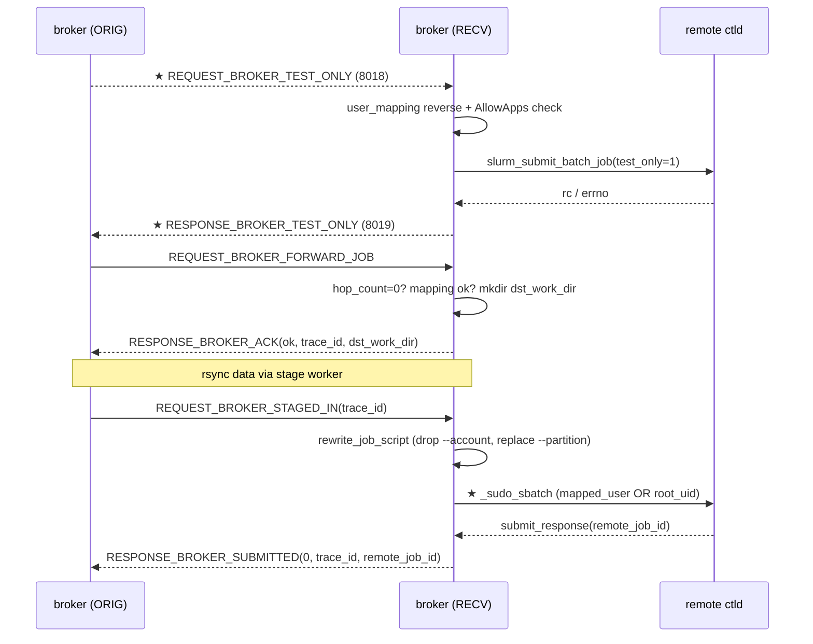

# M07 远端 broker 入站处理 Checklist (broker · v2.0)

> 配套: [doc/Broker详细设计文档MVP_v2.md](../Broker详细设计文档MVP_v2.md) §7.1.B / §7.1.D / §6.6.2
> 差异蓝图: [doc/跨域调度详设-差异变更说明.md](../跨域调度详设-差异变更说明.md) §2.7
> Sprint: S2 → S3
> 依赖: M02-T4 (user_mapping)、M03-T1 (broker_jobs 表)、M04-T3/T4 (8018/8019 payload)、M05-T3 (dispatch)、M12-T1 (rewrite stub)、M16-T2 (routes_loader::AllowApps)
> 下游: M09 状态机推进 RECEIVER 端

> **v1.5 → v2.0 增量**:
> 1. ★ 新增 `handle_broker_test_only()` 处理 8018 探测请求（远端 broker 视角）
> 2. ★ `handle_broker_staged_in()` 内 `_sudo_sbatch()` 按 `g_broker_conf.submit_mode` 分两个分支：`mapped_user` (v1.5 sudo 路径) / `root_uid` (v2.0 broker 直跑 `sbatch --uid=...`)
> 3. ★ `handle_broker_forward_job()` 中字段映射微调：v1.5 用 `req->target_partition` → v2.0 字段名仍是 `target_partition`（broker→broker payload v1.5 与 v2.0 同），但**originator 端在 SELECTED 阶段已基于路由结果填好** `remote_user_name` / `target_partition`，receiver 端只做反向校验。
> 4. ★ test-only handler 与 receiver 端 broker_job_table **不互相污染**——test_only 不入表，仅借调本地 ctld 的 `submit_batch_job(test_only=1)` 后立即 reply。

---

## 1. 模块概述与目标

### 1.1 一句话定位

处理远端 broker 主动发来的 6 类 RPC：v1.5 5 类（`BROKER_FORWARD_JOB` / `BROKER_STAGED_IN` / `BROKER_QUERY_STATUS` / `BROKER_CANCEL` / `BROKER_CLEANUP`）+ ★ v2.0 新增 `BROKER_TEST_ONLY` (8018)。本 broker 在此承担 **RECEIVER** 角色——为远端代提交本地 sbatch、回报状态、删除 dst_work_dir、★ v2.0 还要响应 originator 的 test-only 探测。

### 1.2 v2.0 MVP 范围

- 5 个 v1.5 handler（不变 + 微调 staged_in 的 SubmitMode 分支）
- ★ 1 个新 handler：`handle_broker_test_only()`：反向 user_mapping 校验 + AllowApps 校验 + `slurm_submit_batch_job_test_only()` + 5s 超时 + 8019 reply
- 远端 dst_work_dir：`/work/home/<remote_user>/.burst/<src_cluster>/<src_job_id>` (不变)
- 幂等：所有 handler 沿用 v1.5 幂等模式

### 1.3 不在 MVP 范围

- ~~多 hop 跨域路由~~：`hop_count > 0` 直接拒绝（设计文档明确）
- ~~RECEIVER 端 cancel 反向通知 ORIGINATOR~~
- ~~test_only 入 broker_job_table~~：test_only 不创建 broker_job 实例，仅做无副作用预检

### 1.4 与 v1.5 的差异

| 维度 | v1.5 | v2.0 |
|---|---|---|
| handler 数量 | 5 | **6** (+ test_only) |
| `_sudo_sbatch` 分支 | 仅 `sudo -u remote_user sbatch` | **两分支**: `mapped_user` (v1.5) / `root_uid` (broker 直跑 `sbatch --uid=...`) |
| `handle_broker_staged_in` 删 account | `xfree(job_desc->account)` | **不再适用**: v2.0 没有持久 job_desc，rewrite 行级处理直接 drop `--account/-A` |
| `handle_broker_forward_job` 入参 | 含 `target_partition` (originator 用 `g_broker_conf.default_remote_partition`) | 含 `target_partition` (★ originator 用 SELECTED 阶段路由决策结果填) |
| 错误码新增 | n/a | 9011 / 9012 (test_only handler 内部使用) |

---

## 2. 接口契约

### 2.1 公共 API（v2.0 增 1 个）

```c
/* src/slurmbrokerd/handler_remote.h */
extern int handle_broker_forward_job(slurm_msg_t *msg);
extern int handle_broker_staged_in(slurm_msg_t *msg);
extern int handle_broker_query_status(slurm_msg_t *msg);
extern int handle_broker_cancel(slurm_msg_t *msg);
extern int handle_broker_cleanup(slurm_msg_t *msg);

/* ★ v2.0 新增 */
extern int handle_broker_test_only(slurm_msg_t *msg);
```

### 2.2 私有 helper（v2.0 增 2 个）

```c
static int  _create_dst_work_dir(broker_job_t *job);             /* 不变 */
static int  _exec_sudo_rm_rf(const char *user, const char *dir); /* 不变 */
static void _send_broker_ack(slurm_msg_t *msg, int err,
                             const char *trace_id,
                             const char *dst_work_dir);
static void _send_broker_submitted(slurm_msg_t *msg, int err,
                                   const char *trace_id,
                                   uint32_t remote_job_id);

/* ★ v2.0 新增 */
static int  _sudo_sbatch(broker_job_t *job, const char *modified_path,
                         uint32_t *out_job_id);                  /* 含两 SubmitMode 分支 */
static void _send_test_only_resp(slurm_msg_t *msg,
                                  const char trace_id[BROKER_TRACE_ID_LEN],
                                  uint16_t result, uint32_t reason_code,
                                  const char *reason_text);
```

### 2.3 dst_work_dir 路径模板（不变）

```
/work/home/<remote_user>/.burst/<src_cluster>/<src_job_id>
```

权限：`0700`，owner = `remote_user:remote_user`。

---

## 3. 参考代码

| 用途 | 文件 | 说明 |
|---|---|---|
| `slurm_submit_batch_job(job_desc, &resp)` | [slurm/slurm.h](../../slurm/slurm.h) | broker→ctld submit API |
| ★ `slurm_submit_batch_job(... job_desc.flags |= SLURM_JOB_FLAG_TEST_ONLY ...)` | 同上 | 实际 v2.0 用 `submit_response_msg_t` 中加 `--test-only`；详见设计文档 §6.6.2 |
| `slurm_load_job(&info, job_id, ...)` | 同上 | query status |
| `slurm_kill_job(job_id, sig, flags)` | 同上 | cancel 远端作业 |
| fork + execv + waitpid 范式 | [src/slurmd/slurmstepd/](../../src/slurmd/slurmstepd/) | grep `execv` |
| ★ `routes_loader_app_allowed(cd_app_name, dst_partition)` | M16-T2 | 受方校验 AllowApps 白名单 |

---

## 4. 文件清单

| 文件 | 类型 | 用途 |
|---|---|---|
| [src/slurmbrokerd/handler_remote.h](../../src/slurmbrokerd/handler_remote.h) | 修改 | 新增 `handle_broker_test_only` 声明 |
| [src/slurmbrokerd/handler_remote.c](../../src/slurmbrokerd/handler_remote.c) | 修改 | 新增 `handle_broker_test_only`; `_sudo_sbatch` 重构含 SubmitMode 分支; v1.5 5 个 handler 微调字段映射 |
| [src/slurmbrokerd/Makefile.am](../../src/slurmbrokerd/Makefile.am) | 不变 | handler_remote.c 已在 SOURCES |
| [src/slurmbrokerd/listener.c](../../src/slurmbrokerd/listener.c) | M05-T3 已加 | dispatch_remote_msg 增 8018 case |

---

## 5. 流程图（v2.0 增 8018 路径）



---

## 6. 任务展开

### M07-T1 `handle_broker_forward_job` (RECEIVER 入单, v2.0 微调字段映射)

- **依赖**: M02-T4 / M03-T1 / M04-T2
- **预估**: 0.5d (v1.5 已落地, v2.0 微调字段名)
- **关键决策**:
  1. **hop 限制**: 不变。
  2. **user_mapping 反向匹配**: 不变。
  3. **dst_work_dir**: 不变。
  4. **幂等处理**: 不变。
  5. **★ v2.0**: receiver 端不需要懂 routes.conf——`req->target_partition` 是 originator 在 SELECTED 阶段已用路由结果填好的，receiver 直接用即可（broker→broker 8010 payload v1.5 / v2.0 字段相同）。
  6. **★ v2.0 RECEIVER 入表**: `init_phase = SELECTED`（receiver 没有路由探测）；`role = RECEIVER`。
- **代码草图**（差异部分）:

```c
int handle_broker_forward_job(slurm_msg_t *msg)
{
	brokerd_broker_forward_job_msg_t *req = msg->data;
	broker_job_t *job;

	/* 1-4 v1.5 逻辑 (略) */

	/* 5. 建 broker_job (RECEIVER, v2.0 字段) */
	job = broker_job_create();
	strlcpy(job->trace_id, req->trace_id, sizeof(job->trace_id));
	job->src_job_id        = req->src_job_id;
	job->src_cluster       = xstrdup(req->src_cluster);
	job->src_user_name     = xstrdup(req->src_user_name);
	job->remote_user_name  = xstrdup(m->remote_user);
	job->remote_uid        = m->remote_uid;
	job->remote_gid        = m->remote_gid;
	job->target_partition  = xstrdup(req->target_partition);   /* ★ originator 已填路由结果 */
	job->cd_app_name       = xstrdup(req->cd_app_name);        /* ★ v2.0 字段名 */
	job->role              = BROKER_ROLE_RECEIVER;
	job->hop_count         = req->hop_count + 1;
	job->state             = BROKER_STATE_INIT;
	job->init_phase        = BROKER_INIT_PHASE_SELECTED;       /* ★ v2.0: receiver 跳过 DECIDING/PROBING */
	job->state_enter_time  = time(NULL);

	/* v2.0 已删: job->job_desc, job->account 整体删除 */
	xstrfmtcat(job->dst_work_dir,
	           "/work/home/%s/.burst/%s/%u",
	           job->remote_user_name, job->src_cluster, job->src_job_id);

	/* 6-8 v1.5 逻辑 (略) */
	return SLURM_SUCCESS;
}
```

- **DoD**:
  - [ ] mock orig 发 forward_job → receiver 表 1 条 `state=INIT init_phase=SELECTED role=RECEIVER`
  - [ ] hop_count=1 → `BROKERD_ERR_HOP_EXCEEDED`
  - [ ] mapping 不匹配 → `BROKERD_ERR_USER_MAPPING_MISMATCH`
  - [ ] 重复 forward_job → 返回当前 ACK，dst 目录不重建

### M07-T2 ★ v2.0 新增 `handle_broker_test_only` (8018 受方处理)

- **依赖**: M04-T3/T4 (8018/8019 payload), M16-T2 (routes_loader::AllowApps)
- **预估**: 1.5d
- **关键决策**:
  1. **不入 broker_job_table**：test-only 是无状态 RPC，不创建 broker_job 实例。
  2. **反向 user_mapping 校验**：与 `handle_broker_forward_job` 一致——按 `(req->src_user_name, ?)` 查 LocalUser，若返回的 remote_user 不等于 `req->remote_user_name` → `result=1` (REJECTED) + `reason_code=ESLURM_INVALID_ACCOUNT`。
  3. **AllowApps 白名单校验**：`routes_loader_app_allowed(req->cd_app_name, req->remote_partition)` 返回 false → `result=1` + `reason_code=ESLURM_INVALID_LICENSES`（借用最相近的 ctld 错误码）+ `reason_text="app_not_allowed"`。
  4. **构造最小 job_desc 跑 test_only**：参考设计文档 §6.6.2 范式，9 个抽取字段映射到 `job_desc_msg_t`，`script` 用占位 `"#!/bin/sh\n# test-only probe\n"`，必须设 `desc.test_only = 1`（或 `flags |= SLURM_JOB_FLAG_TEST_ONLY`，按 Slurm API 实际签名）。
  5. **5s 总超时**：handler 内套 `setitimer(ITIMER_REAL, 5s)` + `signal(SIGALRM)` 兜底；正常 `slurm_submit_batch_job` 默认 30s 超时太长。**实际**：直接信任 ctld 端 RPC 超时设置 + 通过外层 `proto_send_async_with_cb` 5s 超时拉，handler 不主动卡 5s。
  6. **结果映射**:
     - `rc == SLURM_SUCCESS` → `result=0` (OK)
     - `rc != 0` → `result=1` (REJECTED) + `reason_code=slurm_get_errno()` + `reason_text=slurm_strerror(rc)`
     - 超时（5s 未返回）→ originator 侧 `proto_send_async_with_cb` 主动判定，receiver 不参与
- **代码草图**:

```c
int handle_broker_test_only(slurm_msg_t *msg)
{
	brokerd_test_only_msg_t *req = msg->data;
	user_mapping_t *m;
	job_desc_msg_t desc = {0};
	submit_response_msg_t *sub_resp = NULL;
	int rc;

	debug("test_only: trace_id=%s src_user=%s remote_user=%s "
	      "partition=%s app=%s",
	      req->trace_id, req->src_user_name, req->remote_user_name,
	      req->remote_partition, req->cd_app_name);

	/* 1. 反向 user_mapping 校验 */
	m = user_mapping_lookup(req->src_user_name,
	                        g_broker_conf.cluster_name);
	if (!m || strcmp(m->remote_user, req->remote_user_name)) {
		_send_test_only_resp(msg, req->trace_id, 1,
		                     ESLURM_INVALID_ACCOUNT,
		                     "user_mapping_mismatch");
		return SLURM_SUCCESS;
	}

	/* 2. AllowApps 白名单校验 */
	if (!routes_loader_app_allowed(req->cd_app_name,
	                                req->remote_partition)) {
		_send_test_only_resp(msg, req->trace_id, 1,
		                     ESLURM_INVALID_LICENSES,
		                     "app_not_allowed_for_partition");
		return SLURM_SUCCESS;
	}

	/* 3. 构造最小 job_desc + test_only 调本端 ctld */
	slurm_init_job_desc_msg(&desc);
	desc.partition       = req->remote_partition;
	desc.user_id         = req->remote_uid;
	desc.group_id        = m->remote_gid;
	desc.num_tasks       = req->num_tasks;
	desc.cpus_per_task   = req->cpus_per_task;
	desc.pn_min_memory   = req->pn_min_memory;
	desc.time_limit      = req->time_limit_min;
	desc.min_nodes       = req->min_nodes;
	desc.max_nodes       = req->max_nodes;
	desc.gres_per_node   = req->gres_per_node;
	desc.qos             = req->qos;
	desc.tres_per_task   = req->tres_per_task;
	desc.script          = xstrdup("#!/bin/sh\n# test-only probe\n");
	desc.work_dir        = xstrdup("/tmp");
	/* 关键: 标记 test_only, ctld 不会真实调度 */
	desc.flags |= SLURM_JOB_FLAG_TEST_ONLY;

	rc = slurm_submit_batch_job(&desc, &sub_resp);
	if (rc == SLURM_SUCCESS) {
		debug("test_only: trace_id=%s rc=OK", req->trace_id);
		_send_test_only_resp(msg, req->trace_id, 0, 0, NULL);
	} else {
		int saved_errno = errno;
		warning("test_only: trace_id=%s rc=%d (%s)",
		        req->trace_id, rc, slurm_strerror(rc));
		_send_test_only_resp(msg, req->trace_id, 1,
		                     (uint32_t) saved_errno,
		                     slurm_strerror(rc));
	}

	if (sub_resp) slurm_free_submit_response_response_msg(sub_resp);
	xfree(desc.script);
	xfree(desc.work_dir);
	return SLURM_SUCCESS;
}

static void _send_test_only_resp(slurm_msg_t *msg,
                                  const char trace_id[BROKER_TRACE_ID_LEN],
                                  uint16_t result, uint32_t reason_code,
                                  const char *reason_text)
{
	brokerd_test_only_resp_msg_t resp = {
		.result             = result,
		.reject_reason_code = reason_code,
		.reject_reason_text = (char *) reason_text,
	};
	memcpy(resp.trace_id, trace_id, BROKER_TRACE_ID_LEN);

	slurm_msg_t resp_msg;
	slurm_msg_t_init(&resp_msg);
	resp_msg.msg_type = BROKERD_RESPONSE_BROKER_TEST_ONLY;
	resp_msg.data     = &resp;
	slurm_send_node_msg(msg->conn_fd, &resp_msg);
}
```

- **风险与坑**:
  - `SLURM_JOB_FLAG_TEST_ONLY` 是否在当前 libslurm 暴露需 grep 验证；若不存在，备选方案：调内部 `submit_batch_job(... will_run=true ...)` 或直接借用 ctld 现成 `slurm_will_run` API。
  - `slurm_init_job_desc_msg` 是 v22.x+ Slurm 提供的初始化 helper；老版本需手动 memset。
  - `desc.script` / `desc.work_dir` xfree 责任在本 handler，不能转 ownership。
  - 大量 test_only 并发调本地 ctld → 本地 ctld 可能压力大；M16 cap_check 已在 originator 端限流，receiver 端不再限流。
- **DoD**:
  - [ ] mock originator 发 8018 含合法 partition + AllowApps 内的 app → 收到 8019 result=0
  - [ ] partition 不存在 → result=1, reason_code 含具体 ctld 错误码
  - [ ] AllowApps 拦截 → result=1, reason_text="app_not_allowed_for_partition"
  - [ ] user_mapping 反向不匹配 → result=1
  - [ ] 同一 trace_id 重发 8018 → 仍正确响应（无副作用）
  - [ ] valgrind: 100 次 8018/8019 round-trip 0 byte still reachable

### M07-T3 ★ v2.0 重构 `handle_broker_staged_in` 含 SubmitMode 分支

- **依赖**: M07-T1, M12-T1 (rewrite v2.0 必改 partition)
- **预估**: 1d
- **关键决策**:
  1. 主体流程不变：查表 → rewrite → submit。
  2. **删除** v1.5 `xfree(job_desc->account)` 整段——v2.0 没有 job_desc，account 由 rewrite 行级处理 drop。
  3. **★ v2.0 `_sudo_sbatch` 两分支**:
     - `mapped_user`: `fork+execvp sudo -n -u remote_user sbatch <modified_path>`（v1.5 行为）
     - `root_uid`: `fork+execvp sbatch --uid=<remote_uid> <modified_path>`（broker 必须 EUID=0，M02 已校验）
  4. 抓 stdout 解析 `Submitted batch job <N>` 取 `remote_job_id`。
- **代码草图**（差异部分）:

```c
int handle_broker_staged_in(slurm_msg_t *msg)
{
	brokerd_broker_staged_in_msg_t *req = msg->data;
	broker_job_t *job = broker_job_table_get(req->trace_id);
	char *modified_path = NULL;
	uint32_t remote_job_id = 0;
	int rc;

	if (!job || job->role != BROKER_ROLE_RECEIVER) {
		_send_broker_submitted(msg, BROKERD_ERR_NOT_FOUND,
		                       req->trace_id, 0);
		return SLURM_SUCCESS;
	}

	/* 幂等: 已 SUBMITTED -> 直接回原 remote_job_id */
	if (job->remote_job_id) {
		_send_broker_submitted(msg, SLURM_SUCCESS, job->trace_id,
		                       job->remote_job_id);
		return SLURM_SUCCESS;
	}

	if (rewrite_job_script(job, &modified_path) != SLURM_SUCCESS) {
		state_machine_transition(job, BROKER_STATE_FAILED,
		                         "rewrite failed");
		_send_broker_submitted(msg, BROKERD_ERR_LOOKUP_FAILED,
		                       job->trace_id, 0);
		return SLURM_SUCCESS;
	}

	/* ★ v2.0: 不再 xfree(job_desc->account); v2.0 已无 job_desc */

	rc = _sudo_sbatch(job, modified_path, &remote_job_id);
	if (rc != SLURM_SUCCESS || !remote_job_id) {
		state_machine_transition(job, BROKER_STATE_FAILED,
		                         "remote sbatch failed");
		_send_broker_submitted(msg, BROKERD_ERR_REMOTE_SUBMIT_FAILED,
		                       job->trace_id, 0);
		xfree(modified_path);
		return SLURM_SUCCESS;
	}

	job->remote_job_id = remote_job_id;
	state_machine_transition(job, BROKER_STATE_SUBMITTED, NULL);
	persist_async_request();
	_send_broker_submitted(msg, SLURM_SUCCESS, job->trace_id,
	                       remote_job_id);
	xfree(modified_path);

	info("broker_staged_in: trace_id=%s -> remote_job_id=%u "
	     "(submit_mode=%s)",
	     job->trace_id, job->remote_job_id,
	     g_broker_conf.submit_mode == BROKER_SUBMIT_ROOT_UID
	         ? "root_uid" : "mapped_user");
	return SLURM_SUCCESS;
}

/* ★ v2.0 新增: 两 SubmitMode 分支 */
static int _sudo_sbatch(broker_job_t *job, const char *modified_path,
                         uint32_t *out_job_id)
{
	int pipe_fd[2];
	if (pipe(pipe_fd) < 0) return SLURM_ERROR;

	pid_t pid = fork();
	if (pid == 0) {
		dup2(pipe_fd[1], STDOUT_FILENO);
		close(pipe_fd[0]); close(pipe_fd[1]);

		if (g_broker_conf.submit_mode == BROKER_SUBMIT_ROOT_UID) {
			/* ★ v2.0 root_uid 分支: broker EUID=0 直跑 sbatch */
			char uid_arg[32];
			snprintf(uid_arg, sizeof(uid_arg), "--uid=%u",
			         job->remote_uid);
			execlp("sbatch", "sbatch", uid_arg, modified_path,
			       (char *) NULL);
		} else {
			/* mapped_user 分支 (v1.5 行为) */
			execlp("sudo", "sudo", "-n", "-u",
			       job->remote_user_name,
			       "sbatch", modified_path, (char *) NULL);
		}
		_exit(127);
	}
	if (pid < 0) {
		close(pipe_fd[0]); close(pipe_fd[1]);
		return SLURM_ERROR;
	}
	close(pipe_fd[1]);

	/* 抓 stdout 解析 "Submitted batch job N" */
	char buf[256] = {0};
	read(pipe_fd[0], buf, sizeof(buf) - 1);
	close(pipe_fd[0]);

	int wstat;
	if (brokerd_waitpid_timeout(pid, &wstat, 30) != SLURM_SUCCESS)
		return SLURM_ERROR;
	if (!WIFEXITED(wstat) || WEXITSTATUS(wstat) != 0) {
		warning("_sudo_sbatch: exit_status=%d output=%s",
		        WEXITSTATUS(wstat), buf);
		return SLURM_ERROR;
	}

	unsigned long n = 0;
	const char *p = strstr(buf, "Submitted batch job ");
	if (p) n = strtoul(p + 20, NULL, 10);
	if (!n) return SLURM_ERROR;
	*out_job_id = (uint32_t) n;
	return SLURM_SUCCESS;
}
```

- **风险与坑**:
  - `root_uid` 模式安全审计：M02 已校验 EUID=0；M15 sudoers 模板必须明示"broker 不能 fork untrusted child"。
  - `sbatch --uid=<remote_uid>` 是 Slurm 自带功能（需 SubmitJobs 权限 + ctld AccountingStorageEnforce 不限制）；运维必须确认本地 ctld 配置允许该路径。
  - stdout pipe buffer 256 字节够装 "Submitted batch job 4294967295\n" + 几行 warn；超长 warn 会被截断但不影响 parse。
- **DoD**:
  - [ ] `mapped_user` 分支：mock staged_in → receiver `squeue` 看到作业由 remote_user 提交
  - [ ] `root_uid` 分支：mock staged_in → receiver `squeue` 看到作业 UID 是 remote_uid（不是 SlurmUser 也不是 root）
  - [ ] 两分支均能正确解析 `Submitted batch job N`
  - [ ] sbatch 子进程 30s 内完成；超时 SIGKILL + warn

### M07-T4 `handle_broker_query_status` 批量回报（不变）

- **依赖**: M03-T1
- **预估**: 0d (v1.5 已落地)
- **DoD**: v1.5 已通过

### M07-T5 `handle_broker_cancel`（不变）

- **依赖**: M07-T1
- **预估**: 0d (v1.5 已落地)
- **DoD**: v1.5 已通过

### M07-T6 `handle_broker_cleanup`（不变）

- **依赖**: M07-T1
- **预估**: 0d (v1.5 已落地)
- **DoD**: v1.5 已通过

---

## 7. 整体 DoD（汇总）

- [ ] 6 个子任务全部勾选（T1/T2/T3 v2.0 增量, T4/T5/T6 v1.5 已完成）
- [ ] **★ v2.0**: 8018 端到端 mock：originator 发 8018 → receiver 调本地 ctld test_only → 5s 内回 8019
- [ ] **★ v2.0**: `submit_mode=mapped_user` 与 `submit_mode=root_uid` 两条路径都能跑通 staged_in
- [ ] 端到端 mock：源 broker 投一个作业，远端 broker 全程跑通 6 类 RPC（含 8018）
- [ ] valgrind clean
- [ ] sudo / mkdir / rm 命令权限审计无警告

## 8. 验证脚本

```bash
# 远端 broker 启动
ssh broker.wz.example.com 'systemctl start slurmbrokerd'

# === ★ v2.0 8018 test_only 单测 ===
./tests/broker/mock_test_only.sh \
    --target=broker.wz.example.com:8443 \
    --trace-id=xian-100 \
    --src-user=test1 --remote-user=wz_test1 \
    --partition=wzhcnormal_virt --app=lammps-2Aug2023-intelmpi2018
# 期望: 收到 8019 result=0

# 故意打错 partition
./tests/broker/mock_test_only.sh ... --partition=does_not_exist
# 期望: 收到 8019 result=1 reason_code=ESLURM_INVALID_PARTITION_NAME

# AllowApps 拦截
./tests/broker/mock_test_only.sh ... --app=banned_app
# 期望: 收到 8019 result=1 reason_text="app_not_allowed_for_partition"

# === ★ v2.0 SubmitMode 双路径 ===
# mapped_user 分支
sudo sed -i 's/^SubmitMode=.*/SubmitMode=mapped_user/' /etc/slurm/broker.conf
sudo systemctl restart slurmbrokerd
./tests/broker/mock_orig_to_recv.sh trace_id=xian-200
ssh broker.wz.example.com 'squeue -u wz_test1 | head'
# 期望: 看到 wz_test1 提交的作业

# root_uid 分支
sudo sed -i 's/^SubmitMode=.*/SubmitMode=root_uid/' /etc/slurm/broker.conf
sudo systemctl restart slurmbrokerd
./tests/broker/mock_orig_to_recv.sh trace_id=xian-201
ssh broker.wz.example.com 'squeue --format="%A %u" | grep 201'
# 期望: 看到 UID=20001 (remote_uid) 提交的作业, 不是 SlurmUser
```

---

## 9. 风险与回滚

| 风险 | 触发 | 缓解 |
|---|---|---|
| `SLURM_JOB_FLAG_TEST_ONLY` 在当前 libslurm 不存在 | Slurm 老版本 | 备选: 用 `slurm_will_run` 或 `submit_batch_job(... will_run=true ...)` 替代 |
| test_only handler 超时 5s 仍未返回 | 远端 ctld 卡住 | originator `proto_send_async_with_cb` 5s 超时主动断连，receiver 端进程不挂 |
| `root_uid` 模式 sbatch --uid 被 ctld 拒 | AccountingStorageEnforce 限制 | M15 部署 SOP 明示 ctld 必须开 `--uid` 投递权限；运维监控该 warn |
| AllowApps 白名单误拦截 | routes.conf 配置漏 app | M15 部署 SOP 明示 routes.conf::AllowApps 必须列出所有支持的 app；M07-T2 reason_text 明确为 "app_not_allowed_for_partition" 便于排查 |
| 大量 test_only 并发压垮本地 ctld | originator 端 cap_check 失效 | originator 端 M16 cap_check 限流（`MaxInflight` / `RemoteMaxInflight`）；receiver 端不重复限流 |
| sudo 配置错 mkdir 失败 | 运维忘配 sudoers | M15-T3 提供模板 + visudo -c |

回滚：

1. `git revert handler_remote.c::handle_broker_test_only + _sudo_sbatch v2.0 重构`
2. `git revert handler_remote.h::handle_broker_test_only 声明`
3. `git revert listener.c::dispatch_remote_msg 8018 case` (M05-T3 v2.0)
4. broker 重启即可，无 wire format 兼容性问题（8018/8019 是新增 msg_type，不影响 v1.5 路径）
