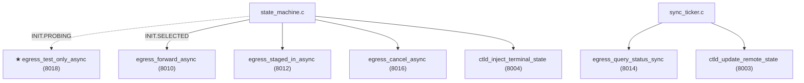

# M08 egress 出站调用 Checklist (broker · v2.0)

> 配套: [doc/Broker详细设计文档MVP_v2.md](../Broker详细设计文档MVP_v2.md) §6.6 / §7.1.A.2 / §7.3
> 差异蓝图: [doc/跨域调度详设-差异变更说明.md](../跨域调度详设-差异变更说明.md) §2.6
> Sprint: S2 → S3
> 依赖: M04-T5 (proto wrapper, v2.0 增 8018 异步 wrapper)、M03-T1 (broker_job_t v2.0)、M02-T3 (broker.conf::TestOnlyTimeoutSec)、M16-T2 (route_candidate_t)
> 下游: M09 状态机、M13 sync_ticker、M14 cleanup（已废弃）

> **v1.5 → v2.0 增量**:
> 1. ★ 新增 `egress_test_only_async(job, cand, cb, user_arg)`: 8018 异步 + 5s 超时 + 回调推进 PROBING 子态
> 2. ★ 新增 `proto_send_async_with_cb()` 在 proto.c 内（io 线程或 epoll 兜底）: M04-T5 v2.0 已声明
> 3. ★ `egress_forward_async(job)` 改用 `route_candidate_t::target_broker_addr` 而非 `g_peer_cluster`（多对端时 peer 由路由决策）
> 4. ★ `egress_query_status_sync()` 类似改造：每 trace_id 按 `selected_route_id` 反查目标 broker
> 5. ★ `ctld_update_remote_state(job)` **首次包**必带 `remote_cluster_name + remote_partition_name`（broker_job_t 已有这俩字段，sync_ticker 调用前确保已填）
> 6. ★ `egress_init/fini`: `g_peer_cluster` 仅 `STATIC_LEGACY` 模式用，`FILE` 模式不再初始化

---

## 1. 模块概述与目标

### 1.1 一句话定位

封装 broker 主动发起的所有出站 RPC：v1.5 的 5 类 broker→broker (`FORWARD_JOB / STAGED_IN / QUERY_STATUS / CANCEL / CLEANUP`) + 2 类 broker→ctld (`UPDATE_REMOTE_STATE / TERMINAL_STATE`) + ★ v2.0 新增 8018 `TEST_ONLY` 异步 RPC。统一加超时、重试、日志。

### 1.2 v2.0 MVP 范围

- 通用 send_recv 包装（含 retry helper）
- 8 个具体 RPC 包装函数（v1.5 7 + v2.0 1）
- broker→broker：v1.5 用 `working_cluster_rec` + `slurm_send_recv_node_msg`；★ v2.0 用 `proto_send_recv_to_peer(peer_addr, ...)`，`peer_addr` 由 `route_candidate_t::target_broker_addr` 提供
- broker→ctld：`slurm_send_recv_controller_rc_msg`（不变）
- ★ 8018 异步：基于 `proto_send_async_with_cb` 实现，5s 超时由 `g_broker_conf.test_only_timeout_sec` 决定

### 1.3 不在 MVP 范围

- ~~异步 IO（io_uring / epoll）替代~~：MVP 同步阻塞 + 8018 单点异步（用阻塞调用 + 子线程模拟 cb）
- ~~批量合并 RPC~~

### 1.4 与 v1.5 的差异

| 维度 | v1.5 | v2.0 |
|---|---|---|
| egress 函数数量 | 7 | **8** (+ test_only_async) |
| broker→broker 寻址 | `working_cluster_rec = &g_peer_cluster` | **每条 RPC 显式传 `slurm_addr_t *peer`** |
| `egress_forward_async` 入参 | `job` only | `job` + 隐含使用 `job->target_broker_addr`（M16 SELECTED 阶段填好） |
| `ctld_update_remote_state` 字段 | 8 字段, remote_cluster/partition 可空 | 8 字段, **首次包必填 remote_cluster + remote_partition**（M13 保证调用顺序） |
| 重试策略 | 同步阻塞 retry | 不变（不影响 8018 异步路径） |

---

## 2. 接口契约

### 2.1 公共 API（v2.0 增 1 个）

```c
/* src/slurmbrokerd/egress.h */
extern int  egress_init(void);
extern void egress_fini(void);

/* === broker -> broker (v2.0 显式 peer addr 由 caller 决定) === */
extern int egress_forward_async(broker_job_t *job);        /* 用 job->target_broker_addr */
extern int egress_staged_in_async(broker_job_t *job);
extern int egress_query_status_sync(char **trace_ids, uint32_t n,
                                    broker_status_msg_t **resp_out);
extern int egress_cancel_async(broker_job_t *job);
extern int egress_cleanup_async(const char *trace_id);

/* ★ v2.0 新增: 异步 8018 + 5s 超时 + 回调 */
typedef void (*test_only_callback_t)(broker_job_t *job, int rc,
                                     brokerd_test_only_resp_msg_t *resp,
                                     void *user_arg);

extern int egress_test_only_async(broker_job_t *job,
                                  route_candidate_t *cand,
                                  test_only_callback_t cb, void *user_arg);

/* === broker -> local ctld === */
extern int ctld_update_remote_state(broker_job_t *job);   /* ★ v2.0 首次包语义 */
extern int ctld_inject_terminal_state(broker_job_t *job);
```

### 2.2 私有 helper（v2.0 增 2 个）

```c
static int  _retry_n_times(int (*fn)(void *), void *arg, int n,
                           int initial_backoff_ms);                  /* 不变 */
static int  _send_to_peer_v1(uint16_t msg_type, void *req,
                              uint16_t resp_type, void **resp_out,
                              int timeout_s);                         /* v1.5: g_peer_cluster */
static int  _send_to_peer_v2(slurm_addr_t *peer, uint16_t msg_type,
                              void *req, uint16_t resp_type,
                              void **resp_out, int timeout_s);        /* ★ v2.0: 显式 peer */

/* ★ v2.0 8018 异步: 后台子线程 */
static void *_test_only_worker(void *arg);
typedef struct {
	broker_job_t        *job;
	route_candidate_t   *cand;
	test_only_callback_t cb;
	void                *user_arg;
	uint32_t             timeout_s;
} _test_only_ctx_t;
```

### 2.3 全局变量（v2.0 微调）

```c
/* egress.c */
static slurmdb_cluster_rec_t g_peer_cluster;     /* v1.5: 仅 STATIC_LEGACY 模式用 */
```

> ★ v2.0 `RouteSource=file` 模式下 `g_peer_cluster` 不初始化；所有 broker→broker 调用都走 `_send_to_peer_v2(peer, ...)` 显式寻址。

---

## 3. 参考代码

| 用途 | 文件 | 说明 |
|---|---|---|
| `slurm_send_recv_controller_rc_msg` | [src/common/slurm_protocol_api.c](../../src/common/slurm_protocol_api.c) | 推 ctld |
| ★ `proto_send_recv_to_peer(peer, msg_type, ...)` | [src/slurmbrokerd/proto.h](../../src/slurmbrokerd/proto.h) | M04-T5 v2.0 已扩展 caller 显式 peer |
| ★ `route_candidate_t` | [src/slurmbrokerd/route.h](../../src/slurmbrokerd/route.h) | M16-T2 提供，含 target_broker_addr / remote_cluster_name / remote_partition / remote_uid |
| `slurm_thread_create` | [src/common/macros.h](../../src/common/macros.h) | 8018 异步子线程 |

---

## 4. 文件清单

| 文件 | 类型 | 用途 |
|---|---|---|
| [src/slurmbrokerd/egress.h](../../src/slurmbrokerd/egress.h) | 修改 | 新增 `egress_test_only_async` + `test_only_callback_t` typedef |
| [src/slurmbrokerd/egress.c](../../src/slurmbrokerd/egress.c) | 修改 | 新增 `_test_only_worker` + `egress_test_only_async`; `_send_to_peer_v2` 显式 peer 路径; `egress_forward_async` 改用 `job->target_broker_addr` |
| [src/slurmbrokerd/Makefile.am](../../src/slurmbrokerd/Makefile.am) | 不变 | egress.c 已在 SOURCES |

---

## 5. 调用关系（v2.0 增 8018 路径）



---

## 6. 任务展开

### M08-T1 ★ v2.0 重构 `egress_init/fini` + 双模式 `_send_to_peer`

- **依赖**: M04-T5 v2.0 (proto API 扩 peer 参数)
- **预估**: 1d
- **关键决策**:
  1. `routes_source == STATIC_LEGACY` 时初始化 `g_peer_cluster`（v1.5 行为）；`FILE` 时跳过。
  2. 新增 `_send_to_peer_v2(peer, ...)`：直接调 `proto_send_recv_to_peer(peer, ...)`，绕过 `working_cluster_rec` 全局变量。
  3. v1.5 `_send_to_peer_v1` 保留作为 STATIC_LEGACY fallback。
  4. dispatcher：所有 v1.5 7 个 wrapper 内部根据 `routes_source` 选 v1/v2 路径；caller（state_machine）传 `job` 后由 wrapper 内部决定 peer。
- **代码草图**:

```c
int egress_init(void)
{
	if (g_broker_conf.routes_source == BROKER_ROUTE_SOURCE_STATIC_LEGACY) {
		memset(&g_peer_cluster, 0, sizeof(g_peer_cluster));
		g_peer_cluster.name         = xstrdup(g_broker_conf.remote_cluster_name);
		g_peer_cluster.control_host = xstrdup(g_broker_conf.remote_broker_host);
		g_peer_cluster.control_port = g_broker_conf.remote_broker_port;
		g_peer_cluster.rpc_version  = SLURM_PROTOCOL_VERSION;
		info("egress_init: STATIC_LEGACY peer = %s:%u",
		     g_peer_cluster.control_host, g_peer_cluster.control_port);
	} else {
		info("egress_init: FILE mode, peer addrs by route_decide");
	}
	return SLURM_SUCCESS;
}

void egress_fini(void)
{
	if (g_broker_conf.routes_source == BROKER_ROUTE_SOURCE_STATIC_LEGACY) {
		xfree(g_peer_cluster.name);
		xfree(g_peer_cluster.control_host);
	}
}

static int _send_to_peer_v2(slurm_addr_t *peer, uint16_t msg_type,
                             void *req, uint16_t resp_type,
                             void **resp_out, int timeout_s)
{
	return proto_send_recv_to_peer_addr(peer, msg_type, req,
	                                     timeout_s, resp_type, resp_out);
}

static slurm_addr_t *_pick_peer_for_job(broker_job_t *job)
{
	if (g_broker_conf.routes_source == BROKER_ROUTE_SOURCE_STATIC_LEGACY)
		return NULL;   /* 走 v1 路径 */
	return &job->target_broker_addr;   /* M16 SELECTED 阶段已填 */
}
```

- **风险与坑**:
  - `slurm_addr_t` 字段需复制到 `broker_job_t` 内（避免 routes.conf 重载后 candidate 失效）—— M16-T3 设计为持久 copy。
  - STATIC_LEGACY 模式下 `proto_send_recv_to_peer_addr(NULL, ...)` 必须 fallback 到 `g_peer_addr`（M04-T5 v2.0 内部判定）。
- **DoD**:
  - [ ] `routes_source=file` 启动 → `egress_init` 不初始化 g_peer_cluster
  - [ ] `routes_source=static_legacy` 启动 → 行为与 v1.5 完全一致
  - [ ] 多对端：发 8 条 forward 到 3 个不同 peer，全部成功

### M08-T2 ★ v2.0 新增 `egress_test_only_async` (8018 异步 + 5s 超时)

- **依赖**: M08-T1, M04-T3/T4 (8018/8019 payload), M16-T3 (route_candidate_t)
- **预估**: 1.5d
- **关键决策**:
  1. **简化策略**：MVP 用"子线程同步阻塞 + cb 在子线程上下文回调"实现"异步"——避免引入 epoll/io_uring 框架。
  2. 子线程内调 `proto_send_recv_to_peer_addr(peer=cand->target_broker_addr, ..., timeout=test_only_timeout_sec)`，超时即 `result=2 (TIMEOUT)`。
  3. `test_only_callback_t` 在子线程上下文执行；cb 内部如果操作 `broker_job_t` 必须 `slurm_mutex_lock(&job->lock)`（state_machine 配套加锁，详见 M09-T7）。
  4. **不阻塞** state_machine tick：tick 内只 `egress_test_only_async()` 投递，子线程结束后由 cb 触发下一 tick。
  5. **超时统计**：用 `clock_gettime(CLOCK_MONOTONIC)` 测耗时，超时打 warn 日志。
- **代码草图**:

```c
int egress_test_only_async(broker_job_t *job, route_candidate_t *cand,
                            test_only_callback_t cb, void *user_arg)
{
	_test_only_ctx_t *ctx = xmalloc(sizeof(*ctx));
	ctx->job       = job;
	ctx->cand      = cand;
	ctx->cb        = cb;
	ctx->user_arg  = user_arg;
	ctx->timeout_s = g_broker_conf.test_only_timeout_sec;

	pthread_t tid;
	pthread_attr_t attr;
	pthread_attr_init(&attr);
	pthread_attr_setdetachstate(&attr, PTHREAD_CREATE_DETACHED);
	int rc = pthread_create(&tid, &attr, _test_only_worker, ctx);
	pthread_attr_destroy(&attr);

	if (rc) {
		error("egress_test_only_async: pthread_create: %s",
		      slurm_strerror(rc));
		xfree(ctx);
		return SLURM_ERROR;
	}
	debug("egress_test_only_async: trace_id=%s candidate=%s "
	      "(target=%s) dispatched",
	      job->trace_id, cand->route_id, cand->remote_partition);
	return SLURM_SUCCESS;
}

static void *_test_only_worker(void *arg)
{
	_test_only_ctx_t *ctx = arg;
	brokerd_test_only_msg_t req = {0};
	brokerd_test_only_resp_msg_t *resp = NULL;
	int rc;

	memcpy(req.trace_id, ctx->job->trace_id, BROKER_TRACE_ID_LEN);
	req.src_uid          = ctx->job->src_uid;
	req.src_user_name    = ctx->job->src_user_name;
	req.remote_uid       = ctx->cand->remote_uid;
	req.remote_user_name = ctx->cand->remote_user_name;
	req.remote_partition = ctx->cand->remote_partition;
	req.cd_app_name      = ctx->job->cd_app_name;
	req.num_tasks        = ctx->job->req_num_tasks;
	req.cpus_per_task    = ctx->job->req_cpus_per_task;
	req.pn_min_memory    = ctx->job->req_pn_min_memory;
	req.time_limit_min   = ctx->job->req_time_limit_min;
	req.min_nodes        = ctx->job->req_min_nodes;
	req.max_nodes        = ctx->job->req_max_nodes;
	req.gres_per_node    = ctx->job->req_gres_per_node;
	req.qos              = ctx->job->req_qos;
	req.tres_per_task    = ctx->job->req_tres_per_task;

	struct timespec t0, t1;
	clock_gettime(CLOCK_MONOTONIC, &t0);
	rc = proto_send_recv_to_peer_addr(&ctx->cand->target_broker_addr,
	                                   BROKERD_REQUEST_BROKER_TEST_ONLY,
	                                   &req, ctx->timeout_s,
	                                   BROKERD_RESPONSE_BROKER_TEST_ONLY,
	                                   (void **) &resp);
	clock_gettime(CLOCK_MONOTONIC, &t1);
	long elapsed_ms = (t1.tv_sec - t0.tv_sec) * 1000 +
	                  (t1.tv_nsec - t0.tv_nsec) / 1000000;

	if (rc != SLURM_SUCCESS) {
		warning("test_only: trace_id=%s rc=%d (%s) elapsed=%ldms",
		        ctx->job->trace_id, rc, slurm_strerror(rc),
		        elapsed_ms);
		/* 区分 timeout vs hard error: 用启发式 (elapsed >= timeout - 100ms 视为 timeout) */
		int reported_rc = (elapsed_ms >= (long) ctx->timeout_s * 1000 - 100)
			? BROKERD_ERR_TEST_ONLY_TIMEOUT
			: BROKERD_ERR_TEST_ONLY_REJECTED;
		ctx->cb(ctx->job, reported_rc, NULL, ctx->user_arg);
	} else {
		debug("test_only: trace_id=%s result=%u reason=%u (%s) elapsed=%ldms",
		      ctx->job->trace_id, resp->result,
		      resp->reject_reason_code,
		      resp->reject_reason_text ? resp->reject_reason_text : "",
		      elapsed_ms);
		int reported_rc = (resp->result == 0)
			? SLURM_SUCCESS
			: BROKERD_ERR_TEST_ONLY_REJECTED;
		ctx->cb(ctx->job, reported_rc, resp, ctx->user_arg);
		brokerd_free_test_only_resp_msg(resp);
	}

	xfree(ctx);
	return NULL;
}
```

- **风险与坑**:
  - 大量并发 PROBING（500 jobs × 8 candidates ≈ 4000 子线程）会爆线程数 → 用线程池版本（M14/v0.2）；MVP 通过 cap_check 限流间接控制并发（最多 `MaxInflight` 个并行）。
  - cb 在子线程执行 → state_machine 必须 thread-safe；`broker_job_t.lock` 已存在（M03）。
  - `proto_send_recv_to_peer_addr` 内部超时是软超时（依赖 `slurm_msg_recvfrom_timeout`）；若对端 wire frame 解码失败，可能立即返回非 timeout rc。
- **DoD**:
  - [ ] mock receiver 5s 内回 result=0 → cb 收到 rc=SUCCESS + resp
  - [ ] mock receiver 故意延迟 6s → cb 收到 rc=BROKERD_ERR_TEST_ONLY_TIMEOUT
  - [ ] mock receiver 立即返回 result=1 → cb 收到 rc=BROKERD_ERR_TEST_ONLY_REJECTED + resp
  - [ ] 100 个 job 并发 test_only_async → 均能在 ≤ 6s 内 cb 完成；valgrind clean
  - [ ] cb 内修改 job->init_phase 字段在加锁保护下不 race

### M08-T3 `egress_forward_async` v2.0 用 job->target_broker_addr

- **依赖**: M08-T1
- **预估**: 0.25d
- **关键决策**:
  1. 改用 `_pick_peer_for_job(job)` 取 peer。
  2. 入参 payload 字段映射改用 v1.5 broker→broker 8010 字段（这部分 wire 不变；详见 broker-M07-T1 v2.0 字段一致性说明）。
  3. 失败时仍 transition FAILED + reason；M09 v2.0 PROBING 阶段已不再调本函数（PROBING 用 test_only_async；SELECTED 阶段才调 forward_async）。
- **代码草图**（差异部分）:

```c
int egress_forward_async(broker_job_t *job)
{
	brokerd_broker_forward_job_msg_t req = {
		.trace_id         = job->trace_id,
		.hop_count        = job->hop_count,
		.src_cluster      = job->src_cluster,
		.src_job_id       = job->src_job_id,
		.src_user_name    = job->src_user_name,
		.remote_user_name = job->remote_user_name,
		.target_partition = job->target_partition,    /* ★ v2.0 由 SELECTED 填 */
		.cd_app_name      = job->cd_app_name,         /* ★ v2.0 字段名 */
	};

	brokerd_broker_ack_msg_t *resp = NULL;
	slurm_addr_t *peer = _pick_peer_for_job(job);
	int rc;

	if (peer)
		rc = _send_to_peer_v2(peer,
		                       BROKERD_REQUEST_BROKER_FORWARD_JOB, &req,
		                       BROKERD_RESPONSE_BROKER_ACK,
		                       (void **) &resp, 30);
	else
		rc = _send_to_peer_v1(BROKERD_REQUEST_BROKER_FORWARD_JOB, &req,
		                       BROKERD_RESPONSE_BROKER_ACK,
		                       (void **) &resp, 30);

	if (rc != SLURM_SUCCESS || (resp && resp->error_code)) {
		int err = resp ? resp->error_code : rc;
		state_machine_transition(job, BROKER_STATE_FAILED,
		                         brokerd_strerror(err));
		if (resp) brokerd_free_broker_ack_msg(resp);
		return err;
	}

	/* RECEIVER 创建的 dst_work_dir 反传回来 */
	if (resp && resp->dst_work_dir) {
		xfree(job->dst_work_dir);
		job->dst_work_dir = xstrdup(resp->dst_work_dir);
	}
	brokerd_free_broker_ack_msg(resp);

	state_machine_transition(job, BROKER_STATE_STAGING_IN, NULL);
	stage_submit_in(job);
	persist_async_request();
	return SLURM_SUCCESS;
}
```

- **DoD**:
  - [ ] 多对端场景：3 个 peer 各收到对应 forward；本端 dst_work_dir 反传正确
  - [ ] STATIC_LEGACY 路径行为与 v1.5 一致

### M08-T4 `egress_staged_in_async` / `egress_cancel_async` / `egress_cleanup_async` v2.0 改用 _pick_peer_for_job

- **依赖**: M08-T1
- **预估**: 0.25d
- **关键决策**: 与 T3 相同的"choose peer by job"模式，三个 wrapper 各加一行 `_pick_peer_for_job(job)`。
- **DoD**:
  - [ ] 与 T3 同等覆盖

### M08-T5 `egress_query_status_sync` v2.0 按目标 broker 分组

- **依赖**: M08-T1
- **预估**: 0.5d
- **关键决策**:
  1. v1.5 一次性发 N 个 trace_id 到单 peer；v2.0 多对端时需按 `selected_route_id → target_broker_addr` 分组，每组单独发一次。
  2. M13 sync_ticker 内 Phase 1 已按 ORIGINATOR + state ∈ {SUBMITTED,RUNNING} 收集 trace_id；本函数在内部按 peer 分桶。
  3. 返回时合并所有 bucket 的 entries 到一个 `broker_status_msg_t`。
- **代码草图**（差异部分）:

```c
int egress_query_status_sync(char **trace_ids, uint32_t n,
                             broker_status_msg_t **resp_out)
{
	if (g_broker_conf.routes_source == BROKER_ROUTE_SOURCE_STATIC_LEGACY) {
		/* v1.5 单 peer 路径 (略) */
		return _query_status_v1(trace_ids, n, resp_out);
	}

	/* ★ v2.0: 按 peer 分组 */
	xhash_t *buckets = _group_by_peer_addr(trace_ids, n);
	broker_status_msg_t *merged = xmalloc(sizeof(*merged));
	merged->entry_count = 0;
	merged->entries     = xcalloc(n, sizeof(*merged->entries));

	xhash_walk(buckets, _query_one_bucket_cb, merged);

	xhash_free(buckets);
	*resp_out = merged;
	return SLURM_SUCCESS;
}
```

- **风险与坑**: 多对端 query 时单点失败不阻塞其它 bucket；某 peer 超时时只对应 bucket 的 trace_id 视为 PENDING，下轮重试。
- **DoD**:
  - [ ] 100 个 trace_id 分布到 3 个 peer，能正确合并 100 entries
  - [ ] 1 个 peer 不可达 → 该 bucket 内 trace_id 报 PENDING；其它 bucket 正常返回

### M08-T6 ★ v2.0 `ctld_update_remote_state` 强化首次包语义

- **依赖**: M08-T1, M04-T2 (8003 payload v2.0 字段不变, 仅语义)
- **预估**: 0.25d
- **关键决策**:
  1. 字段顺序与 [Broker详细设计文档MVP_v2.md](../Broker详细设计文档MVP_v2.md) §6.3.4 一致（M04 v2.0 §2.3.3 已对齐）。
  2. **首次包**（caller M13 由 `job->first_state_pushed == false` 判定）必带 `remote_cluster_name + remote_partition_name` —— broker_job_t 已有这俩字段，由 M16 SELECTED 阶段填好；本函数不做 NULL 校验，由 caller 保证。
  3. 失败 warn 不阻塞（下一轮 sync 重推）；首次包失败时**不**置 `first_state_pushed = true`，确保下一轮再次按首次包语义推。
- **代码草图**（差异部分）:

```c
int ctld_update_remote_state(broker_job_t *job)
{
	brokerd_remote_state_msg_t req = {
		.src_job_id            = job->src_job_id,
		.trace_id              = job->trace_id,
		.remote_cluster_name   = job->dst_cluster,         /* ★ v2.0 必填 */
		.remote_partition_name = job->target_partition,    /* ★ v2.0 必填 */
		.remote_job_id         = job->remote_job_id,
		.remote_state          = _broker_state_to_slurm_state(job->state),
		.remote_alloc_tres     = job->remote_alloc_tres,
		.remote_start_time     = job->remote_start_time,
	};

	/* ★ v2.0 防御: 首次包必带 remote_cluster_name */
	if (!job->first_state_pushed &&
	    (!req.remote_cluster_name || !req.remote_partition_name)) {
		error("ctld_update_remote_state: first push for trace_id=%s "
		      "MISSING remote_cluster_name or remote_partition_name; "
		      "did SELECTED phase populate them?",
		      job->trace_id);
		return SLURM_ERROR;
	}

	slurm_msg_t req_msg;
	int rc = SLURM_SUCCESS;

	slurm_msg_t_init(&req_msg);
	req_msg.msg_type = BROKERD_REQUEST_BROKER_UPDATE_REMOTE_STATE;
	req_msg.data     = &req;

	if (slurm_send_recv_controller_rc_msg(&req_msg, &rc, NULL)) {
		warning("ctld_update_remote_state trace_id=%s: %m",
		        job->trace_id);
		return SLURM_ERROR;
	}

	if (rc == SLURM_SUCCESS && !job->first_state_pushed) {
		slurm_mutex_lock(&job->lock);
		job->first_state_pushed = true;
		slurm_mutex_unlock(&job->lock);
		debug("ctld_update_remote_state: trace_id=%s first_pack done "
		      "(remote_cluster=%s remote_partition=%s)",
		      job->trace_id, req.remote_cluster_name,
		      req.remote_partition_name);
	}
	return rc;
}
```

- **DoD**:
  - [ ] mock ctld 收到首次包，字段含 remote_cluster_name + remote_partition_name
  - [ ] M03 持久化字段含 `first_state_pushed`（broker_job_t v2.0 应同步加该字段；如 M03 未含，本函数本地 cache 即可）
  - [ ] 首次推送失败 → 下一轮 sync_ticker 仍带首次包字段
  - [ ] grep `slurm_update_job` in egress.c → 0 行（broker 不调 comment 路径）

### M08-T7 `ctld_inject_terminal_state`（不变）

- **依赖**: M08-T6
- **预估**: 0d (v1.5 已落地)
- **DoD**: v1.5 已通过

---

## 7. 整体 DoD（汇总）

- [ ] 7 个子任务全部勾选（T1/T2/T6 v2.0 增量, T3/T4/T5 v2.0 微调, T7 v1.5 已完成）
- [ ] **★ v2.0**: 8018 异步 `cb` 在 5s 内完成；超时正确报告 `BROKERD_ERR_TEST_ONLY_TIMEOUT`
- [ ] **★ v2.0**: `routes_source=file` 时多对端 forward / query_status / cancel 均能正确寻址
- [ ] **★ v2.0**: 首次 ctld_update_remote_state 必带 remote_cluster + remote_partition；缺失时返回 SLURM_ERROR
- [ ] valgrind: 1000 次 send/recv（含 100 次 8018 异步）clean
- [ ] mock peer 不可用时所有 egress 失败重试后 graceful 处理（无阻塞主线程）
- [ ] grep `slurm_update_job` egress.c → 0 行

## 8. 验证脚本

```bash
# === ★ v2.0 8018 异步 ===
./tests/broker/test_egress_test_only_v2 \
    --target=127.0.0.1:8443 \
    --concurrency=100 --timeout=5
# 期望: 100/100 在 6s 内完成 cb
# 期望: TIMEOUT 比例 < 5%

# === ★ v2.0 多对端 forward ===
./tests/broker/mock_3_peers.sh --bind 127.0.0.1:8443 127.0.0.1:8444 127.0.0.1:8445
./tests/broker/inject_routes_conf_3peers.sh
sudo systemctl reload slurmbrokerd  # 触发 routes 热加载
for i in $(seq 1 30); do
  ./tests/broker/inject_forward_job_v2 --src-job-id=$i ...
done
# 期望: 3 个 mock peer 各收到 ~10 个 forward, dst_work_dir 反传正确

# === ★ v2.0 首次包必带字段 ===
./tests/broker/test_first_pack_remote_cluster
# 期望: 首次 8003 必含 remote_cluster_name + remote_partition_name

# === ★ v2.0 STATIC_LEGACY 兼容 ===
sudo sed -i 's/^RouteSource=file/RouteSource=static_legacy/' /etc/slurm/broker.conf
sudo systemctl restart slurmbrokerd
./tests/broker/inject_forward_job ...
# 期望: 行为与 v1.5 完全一致, journalctl 含 "STATIC_LEGACY peer = wz-broker:8443"
```

---

## 9. 风险与回滚

| 风险 | 触发 | 缓解 |
|---|---|---|
| 8018 子线程数量爆炸 | 500 jobs × 8 cands 同时 PROBING | M16 cap_check 限流（PROBING 只对未失败候选发，最多 N=test_only_max_candidates）；M14/v0.2 改线程池 |
| `cb` 在子线程内修改 broker_job 数据 race | 漏加锁 | M09-T7 强制 cb 入口加 `job->lock`；CI grep `egress_test_only_async` 调用方必须配 `slurm_mutex_lock` |
| `proto_send_recv_to_peer_addr` 超时启发式不准 | 网络抖动 | M14/v0.2 改用显式 `setsockopt SO_RCVTIMEO` + 错误码区分 |
| 首次包字段缺失 | M16 SELECTED 阶段 bug | M08-T6 显式 fail-fast SLURM_ERROR + error 日志，M09 状态机收到后 transition FAILED |
| `g_peer_cluster` 空指针解引用 | FILE 模式误用 v1 路径 | T1 内 `_pick_peer_for_job` 严格按 `routes_source` 选择；CI 测试 file-mode 不调 v1 |
| 多对端 query_status 部分失败 | 1 个 peer 网络故障 | bucket 级失败不影响其它，PENDING 报告下轮重试 |

回滚：本模块独立。

1. `git revert egress.c::egress_test_only_async + _test_only_worker`
2. `git revert egress.c::_send_to_peer_v2 + _pick_peer_for_job`
3. `git revert egress.c::ctld_update_remote_state v2.0 首次包语义`
4. broker 重启即可，无 wire format 兼容性问题
