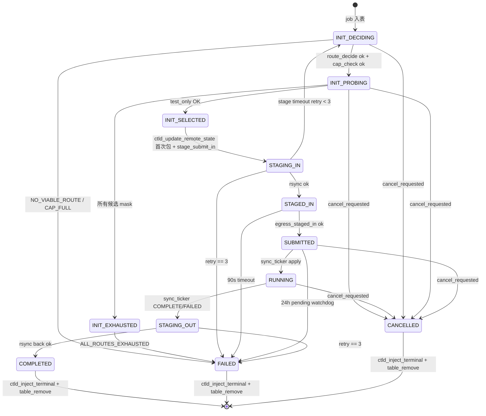

# M09 状态机 Checklist (broker · v2.0)

> 配套: [doc/Broker详细设计文档MVP_v2.md](../Broker详细设计文档MVP_v2.md) §5
> 差异蓝图: [doc/跨域调度详设-差异变更说明.md](../跨域调度详设-差异变更说明.md) §2.5
> Sprint: S2 → S3
> 依赖: M03-T1 (broker_job_t.init_phase + route_candidates[])、M08-T2 (egress_test_only_async)、M16-T2/T3 (route_decide / cap_check / route_candidate_t)、M10 (stage_*)
> 下游: M07/M08/M13 调 `state_machine_transition`

> **v1.5 → v2.0 增量**:
> 1. ★ INIT 状态拆 4 子状态 (`DECIDING / PROBING / SELECTED / EXHAUSTED`)；新增 4 个内部分支函数 `_on_init_deciding/probing/selected/exhausted`
> 2. ★ 引入 **两阶段 tick + ACTION 队列**：Phase1 持锁收集 actions，Phase2 释锁串行执行 ACTION（避免 egress 阻塞主表锁）
> 3. ★ 新增 4 个 ACTION 类型：`SM_ACTION_ROUTE_DECIDE` / `SM_ACTION_TEST_ONLY_NEXT` / `SM_ACTION_INIT_TO_STAGE_IN` / `SM_ACTION_INJECT_TERMINAL` (后者 v1.5 已存在, v2.0 名称统一)
> 4. ★ INIT.SELECTED 阶段在 stage_submit_in 之前**立即推首次 `ctld_update_remote_state(8003)`**（含 remote_cluster + remote_partition）
> 5. ★ INIT.EXHAUSTED 转 FAILED 时 reason 固定为 `"ALL_ROUTES_EXHAUSTED"`，触发 `ctld_inject_terminal_state` 携带 `BROKERD_ERR_ALL_ROUTES_EXHAUSTED`
> 6. ★ `state_machine_resume_inflight()` 在 M03-T8 已扩展含 PROBING 续探测；本模块 wire-up 调用

---

## 1. 模块概述与目标

### 1.1 一句话定位

全局 1s tick 线程，遍历表，按状态执行：超时检测 → cancel 优先级 → ★ v2.0 INIT 4 子状态推进（DECIDING → PROBING → SELECTED 或 EXHAUSTED）→ 状态推进 → 终态出表。本模块是 broker 的"心跳"。

### 1.2 v2.0 MVP 范围

- 单 tick 线程，1s 周期
- 9 个状态对应 9 个分支；INIT 内拆 4 子状态分支
- ★ **两阶段 tick**：Phase1 持锁 foreach + 收集 ACTION；Phase2 释锁串行 drain ACTION queue
- 超时与重试逻辑（INIT 总超时 80s 含所有 4 子状态、STAGING 按数据量、SUBMITTED 24h 看门狗）
- cancel 优先级：先于状态推进
- 终态：调 `ctld_inject_terminal_state` + 出表

### 1.3 不在 MVP 范围

- ~~优先级队列 / 多线程并行~~：单 tick 线程足够
- ~~状态机 DSL / 配置化~~

### 1.4 与 v1.5 的差异

| 维度 | v1.5 | v2.0 |
|---|---|---|
| INIT 分支 | 1 个 `_on_init` | **4 个**: `_on_init_deciding/probing/selected/exhausted` |
| tick 结构 | 单阶段 (foreach 内直接 transition + egress) | **两阶段** (Phase1 收集 actions, Phase2 drain) |
| ACTION 类型 | 隐式（直接调 egress） | **5 个显式**: ROUTE_DECIDE / TEST_ONLY_NEXT / INIT_TO_STAGE_IN / CANCEL / INJECT_TERMINAL |
| INIT 超时 | 60s | 80s（4 子状态串行最多 5s × 8 候选 = 40s + 余量） |
| RECEIVER 端 INIT | 60s 看门狗 | 不变（receiver 没有路由探测，init_phase 直接 SELECTED） |
| FAILED state_reason | 自由文本 | INIT.EXHAUSTED 固定 `"ALL_ROUTES_EXHAUSTED"`；INIT 总超时 `"INIT_TIMEOUT"` |

---

## 2. 接口契约

### 2.1 公共 API（v2.0 不变）

```c
/* src/slurmbrokerd/state_machine.h */
extern int  state_machine_start(void);
extern void state_machine_stop(void);

extern void state_machine_transition(broker_job_t *job,
                                     broker_job_state_t to,
                                     const char *reason);

extern void state_machine_resume_inflight(void);   /* M03-T8 已实现 PROBING 分支 */
```

### 2.2 ★ v2.0 ACTION 类型（**单一源头**）

```c
/* src/slurmbrokerd/state_machine.c (private) */
typedef enum {
	SM_ACTION_ROUTE_DECIDE     = 1,   /* INIT.DECIDING */
	SM_ACTION_TEST_ONLY_NEXT   = 2,   /* INIT.PROBING */
	SM_ACTION_INIT_TO_STAGE_IN = 3,   /* INIT.SELECTED -> STAGING_IN */
	SM_ACTION_CANCEL           = 4,   /* cancel 优先 */
	SM_ACTION_INJECT_TERMINAL  = 5,   /* 终态 */
} sm_action_kind_t;

typedef struct {
	sm_action_kind_t kind;
	char trace_id[BROKER_TRACE_ID_LEN];
} sm_action_t;
```

### 2.3 私有 helper（v2.0 增 5 个）

```c
static void *_state_machine_thread(void *arg);
static int   _tick_phase1_collect(broker_job_t *job, void *arg);   /* foreach cb */
static void  _tick_phase2_drain(list_t *actions);
static void  _exec_action(sm_action_t *act);

/* ★ v2.0 INIT 4 子状态分支 */
static void  _on_init_deciding(broker_job_t *job);
static void  _on_init_probing(broker_job_t *job);
static void  _on_init_selected(broker_job_t *job);
static void  _on_init_exhausted(broker_job_t *job);

/* ★ v2.0 8018 异步 cb: 在 egress_test_only_async 子线程执行 */
static void  _test_only_cb(broker_job_t *job, int rc,
                            brokerd_test_only_resp_msg_t *resp,
                            void *user_arg);

/* v1.5 沿用 */
static void  _on_staging_in(broker_job_t *job, time_t now);
static void  _on_staged_in(broker_job_t *job, time_t now);
static void  _on_submitted(broker_job_t *job, time_t now);
static void  _on_staging_out(broker_job_t *job, time_t now);
static void  _on_terminal(broker_job_t *job);
static int   _stage_timeout(broker_job_t *job);
```

### 2.4 全局变量

```c
/* state_machine.c */
static pthread_t     sm_tid;
static volatile bool sm_running;
static list_t       *to_remove_list;     /* 终态出表延迟清理 */
```

---

## 3. 参考代码

| 用途 | 文件 | 说明 |
|---|---|---|
| 1s tick 线程范式 | [src/slurmctld/agent.c](../../src/slurmctld/agent.c) | grep `_agent` |
| `slurm_thread_create` | [src/common/macros.h](../../src/common/macros.h) | thread helper |
| `clock_gettime(CLOCK_MONOTONIC)` | `<time.h>` | 系统时钟回拨防御 |
| ★ M16 `route_decide()` / `cap_check()` | [src/slurmbrokerd/route.h](../../src/slurmbrokerd/route.h) | M16 实现 |
| ★ M08 `egress_test_only_async()` | [src/slurmbrokerd/egress.h](../../src/slurmbrokerd/egress.h) | M08-T2 实现 |

---

## 4. 文件清单

| 文件 | 类型 | 用途 |
|---|---|---|
| [src/slurmbrokerd/state_machine.h](../../src/slurmbrokerd/state_machine.h) | 不变 | API |
| [src/slurmbrokerd/state_machine.c](../../src/slurmbrokerd/state_machine.c) | 修改 | ★ v2.0 重写 tick 为两阶段 + 4 个 INIT 子分支 + ACTION 队列 |
| [src/slurmbrokerd/Makefile.am](../../src/slurmbrokerd/Makefile.am) | 不变 | 已在 SOURCES |

---

## 5. 状态转移图（v2.0 INIT 拆 4 子状态）



### 状态超时表（v2.0 调整 INIT）

| 状态 / 子状态 | 超时阈值 | 超时动作 |
|---|---|---|
| INIT (整体) | **80s**（含 4 子状态总耗时） | FAILED reason="INIT_TIMEOUT" |
| INIT.DECIDING | 5s（route_decide 应是 ms 级） | FAILED reason="DECIDING_TIMEOUT" |
| INIT.PROBING | 8 × test_only_timeout_sec = 40s（默认） | FAILED reason="PROBING_TIMEOUT"（理论会先转 EXHAUSTED） |
| INIT.SELECTED | 5s（首次推 ctld + stage_submit_in 同步快） | FAILED reason="SELECTED_TIMEOUT" |
| INIT.EXHAUSTED | 立即（无 timeout） | FAILED reason="ALL_ROUTES_EXHAUSTED" |
| STAGING_IN | `data_GB * StageTimeoutPerGB + 600s` | retry < 3 → INIT.DECIDING；retry == 3 → FAILED |
| STAGED_IN | 30s（每次重发） | 重发，3 次 → FAILED |
| SUBMITTED | 24h | FAILED |
| RUNNING | 不设软超时 | - |
| STAGING_OUT | 同 STAGING_IN | 同 |

---

## 6. 任务展开

### M09-T1 ★ v2.0 重构 `state_machine_thread` 为两阶段 tick + ACTION 队列

- **依赖**: M03-T2
- **预估**: 1d
- **关键决策**:
  1. **Phase1**: `broker_job_table_foreach(_tick_phase1_collect, &actions)` —— 持锁，仅收集 ACTION 不执行 egress / IO。
  2. **Phase2**: `_tick_phase2_drain(actions)` —— 释锁，串行 drain ACTION queue；ACTION 内调用 egress 等可阻塞 IO。
  3. ACTION queue 用 `list_t *` 局部变量，每次 tick 创建并销毁。
  4. terminal jobs 的 remove 仍延迟到 tick 末尾批量执行（v1.5 行为）。
- **代码草图**:

```c
int state_machine_start(void)
{
	to_remove_list = list_create(NULL);
	sm_running = true;
	slurm_thread_create(&sm_tid, _state_machine_thread, NULL);
	return SLURM_SUCCESS;
}

void state_machine_stop(void)
{
	sm_running = false;
	pthread_join(sm_tid, NULL);
	FREE_NULL_LIST(to_remove_list);
}

static void *_state_machine_thread(void *arg)
{
	while (sm_running) {
		list_t *actions = list_create(xfree_ptr);

		/* Phase 1: 持锁收集 */
		broker_job_table_foreach(_tick_phase1_collect, actions);

		/* Phase 2: 释锁 drain */
		_tick_phase2_drain(actions);
		FREE_NULL_LIST(actions);

		/* 终态出表 */
		broker_job_t *j;
		list_itr_t *itr = list_iterator_create(to_remove_list);
		while ((j = list_next(itr)))
			broker_job_table_remove(j->trace_id);
		list_iterator_destroy(itr);
		list_flush(to_remove_list);

		sleep(1);
	}
	return NULL;
}

static void _enqueue(list_t *actions, sm_action_kind_t kind,
                      const char *trace_id)
{
	sm_action_t *a = xmalloc(sizeof(*a));
	a->kind = kind;
	strlcpy(a->trace_id, trace_id, BROKER_TRACE_ID_LEN);
	list_append(actions, a);
}

static int _tick_phase1_collect(broker_job_t *job, void *arg)
{
	list_t *actions = arg;
	time_t now = time(NULL);

	/* cancel 优先 */
	if (job->cancel_requested && !job->cancel_propagated &&
	    job->state != BROKER_STATE_CANCELLED &&
	    job->state != BROKER_STATE_COMPLETED &&
	    job->state != BROKER_STATE_FAILED) {
		_enqueue(actions, SM_ACTION_CANCEL, job->trace_id);
		return 0;
	}

	switch (job->state) {
	case BROKER_STATE_INIT:
		switch (job->init_phase) {
		case BROKER_INIT_PHASE_DECIDING:
			_enqueue(actions, SM_ACTION_ROUTE_DECIDE, job->trace_id);
			break;
		case BROKER_INIT_PHASE_PROBING:
			_enqueue(actions, SM_ACTION_TEST_ONLY_NEXT, job->trace_id);
			break;
		case BROKER_INIT_PHASE_SELECTED:
			_enqueue(actions, SM_ACTION_INIT_TO_STAGE_IN, job->trace_id);
			break;
		case BROKER_INIT_PHASE_EXHAUSTED:
			/* 内联 transition FAILED, 然后下轮变 _on_terminal */
			state_machine_transition(job, BROKER_STATE_FAILED,
			                         "ALL_ROUTES_EXHAUSTED");
			_enqueue(actions, SM_ACTION_INJECT_TERMINAL, job->trace_id);
			break;
		}
		/* INIT 总超时 (除 PROBING 外, PROBING 在 _on_init_probing 内自管) */
		if (job->init_phase != BROKER_INIT_PHASE_PROBING &&
		    now - job->state_enter_time > 80) {
			state_machine_transition(job, BROKER_STATE_FAILED,
			                         "INIT_TIMEOUT");
			_enqueue(actions, SM_ACTION_INJECT_TERMINAL, job->trace_id);
		}
		break;
	case BROKER_STATE_STAGING_IN:  _on_staging_in(job, now);  break;
	case BROKER_STATE_STAGED_IN:   _on_staged_in(job, now);   break;
	case BROKER_STATE_SUBMITTED:   _on_submitted(job, now);   break;
	case BROKER_STATE_RUNNING:     /* sync_ticker 推进 */     break;
	case BROKER_STATE_STAGING_OUT: _on_staging_out(job, now); break;
	case BROKER_STATE_COMPLETED:
	case BROKER_STATE_FAILED:
	case BROKER_STATE_CANCELLED:
		_enqueue(actions, SM_ACTION_INJECT_TERMINAL, job->trace_id);
		list_append(to_remove_list, job);
		break;
	}
	return 0;
}

static void _tick_phase2_drain(list_t *actions)
{
	list_itr_t *itr = list_iterator_create(actions);
	sm_action_t *a;
	while ((a = list_next(itr))) _exec_action(a);
	list_iterator_destroy(itr);
}

static void _exec_action(sm_action_t *act)
{
	broker_job_t *job = broker_job_table_get(act->trace_id);
	if (!job) return;

	switch (act->kind) {
	case SM_ACTION_ROUTE_DECIDE:      _on_init_deciding(job); break;
	case SM_ACTION_TEST_ONLY_NEXT:    _on_init_probing(job);  break;
	case SM_ACTION_INIT_TO_STAGE_IN:  _on_init_selected(job); break;
	case SM_ACTION_CANCEL:
		egress_cancel_async(job);
		state_machine_transition(job, BROKER_STATE_CANCELLED,
		                         "user_cancelled");
		break;
	case SM_ACTION_INJECT_TERMINAL:
		if (!job->_terminal_handled) {
			if (job->role == BROKER_ROLE_ORIGINATOR)
				ctld_inject_terminal_state(job);
			job->_terminal_handled = true;
		}
		break;
	}
}
```

- **风险与坑**:
  - Phase1 持锁期间不能调用 egress / IO；CI grep `_tick_phase1_collect` 函数体内禁止 `egress_*`。
  - ACTION queue 在 Phase1 与 Phase2 之间作业可能被并发删除（M07/M08 内部 transition）；`_exec_action` 入口已用 `broker_job_table_get` 重查，找不到就跳过。
- **DoD**:
  - [ ] 线程能起停；transition 调用日志可见
  - [ ] valgrind: start/stop 100 次 0 still reachable
  - [ ] 100 jobs 并发 → tick 间隔 ≈ 1.0s ± 50ms

### M09-T2 ★ v2.0 `_on_init_deciding`

- **依赖**: M16-T2 (route_decide / cap_check)
- **预估**: 0.5d
- **关键决策**:
  1. 调 `route_decide(job, &out_candidates, &out_count)`；NULL/空 → `transition FAILED reason="NO_VIABLE_ROUTE"` + 收 INJECT_TERMINAL（携带 9010）。
  2. 调 `cap_check(out_candidates, &out_count)`；过滤后 0 → `transition FAILED reason="CAP_FULL"` + 收 INJECT_TERMINAL（携带 9020 软等待）。
  3. 成功：把候选 strdup 到 `job->route_candidates[]`，`route_candidates_count = out_count`，`route_current_idx = 0`，`init_phase = PROBING`，`persist_async_request()`。
  4. **9020 vs 9010 区分**：CAP_FULL 是临时性的，理论上下一轮 tick 会自动 retry；MVP 简化为 fail-fast（与 9010 同等处理），运维通过 ctld `cd_route_exhausted` 字段判断是否人工 reset。
- **代码草图**:

```c
static void _on_init_deciding(broker_job_t *job)
{
	route_candidate_t *out = NULL;
	uint32_t n = 0;
	int rc;

	rc = route_decide(job, &out, &n);
	if (rc != SLURM_SUCCESS || n == 0) {
		warning("init_deciding: trace_id=%s NO_VIABLE_ROUTE",
		        job->trace_id);
		state_machine_transition(job, BROKER_STATE_FAILED,
		                         "NO_VIABLE_ROUTE");
		job->terminal_err_code = BROKERD_ERR_NO_VIABLE_ROUTE;
		return;
	}

	rc = cap_check(out, &n);
	if (rc != SLURM_SUCCESS || n == 0) {
		warning("init_deciding: trace_id=%s CAP_FULL_SOFT_WAIT",
		        job->trace_id);
		state_machine_transition(job, BROKER_STATE_FAILED,
		                         "CAP_FULL_SOFT_WAIT");
		job->terminal_err_code = BROKERD_ERR_CAP_FULL_SOFT_WAIT;
		route_candidate_array_free(out, n);
		return;
	}

	/* 复制到 broker_job_t (定长数组 BROKER_MAX_ROUTE_CANDIDATES) */
	uint32_t copy_n = MIN(n, BROKER_MAX_ROUTE_CANDIDATES);
	for (uint32_t i = 0; i < copy_n; i++) {
		job->route_candidates[i] = xstrdup(out[i].route_id);
	}
	/* route_candidate_t 详细信息（target_broker_addr, remote_*）由 caller
	 * 缓存到 job 内或在 _on_init_probing 时 lookup_route_by_id 重查 */
	job->route_candidates_count = copy_n;
	job->route_current_idx = 0;
	job->route_attempted_mask = 0;
	job->init_phase = BROKER_INIT_PHASE_PROBING;
	persist_async_request();

	info("init_deciding: trace_id=%s -> PROBING with %u candidate(s)",
	     job->trace_id, copy_n);

	route_candidate_array_free(out, n);
}
```

- **DoD**:
  - [ ] route_decide 返回 0 候选 → transition FAILED
  - [ ] cap_check 全过滤 → transition FAILED + reason=CAP_FULL_SOFT_WAIT
  - [ ] 成功 → init_phase=PROBING + route_candidates_count > 0

### M09-T3 ★ v2.0 `_on_init_probing` + `_test_only_cb`

- **依赖**: M08-T2 (egress_test_only_async)
- **预估**: 1.5d
- **关键决策**:
  1. 取 `idx = job->route_current_idx`；若已 mask 该位（防御性）→ 直接推进到下一个未 mask 候选。
  2. 用 `route_decide_get_by_id(job->route_candidates[idx])` 重查 `route_candidate_t`（避免 routes.conf 重载导致旧指针失效）；若 id 不存在 → 视为该候选失败，mask 置位继续下一。
  3. 投递 `egress_test_only_async(job, cand, _test_only_cb, NULL)`，**只投一次**；状态机不阻塞，等 cb 推进。
  4. 在 cb 内串行更新 `init_phase` / `route_attempted_mask` / `route_current_idx` / `selected_route_id` / `dst_cluster` / `target_partition`，加 `job->lock`。
  5. 防止重复投递：用 `job->probe_pending` flag（broker_job_t v2.0 应加该字段，M03-T1 草图未列；建议 M03 补一行 `bool probe_pending`）。
- **代码草图**:

```c
static void _on_init_probing(broker_job_t *job)
{
	if (job->probe_pending) {
		debug("init_probing: trace_id=%s probe still pending, skip",
		      job->trace_id);
		return;
	}

	/* 找下一个未 mask 的 idx */
	uint8_t idx = job->route_current_idx;
	if (job->route_attempted_mask & (1 << idx)) {
		for (uint8_t i = 1; i <= job->route_candidates_count; i++) {
			uint8_t k = (idx + i) % job->route_candidates_count;
			if (!(job->route_attempted_mask & (1 << k))) {
				idx = k; break;
			}
		}
	}
	if (job->route_attempted_mask >=
	    (1U << job->route_candidates_count) - 1) {
		job->init_phase = BROKER_INIT_PHASE_EXHAUSTED;
		return;
	}
	job->route_current_idx = idx;

	/* 重查 candidate (routes.conf 可能已 reload) */
	route_candidate_t *cand =
		route_decide_get_by_id(job->route_candidates[idx]);
	if (!cand) {
		warning("init_probing: trace_id=%s candidate %s no longer "
		        "in routes.conf; mask + advance",
		        job->trace_id, job->route_candidates[idx]);
		job->route_attempted_mask |= (1 << idx);
		return;
	}

	job->probe_pending = true;
	(void) egress_test_only_async(job, cand, _test_only_cb, NULL);
	/* cb 内 reset probe_pending */
	route_candidate_free(cand);
}

static void _test_only_cb(broker_job_t *job, int rc,
                           brokerd_test_only_resp_msg_t *resp,
                           void *user_arg)
{
	slurm_mutex_lock(&job->lock);
	job->probe_pending = false;
	job->route_attempted_mask |= (1 << job->route_current_idx);

	if (rc == SLURM_SUCCESS) {
		/* OK: 进入 SELECTED */
		const char *route_id = job->route_candidates[job->route_current_idx];
		route_candidate_t *cand = route_decide_get_by_id(route_id);
		if (cand) {
			xfree(job->selected_route_id);
			job->selected_route_id = xstrdup(route_id);
			xfree(job->dst_cluster);
			job->dst_cluster      = xstrdup(cand->remote_cluster_name);
			xfree(job->target_partition);
			job->target_partition = xstrdup(cand->remote_partition);
			job->target_broker_addr = cand->target_broker_addr;
			xfree(job->remote_user_name);
			job->remote_user_name = xstrdup(cand->remote_user_name);
			job->remote_uid       = cand->remote_uid;
			route_candidate_free(cand);

			job->init_phase = BROKER_INIT_PHASE_SELECTED;
			info("test_only_cb: trace_id=%s SELECTED route=%s",
			     job->trace_id, route_id);
		}
	} else {
		uint32_t reason_code = resp ? resp->reject_reason_code : 0;
		debug("test_only_cb: trace_id=%s rc=%d reason=%u",
		      job->trace_id, rc, reason_code);
		xfree(job->state_reason);
		job->state_reason = xstrfmtcat(NULL, "test_only_rc=%d reason=%u",
		                                rc, reason_code);

		/* 全部 mask -> EXHAUSTED */
		uint8_t full_mask =
			(1U << job->route_candidates_count) - 1;
		if ((job->route_attempted_mask & full_mask) == full_mask) {
			job->init_phase = BROKER_INIT_PHASE_EXHAUSTED;
			job->terminal_err_code = BROKERD_ERR_ALL_ROUTES_EXHAUSTED;
		} else {
			/* 推进到下一未 mask 的 idx */
			uint8_t idx = job->route_current_idx;
			for (uint8_t i = 1; i <= job->route_candidates_count; i++) {
				uint8_t k = (idx + i) % job->route_candidates_count;
				if (!(job->route_attempted_mask & (1 << k))) {
					job->route_current_idx = k; break;
				}
			}
		}
	}
	slurm_mutex_unlock(&job->lock);
	persist_async_request();
}
```

- **风险与坑**:
  - `probe_pending` 字段需要在 M03-T1 broker_job_t 中预留；如 M03 未含，本模块在 broker_job.c 内补字段。
  - cb 在 egress 子线程上下文执行，**禁止持表锁** `g_broker_jobs_lock`（避免与 tick 死锁）—— 只持 `job->lock`。
  - 多次 cb 并发到同一 job（理论不会，因为 probe_pending 限并发）；防御性加 `if (!job->probe_pending) return;` 兜底。
- **DoD**:
  - [ ] 第 1 个候选 OK → 1 次 8018 后 init_phase=SELECTED
  - [ ] 前 2 个候选 REJECTED + 第 3 个 OK → 3 次 8018, 最终 SELECTED, route_attempted_mask=0b00000011
  - [ ] 全部候选 REJECTED → init_phase=EXHAUSTED + state_reason 含最后一次 reason
  - [ ] cb 在子线程并发安全（valgrind --tool=helgrind clean）

### M09-T4 ★ v2.0 `_on_init_selected` + 首次 ctld_update_remote_state

- **依赖**: M08-T6 (ctld_update_remote_state v2.0 首次包语义), M10-T1 (stage_submit_in)
- **预估**: 0.5d
- **关键决策**:
  1. **顺序**：`ctld_update_remote_state(job)` 首次包先发，**再** `stage_submit_in(job)`；这样 ctld 端可以马上看到 `remote_cluster_name + remote_partition_name` 字段。
  2. 首次包失败时：仍调 `stage_submit_in`（不阻塞主流程），但 `first_state_pushed` 不置 true，下一轮 sync_ticker 会再推。
  3. transition `STAGING_IN`。
- **代码草图**:

```c
static void _on_init_selected(broker_job_t *job)
{
	if (!job->dst_cluster || !job->target_partition) {
		error("init_selected: trace_id=%s missing dst_cluster or "
		      "target_partition; cannot proceed",
		      job->trace_id);
		state_machine_transition(job, BROKER_STATE_FAILED,
		                         "SELECTED_INVALID_TARGET");
		return;
	}

	/* 首次包语义: 让 ctld 立刻看到路由结果 */
	int rc = ctld_update_remote_state(job);
	if (rc != SLURM_SUCCESS)
		warning("init_selected: trace_id=%s first ctld_update_remote_state "
		        "failed: %s; will retry in next sync tick",
		        job->trace_id, slurm_strerror(rc));

	stage_submit_in(job);
	state_machine_transition(job, BROKER_STATE_STAGING_IN, NULL);

	info("init_selected: trace_id=%s -> STAGING_IN selected_route=%s "
	     "dst_cluster=%s partition=%s",
	     job->trace_id, job->selected_route_id,
	     job->dst_cluster, job->target_partition);
}
```

- **DoD**:
  - [ ] mock ctld 收到首次包 8003，字段含 remote_cluster_name + remote_partition_name
  - [ ] 同一 tick 内 transition STAGING_IN, stage worker 接管
  - [ ] 首次包失败但仍进入 STAGING_IN（不阻塞）

### M09-T5 ★ v2.0 `_on_init_exhausted`（回滚 cap + 终态）

- **依赖**: M16-T3 (cap_dec)
- **预估**: 0.25d
- **关键决策**:
  1. 若曾经 SELECTED 阶段已 cap_inc → 此处 cap_dec 回滚（避免泄漏容量配额）。
  2. transition FAILED reason="ALL_ROUTES_EXHAUSTED"。
  3. terminal_err_code = `BROKERD_ERR_ALL_ROUTES_EXHAUSTED`，由 `_on_terminal` 阶段调 `ctld_inject_terminal_state` 时携带。
- **代码草图**:

```c
static void _on_init_exhausted(broker_job_t *job)
{
	if (job->selected_route_id)
		cap_dec(job->selected_route_id);   /* 回滚 SELECTED 占用 */

	state_machine_transition(job, BROKER_STATE_FAILED,
	                         "ALL_ROUTES_EXHAUSTED");
	job->terminal_err_code = BROKERD_ERR_ALL_ROUTES_EXHAUSTED;
}
```

- **DoD**:
  - [ ] mock 全部候选失败 → 1 个作业 transition FAILED reason="ALL_ROUTES_EXHAUSTED"
  - [ ] cap_dec 被正确调用（M16 Cap 计数 -1）

### M09-T6 STAGING_IN / STAGING_OUT 超时与重试（v2.0 微调）

- **依赖**: M10-T1
- **预估**: 0.25d
- **关键决策**: v1.5 retry 走 `transition INIT`；v2.0 改为 `transition INIT.DECIDING`（避免重 forward 时漏更新路由）。
- **代码草图**（差异部分）:

```c
static void _on_staging_in(broker_job_t *job, time_t now)
{
	if (now - job->state_enter_time < _stage_timeout(job))
		return;

	if (job->retry_count < 3) {
		job->retry_count++;
		/* ★ v2.0: 重新走 DECIDING (允许 routes.conf 已变更) */
		job->init_phase = BROKER_INIT_PHASE_DECIDING;
		state_machine_transition(job, BROKER_STATE_INIT,
		                         "stage retry -> DECIDING");
	} else {
		state_machine_transition(job, BROKER_STATE_FAILED,
		                         "stage timeout");
	}
}
```

- **DoD**:
  - [ ] 故意杀掉 rsync → retry，第 3 次 FAILED；第 1 次 retry 时 init_phase=DECIDING

### M09-T7 STAGED_IN / SUBMITTED 看门狗（不变）

- **依赖**: M08-T3
- **预估**: 0d (v1.5 已落地)

### M09-T8 cancel 优先级（不变, 内嵌 ACTION 队列）

- **依赖**: M08-T5
- **预估**: 0d (v1.5 已落地, T1 草图体现)
- **DoD**: scancel 后 ≤ 5s 状态 CANCELLED

### M09-T9 终态出表 + ctld 注入（不变, 复用 INJECT_TERMINAL ACTION）

- **依赖**: M08-T7
- **预估**: 0d (v1.5 已落地, T1 草图体现)

### M09-T10 wire-up `state_machine_resume_inflight()` 启动调用

- **依赖**: M03-T8
- **预估**: 0d (v1.5 已 wire-up; v2.0 PROBING 续探测在 M03-T8 已加 case)

---

## 7. 整体 DoD（汇总）

- [ ] 10 个子任务全部勾选（T1/T2/T3/T4/T5 v2.0 增量, T6 v2.0 微调, 其余 v1.5 已完成）
- [ ] **★ v2.0**: 整机端到端：mock peer 全程响应 + routes.conf 含 2 候选 → 1 个 job INIT.DECIDING → INIT.PROBING (1 次 8018) → INIT.SELECTED → STAGING_IN → ... → COMPLETED
- [ ] **★ v2.0**: 故意让 1 candidate REJECTED → 第 2 candidate OK → SELECTED
- [ ] **★ v2.0**: 全部候选 REJECTED → INIT.EXHAUSTED → FAILED reason="ALL_ROUTES_EXHAUSTED"
- [ ] **★ v2.0**: kill -9 在 PROBING 第 3 个 → 重启续探测从第 4 个起
- [ ] cancel 链路：任意状态 cancel ≤ 5s 内 CANCELLED
- [ ] valgrind: start/stop + 100 jobs full lifecycle 0 still reachable; helgrind clean
- [ ] grep `egress_*` in `_tick_phase1_collect` 函数体 → 0 行（Phase1 不调 IO）

## 8. 验证脚本

```bash
# === ★ v2.0 INIT 4 子状态全程 ===
./tests/broker/sm_init_4phase_lifecycle.sh xian-100
# 期望日志:
#   transition: trace_id=xian-100 INIT init_phase=DECIDING -> PROBING
#   transition: trace_id=xian-100 INIT init_phase=PROBING -> SELECTED
#   transition: trace_id=xian-100 INIT -> STAGING_IN

# === ★ v2.0 多候选探测 ===
./tests/broker/sm_probing_multi_candidates.sh xian-101 \
    --candidates=3 --reject-first=2
# 期望: 第 1, 2 个候选 REJECTED, 第 3 个 OK -> SELECTED

# === ★ v2.0 全部失败 ===
./tests/broker/sm_probing_all_reject.sh xian-102
# 期望: state_reason="ALL_ROUTES_EXHAUSTED"
#       ctld 收到 8004 携带 BROKERD_ERR_ALL_ROUTES_EXHAUSTED

# === ★ v2.0 kill -9 续探测 ===
./tests/broker/sm_kill_at_probing.sh xian-103 --kill-after-cand=2
# 期望: 重启后 grep "PROBING resumed at idx=" 从第 3 个继续

# === cancel 全状态 ===
./tests/broker/sm_cancel_at_each_state.sh xian-200
# 期望: DECIDING / PROBING / SELECTED / STAGING_IN / RUNNING / STAGING_OUT 6 个用例 ≤ 5s CANCELLED
```

---

## 9. 风险与回滚

| 风险 | 触发 | 缓解 |
|---|---|---|
| Phase1 持锁期间慢 IO | 重构错把 egress 调用留在 Phase1 | CI grep 校验 + code review；Phase1 函数体不允许调 `egress_*` |
| `probe_pending` 字段未持久化 → 重启重复投 8018 | broker crash 在 cb 之前 | M03-T1 v2.0 把 `probe_pending` 加入 broker_job_t；restore 时强制 reset 为 false |
| ACTION queue 在 Phase2 期间作业被并发 remove | M07/M08 内部 transition | `_exec_action` 入口 `broker_job_table_get` 重查；找不到跳过 |
| `route_decide_get_by_id` 在 routes.conf reload 后返回 NULL | SIGHUP 期间 | T3 内防御性处理，mask 该 idx 继续 |
| 系统时钟回拨导致超时误判 | NTP 调整 | `clock_gettime(CLOCK_MONOTONIC)` 替代 `time()`（M14/v0.2 优化） |
| `_terminal_handled` 字段未持久化 → restart 重复 inject_terminal | broker crash | M03-T1 v2.0 加该字段; restore 时按 state == terminal && persisted_terminal_handled 判定 |
| `egress_test_only_async` cb 与 tick 竞态修改 init_phase | 多线程 | cb 内部 `slurm_mutex_lock(&job->lock)` 全程持锁; tick Phase1/Phase2 也按需持锁 |

回滚：本模块独立。

1. `git revert state_machine.c v2.0 重构`：恢复单阶段 tick + 单 _on_init
2. `git revert state_machine.h v2.0 增量`（实际 .h 不变）
3. broker 重启即可；persist 中 init_phase 字段会被 v1.5 _on_init 忽略
