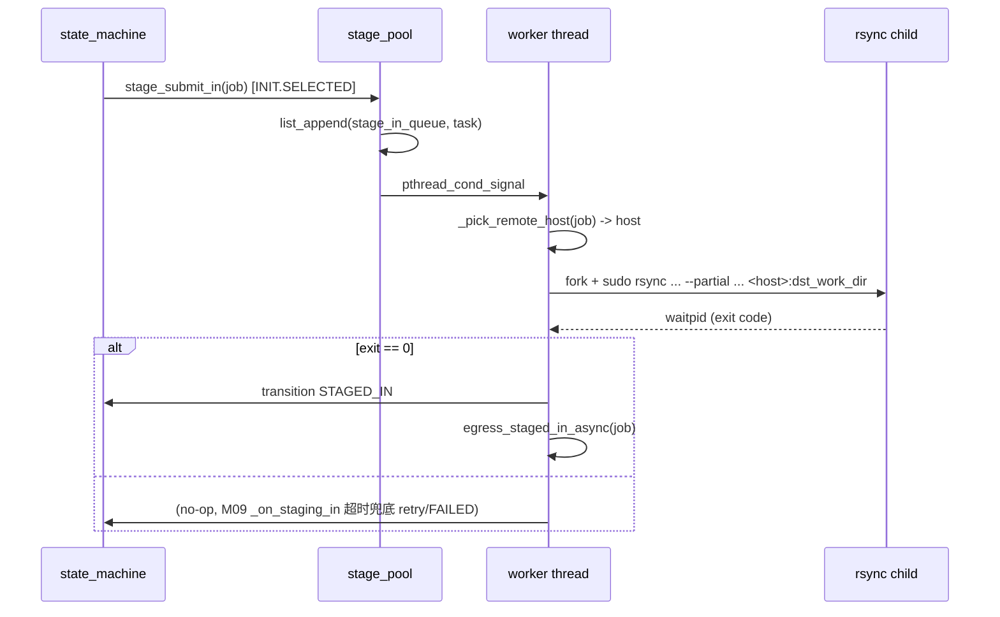

# M10 数据传输 (rsync) Checklist (broker · v2.0)

> 配套: [doc/Broker详细设计文档MVP_v2.md](../Broker详细设计文档MVP_v2.md) §7.1.C
> 差异蓝图: [doc/跨域调度详设-差异变更说明.md](../跨域调度详设-差异变更说明.md) §2.10
> Sprint: S2 → S3
> 依赖: M02-T3 (StageRsyncBin / StageSshKey / StageSshUser / StageWorkerCount)
> 下游: M08-T3 (stage-in 完成后调 egress_staged_in)、M09 状态机

> **v1.5 → v2.0 增量**:
> 1. ★ rsync 命令补 `--partial`：跨集群网络抖动时支持断点续传，与设计文档 §7.1.C 一致
> 2. ★ stage-in 目标主机由 `g_broker_conf.remote_broker_host` 改为 `job->target_broker_addr` 中的 host（多对端时按路由决策结果）；STATIC_LEGACY 模式回退 v1.5
> 3. ★ stage-in 之前 broker 已确保 `job->dst_work_dir` 由 receiver ACK 8011 反传填好（不变，receiver 端逻辑见 broker-M07-T1）
> 4. ★ 日志路径不变 `/var/log/slurm/broker_stage/<trace_id>.log`；M15 部署模板需 logrotate 含 `*.log` glob

---

## 1. 模块概述与目标

### 1.1 一句话定位

固定大小 worker pool（默认 4 线程）异步执行 `sudo + rsync + ssh` 跨主机数据传输。stage-in（源端 → 远端 dst_work_dir）由 ORIGINATOR 在 INIT.SELECTED → STAGING_IN 时触发，stage-out（远端 → 源端 src_work_dir）由 sync_ticker 检测远端终态后触发。★ v2.0 多对端时目标 host 按路由结果寻址。

### 1.2 v2.0 MVP 范围

- 4 个 worker pthread，pop 任务串行执行 rsync（`waitpid` 阻塞）
- ★ rsync 加 `--partial` 支持断点续传
- 退出码 0 → 调 transition + 后续 egress；非 0 → 重试 / FAILED
- stdout/stderr 重定向到 `/var/log/slurm/broker_stage/<trace_id>.log`
- `du -sb` 估算字节，超 `MaxStageBytes` 拒绝
- ★ v2.0 多对端：`_pick_remote_host(job)` 内部按 `routes_source` 选 `STATIC_LEGACY` (`g_broker_conf.remote_broker_host`) 或 `FILE` (`job->target_broker_host`)

### 1.3 不在 MVP 范围

- ~~并发流控（不让多个大数据 stage 同时跑）~~
- ~~多进程协调（避免同一目录两个 rsync）~~

### 1.4 与 v1.5 的差异

| 维度 | v1.5 | v2.0 |
|---|---|---|
| rsync 选项 | `-av --delete` | **`-av --partial --delete`** (stage-in) / `-av --partial` (stage-out) |
| 远端 host | `g_broker_conf.remote_broker_host`（单值） | **`job->target_broker_host`** (M16 SELECTED 阶段填) / 旧字段仅 STATIC_LEGACY 用 |
| 触发点 | M09 `_on_init` 单步 | **M09 `_on_init_selected` 子状态** (broker_job_t.dst_work_dir 已由 8011 ACK 填好) |
| log 文件 | `<trace_id>.log` | 不变 |
| 字节限额 | `MaxStageBytes`（不变） | 不变 |

---

## 2. 接口契约

### 2.1 公共 API（不变）

```c
/* src/slurmbrokerd/stage.h */
extern int  stage_pool_start(void);
extern void stage_pool_stop(void);

extern int  stage_submit_in(broker_job_t *job);
extern int  stage_submit_out(broker_job_t *job);
```

### 2.2 私有数据结构（不变）

```c
typedef enum { STAGE_IN, STAGE_OUT } stage_dir_t;

typedef struct {
	broker_job_t *job;
	stage_dir_t   direction;
} stage_task_t;

static list_t          *stage_in_queue;
static list_t          *stage_out_queue;
static pthread_mutex_t  stage_mutex;
static pthread_cond_t   stage_cond;
static pthread_t       *stage_workers;
static int              n_workers;
static volatile bool    stage_running;
```

### 2.3 ★ v2.0 rsync 命令模板

**stage-in**（源端 broker 触发，从 src_work_dir 推到 `<remote_host>:dst_work_dir`）：

```sh
sudo -u <src_user> /usr/bin/rsync -av --partial --delete \
    -e "ssh -i <stage_ssh_key> -o BatchMode=yes \
            -o StrictHostKeyChecking=no \
            -o UserKnownHostsFile=/dev/null \
            -o LogLevel=ERROR" \
    <src_work_dir>/ \
    <stage_ssh_user>@<remote_host>:<dst_work_dir>/
```

**stage-out**（源端 broker 触发，从 `<remote_host>` 拉回到 src_work_dir）：

```sh
sudo -u <src_user> /usr/bin/rsync -av --partial \
    -e "ssh -i <stage_ssh_key> ..." \
    <stage_ssh_user>@<remote_host>:<dst_work_dir>/ \
    <src_work_dir>/
```

> ★ v2.0：`<remote_host>` 由 `_pick_remote_host(job)` 决定：
> - `routes_source=file` → `job->target_broker_host`（M16 SELECTED 阶段填）
> - `routes_source=static_legacy` → `g_broker_conf.remote_broker_host`

---

## 3. 参考代码

| 用途 | 文件 | 说明 |
|---|---|---|
| fork+execv+waitpid | [src/slurmd/slurmstepd/](../../src/slurmd/slurmstepd/) | grep `execv` |
| pthread worker pool | [src/slurmctld/agent.c](../../src/slurmctld/agent.c) | grep `pthread_create` |
| dup2 重定向 stdout/stderr | [src/common/run_command.c](../../src/common/run_command.c) | grep `dup2` |
| `pthread_cond_wait` 队列 | [src/common/agent.h](../../src/common/agent.h) | 范式 |
| ★ M16 `route_candidate_t::target_broker_host` | [src/slurmbrokerd/route.h](../../src/slurmbrokerd/route.h) | 提供 host 字符串供 rsync |

---

## 4. 文件清单

| 文件 | 类型 | 用途 |
|---|---|---|
| [src/slurmbrokerd/stage.h](../../src/slurmbrokerd/stage.h) | 不变 | API |
| [src/slurmbrokerd/stage.c](../../src/slurmbrokerd/stage.c) | 修改 | rsync 增 `--partial`; `_build_and_exec_rsync` 改用 `_pick_remote_host(job)` |
| [src/slurmbrokerd/Makefile.am](../../src/slurmbrokerd/Makefile.am) | 不变 | stage.c 已在 SOURCES |

---

## 5. 数据流



---

## 6. 任务展开

### M10-T1 stage worker pool 启动 + 任务队列（不变）

- **依赖**: M02-T3
- **预估**: 0d (v1.5 已落地)
- **DoD**: v1.5 已通过

### M10-T2 ★ v2.0 stage-in 子进程（rsync `--partial` + 多对端 host）

- **依赖**: M10-T1, M03-T1 (broker_job_t.target_broker_host 字段)
- **预估**: 0.5d
- **关键决策**:
  1. rsync 命令加 `--partial`：跨集群（数百公里光纤）经常抖动，断点续传可避免 GB 级数据重传。
  2. ssh 命令加 `-o BatchMode=yes`：无人值守，避免误读 stdin password 提示卡死。
  3. ★ v2.0 远端 host：`_pick_remote_host(job)` 内部按 `routes_source` 选；STATIC_LEGACY 路径 100% 兼容 v1.5。
  4. 退出码 0 → transition STAGED_IN + egress_staged_in_async（不变）。
  5. 非 0 → 让状态机走 retry（M09-T6）；不在这里直接 FAILED。
- **代码草图**（差异部分）:

```c
static const char *_pick_remote_host(broker_job_t *job)
{
	if (g_broker_conf.routes_source == BROKER_ROUTE_SOURCE_STATIC_LEGACY)
		return g_broker_conf.remote_broker_host;

	/* ★ v2.0 file 模式: M16 SELECTED 阶段已填 target_broker_host */
	if (job->target_broker_host && job->target_broker_host[0])
		return job->target_broker_host;

	error("_pick_remote_host: trace_id=%s missing target_broker_host "
	      "(SELECTED phase did not populate it)", job->trace_id);
	return NULL;
}

static void _build_and_exec_rsync(broker_job_t *job, stage_dir_t dir)
{
	char *src = NULL, *dst = NULL, *ssh_e = NULL;
	const char *remote_host = _pick_remote_host(job);
	if (!remote_host) _exit(127);

	xstrfmtcat(ssh_e,
	           "ssh -i %s -o BatchMode=yes "
	           "-o StrictHostKeyChecking=no "
	           "-o UserKnownHostsFile=/dev/null -o LogLevel=ERROR",
	           g_broker_conf.stage_ssh_key);

	if (dir == STAGE_IN) {
		xstrfmtcat(src, "%s/", job->src_work_dir);
		xstrfmtcat(dst, "%s@%s:%s/",
		           g_broker_conf.stage_ssh_user,
		           remote_host,
		           job->dst_work_dir);
		execl("/usr/bin/sudo", "sudo", "-u", job->src_user_name,
		      g_broker_conf.stage_rsync_bin, "-av",
		      "--partial",                       /* ★ v2.0 */
		      "--delete",
		      "-e", ssh_e, src, dst, (char *) NULL);
	} else {
		xstrfmtcat(src, "%s@%s:%s/",
		           g_broker_conf.stage_ssh_user,
		           remote_host,
		           job->dst_work_dir);
		xstrfmtcat(dst, "%s/", job->src_work_dir);
		execl("/usr/bin/sudo", "sudo", "-u", job->src_user_name,
		      g_broker_conf.stage_rsync_bin, "-av",
		      "--partial",                       /* ★ v2.0 */
		      "-e", ssh_e, src, dst, (char *) NULL);
	}

	/* execl 失败才会到这里 */
	_exit(127);
}
```

- **风险与坑**:
  - `--partial` 在 rsync 中保留下次续传 .partial 文件；运维需注意 `<dst_work_dir>` 上残留的 `.~` / `.partial` 文件清理（M15 logrotate 不影响）。
  - `BatchMode=yes` 在 ssh key 损坏时立即返回错误（不会 hang），符合 broker"短超时优于 hang"的策略。
  - 多对端时不同 peer 必须共用同一 stage_ssh_user（M15 部署模板假设）；如需多 user 走 routes.conf 内额外字段（v3）。
- **DoD**:
  - [ ] 真实 1GB 目录跨机 rsync 完成态正确（含 `--partial`）
  - [ ] 故意中断网络 → 重新触发后从断点续传，整体耗时 < 1.5 倍完整 rsync
  - [ ] STATIC_LEGACY 模式仍走 `g_broker_conf.remote_broker_host`，行为与 v1.5 一致
  - [ ] ★ v2.0 file 模式：3 个 peer 各跑一个 stage-in 任务，目标 host 正确

### M10-T3 stage-out 子进程（v2.0 同样加 `--partial` 与多对端）

- **依赖**: M10-T2
- **预估**: 0.25d
- **关键决策**: 与 stage-in 镜像，方向反；同样调 `_pick_remote_host(job)`。
- **DoD**:
  - [ ] 远端跑完作业，源端 src_work_dir 出现回写文件
  - [ ] 中断后续传正常

### M10-T4 字节限额 MaxStageBytes（不变）

- **依赖**: M10-T2
- **预估**: 0d (v1.5 已落地)
- **DoD**: v1.5 已通过

### M10-T5 ★ v2.0 broker_job_t 字段补 `target_broker_host` 字符串

- **依赖**: M03-T1 (broker_job_t 字段表)
- **预估**: 0.1d
- **关键决策**:
  1. M03-T1 v2.0 草图已含 `target_broker_addr`（slurm_addr_t）；本任务额外补 `char *target_broker_host` 字符串字段（用于 rsync 命令）。
  2. M09 `_on_init_selected` cb 内填该字段：`job->target_broker_host = xstrdup(cand->target_broker_host);`
  3. M03 JSON schema 同步加该字段（broker_job_to_json / from_json）。
- **代码影响**: 本任务实质是 M03-T1 / M09-T4 联动；本 checklist 仅显式 wire-up。
- **DoD**:
  - [ ] `broker_state.jsonl` 中含 `"target_broker_host":"wz-broker-01.example.com"`
  - [ ] kill broker 后重启，stage-in 仍能正确寻址 target_broker_host
  - [ ] grep `target_broker_host` in stage.c → ≥ 1（被使用）

---

## 7. 整体 DoD（汇总）

- [ ] 5 个子任务全部勾选（T1/T4 v1.5 已完成，T2/T3 v2.0 微调，T5 v2.0 wire-up）
- [ ] **★ v2.0**: 1GB / 100MB / 1MB 三种 size 实跑通过
- [ ] **★ v2.0**: 多对端 3 个 peer 各跑一个 stage-in，目标 host 正确
- [ ] 故障注入：ssh key 错 / 远端目录不存在 → FAILED + log 可读
- [ ] **★ v2.0**: 网络抖动 → `--partial` 续传 OK
- [ ] valgrind clean

## 8. 验证脚本

```bash
# 准备
sudo install -d -o slurm-broker -g slurm-broker /var/log/slurm/broker_stage

# 跑 1MB
./tests/broker/stage_in_smoke.sh /tmp/test1mb
cat /var/log/slurm/broker_stage/xian-100.log

# === ★ v2.0 字节限额 ===
dd if=/dev/zero of=/tmp/big.bin bs=1G count=70
./tests/broker/stage_in_smoke.sh /tmp/big.bin
# 期望: ESLURM_BROKER... + FAILED

# === ★ v2.0 --partial 续传 ===
./tests/broker/stage_in_with_network_chaos.sh /tmp/test500mb \
    --drop-after=200MB --resume-after=5s
# 期望: 第二次跑总耗时 < 1.5x 完整 rsync 耗时
ls -la /work/home/wz_test1/.burst/xian_cluster/100/.~test500mb*
# 期望: .partial 残留正常清理或下次续上

# === ★ v2.0 多对端 host ===
sudo cp tests/broker/data/routes.conf.3peers /etc/slurm/routes.conf
sudo systemctl reload slurmbrokerd
for i in $(seq 1 30); do ./tests/broker/inject_forward_job_v2 ... ; done
journalctl -u slurmbrokerd -n 100 | grep "rsync.*@.*broker"
# 期望: 看到 3 个不同 host 的 rsync 行
```

---

## 9. 风险与回滚

| 风险 | 触发 | 缓解 |
|---|---|---|
| `target_broker_host` 字段缺失（M03/M09 未填） | M16/M09 联动 bug | `_pick_remote_host` 返回 NULL → exec 前检查并 `_exit(127)`，状态机看到 rsync exit 非 0 走 retry |
| `--partial` 残留 `.partial` 文件 | rsync 中断 | M14 cleanup（已废弃）原职责；运维通过 cron 周期清理 `.burst/<src>/<jobid>/.~*` |
| sudoers 配错 | 部署 | M15-T3 模板 |
| ssh known_hosts 污染 | 多端 host 互信不一致 | `UserKnownHostsFile=/dev/null` |
| log 撑爆磁盘 | 大量 stage / 长期不清理 | M15-T6 logrotate |
| worker 卡死无超时 | rsync hang（极少见, 因 BatchMode=yes） | 上层 M09-T6 状态超时兜底 |
| STATIC_LEGACY 与 file 模式行为偏差 | 回退路径未测试 | T2 DoD 显式覆盖两路径; STATIC_LEGACY 路径 100% 沿用 v1.5 |

回滚：本模块独立。

1. `git revert stage.c::_build_and_exec_rsync v2.0` (恢复 v1.5 命令)
2. `git revert stage.c::_pick_remote_host` (改回 g_broker_conf.remote_broker_host)
3. broker 重启即可，无 wire format 兼容性问题
