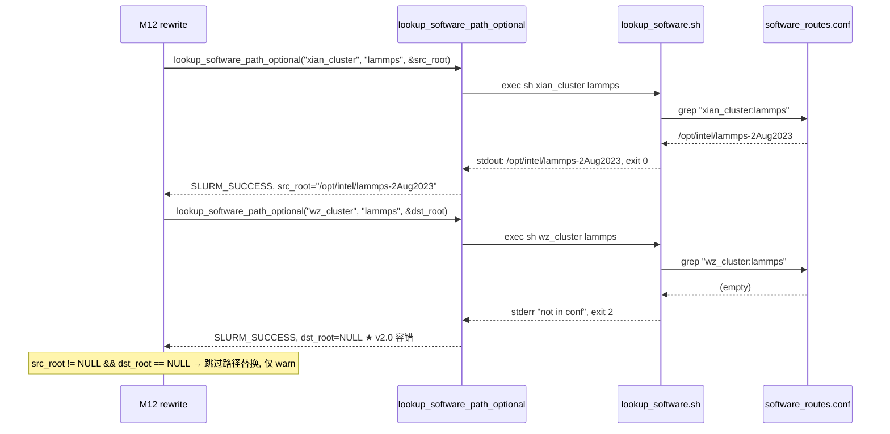

# M11 软件路径解析 Checklist (broker · v2.0)

> 配套: [doc/Broker详细设计文档MVP_v2.md](../Broker详细设计文档MVP_v2.md) §7.1.D / §8.2.1
> 差异蓝图: [doc/跨域调度详设-差异变更说明.md](../跨域调度详设-差异变更说明.md) §2.10
> Sprint: S3
> 依赖: 无（独立工具模块）
> 下游: M12 rewrite 调用 `lookup_software_path`（双向：src + dst 各一次）

> **v1.5 → v2.0 增量**:
> 1. ★ 调用语义升级为**双向容错**：M12 rewrite 调用时同时查 `src_cluster` 与 `dst_cluster` 的软件路径；任一失败 → 仅 warn + 不替换该集群的软件根，**不阻塞 sbatch 提交**（v1.5 是阻塞 hard fail）
> 2. ★ 提供 `lookup_software_path_optional()` 包装：返回 `SLURM_SUCCESS + *out_path = NULL` 表示"找不到该集群该 app 的路径，但允许继续"
> 3. ★ `lookup_software.sh` 脚本契约新增 exit code `2 = not_found (allow continue)` 与 `3 = hard error (must abort)` 区分
> 4. ★ broker.conf::`LookupTimeoutSec` 重命名校验逻辑（M02 已落地为该字段名，本模块对齐）

---

## 1. 模块概述与目标

### 1.1 一句话定位

fork+exec 外部 `lookup_software.sh` 脚本，输入 `<cluster> <app>` 拿到软件绝对路径，3s 超时；脚本读取 `software_routes.conf` 由运维管理。broker 不感知 conf 格式，仅消费一行 stdout。★ v2.0 区分 "not_found（允许继续）" 与 "hard error（必须 abort）"。

### 1.2 v2.0 MVP 范围

- `read_with_timeout` / `waitpid_timeout` 通用工具（不变）
- `lookup_software_path()` 主函数：pipe + fork + execl 脚本，超时 kill（不变）
- ★ 新增 `lookup_software_path_optional()`：not_found 返回 `SUCCESS + NULL`
- 提供 `lookup_software.sh` 模板（v2.0 区分 exit code 2/3）与示例 `software_routes.conf`

### 1.3 不在 MVP 范围

- ~~LRU 缓存~~：3s × N 次 lookup 在 MVP 量级可接受
- ~~plugin 化（让 lookup 可换实现）~~

### 1.4 与 v1.5 的差异

| 维度 | v1.5 | v2.0 |
|---|---|---|
| API 函数 | 1 个 `lookup_software_path()`（hard fail） | **2 个**: hard 版（不变）+ optional 版（not_found 允许） |
| 脚本退出码 | 0/!=0 | **0 = ok / 2 = not_found / 3 = hard error / 其它 = unknown** |
| M12 rewrite 调用方式 | 1 次（仅 dst_cluster） | **2 次**（src_cluster + dst_cluster），均用 optional 版 |
| 调用失败影响 | sbatch 失败 | warn 后跳过该集群的软件根替换，sbatch 仍执行 |

---

## 2. 接口契约

### 2.1 公共 API（v2.0 增 1 个）

```c
/* src/slurmbrokerd/software.h */

/* v1.5 hard fail 版 (仍保留, 用于其它将来场景) */
extern int lookup_software_path(const char *cluster, const char *app,
                                char **out_path);

/* ★ v2.0 新增: optional 版, not_found 返回 SUCCESS + *out_path = NULL */
extern int lookup_software_path_optional(const char *cluster, const char *app,
                                          char **out_path);
```

### 2.2 私有工具（不变）

```c
static int  _read_with_timeout(int fd, char *buf, size_t bufsz,
                               int timeout_ms);
static int  _waitpid_timeout(pid_t pid, int *wstatus, int timeout_ms);
```

### 2.3 脚本契约（★ v2.0 退出码扩展）

输入：`argv[1] = <cluster>`、`argv[2] = <app>`
输出：stdout 一行，即软件绝对路径（必须 `/` 开头）
退出码：

| code | 语义 | broker 行为 |
|---|---|---|
| 0 | OK | 取 stdout 路径返回 |
| 2 | not_found（cluster 或 app 没在 conf 内） | optional 版返回 `SUCCESS + NULL`；hard 版返回 LOOKUP_FAILED |
| 3 | hard error（conf 损坏 / 权限不足） | 两版均返回 LOOKUP_FAILED |
| 其它非 0 | unknown | 同 hard error |

---

## 3. 参考代码

| 用途 | 文件 | 说明 |
|---|---|---|
| `select` 等 fd 可读 | [src/common/fd.c](../../src/common/fd.c) | grep `wait_fd_readable` |
| pipe + fork + execl | [src/common/run_command.c](../../src/common/run_command.c) | 完整范式 |
| `waitpid` + WNOHANG 轮询 | [src/slurmd/slurmstepd/](../../src/slurmd/slurmstepd/) | 同样模式 |
| `access(p, X_OK)` | [src/common/proc_args.c](../../src/common/proc_args.c) | M02-T3 校验 |

---

## 4. 文件清单

| 文件 | 类型 | 用途 |
|---|---|---|
| [src/slurmbrokerd/software.h](../../src/slurmbrokerd/software.h) | 修改 | 新增 `lookup_software_path_optional` 声明 |
| [src/slurmbrokerd/software.c](../../src/slurmbrokerd/software.c) | 修改 | 主函数加 exit code 2/3 区分逻辑; 新增 optional 包装 |
| [src/slurmbrokerd/Makefile.am](../../src/slurmbrokerd/Makefile.am) | 不变 | software.c 已在 SOURCES |
| `scripts/lookup_software.sh` | 修改 | 区分 exit 2 / exit 3 |
| `etc/slurm-broker/software_routes.conf.example` | 不变 | 示例 |

---

## 5. 数据流（v2.0 双向 lookup）



---

## 6. 任务展开

### M11-T1 `_read_with_timeout` / `_waitpid_timeout` 工具（不变）

- **依赖**: 无
- **预估**: 0d (v1.5 已落地)
- **DoD**: v1.5 已通过

### M11-T2 `lookup_software_path` 主函数（v2.0 区分 exit 2/3）

- **依赖**: M11-T1
- **预估**: 0.25d
- **关键决策**:
  1. v1.5 行为保留：exit 0 → SUCCESS；exit !=0 → LOOKUP_FAILED；超时 → LOOKUP_TIMEOUT。
  2. ★ v2.0：函数内部解析 `WEXITSTATUS(wstat)`，将 2 与 3/其它区分对待——hard 版无论 2/3 都返回 LOOKUP_FAILED；optional 版（M11-T3）才区分。
  3. 公共主函数返回区分性 errno（隐藏在 errno 中）：
     - exit 2 → 设 `errno = ENOENT`
     - exit 3 / 其它 → 设 `errno = EIO`
- **代码草图**（差异部分）:

```c
int lookup_software_path(const char *cluster, const char *app, char **out_path)
{
	/* v1.5 主体 (略) */

	if (!WIFEXITED(wstat)) {
		errno = EIO;
		return ESLURM_BROKER_LOOKUP_FAILED;
	}

	int code = WEXITSTATUS(wstat);
	if (code != 0) {
		errno = (code == 2) ? ENOENT : EIO;
		debug("lookup_software: cluster=%s app=%s exit=%d (%s)",
		      cluster, app, code,
		      (code == 2) ? "not_found" : "hard_error");
		return ESLURM_BROKER_LOOKUP_FAILED;
	}

	/* v1.5 后续 (路径校验 + xstrdup) */
}
```

- **DoD**:
  - [ ] mock 脚本 exit 2 → LOOKUP_FAILED + errno=ENOENT
  - [ ] mock 脚本 exit 3 → LOOKUP_FAILED + errno=EIO
  - [ ] mock 脚本 exit 0 + valid path → SUCCESS

### M11-T3 ★ v2.0 新增 `lookup_software_path_optional`

- **依赖**: M11-T2
- **预估**: 0.25d
- **关键决策**:
  1. 包装 hard 版：调用后判 `errno`，若 LOOKUP_FAILED + errno=ENOENT → 转 `SLURM_SUCCESS + *out_path = NULL` + debug 日志。
  2. 其它失败码与 timeout 仍透传（caller 可选择忽略）。
  3. 用于 M12 rewrite 双向 lookup：src/dst 任一 not_found 都允许继续。
- **代码草图**:

```c
int lookup_software_path_optional(const char *cluster, const char *app,
                                   char **out_path)
{
	*out_path = NULL;
	int rc = lookup_software_path(cluster, app, out_path);

	if (rc == ESLURM_BROKER_LOOKUP_FAILED && errno == ENOENT) {
		debug("lookup_software_path_optional: cluster=%s app=%s "
		      "not_found, will skip path substitution",
		      cluster, app);
		return SLURM_SUCCESS;   /* *out_path 已 NULL */
	}
	return rc;
}
```

- **风险与坑**:
  - errno 跨 fork 是 thread-local；本进程父子调用不影响其它线程。
  - hard 版可能在某些路径上重置 errno；包装函数立刻判定避免被覆盖。
- **DoD**:
  - [ ] mock 脚本 exit 2 → SUCCESS + *out_path=NULL
  - [ ] mock 脚本 exit 3 → LOOKUP_FAILED
  - [ ] mock 脚本超时 → LOOKUP_TIMEOUT
  - [ ] mock 脚本 exit 0 → SUCCESS + *out_path=非 NULL

### M11-T4 ★ v2.0 升级 `lookup_software.sh` 模板（区分 exit 2/3）

- **依赖**: 无
- **预估**: 0.25d
- **关键决策**:
  1. `set -euo pipefail` 不变。
  2. cluster/app 缺失 → exit 2（视为 not_found）。
  3. CONF 文件不存在或不可读 → exit 3（hard error）。
  4. CONF 内 grep 不到 → exit 2（not_found）。
  5. CONF 内行格式错误（缺 `=`）→ exit 3（hard error）。
- **代码草图**:

```bash
#!/bin/bash
# /opt/slurm-broker/scripts/lookup_software.sh
# 用法: lookup_software.sh <cluster> <app>
# Exit codes (★ v2.0):
#   0 = OK (stdout = absolute path)
#   2 = not_found (cluster or app not configured; broker 可继续)
#   3 = hard_error (conf 损坏 / 权限不足; broker 报错)
set -euo pipefail

CLUSTER="${1:-}"
APP="${2:-}"
CONF="${BROKER_CONF_DIR:-/etc/slurm-broker}/software_routes.conf"

if [[ -z "$CLUSTER" || -z "$APP" ]]; then
    echo "Usage: $0 <cluster> <app>" >&2
    exit 2     # ★ v2.0: 输入缺失视为 not_found
fi

if [[ ! -r "$CONF" ]]; then
    echo "lookup_software: $CONF not readable" >&2
    exit 3     # ★ v2.0: conf 不可读是 hard error
fi

# 行格式: <cluster>:<app>=<absolute_path>
LINE=$(grep -E "^${CLUSTER}:${APP}=" "$CONF" || true)
if [[ -z "$LINE" ]]; then
    echo "lookup_software: ${CLUSTER}:${APP} not in $CONF" >&2
    exit 2     # ★ v2.0: 行缺失视为 not_found (允许继续)
fi

PATH_OUT="${LINE#*=}"
if [[ -z "$PATH_OUT" || "$PATH_OUT" != /* ]]; then
    echo "lookup_software: invalid path in conf for ${CLUSTER}:${APP}" >&2
    exit 3     # ★ v2.0: 行格式错是 hard error
fi
echo "$PATH_OUT"
```

- **DoD**:
  - [ ] `./lookup_software.sh wz_cluster gromacs` 输出 `/opt/apps/gromacs-2024.1` exit 0
  - [ ] `./lookup_software.sh wz_cluster nonexistent` exit 2 + stderr "not in"
  - [ ] `BROKER_CONF_DIR=/wrong ./lookup_software.sh ...` exit 3 + stderr "not readable"
  - [ ] CONF 内插一行 `bad_cluster:bad_app=` (空 path) → exit 3

---

## 7. 整体 DoD（汇总）

- [ ] 4 个子任务全部勾选（T1 v1.5 已完成, T2/T3/T4 v2.0 增量）
- [ ] **★ v2.0**: M12 rewrite 双向调 optional 版，src/dst 任一 not_found 不阻塞
- [ ] 100 次 lookup 单线程总耗时 < 5s
- [ ] 故障注入：脚本 hang → broker 自动 timeout，state_reason 含 `lookup_software`
- [ ] 故障注入：CONF 不可读 → exit 3 → optional 版返回 LOOKUP_FAILED → M12 失败
- [ ] 故障注入：CONF 缺该 cluster:app 行 → exit 2 → optional 版返回 SUCCESS+NULL → M12 跳过替换
- [ ] valgrind: 100 次 lookup clean

## 8. 验证脚本

```bash
# T1 单元
./tests/broker/test_read_timeout

# T2/T3 集成 (★ v2.0 双版本)
echo '#!/bin/bash
echo /opt/apps/gromacs' > /tmp/mock_lookup.sh
chmod +x /tmp/mock_lookup.sh
./tests/broker/test_lookup_software /tmp/mock_lookup.sh wz gromacs
# 期望: SUCCESS, path=/opt/apps/gromacs

echo '#!/bin/bash
echo "not_found" >&2; exit 2' > /tmp/mock_lookup_nf.sh
chmod +x /tmp/mock_lookup_nf.sh
./tests/broker/test_lookup_software_optional /tmp/mock_lookup_nf.sh wz gromacs
# 期望: SUCCESS, path=NULL  (★ v2.0 optional 容错)

echo '#!/bin/bash
echo "conf broken" >&2; exit 3' > /tmp/mock_lookup_he.sh
chmod +x /tmp/mock_lookup_he.sh
./tests/broker/test_lookup_software_optional /tmp/mock_lookup_he.sh wz gromacs
# 期望: LOOKUP_FAILED  (★ v2.0 hard error 不容错)

# T4 真脚本
sudo cp scripts/lookup_software.sh /opt/slurm-broker/scripts/
sudo cp etc/slurm-broker/software_routes.conf.example /etc/slurm-broker/software_routes.conf
/opt/slurm-broker/scripts/lookup_software.sh wz_cluster gromacs && echo "exit 0 ok"
/opt/slurm-broker/scripts/lookup_software.sh wz_cluster nonexistent; echo "got exit $?"
# 期望: 第一行输出路径; 第二行 "got exit 2"
```

---

## 9. 风险与回滚

| 风险 | 触发 | 缓解 |
|---|---|---|
| 脚本权限/路径错 | 部署疏漏 | M02-T3 校验 X_OK；M15-T5 部署位置规约 |
| 旧版脚本（无 exit 2/3 区分）+ 新 broker | 升级窗口 | M11-T2 hard 版兼容（仍按 exit !=0 → LOOKUP_FAILED）；optional 版需新脚本配合 |
| stderr 阻塞 | conf 巨量错误日志 | 不重定向；让 broker 主进程吃住 |
| conf 行注入 | 运维写入恶意 path | 脚本只输出，不 exec；调用方仅嵌入 sbatch script，由远端 sbatch 校验 |
| LRU 缺失导致脚本被频繁 fork | 大并发 forward | 100 forward/s × 50ms = 5s/s，可接受；后续可加缓存 |
| optional 版被误用于必须替换的场景 | 后续工程师 typo | 文档 + 函数注释明示 "optional 仅用于双向容错路径替换" |

回滚：本模块独立。

1. `git revert software.c::v2.0 exit 2/3 区分` (恢复 v1.5 二值判定)
2. `git revert software.c::lookup_software_path_optional`
3. `git revert software.h::lookup_software_path_optional 声明`
4. `git revert scripts/lookup_software.sh v2.0 退出码扩展`
5. M12 rewrite v2.0 双向调用如已上线，需同步回滚（broker-M12-rewrite v2.0）
