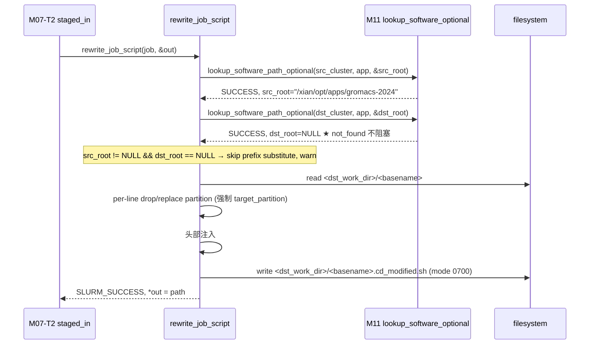

# M12 脚本改写 (rewrite) Checklist (broker · v2.0)

> 配套: [doc/Broker详细设计文档MVP_v2.md](../Broker详细设计文档MVP_v2.md) §7.1.D / §8.2.2
> 差异蓝图: [doc/跨域调度详设-差异变更说明.md](../跨域调度详设-差异变更说明.md) §2.10
> Sprint: S3
> 依赖:
>   - **M11-T2**（hard 版 lookup_software_path）
>   - **★ M11-T3 v2.0**（optional 版 lookup_software_path_optional）
>   - **★ M03-T1 v2.0**（broker_job_t::selected_route_id / dst_cluster）
>   - **★ M16 v2.0**（route 已决策，job 上挂载 dst_cluster + target_partition）
> 下游: M07-T2 `handle_broker_staged_in` 调用前

> **v1.5 → v2.0 增量**:
> 1. ★ `partition` 强制改写**目标固定为** `job->target_partition`（来源是 v2.0 routing decision，不再是 src 端 `--partition` 上的字符串）；任何用户脚本中的 `#SBATCH -p / --partition=` 都被强行替换
> 2. ★ 双向 lookup 改用 **optional 版**（M11-T3）；src/dst 任一 not_found 不阻塞，仅跳过该集群的软件根替换
> 3. ★ 不再删除 `#SBATCH --account` 行（v2.0 由 routing layer + dbd 端 ACL 校验，account 保留以便审计）；改为新增 drop 规则 `#SBATCH --allow-remote`
> 4. ★ 不再 `xfree(job->job_desc->account); = NULL`；account 保留传给远端 sbatch（远端 dbd 校验 `assoc.remote_allowed`）
> 5. ★ 复用 `job->selected_route_id` 写入到 modified 脚本头部 `# CD-route-id: <id>` 注释（用于审计/troubleshooting）

---

## 1. 模块概述与目标

### 1.1 一句话定位

RECEIVER 端在 STAGED_IN → SUBMITTED 之前调用，修改用户原始 sbatch 脚本：**强制替换 partition 为 routing-decision 的 target_partition**、删除特殊 SBATCH 行、做软件路径前缀替换（双向容错）、保留 account。

### 1.2 v2.0 MVP 范围

- 一个主入口 `rewrite_job_script(job, &out_modified_path)`（接口不变）
- 行级处理：drop / replace / prefix-substitute（规则集 v2.0 调整）
- 失败回滚（删半成品 `.cd_modified.sh`）
- ★ 头部插入 `# CD-route-id: <id>` 注释行（便于审计）
- ★ 双向 lookup 用 optional 版

### 1.3 不在 MVP 范围

- ~~多轮迭代改写~~
- ~~复杂正则匹配 / DSL 化~~

### 1.4 与 v1.5 的差异

| 维度 | v1.5 | v2.0 |
|---|---|---|
| `--partition` 替换源 | `target_partition` | **`target_partition`（来自 routing decision）** |
| `--account` 处理 | drop 行 + xfree(account) | **保留**（v2.0 由 dbd ACL 校验） |
| `--allow-remote` (新参数) | n/a | **drop**（远端 sbatch 不需要） |
| `--cross-domain` | drop | **drop**（v1.5 已有，保留） |
| 双向 lookup_software | hard 版（任一失败阻塞） | **optional 版**（任一 not_found 跳过该集群替换） |
| 头部审计注释 | 无 | **`# CD-route-id: <id>` + `# CD-src-cluster: <X>` + `# CD-dst-cluster: <Y>`** |

---

## 2. 接口契约

### 2.1 公共 API（不变）

```c
/* src/slurmbrokerd/rewrite.h */

extern int rewrite_job_script(broker_job_t *job, char **out_modified_path);
```

### 2.2 改写规则（`#SBATCH` 行 · ★ v2.0）

| 原始行 | v1.5 处理 | v2.0 处理 |
|---|---|---|
| `#SBATCH --reservation=<X>` | drop | drop |
| `#SBATCH --cross-domain` | drop | drop |
| `#SBATCH --app=<X>` | drop | drop |
| `#SBATCH --allow-remote` | n/a | **drop（v2.0 新增）** |
| `#SBATCH --account=<X>` / `#SBATCH -A <X>` | drop | **保留** ★ |
| `#SBATCH -p <X>` / `#SBATCH --partition=<X>` | 替换为 `target_partition` | 替换为 `job->target_partition` |
| 无任何 `#SBATCH -p` 行 | 不动 | **★ 头部插入 `#SBATCH --partition=<target_partition>`** |
| 其它 SBATCH 行 | 保留 | 保留 |

### 2.3 改写规则（脚本正文）

- **前缀替换**：把 `src_software_path` 的所有出现替换为 `dst_software_path`
- ★ v2.0：双向 lookup 用 optional 版；
  - src_path == NULL → 不替换（用户脚本中 `/xian/...` 不动；远端如不存在则运行时报错由用户负责）
  - dst_path == NULL → 不替换（即使 src_path 找到也不替换，避免改成空字符串）
  - 二者都 not NULL → 正常 strstr 替换
- 实现：strstr 多次替换；O(N) 不变

### 2.4 输出（★ v2.0 头部审计注释）

- 文件：`<dst_work_dir>/<basename(orig_script)>.cd_modified.sh`，`mode 0700`
- ★ 头部 4 行（紧跟 shebang 后）：
  ```
  #!/bin/bash
  # CD-route-id: <job->selected_route_id>
  # CD-src-cluster: <job->src_cluster>
  # CD-dst-cluster: <job->dst_cluster>
  # CD-trace-id: <job->trace_id>
  ```
- 替换 job_desc：`xfree(job_desc->script); job_desc->script = xstrdup(modified_path 或 transformed)`（视 sbatch API）
- ★ v2.0：**不再** `xfree(account); =NULL`

---

## 3. 参考代码

| 用途 | 文件 | 说明 |
|---|---|---|
| `xstrcatchar` / `xstrfmtcat` | [src/common/xstring.h](../../src/common/xstring.h) | 拼字符串 |
| `regex.h` POSIX | 系统 | 正则匹配 SBATCH 行 |
| `strstr` 多次替换 | 标准 C | 前缀替换 |
| `job_desc_msg_t.script` | [slurm/slurm.h](../../slurm/slurm.h) | grep `script;` 字段说明 |
| `lookup_software_path_optional` | [src/slurmbrokerd/software.h](../../src/slurmbrokerd/software.h) | M11-T3 v2.0 |

---

## 4. 文件清单

| 文件 | 类型 | 用途 |
|---|---|---|
| [src/slurmbrokerd/rewrite.h](../../src/slurmbrokerd/rewrite.h) | 不变 | API 签名 |
| [src/slurmbrokerd/rewrite.c](../../src/slurmbrokerd/rewrite.c) | 修改 | drop 规则、partition 强制改写、双向 optional lookup、头部注释 |
| [src/slurmbrokerd/Makefile.am](../../src/slurmbrokerd/Makefile.am) | 不变 | rewrite.c 已在 SOURCES |

---

## 5. 数据流（★ v2.0 双向 optional lookup）



---

## 6. 任务展开

### M12-T1 ★ v2.0 主入口：双向 optional lookup

- **依赖**: M11-T3
- **预估**: 0.5d
- **关键决策**:
  1. 双向 `lookup_software_path_optional`，src/dst 任一 not_found 不阻塞
  2. **必要前置校验**：`job->target_partition` 与 `job->dst_cluster` 必须非 NULL（来自 M16 routing decision）
  3. `app_name` 取序：`job->cd_app_name`（M06-T1 v2.0 新字段）→ `job->job_desc->name`
  4. 任一 lookup 真正失败（hard error / timeout）才返回 LOOKUP_FAILED；not_found 静默跳过该集群替换
- **代码草图**:

```c
int rewrite_job_script(broker_job_t *job, char **out_modified_path)
{
	char *src_path = NULL, *dst_path = NULL;
	const char *app_name = NULL;
	int rc;

	*out_modified_path = NULL;

	if (!job || !job->job_desc) {
		error("rewrite: trace_id=%s job_desc NULL",
		      job ? job->trace_id : "?");
		return SLURM_ERROR;
	}

	/* ★ v2.0 必备前置 */
	if (!job->target_partition || !job->dst_cluster) {
		error("rewrite: trace_id=%s target_partition or dst_cluster "
		      "missing (routing not decided?)", job->trace_id);
		return SLURM_ERROR;
	}

	app_name = job->cd_app_name ? job->cd_app_name :
	           (job->job_desc ? job->job_desc->name : NULL);
	if (!app_name) {
		debug("rewrite: trace_id=%s app_name missing, skip lookup",
		      job->trace_id);
	}

	if (app_name) {
		/* ★ v2.0 双向 optional lookup */
		rc = lookup_software_path_optional(job->src_cluster, app_name,
		                                    &src_path);
		if (rc != SLURM_SUCCESS) goto fail;

		rc = lookup_software_path_optional(job->dst_cluster, app_name,
		                                    &dst_path);
		if (rc != SLURM_SUCCESS) goto fail;
	}

	if (app_name && (!src_path || !dst_path)) {
		debug("rewrite: trace_id=%s app=%s src=%s dst=%s — skip prefix subst",
		      job->trace_id, app_name,
		      src_path ? src_path : "(none)",
		      dst_path ? dst_path : "(none)");
	}

	rc = _do_rewrite(job, src_path, dst_path, out_modified_path);

fail:
	xfree(src_path);
	xfree(dst_path);
	return rc;
}
```

- **DoD**:
  - [ ] 单测：src_root + dst_root 双 NULL → 跳过前缀替换，仍能写出修改后脚本
  - [ ] 单测：src_root 非 NULL + dst_root NULL → 跳过前缀替换 + warn
  - [ ] 单测：双 not NULL → 正常前缀替换

### M12-T2 ★ v2.0 行级处理：partition 强制改写 + 新 drop 规则

- **依赖**: M12-T1
- **预估**: 1.5d
- **关键决策**:
  1. 读 `<dst_work_dir>/<basename(orig)>` 全文
  2. 逐行处理 SBATCH 头：
     - drop: `--reservation`, `--cross-domain`, `--app`, **`--allow-remote`** ★ v2.0 新增
     - **保留 `--account` / `-A`** ★ v2.0
     - 替换 `-p` / `--partition=` 为 `job->target_partition` ★ v2.0 强制
  3. 若整脚本扫完没有任何 `#SBATCH -p` 行 → 在 shebang 之后头部注入一行 `#SBATCH --partition=<target>` ★ v2.0
  4. 头部插入 4 行审计注释 ★ v2.0
  5. 全文 strstr 多次替换 `src_path` → `dst_path`（仅当二者都非 NULL）
  6. 写到 `<dst_work_dir>/<basename>.cd_modified.sh`
  7. ★ v2.0 **删除** `xfree(account)` 步骤
- **代码草图**（差异部分）:

```c
static bool _line_is_drop_v2(const char *line)
{
	const char *p = line + strspn(line, "# \t");
	if (strncmp(p, "SBATCH", 6)) return false;
	p += 6; p += strspn(p, " \t");

	if (strstr(p, "--reservation"))  return true;
	if (strstr(p, "--cross-domain")) return true;
	if (strstr(p, "--app"))          return true;
	if (strstr(p, "--allow-remote")) return true;     /* ★ v2.0 新增 */
	/* ★ v2.0: --account / -A 不再 drop, 保留 */
	return false;
}

static int _do_rewrite(broker_job_t *job, const char *src_path,
                       const char *dst_path, char **out)
{
	char *orig_path = NULL;
	xstrfmtcat(orig_path, "%s/%s", job->dst_work_dir,
	           xbasename(job->script_path));

	FILE *fp = fopen(orig_path, "r");
	if (!fp) {
		error("rewrite: open %s: %m", orig_path);
		xfree(orig_path);
		return SLURM_ERROR;
	}

	char *full = NULL, *transformed = NULL;
	char line[8192];
	bool seen_shebang = false;
	bool injected_header = false;
	bool seen_partition_line = false;

	while (fgets(line, sizeof(line), fp)) {
		/* shebang 后立刻注入 v2.0 审计 4 行 */
		if (!injected_header && line[0] == '#' && line[1] == '!') {
			seen_shebang = true;
			xstrcat(full, line);
			xstrfmtcat(full, "# CD-route-id: %u\n",
			           job->selected_route_id);
			xstrfmtcat(full, "# CD-src-cluster: %s\n",
			           job->src_cluster ? job->src_cluster : "");
			xstrfmtcat(full, "# CD-dst-cluster: %s\n",
			           job->dst_cluster ? job->dst_cluster : "");
			xstrfmtcat(full, "# CD-trace-id: %s\n",
			           job->trace_id ? job->trace_id : "");
			injected_header = true;
			continue;
		}

		if (_line_is_drop_v2(line)) continue;

		char *replaced = _line_replace_partition(line,
		                                         job->target_partition);
		if (replaced) {
			seen_partition_line = true;
			xstrcat(full, replaced);
			xfree(replaced);
		} else {
			xstrcat(full, line);
		}
	}
	fclose(fp);

	/* ★ v2.0: 没找到 #SBATCH -p 行 → 强制注入 (在 shebang/审计行后, 在第一条非#行前) */
	if (!seen_partition_line && injected_header) {
		/* 简化: 直接 prepend 在 transformed 内容中, 紧跟审计 4 行
		 * 通过分两段拼接: 找到 full 中第 5 个 \n (shebang+4 audit lines) 后插入
		 */
		char *inj = NULL;
		xstrfmtcat(inj, "#SBATCH --partition=%s\n", job->target_partition);
		/* 简化实现: 直接 prepend 到 full 末尾不行, 必须在 SBATCH 区域内
		 * 用一个简化策略: prepend 到 full 开头(放在 #! 后)
		 *   - 重新组装: 找第一个 \n 后插入
		 */
		const char *first_nl = strchr(full, '\n');
		if (first_nl) {
			char *new_full = NULL;
			xstrncat(new_full, full, first_nl - full + 1);
			xstrcat(new_full, inj);
			xstrcat(new_full, first_nl + 1);
			xfree(full); full = new_full;
		}
		xfree(inj);
	}

	/* ★ v2.0: src/dst 都非 NULL 才前缀替换 */
	if (src_path && dst_path && *src_path && *dst_path) {
		transformed = _substitute_all(full, src_path, dst_path);
		xfree(full);
	} else {
		transformed = full;
	}

	/* write */
	char *modified_path = NULL;
	xstrfmtcat(modified_path, "%s.cd_modified.sh", orig_path);
	int fd = open(modified_path, O_WRONLY|O_CREAT|O_TRUNC, 0700);
	if (fd < 0 ||
	    write(fd, transformed, strlen(transformed)) < 0) {
		error("rewrite: write %s: %m", modified_path);
		if (fd >= 0) close(fd);
		unlink(modified_path);
		xfree(modified_path); xfree(orig_path); xfree(transformed);
		return SLURM_ERROR;
	}
	close(fd);

	/* ★ v2.0: 不再 xfree(account); =NULL — account 保留传给远端 sbatch */

	/* job_desc->script: inline vs path 视 sbatch API
	 *   - inline: xfree(job_desc->script); = xstrdup(transformed);
	 *   - path:   xfree(job_desc->script); = xstrdup(modified_path);
	 * MVP 假设 inline (sbatch 默认 read 后 RPC) — 落地时 verify
	 */
	xfree(job->job_desc->script);
	job->job_desc->script = xstrdup(transformed);

	*out = modified_path;
	xfree(orig_path);
	xfree(transformed);
	return SLURM_SUCCESS;
}
```

- **风险与坑**:
  - shebang 之外的脚本（POSIX `sh -c`）没有 `#!` 行 → injected_header 永远 false → 审计注释 + partition 注入会失败。**fallback**：扫完全文若 `injected_header == false`，则将 4 行审计 + 强制 partition 行 prepend 到全文头。
  - SBATCH 解析极简 `strstr`，`--comment="--account in name"` 仍可能误判；但 v2.0 已不 drop `--account`，误判面缩小。
  - `--app` 与 `--allow-remote` 同样可能在 `--comment="..."` 内误判，MVP 接受，文档警告。
  - `seen_partition_line` 注入位置实现略 hacky；接受 MVP，后续 refactor 为「解析+组装」两步。
- **DoD**:
  - [ ] 给 1 份示例脚本（含 -p / --reservation / --account / --allow-remote / source xxx/env.sh），输出脚本：
    - partition 强制改成 `job->target_partition`
    - reservation / cross-domain / app / **allow-remote** 已删
    - **account 保留**
    - 头部 4 行审计注释存在且字段对得上
    - source 路径在 src_root + dst_root 都存在时被替换；任一缺失时不替换
  - [ ] **`job->job_desc->account` rewrite 后 == 原值（未被 free）** ★ v2.0
  - [ ] 没有 `#SBATCH -p` 的脚本 → 自动注入 `#SBATCH --partition=<target>` 一行
  - [ ] 没有 shebang 的脚本 → 头部 4 行审计注释 + partition 行 prepend 成功

### M12-T3 错误处理与回滚（不变）

- **依赖**: M12-T2
- **预估**: 0.25d
- **关键决策**:
  1. 任一步失败：log + 返回错误 + 删半成品 modified.sh
  2. 调用方 (M07-T2) 收到非 0 → state FAILED reason="rewrite failed: ..."
- **DoD**:
  - [ ] 脚本不存在 / 没写权限 → SLURM_ERROR
  - [ ] lookup hard 失败 → ESLURM_BROKER_LOOKUP_FAILED
  - [ ] 半成品文件不残留

---

## 7. 整体 DoD（汇总）

- [ ] 3 子任务全部勾选
- [ ] **★ v2.0 端到端**：mock 远端 broker rewrite + sbatch，远端 squeue 看到：
  - partition = `<target_partition>`（即 routing 选定的 dst partition）
  - account = 用户原始 account（不再被清空）
  - 输出脚本头部含 `# CD-route-id: <id>` 注释
- [ ] valgrind clean
- [ ] 异常注入：脚本带二进制内容 / 非 UTF-8 → 不 crash
- [ ] **★ v2.0**: dst_root not_found 不阻塞 sbatch；远端运行可能因路径不存在失败，由用户排查（broker 不背责）

## 8. 验证脚本

```bash
# 准备测试脚本
cat > /tmp/orig.sh <<'EOF'
#!/bin/bash
#SBATCH --job-name=gromacs
#SBATCH --partition=xianhcnormal
#SBATCH --reservation=mybooking
#SBATCH --cross-domain
#SBATCH --app=gromacs
#SBATCH --allow-remote
#SBATCH --account=team_a
#SBATCH -N 4

source /xian/opt/apps/gromacs-2024.1/setup.sh
gmx mdrun -deffnm prod
EOF

# ★ v2.0 mock 测试 (传 selected_route_id + dst_cluster)
./tests/broker/test_rewrite \
    --orig /tmp/orig.sh \
    --src-cluster xian_cluster --dst-cluster wz_cluster \
    --target-partition wzhcnormal \
    --selected-route-id 7 \
    --src-path /xian/opt/apps/gromacs-2024.1 \
    --dst-path /wz/opt/apps/gromacs-2024.1

# 期望输出 /tmp/orig.sh.cd_modified.sh:
#   - 头部 4 行审计注释 (route-id=7, src=xian_cluster, dst=wz_cluster, trace-id=...)
#   - #SBATCH --partition=wzhcnormal  (强制改)
#   - 没有 --reservation / --cross-domain / --app / --allow-remote
#   - --account=team_a 保留 ★ v2.0
#   - source /wz/opt/apps/gromacs-2024.1/setup.sh

# 故障注入: dst_path NULL (mock lookup 返回 not_found)
./tests/broker/test_rewrite_optional_dst_missing \
    --orig /tmp/orig.sh \
    --src-cluster xian_cluster --dst-cluster wz_cluster \
    --target-partition wzhcnormal \
    --selected-route-id 7
# 期望: rewrite 仍 SUCCESS, 脚本中 source 行未被替换 (保留 /xian/...), warn 日志
```

---

## 9. 风险与回滚

| 风险 | 触发 | 缓解 |
|---|---|---|
| `--comment="--app in name"` 误删 | 用户脚本中带 `--app` 子串 | T2 加更精确正则；MVP 文档警告 |
| `job_desc->script` 语义不匹配 | inline vs path | 落地时用 mock submit verify |
| 全文 strstr 性能 O(N*M) | 1MB 脚本 + 多次 src_path | MVP 接受；后续可换 KMP |
| 脚本含 CRLF | Windows 用户提交 | T2 normalize line endings（可选）|
| 用户原 account 在远端不存在 | 跨域两边账号体系不一致 | v2.0 由远端 dbd ACL 校验后报错；ctld 收到 sbatch failure |
| dst_path 缺失但用户硬编码绝对路径 | 软件路径未在远端 software_routes.conf 配置 | 远端 sbatch 运行时报 file not found；broker 仅 warn |
| seen_partition_line 注入实现 hacky | 边缘情况脚本无 `#!` | T2 fallback prepend 全文头 |

回滚（v1.5 → v2.0 增量回滚）：

1. `git revert rewrite.c::v2.0 _line_is_drop_v2 (恢复 _line_is_drop drop --account/-A)`
2. `git revert rewrite.c::v2.0 audit header injection (4 行注释)`
3. `git revert rewrite.c::v2.0 partition forced inject when missing`
4. `git revert rewrite.c::v2.0 lookup_software_path_optional 调用 (恢复 hard 版)`
5. 恢复 `xfree(job->job_desc->account); =NULL` 一行

整模块回滚：`git revert rewrite.c/.h v2.0 commits + handler_remote 调用`。
