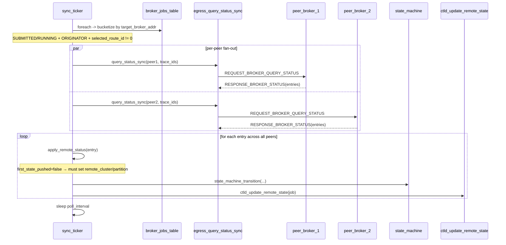

# M13 状态轮询 (sync_ticker) Checklist (broker · v2.0)

> 配套: [doc/Broker详细设计文档MVP_v2.md](../Broker详细设计文档MVP_v2.md) §6.2 / §6.3 / §7.1.D
> 差异蓝图: [doc/跨域调度详设-差异变更说明.md](../跨域调度详设-差异变更说明.md) §2.7 / §2.10
> Sprint: S3
> 依赖:
>   - M03-T2 v1.5（broker_job 表 foreach）
>   - **★ M03-T1 v2.0**（broker_job_t 新字段 first_state_pushed / target_broker_addr）
>   - M08-T4 v2.0（egress_query_status_sync · 多 peer 路由感知）
>   - **★ M08-T6 v2.0**（ctld_update_remote_state · 首次包必带 remote_cluster/partition_name）
>   - M10-T3（stage_submit_out）
> 下游: 无（直接驱动 state_machine 推进）

> **v1.5 → v2.0 增量**:
> 1. ★ ticker 收集环节按 `target_broker_addr` 分组（FILE 模式可能多 peer），分组发起 N 路 `query_status_sync`；STATIC_LEGACY 模式仍单 peer
> 2. ★ apply 逻辑首次状态推送（first_state_pushed=false 时）必须携带 `remote_cluster_name` / `remote_partition_name`，与 M08-T6 v2.0 约束对齐
> 3. ★ 新增 `_apply_remote_status` 对 `e->remote_state == JOB_NODE_FAIL` / `JOB_PREEMPTED` 的处理（v2.0 字段细化）
> 4. ★ 添加按 peer 的失败计数（`consecutive_failures` 升级为 `peer_failure_map`）；某个 peer 连续失败不影响其它 peer 的 ticker
> 5. ★ 在 PROBING 阶段的 job 不参与 sync ticker（M09 已落 SELECTED 才会进入 SUBMITTED 后才有 trace_id 落到远端）

---

## 1. 模块概述与目标

### 1.1 一句话定位

ORIGINATOR 角色独有线程：每 10s 收集所有 SUBMITTED/RUNNING 的 trace_id，按 target_broker_addr 分组、并发发起 `REQUEST_BROKER_QUERY_STATUS`（8004），按返回 entry 推进本地 state、推送 ctld、触发 stage-out。

### 1.2 v2.0 MVP 范围

- 单 ticker 线程，10s 周期（不变）
- ★ 按 peer 分组、并发 N 路 RPC（v2.0 多 peer 支持）
- `apply_remote_status` 状态映射（v2.0 增加 NODE_FAIL/PREEMPTED 处理）
- ★ 失败重试按 peer 维度计数

### 1.3 不在 MVP 范围

- ~~分片轮询（多 ticker 实例）~~：单 ticker 即可
- ~~事件驱动（远端主动推 RUNNING）~~：v0.2 hook
- ~~按 peer 异步并发执行~~：v2.0 用 fan-out 同步顺序，串行调 N 个 `query_status_sync`（每个内部仍同步等响应）；后续可改为 worker pool 并发

### 1.4 与 v1.5 的差异

| 维度 | v1.5 | v2.0 |
|---|---|---|
| 收集单元 | 单一全局列表 | **按 `target_broker_addr` 分桶** |
| 单轮 RPC 数 | 1 (全部 trace_id) | **N (每 peer 一发)** |
| 失败计数粒度 | 全局 | **按 peer (`peer_failure_map`)** |
| 首次 ctld 推送 | 不区分 | **首次必带 remote_cluster/partition_name** |
| state 映射 | 4 种 | **6 种** (新增 NODE_FAIL, PREEMPTED) |
| PROBING/EXHAUSTED job | n/a | **跳过 ticker**（无 remote trace_id 可查） |

---

## 2. 接口契约

### 2.1 公共 API（不变）

```c
/* src/slurmbrokerd/sync_ticker.h */
extern int sync_ticker_start(void);
extern void sync_ticker_stop(void);
```

### 2.2 私有 helper（★ v2.0 重构）

```c
static void *_sync_ticker_main(void *arg);
static void  _sync_ticker_run(void);

/* ★ v2.0: 按 peer 收集 */
typedef struct {
	char     *target_broker_host;
	slurm_addr_t target_broker_addr;
	char    **trace_ids;
	uint32_t  count;
	uint32_t  cap;
} _peer_bucket_t;

static int   _collect_trace_id_bucketed(broker_job_t *j, void *arg);
static void  _query_one_peer(_peer_bucket_t *b);
static void  _apply_remote_status(broker_status_entry_t *e);
```

### 2.3 全局变量（★ v2.0 增加 peer 失败 map）

```c
/* sync_ticker.c */
static pthread_t  sync_tid;
static volatile bool sync_running;

/* ★ v2.0: peer_host -> consecutive failure count */
static pthread_mutex_t peer_fail_lock;
static List            peer_failure_map;   /* List of (host, fail_count) */
```

### 2.4 远端 state → 本地 state 映射 (★ v2.0 扩展)

| 远端 `remote_state` (slurm.h) | 本地 broker_job_state | 动作 |
|---|---|---|
| `JOB_PENDING` | 任意 | `ctld_update_remote_state(job)`（仅推一次 PENDING；首次必带 cluster/partition） |
| `JOB_RUNNING` | SUBMITTED | 写 start_time / alloc_tres → transition RUNNING → ctld_update_remote_state |
| `JOB_COMPLETE` / `JOB_FAILED` / `JOB_TIMEOUT` | RUNNING | 写 end_time / exit_code / alloc_tres → stage_submit_out → transition STAGING_OUT |
| `JOB_CANCELLED` | 任意 | transition CANCELLED |
| **★ `JOB_NODE_FAIL`** | RUNNING | 当 FAILED 处理（写 reason='node_fail'）→ stage_submit_out（best-effort）→ STAGING_OUT |
| **★ `JOB_PREEMPTED`** | RUNNING | 当 FAILED 处理（写 reason='preempted'）→ stage_submit_out → STAGING_OUT |

---

## 3. 参考代码

| 用途 | 文件 | 说明 |
|---|---|---|
| 1s tick + cond_timedwait | [src/slurmctld/agent.c](../../src/slurmctld/agent.c) | 范式 |
| `slurm_job_state_string` | [src/common/slurm_protocol_defs.c](../../src/common/slurm_protocol_defs.c) | 状态字符串 |
| `JOB_PENDING` / `JOB_NODE_FAIL` / `JOB_PREEMPTED` 等枚举 | [slurm/slurm.h](../../slurm/slurm.h) | grep `JOB_PENDING` |
| List 容器 | [src/common/list.h](../../src/common/list.h) | peer_failure_map |

---

## 4. 文件清单

| 文件 | 类型 | 用途 |
|---|---|---|
| [src/slurmbrokerd/sync_ticker.h](../../src/slurmbrokerd/sync_ticker.h) | 不变 | API |
| [src/slurmbrokerd/sync_ticker.c](../../src/slurmbrokerd/sync_ticker.c) | 修改 | 按 peer 分桶 + 首次 push 字段守卫 |
| [src/slurmbrokerd/Makefile.am](../../src/slurmbrokerd/Makefile.am) | 不变 | sync_ticker.c 已在 SOURCES |

---

## 5. 流程（★ v2.0 多 peer 分桶）



---

## 6. 任务展开

### M13-T1 ticker 线程骨架 (不变)

- **依赖**: M03-T2
- **预估**: 0d (v1.5 已落地)
- **代码草图** (不变):

```c
int sync_ticker_start(void)
{
	consecutive_failures_init();
	sync_running = true;
	slurm_thread_create(&sync_tid, _sync_ticker_main, NULL);
	return SLURM_SUCCESS;
}

void sync_ticker_stop(void)
{
	sync_running = false;
	pthread_join(sync_tid, NULL);
	peer_failure_map_free();
}

static void *_sync_ticker_main(void *arg)
{
	while (sync_running) {
		_sync_ticker_run();
		sleep(g_broker_conf.poll_interval);
	}
	return NULL;
}
```

- **DoD**:
  - [ ] 起停干净，valgrind clean (v1.5 已通过)

### M13-T2 ★ v2.0 收集 + 按 peer 分桶 + fan-out 查询

- **依赖**: M08-T4 v2.0, M13-T1
- **预估**: 1.5d
- **关键决策**:
  1. foreach 收集 ORIGINATOR && state ∈ {SUBMITTED, RUNNING} && `selected_route_id != 0` 的 job
  2. 按 `(target_broker_host, target_broker_addr)` 分桶；同 peer 的 trace_id 合并到同一 bucket
  3. 对每个 bucket 调一次 `egress_query_status_sync(bucket->trace_ids, ...)`（M08-T4 v2.0 内部使用 `target_broker_addr`）
  4. ★ STATIC_LEGACY 模式：所有 job 落到单一 bucket（`target_broker_host` 退化为 `g_broker_conf.remote_broker_host`）
- **代码草图**:

```c
static int _collect_trace_id_bucketed(broker_job_t *j, void *arg)
{
	List buckets = arg;
	if (j->role != BROKER_ROLE_ORIGINATOR) return 0;
	if (j->state != BROKER_STATE_SUBMITTED &&
	    j->state != BROKER_STATE_RUNNING) return 0;
	if (j->selected_route_id == 0) return 0;     /* ★ v2.0: PROBING/EXHAUSTED skip */
	if (!j->target_broker_host)    return 0;     /* 防御 */

	/* 查或新建 bucket */
	_peer_bucket_t *b = NULL;
	ListIterator it = list_iterator_create(buckets);
	_peer_bucket_t *cur;
	while ((cur = list_next(it))) {
		if (xstrcmp(cur->target_broker_host, j->target_broker_host) == 0) {
			b = cur;
			break;
		}
	}
	list_iterator_destroy(it);

	if (!b) {
		b = xmalloc(sizeof(*b));
		b->target_broker_host = xstrdup(j->target_broker_host);
		memcpy(&b->target_broker_addr, &j->target_broker_addr,
		       sizeof(slurm_addr_t));
		b->cap = 16;
		b->trace_ids = xmalloc(b->cap * sizeof(char *));
		list_append(buckets, b);
	}

	if (b->count == b->cap) {
		b->cap *= 2;
		xrealloc(b->trace_ids, b->cap * sizeof(char *));
	}
	b->trace_ids[b->count++] = xstrdup(j->trace_id);
	return 0;
}

static void _bucket_destructor(void *x)
{
	_peer_bucket_t *b = x;
	for (uint32_t i = 0; i < b->count; i++) xfree(b->trace_ids[i]);
	xfree(b->trace_ids);
	xfree(b->target_broker_host);
	xfree(b);
}

static void _sync_ticker_run(void)
{
	List buckets = list_create(_bucket_destructor);
	broker_job_table_foreach(_collect_trace_id_bucketed, buckets);

	if (list_count(buckets) == 0) {
		FREE_NULL_LIST(buckets);
		return;
	}

	ListIterator it = list_iterator_create(buckets);
	_peer_bucket_t *b;
	while ((b = list_next(it))) {
		_query_one_peer(b);
	}
	list_iterator_destroy(it);

	FREE_NULL_LIST(buckets);
}

static void _query_one_peer(_peer_bucket_t *b)
{
	broker_status_msg_t *resp = NULL;
	int rc = egress_query_status_sync_to_peer(
		&b->target_broker_addr, b->trace_ids, b->count, &resp);

	if (rc != SLURM_SUCCESS || !resp) {
		uint32_t fc = peer_fail_inc(b->target_broker_host);
		warning("sync_ticker: peer=%s query failed (#%u): %s",
		        b->target_broker_host, fc, slurm_strerror(rc));
		if (fc >= g_broker_conf.poll_max_retries) {
			error("sync_ticker: peer=%s unreachable for %u rounds",
			      b->target_broker_host, fc);
		}
		return;
	}
	peer_fail_reset(b->target_broker_host);

	for (uint32_t i = 0; i < resp->entry_count; i++)
		_apply_remote_status(&resp->entries[i]);

	slurm_free_broker_status_msg(resp);
}
```

- **风险与坑**:
  - bucket 查找 O(N×P)；P（peer 数）通常 < 10，N ≤ 1000，可接受
  - peer_failure_map 用 list/hashtbl 都行，MVP 用简单 list
  - `egress_query_status_sync_to_peer` 是 M08-T4 v2.0 新接口（含 peer addr 参数）
- **DoD**:
  - [ ] 100 个 ORIGINATOR job 分布到 2 个 peer 时 ticker 每 10s 发 2 个 RPC，每个含正确 trace_id 子集
  - [ ] STATIC_LEGACY 模式下 100 job 仍走单 RPC

### M13-T3 ★ v2.0 `_apply_remote_status` 状态分发（首次包字段守卫 + 新 state）

- **依赖**: M08-T6 v2.0, M10-T3
- **预估**: 1d
- **关键决策**:
  1. 按 §2.4 v2.0 映射表执行（新增 NODE_FAIL / PREEMPTED）
  2. **避免无谓 RPC**：仅 `remote_state` / `remote_alloc_tres` / `remote_start_time` 变化时推 ctld
  3. ★ **首次推送守卫**：`job->first_state_pushed == false` 时强制确保 `job->remote_cluster_name` / `job->remote_partition_name` 已写入；若为空，从 `job->dst_cluster` / `job->target_partition` 兜底回填后再推
  4. ★ NODE_FAIL / PREEMPTED 走与 FAILED 一致的 stage_out + STAGING_OUT 分支，但写不同 reason
- **代码草图**:

```c
static void _apply_remote_status(broker_status_entry_t *e)
{
	broker_job_t *job = broker_job_table_get(e->trace_id);
	if (!job) return;

	bool changed = false;

	slurm_mutex_lock(&job->lock);
	if (job->remote_state != e->remote_state) {
		job->remote_state = e->remote_state;
		changed = true;
	}
	if (e->remote_alloc_tres &&
	    (!job->remote_alloc_tres ||
	     strcmp(job->remote_alloc_tres, e->remote_alloc_tres))) {
		xfree(job->remote_alloc_tres);
		job->remote_alloc_tres = xstrdup(e->remote_alloc_tres);
		changed = true;
	}
	if (e->remote_start_time && job->remote_start_time != e->remote_start_time) {
		job->remote_start_time = e->remote_start_time;
		changed = true;
	}
	if (e->remote_end_time && job->remote_end_time != e->remote_end_time) {
		job->remote_end_time = e->remote_end_time;
	}
	if (e->remote_exit_code != job->remote_exit_code) {
		job->remote_exit_code = e->remote_exit_code;
	}
	job->last_poll_time = time(NULL);

	/* ★ v2.0 首次推送守卫: 兜底填 remote_cluster/partition_name */
	if (!job->first_state_pushed) {
		if (!job->remote_cluster_name && job->dst_cluster) {
			job->remote_cluster_name = xstrdup(job->dst_cluster);
		}
		if (!job->remote_partition_name && job->target_partition) {
			job->remote_partition_name = xstrdup(job->target_partition);
		}
	}
	slurm_mutex_unlock(&job->lock);

	switch (e->remote_state) {
	case JOB_PENDING:
		if (changed || !job->first_state_pushed) {
			ctld_update_remote_state(job);   /* M08-T6 v2.0 内部置 first_state_pushed=true */
		}
		break;
	case JOB_RUNNING:
		if (job->state == BROKER_STATE_SUBMITTED) {
			state_machine_transition(job, BROKER_STATE_RUNNING, NULL);
			ctld_update_remote_state(job);
		} else if (changed) {
			ctld_update_remote_state(job);
		}
		break;
	case JOB_COMPLETE:
	case JOB_FAILED:
	case JOB_TIMEOUT:
		if (job->state == BROKER_STATE_RUNNING ||
		    job->state == BROKER_STATE_SUBMITTED) {
			stage_submit_out(job);
			state_machine_transition(job,
			                         BROKER_STATE_STAGING_OUT, NULL);
		}
		break;
	/* ★ v2.0 新增 */
	case JOB_NODE_FAIL:
		if (job->state == BROKER_STATE_RUNNING ||
		    job->state == BROKER_STATE_SUBMITTED) {
			info("sync_ticker: trace_id=%s remote NODE_FAIL → stage_out",
			     job->trace_id);
			stage_submit_out(job);
			state_machine_transition(job,
			                         BROKER_STATE_STAGING_OUT,
			                         "remote node_fail");
		}
		break;
	case JOB_PREEMPTED:
		if (job->state == BROKER_STATE_RUNNING ||
		    job->state == BROKER_STATE_SUBMITTED) {
			info("sync_ticker: trace_id=%s remote PREEMPTED → stage_out",
			     job->trace_id);
			stage_submit_out(job);
			state_machine_transition(job,
			                         BROKER_STATE_STAGING_OUT,
			                         "remote preempted");
		}
		break;
	case JOB_CANCELLED:
		state_machine_transition(job, BROKER_STATE_CANCELLED,
		                         "remote cancelled");
		break;
	default:
		debug("sync_ticker: unhandled remote_state=%u trace_id=%s",
		      e->remote_state, e->trace_id);
	}
}
```

- **风险与坑**:
  - `remote_state` 字段需在 broker_job_t 预留（M03-T1 v2.0 已含）
  - state_machine_transition 内部已加锁；本草图 unlock 后再调，OK
  - `first_state_pushed` 由 M08-T6 v2.0 在成功推送后置 true（在 `ctld_update_remote_state` 末尾）
- **DoD**:
  - [ ] 远端 job 走完一个生命周期，源端 state.jsonl 看到与远端同步的 state
  - [ ] **★ v2.0**: 首次推送（PENDING）的 ctld RPC 必含非空 `remote_cluster_name` / `remote_partition_name`
  - [ ] mock 远端返回 NODE_FAIL → 本地走 STAGING_OUT 分支
  - [ ] mock 远端返回 PREEMPTED → 本地走 STAGING_OUT 分支

### M13-T4 ★ v2.0 重试与降级（按 peer 维度）

- **依赖**: M13-T2
- **预估**: 0.5d
- **关键决策**:
  1. query_status 失败 → `peer_fail_inc(host)` + warn + 跳过本 peer
  2. 某 peer 连续 `poll_max_retries` 轮失败 → error + 不影响其它 peer
  3. 不主动 transition FAILED；让 M09-T5 的 24h 看门狗兜底
- **代码草图**:

```c
typedef struct {
	char *host;
	uint32_t fail_count;
} _peer_fail_t;

static void _peer_fail_destructor(void *x)
{
	_peer_fail_t *p = x;
	xfree(p->host);
	xfree(p);
}

static void peer_fail_init(void)
{
	slurm_mutex_init(&peer_fail_lock);
	peer_failure_map = list_create(_peer_fail_destructor);
}

static uint32_t peer_fail_inc(const char *host)
{
	uint32_t ret;
	slurm_mutex_lock(&peer_fail_lock);
	ListIterator it = list_iterator_create(peer_failure_map);
	_peer_fail_t *p;
	while ((p = list_next(it))) {
		if (xstrcmp(p->host, host) == 0) break;
	}
	list_iterator_destroy(it);
	if (!p) {
		p = xmalloc(sizeof(*p));
		p->host = xstrdup(host);
		p->fail_count = 0;
		list_append(peer_failure_map, p);
	}
	ret = ++(p->fail_count);
	slurm_mutex_unlock(&peer_fail_lock);
	return ret;
}

static void peer_fail_reset(const char *host)
{
	slurm_mutex_lock(&peer_fail_lock);
	ListIterator it = list_iterator_create(peer_failure_map);
	_peer_fail_t *p;
	while ((p = list_next(it))) {
		if (xstrcmp(p->host, host) == 0) { p->fail_count = 0; break; }
	}
	list_iterator_destroy(it);
	slurm_mutex_unlock(&peer_fail_lock);
}
```

- **DoD**:
  - [ ] peer1 临时不可达，几轮内 ticker 不退出
  - [ ] peer2 仍能正常更新，不受 peer1 失败影响 (★ v2.0 关键)
  - [ ] 连续 `poll_max_retries` 轮失败后 error 日志清晰

---

## 7. 整体 DoD（汇总）

- [ ] 4 子任务全部勾选
- [ ] 端到端：mock 2 个 peer，每 peer 各 50 个 job，全程经 ticker 完成生命周期
- [ ] **★ v2.0**: 任一 peer 5 轮不响应后 error 日志可见，**其它 peer ticker 不受影响**
- [ ] **★ v2.0**: ctld 收到的首条 update RPC 含 `RemoteCluster` / `RemotePartition` 字段
- [ ] **★ v2.0**: 远端 NODE_FAIL/PREEMPTED 触发 STAGING_OUT 分支，state_save 与最终 sacct 一致
- [ ] valgrind clean

## 8. 验证脚本

```bash
# 单 peer 全生命周期 (兼容 v1.5)
./tests/broker/sync_ticker_full_lifecycle.sh xian-100
# 期望日志：
# sync_ticker: peer=10.0.1.1 query 1 trace_ids
# apply: trace_id=xian-100 PENDING -> ctld update [first push: remote_cluster/partition set]
# apply: trace_id=xian-100 RUNNING -> transition RUNNING -> ctld update
# apply: trace_id=xian-100 COMPLETED -> stage_out -> STAGING_OUT

# ★ v2.0 多 peer 分桶
./tests/broker/sync_ticker_multi_peer.sh peer1 peer2 100
# 期望: 每 10s 看到 2 条 query log, 每条 trace_id 数 ~50

# ★ v2.0 一个 peer 不可达
./tests/broker/sync_ticker_peer_down.sh peer1 5
# 期望: peer1 fail_count 累计到 5 后 error log
#       peer2 始终正常

# ★ v2.0 远端 NODE_FAIL
./tests/broker/sync_ticker_node_fail.sh xian-100
# 期望: 本地 trace_id=xian-100 进入 STAGING_OUT (reason='remote node_fail')
```

---

## 9. 风险与回滚

| 风险 | 触发 | 缓解 |
|---|---|---|
| 100 trace_id 单次 RPC 超时 | 远端慢 | timeout 30s；若不够调大 |
| ctld 推送延迟连锁 | sync_ticker 持有 broker_job 引用太久 | apply 内部短锁 + 出锁后调 ctld |
| 状态错乱（远端 RUNNING 但本地 STAGING_IN）| 顺序异常 | 本草图 if 检查 job->state，仅当 SUBMITTED 才 -> RUNNING |
| `last_poll_time` 一直不更新 | sync_ticker hang | 用作健康检查指标 |
| ★ v2.0 多 peer fan-out 串行总耗时 > 10s | peer 数过多 | MVP < 10 peer × 30s timeout 可接受；后续 worker pool 并发 |
| ★ v2.0 首次 push 守卫为空兜底失败 | dst_cluster/target_partition 也 NULL | M16 routing 必保证 SELECTED 时填好；防御性 log + 跳过本轮 |
| ★ v2.0 PROBING job 误入 ticker | selected_route_id == 0 守卫漏掉 | T2 显式过滤 |

回滚（v1.5 → v2.0 增量回滚）：

1. `git revert sync_ticker.c::v2.0 _collect_trace_id_bucketed (恢复单桶)`
2. `git revert sync_ticker.c::v2.0 _query_one_peer (恢复单 RPC)`
3. `git revert sync_ticker.c::v2.0 peer_failure_map (恢复 consecutive_failures 单计数)`
4. `git revert sync_ticker.c::v2.0 first_state_pushed 守卫`
5. `git revert sync_ticker.c::v2.0 NODE_FAIL/PREEMPTED case`
6. `git revert sync_ticker.c::v2.0 selected_route_id == 0 跳过`

整模块回滚：`git revert sync_ticker.c/.h v2.0 commits`。
