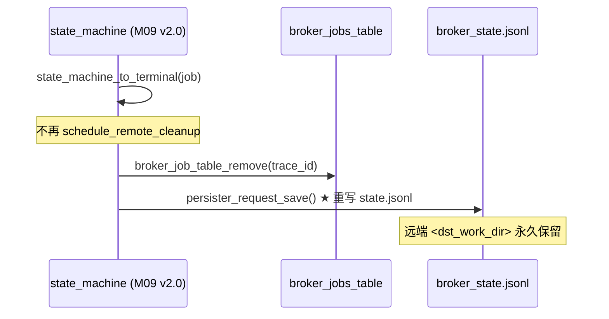

# M14 远端清理与保留 Checklist (broker · v2.0) ⏸ **DEPRECATED 整模块废弃**

> 配套: [doc/Broker详细设计文档MVP_v2.md](../Broker详细设计文档MVP_v2.md) §2 (废弃项) / §3.3 (线程拓扑) / §10.1 (保留字段) / §11 (落地排期表)
> 差异蓝图: [doc/跨域调度详设-差异变更说明.md](../跨域调度详设-差异变更说明.md) §2 (M14 废弃)
> Sprint: ⏸ **暂废弃**
> 依赖: 无（本模块停用）
> 下游: 无

---

> ## ⚠️ 重要状态：本模块已在 v2.0 整模块废弃
>
> v2.0 设计明确不在本期（MVP_v2）实现"远端工作目录定时清理"功能：
>
> - **永不删除用户数据**：终态作业（COMPLETED/FAILED/CANCELLED）仅从内存表 + state_save 落盘移除，**远端 `<dst_work_dir>` 留作运维取证**。
> - **`cleanup.c` / `cleanup.h` 不进编译**：MVP_v2 文件清单（设计文档 §8 / §1247 行）确认"❌ 没有独立 cleanup.c"。
> - **`egress_cleanup_async` (8017) 不启用**：协议号保留供未来恢复，但当前 wire 路径无调用（设计文档 §251 行 / §821 行）。
> - **`schedule_remote_cleanup` 不被 M09-T7 调用**：M09 v2.0 在终态时直接走 `state_machine_to_terminal()` → 内存表移除 + state.jsonl 重写，不入 cleanup 队列。
> - **保留参数仍在 broker.conf**（设计文档 §1656）：`RemoteWorkDirRetentionHours=24` / `RemoteWorkDirFailureRetentionDays=7` 仅作语义占位，未来恢复模块时复用，**当前 broker 不读取**。

---

## 1. 模块概述与目标（v2.0 修订）

### 1.1 一句话定位（v2.0）

**v2.0 不实现自动远端目录清理**。终态作业的 `<dst_work_dir>` 一律保留到磁盘满或运维 cron 接管。

### 1.2 v2.0 MVP 范围

- **空** — 不进编译、不进入 `Makefile.am SOURCES`
- 保留 `broker.conf` 字段定义（M02-T2 v2.0 已注明 "v2.0 unused, reserved"）
- 保留 8017 RPC 协议号定义 + handler 桩（M04 v2.0 / M07 v2.0 仅注册 `RESPONSE_SUCCESS` 桩，避免后续协议号冲突）

### 1.3 不在 MVP 范围（明确剥离）

- ~~`cleanup_init()` / `cleanup_fini()` / `schedule_remote_cleanup()`~~：**整套删除**
- ~~`cleanup_queue.jsonl` 持久化~~：**不落盘**
- ~~`_cleanup_main` ticker 线程~~：**不创建**（线程拓扑从 9 减到 7，对应设计文档 §3.3）
- ~~`egress_cleanup_async` 调用~~：M08 v2.0 中 8017 仅保留 wire 接口（M04-T2 注 LEGACY_M04_TRANSITIONAL），无人调用

### 1.4 与 v1.5 的差异

| 维度 | v1.5 | v2.0 |
|---|---|---|
| 模块状态 | 启用 | **⏸ DEPRECATED** |
| `cleanup.c/.h` | 编入 SOURCES | **不编入** |
| `cleanup_init()` 调用 | broker_main.c 启动时 | **删除调用点** |
| 线程数 | 含 cleanup ticker 线程 | **少 1 个线程** (设计文档 §3.3 7 线程组) |
| `state_machine` 终态钩子 | 调 `schedule_remote_cleanup(job)` | **不调；直接内存表移除** (M09-T7 v2.0) |
| `egress_cleanup_async` | 由 cleanup ticker 调 | **无调用方**；wire 桩保留 |
| `RemoteWorkDirRetentionHours` | 生效 | **broker 不读**；仅文档占位 |
| `RemoteWorkDirFailureRetentionDays` | 生效 | **broker 不读**；仅文档占位 |
| 远端 dst_work_dir 生命周期 | 24h / 7d 后 rm -rf | **永不删除**（运维 cron 接管） |

---

## 2. 接口契约（v2.0）

### 2.1 公共 API

**无** —— 本头文件 `cleanup.h` v2.0 不存在。

如未来恢复，建议保留 v1.5 的接口签名以减少回滚摩擦：

```c
/* 仅供未来恢复参考, v2.0 不编译 */
extern int  cleanup_init(void);
extern void cleanup_fini(void);
extern void schedule_remote_cleanup(broker_job_t *job);
```

### 2.2 broker.conf 字段（仍接受但不生效）

```ini
# v2.0 保留字段, broker 不读取, 不影响行为
RemoteWorkDirRetentionHours=24
RemoteWorkDirFailureRetentionDays=7
```

M02-T2 v2.0 解析逻辑：仍接受这两个字段（避免老配置文件升级 broker 时报 unknown key），但 `g_broker_conf` 中标注 "reserved" 注释。M02 v2.0 的 `broker_conf_log_summary()` 不打印这两项。

---

## 3. 参考代码（v2.0 删除项）

| 用途 | 文件 | v2.0 处理 |
|---|---|---|
| 1 分钟 ticker | [src/slurmctld/agent.c](../../src/slurmctld/agent.c) | 不需要 |
| `list_t` + 时间排序 | [src/common/list.h](../../src/common/list.h) | 不需要 |
| JSONL 写法 | [doc/checklist1/broker-M03-data-persist.md](broker-M03-data-persist.md) | 仅 broker_state.jsonl 沿用 |

---

## 4. 文件清单（v2.0 删除项）

| 文件 | v1.5 类型 | v2.0 处理 |
|---|---|---|
| `src/slurmbrokerd/cleanup.h` | 新增 | **删除 / 不创建** |
| `src/slurmbrokerd/cleanup.c` | 新增 | **删除 / 不创建** |
| [src/slurmbrokerd/Makefile.am](../../src/slurmbrokerd/Makefile.am) | 修改加 cleanup.c | **不加，确保 SOURCES 不含 cleanup.c** |
| [src/slurmbrokerd/state_machine.c](../../src/slurmbrokerd/state_machine.c) | 修改调 `schedule_remote_cleanup` | **★ 移除调用** (M09-T7 v2.0 已落地) |
| [src/slurmbrokerd/broker_main.c](../../src/slurmbrokerd/broker_main.c) | 修改调 `cleanup_init/fini` | **★ 移除调用** |

---

## 5. 流程（v2.0 已停止）



---

## 6. 任务展开

### M14-T1 ⏸ DEPRECATED 数据结构 / API

- **状态**: **跳过 / 不实施**
- **预估**: 0d
- **DoD**:
  - [ ] `git ls-files src/slurmbrokerd/ | grep cleanup` 返回空（确认源码未引入）
  - [ ] `Makefile.am` 中 `slurmbrokerd_SOURCES` 不含 `cleanup.c`
  - [ ] `broker_main.c` grep `cleanup_init|cleanup_fini` 返回空
  - [ ] `state_machine.c` grep `schedule_remote_cleanup` 返回空

### M14-T2 ⏸ DEPRECATED cleanup ticker

- **状态**: **跳过 / 不实施**
- **预估**: 0d
- **DoD**:
  - [ ] `pgrep -af slurmbrokerd` 后再 `pstack <pid>` 不出现 `_cleanup_main` 线程符号
  - [ ] 线程数 = 7（设计文档 §3.3 拓扑），不含 cleanup ticker

### M14-T3 ★ v2.0 残留点清理审计（NEW · 替代 T1/T2）

- **依赖**: 无
- **预估**: 0.25d
- **关键决策**:
  1. 全仓 grep 三类符号，确认零残留：
     - `cleanup_init`、`cleanup_fini`、`schedule_remote_cleanup`、`_cleanup_main`
     - `cleanup_queue.jsonl` 字符串
     - `egress_cleanup_async` 调用方（仅 M08 wire 注册保留 0 调用）
  2. `broker.conf` 文档示例不再标注这两字段为"必填"，改注 `# v2.0 reserved, not yet wired`
  3. 部署脚本（M15-T*）不创建 `<state_save_location>/cleanup_queue.jsonl`
- **代码草图（审计脚本）**:

```bash
#!/bin/bash
# tools/audit_m14_deprecation.sh
set -euo pipefail
cd "$(git rev-parse --show-toplevel)"

echo "=== M14 deprecation audit ==="

FAIL=0
for sym in cleanup_init cleanup_fini schedule_remote_cleanup _cleanup_main cleanup_queue.jsonl; do
    HITS=$(rg -n "$sym" src/slurmbrokerd/ || true)
    if [[ -n "$HITS" ]]; then
        echo "[FAIL] $sym still referenced:"
        echo "$HITS"
        FAIL=1
    else
        echo "[OK]   $sym not referenced"
    fi
done

# egress_cleanup_async 允许出现在 M04 协议号注册 + M08 wire 桩, 但不允许有调用方
CALL_HITS=$(rg -n 'egress_cleanup_async\s*\(' src/slurmbrokerd/ \
    | grep -v 'egress.h:' \
    | grep -v 'egress.c:.*\bstatic\|extern\b' || true)
if [[ -n "$CALL_HITS" ]]; then
    echo "[FAIL] egress_cleanup_async() has callers:"
    echo "$CALL_HITS"
    FAIL=1
else
    echo "[OK]   egress_cleanup_async() has no caller"
fi

exit $FAIL
```

- **DoD**:
  - [ ] 上述脚本 exit 0
  - [ ] CI 集成此脚本，PR 触发审计

---

## 7. 整体 DoD（v2.0 汇总）

- [ ] T3 审计脚本 PASS
- [ ] broker 启动日志无 "cleanup ticker started" 行
- [ ] broker 关闭日志无 "cleanup ticker stopped" 行
- [ ] 测试集 `tests/broker/full_lifecycle.sh` 跑完一个 COMPLETED → 24h+ 远端 dst_dir 仍存在
- [ ] `<state_save_location>/cleanup_queue.jsonl` 不被创建
- [ ] M15-T2 deploy 文档不再 mention "cleanup ticker"

## 8. 验证脚本

```bash
# v2.0 deprecation 审计
./tools/audit_m14_deprecation.sh
# 期望 exit 0

# 端到端确认远端目录不被自动删
./tests/broker/full_lifecycle.sh trace_id=v2-deprec-001
ssh broker.wz.example.com 'ls -la /work/home/wz_test1/.burst/xian_cluster/v2-deprec-001/'
# 期望: 24h+ 后目录仍存在 (与 v1.5 相反)

# 启动后线程数检查
pgrep -af slurmbrokerd | head -1 | awk '{print $1}' | xargs -I{} ls /proc/{}/task | wc -l
# 期望: 7 (设计文档 §3.3, 比 v1.5 少 1 个 cleanup ticker)
```

---

## 9. 风险与回滚

| 风险 | 触发 | 缓解 |
|---|---|---|
| 远端磁盘被旧作业目录撑爆 | 长期不清 | 运维 cron + quota；文档 §1903 明示风险 |
| 用户认为 cleanup 还在生效 | 文档/release notes 不清 | 升级公告明确 "v2.0 不自动清理远端目录" |
| 老配置含 `RemoteWorkDir*` 字段 | 升级 | M02-T2 v2.0 仍接受，避免 unknown key 报错；标注 "reserved" |
| egress_cleanup_async wire 桩被误用 | 后续工程师手抖调用 | 函数体加 `error("egress_cleanup_async: M14 deprecated, no-op"); return SLURM_ERROR;` 防御 |
| 未来恢复时找不到代码 | git revert 找不到 commit | v2.0 标签 + CHANGELOG 明确指向 v1.5 cleanup commit hash 列表 |

回滚（恢复 cleanup 模块）：

> 当未来需要恢复（如硬性合规要求"N 天后必须删"），按以下步骤逆向操作：

1. `git cherry-pick <v1.5 cleanup.c/.h commit>`
2. `Makefile.am` 加回 `cleanup.c`
3. `broker_main.c` 加回 `cleanup_init()` / `cleanup_fini()` 调用点
4. `state_machine.c::state_machine_to_terminal()` 加回 `schedule_remote_cleanup(job)` 调用
5. `M02-T2 broker_options[]` 把 `RemoteWorkDir*` 注释从 "reserved" 改为 "active"
6. `egress_cleanup_async` 移除 M14 deprecated 防御 return
7. `tools/audit_m14_deprecation.sh` 暂停或反向断言

恢复后建议复读：

- 设计文档 §10.1 保留参数语义
- v1.5 M14 checklist `doc/checklists/M14-cleanup.md` 完整任务展开
