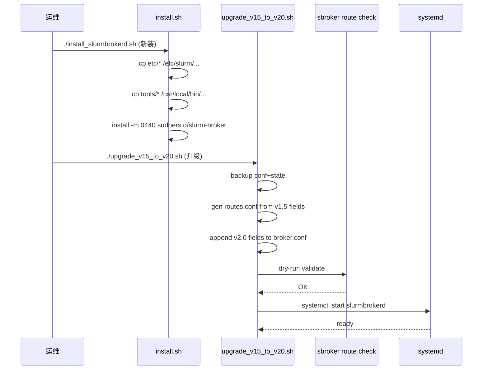

# M15 部署运维工件 Checklist (broker · v2.0) ★ NEW

> 配套: [doc/Broker详细设计文档MVP_v2.md](../Broker详细设计文档MVP_v2.md) §11.4 / §11.5 / §11.6
> 差异蓝图: [doc/跨域调度详设-差异变更说明.md](../跨域调度详设-差异变更说明.md) §2 (运维基线 v2.0 增量)
> Sprint: S4 W7-W8
> 依赖:
>   - M02 v2.0（broker.conf 字段定稿）
>   - **★ M16 v2.0**（routes.conf 文件 schema 定稿，需先于 M15 完成）
>   - M11-T4（lookup_software.sh / software_routes.conf 模板）
> 下游: M17 smoke 测试用本模块产出的部署制品在 staging 环境拉起 broker

> **v1.5 → v2.0 增量**:
> 1. ★ 新增 `etc/routes.conf.example`（v2.0 路由表必备）
> 2. ★ 新增 `etc/broker.conf.example v2.0`（含 `RouteSource=` / `RoutesConfPath=` / `SubmitMode=` / `RemoteAllowedCheck=` / `TestOnly*` 5 类新字段，并把 `RemoteCluster*` / `DefaultRemotePartition` 标注为 LEGACY）
> 3. ★ sudoers 模板新增 `--uid=` 选项放行（SubmitMode=root_uid 模式必需）
> 4. ★ logrotate 增 `routes.conf` 重载触发后的审计日志切片
> 5. ★ 新增升级/回滚 SOP 脚本 `tools/upgrade_v15_to_v20.sh` 与 `tools/rollback_v20_to_v15.sh`
> 6. ★ 新增预上线校验工具 `sbroker route check`（依赖 M16 routes_loader）

---

## 1. 模块概述与目标

### 1.1 一句话定位

把 broker v2.0 二进制 + 5 类配置 + 4 类系统集成（systemd / sudoers / logrotate / SSH key）一次性打包到运维可复用的 `etc/`、`tools/`、`scripts/` 目录，并提供 v1.5→v2.0 升级与回滚 SOP，确保现网平滑切换。

### 1.2 v2.0 MVP 范围

- 部署制品（5 项）：
  1. `etc/slurmbrokerd.service`（systemd unit，v1.5 已有，v2.0 仅校对路径）
  2. `etc/broker.conf.example` **★ v2.0**（含 RouteSource / SubmitMode / TestOnly* 等新字段）
  3. `etc/routes.conf.example` **★ v2.0 NEW**（最少 1 个 `[Route ...]` 段，注释覆盖所有字段）
  4. `etc/sudoers.d/slurm-broker` **★ v2.0**（rsync + sbatch + sbatch --uid + mkdir/chmod/sh）
  5. `etc/logrotate.d/slurm-broker` **★ v2.0**（`slurmbrokerd.log` + `broker_stage/*.log`）
- 部署辅助脚本（3 项）：
  1. `tools/install_slurmbrokerd.sh`（一键拷贝制品到目标路径）
  2. `tools/upgrade_v15_to_v20.sh` **★ NEW**（v1.5 → v2.0 升级）
  3. `tools/rollback_v20_to_v15.sh` **★ NEW**（v2.0 → v1.5 回滚）
- 预上线校验工具：`sbroker route check` **★ NEW**（dry-run routes.conf）
- README/文档：`etc/README.broker.md`（部署 SOP 索引）

### 1.3 不在 MVP 范围

- ~~ansible/saltstack playbook 化~~：MVP 仅 shell 脚本，运维自己接 ansible
- ~~containerized 镜像（docker / podman）~~：MVP 仅 RPM/DEB 风格直装
- ~~多 broker HA / 多副本~~：MVP 单 broker 实例

### 1.4 与 v1.5 的差异

| 维度 | v1.5 | v2.0 |
|---|---|---|
| broker.conf 模板 | `etc/broker.conf.example` (M15 v1.5 也是 TODO) | **★ 新增 RouteSource/SubmitMode/TestOnly* 字段** |
| 路由配置 | 仅 `RemoteCluster*` / `DefaultRemotePartition` 在 broker.conf | **★ 独立 `routes.conf`，多 [Route] 段** |
| sudoers | rsync, sbatch, mkdir, chmod, sh | **★ 增加 sbatch --uid（SubmitMode=root_uid 必需）** |
| logrotate | `slurmbrokerd.log`, `broker_stage/*.log` | **★ 增加 SIGHUP 重载触发后的审计日志条件 size+date** |
| 升级 SOP | 无（v1.5 是首发） | **★ tools/upgrade_v15_to_v20.sh** |
| 校验工具 | 无 | **★ sbroker route check** (M16 依赖) |

---

## 2. 接口契约 / 制品 schema

### 2.1 `etc/broker.conf.example` (★ v2.0)

```ini
# /etc/slurm/broker.conf  (broker v2.0 sample)
# 详见 doc/Broker详细设计文档MVP_v2.md §10.1

############################################
# 1) 基础进程参数
############################################
ClusterName            = wz_cluster
BrokerHost             = wz-broker-01.example.com
BrokerPort             = 7001
StateSaveLocation      = /var/spool/slurm/broker
PidFile                = /var/run/slurmbrokerd.pid
LogFile                = /var/log/slurm/slurmbrokerd.log
LogLevel               = info

############################################
# 2) 用户映射 (内联)  -- 见 doc §10.1.B
############################################
LocalUser=zhangsan src_cluster=xian_cluster src_uid=10001 remote_uid=20001
LocalUser=lisi     src_cluster=xian_cluster src_uid=10002 remote_uid=20002
# 多行 LocalUser= 累加, 由 broker_conf_load 批量解析

############################################
# 3) 路由层 (★ v2.0 新增)
############################################
# 路由来源: file = 读 routes.conf; static_legacy = 退化到 v1.5 单对端
RouteSource            = file
RoutesConfPath         = /etc/slurm/routes.conf
RoutesReloadMode       = sighup_or_mtime    # off | sighup | sighup_or_mtime
RoutesMtimePollSec     = 10                 # mtime poll 周期 (仅 sighup_or_mtime)

############################################
# 4) 提交模式 (★ v2.0 新增)
############################################
# mapped_user = sudo -u <remote_user> sbatch (v1.5 行为)
# root_uid    = 直接 sbatch --uid=<remote_uid> (省 sudoers, 但 broker 需 root)
SubmitMode             = mapped_user
RemoteAllowedCheck     = strict             # strict | none

############################################
# 5) test-only 探测 (★ v2.0 新增)
############################################
TestOnlyTimeoutSec     = 5
TestOnlyMaxCandidates  = 8

############################################
# 6) 容量软限流 (★ v2.0 + 复用)
############################################
MaxInFlightJobs        = 1000               # 全局兜底, 配合 routes.conf::RemoteMaxInflight

############################################
# 7) 软件路径解析
############################################
LookupSoftwareScript   = /opt/slurm-broker/scripts/lookup_software.sh
LookupTimeoutSec       = 3

############################################
# 8) v2.0 LEGACY 字段 (★ 仅 RouteSource=static_legacy 时生效)
############################################
# RemoteClusterName       = xian_cluster
# RemoteBrokerHost        = xian-broker-01.example.com
# RemoteBrokerPort        = 7001
# DefaultRemotePartition  = xianhcnormal

############################################
# 9) v2.0 RESERVED (★ M14 cleanup 暂废弃, broker 不读)
############################################
# RemoteWorkDirRetentionHours        = 24
# RemoteWorkDirFailureRetentionDays  = 7
```

### 2.2 `etc/routes.conf.example` (★ v2.0 NEW)

```ini
# /etc/slurm/routes.conf  (broker v2.0 sample)
# 详见 doc/Broker详细设计文档MVP_v2.md §8.A.1
# 每个 [Route ...] 段一条路由规则; broker 按 Priority 升序探测

# 最小迁移示例 (从 v1.5 单对端字段平移)
[Route legacy-default]
Src                = wz_cluster:*           # * = 任意 src_partition
AllowApps          = *                      # * = 任意 app
TargetBroker       = xian-broker-01.example.com:7001
TargetCluster      = xian_cluster
TargetPartition    = xianhcnormal
Priority           = 100
RemoteMaxInflight  = 500
TestOnlyTimeout    = 5

# 多 Target 示例: 同 (Src, App) 多候选, broker 按 Priority 探测后选首个 OK
[Route gromacs-to-cluB]
Src                = wz_cluster:cpu_p1
AllowApps          = gromacs,vasp
TargetBroker       = 10.0.2.50:7001
TargetCluster      = cluster_B
TargetPartition    = cpu_partition_Q
Priority           = 50
RemoteMaxInflight  = 64
TestOnlyTimeout    = 5

[Route gromacs-to-cluC]
Src                = wz_cluster:cpu_p1
AllowApps          = gromacs,vasp
TargetBroker       = 10.0.3.50:7001
TargetCluster      = cluster_C
TargetPartition    = cpu_partition_R
Priority           = 200
RemoteMaxInflight  = 32
TestOnlyTimeout    = 8

# GPU 专属路由示例
[Route lammps-gpu]
Src                = wz_cluster:gpu_p1
AllowApps          = lammps
TargetBroker       = 10.0.4.50:7001
TargetCluster      = cluster_D
TargetPartition    = gpu_partition_S
Priority           = 100
RemoteMaxInflight  = 16
```

### 2.3 `etc/sudoers.d/slurm-broker` (★ v2.0)

```
# /etc/sudoers.d/slurm-broker  (mode 0440, owner root:root)
# v2.0: 同时支持 SubmitMode=mapped_user (sbatch via sudo -u <remote_user>)
#       与 SubmitMode=root_uid (sbatch --uid=<uid> 直接执行)

# 1) v1.5 通用 (mapped_user 模式 + stage worker rsync)
slurm ALL=(ALL) NOPASSWD: /usr/bin/rsync, \
                          /usr/bin/sbatch, \
                          /bin/mkdir, \
                          /bin/chmod, \
                          /bin/sh

# 2) ★ v2.0 新增 (root_uid 模式必需; SubmitMode=mapped_user 时该行无害但不必要)
#    sbatch --uid=<numeric> 是新选项, 必须 root 才能 setuid
#    若部署使用 SubmitMode=mapped_user, 可注释掉本行
# slurm ALL=(root) NOPASSWD: /usr/bin/sbatch --uid=*

# 3) Defaults: 禁用 tty 要求 (broker 是 daemon 进程, 无 tty)
Defaults:slurm !requiretty
Defaults:slurm env_keep += "PATH SLURM_CONF SLURM_CLUSTERS"
```

### 2.4 `etc/logrotate.d/slurm-broker` (★ v2.0)

```
# /etc/logrotate.d/slurm-broker
/var/log/slurm/slurmbrokerd.log {
    daily
    rotate 14
    missingok
    notifempty
    compress
    delaycompress
    sharedscripts
    postrotate
        # ★ v2.0: 不发 SIGHUP, 因为 SIGHUP 是 routes.conf 重载用 (M16)
        # broker 自己处理 log rotate 通过 logrotate-friendly open(O_APPEND)
        /bin/true
    endscript
}

/var/log/slurm/broker_stage/*.log {
    weekly
    rotate 8
    missingok
    notifempty
    compress
    olddir /var/log/slurm/broker_stage/archived
    create 0640 slurm slurm
    # ★ v2.0: stage worker log 量随作业并发线性增长
    size 100M
}
```

### 2.5 `tools/upgrade_v15_to_v20.sh` (★ NEW)

```bash
#!/bin/bash
# tools/upgrade_v15_to_v20.sh
# v1.5 → v2.0 升级 SOP (与 doc §11.6.2 同步)
set -euo pipefail

CONF_DIR="${BROKER_CONF_DIR:-/etc/slurm}"
STATE_DIR="${BROKER_STATE_DIR:-/var/spool/slurm/broker}"
PEER_HOST="${PEER_BROKER_HOST:-}"

echo "=== Step 1/7: stop both brokers (let in-flight jobs poll to terminal) ==="
systemctl stop slurmbrokerd
[[ -n "$PEER_HOST" ]] && ssh "$PEER_HOST" systemctl stop slurmbrokerd

echo "=== Step 2/7: backup state + conf ==="
cp -p "$STATE_DIR/broker_state.jsonl" "$STATE_DIR/broker_state.jsonl.v1.5.bak"
cp -p "$CONF_DIR/broker.conf" "$CONF_DIR/broker.conf.v1.5.bak"

echo "=== Step 3/7: install v2.0 binary (assume already done by yum/apt) ==="
slurmbrokerd --version | grep -q '2\.0' || {
    echo "FATAL: slurmbrokerd binary not v2.0"; exit 1
}

echo "=== Step 4/7: migrate routes.conf from v1.5 single-target fields ==="
if [[ -e "$CONF_DIR/routes.conf" ]]; then
    echo "WARN: $CONF_DIR/routes.conf exists, skip auto-gen"
else
    OLD_CLUSTER=$(awk '/^[[:space:]]*RemoteClusterName[[:space:]]*=/{print $NF}' "$CONF_DIR/broker.conf.v1.5.bak")
    OLD_HOST=$(awk    '/^[[:space:]]*RemoteBrokerHost[[:space:]]*=/{print $NF}' "$CONF_DIR/broker.conf.v1.5.bak")
    OLD_PORT=$(awk    '/^[[:space:]]*RemoteBrokerPort[[:space:]]*=/{print $NF}' "$CONF_DIR/broker.conf.v1.5.bak")
    OLD_PART=$(awk    '/^[[:space:]]*DefaultRemotePartition[[:space:]]*=/{print $NF}' "$CONF_DIR/broker.conf.v1.5.bak")
    SELF_CLUSTER=$(awk '/^[[:space:]]*ClusterName[[:space:]]*=/{print $NF}' "$CONF_DIR/broker.conf.v1.5.bak")
    cat > "$CONF_DIR/routes.conf" <<EOF
# auto-generated by upgrade_v15_to_v20.sh
[Route legacy-default]
Src                = ${SELF_CLUSTER}:*
AllowApps          = *
TargetBroker       = ${OLD_HOST}:${OLD_PORT}
TargetCluster      = ${OLD_CLUSTER}
TargetPartition    = ${OLD_PART}
Priority           = 100
RemoteMaxInflight  = 500
TestOnlyTimeout    = 5
EOF
    chown root:slurm "$CONF_DIR/routes.conf"
    chmod 0640 "$CONF_DIR/routes.conf"
fi

echo "=== Step 5/7: append v2.0 fields to broker.conf ==="
grep -q '^RouteSource' "$CONF_DIR/broker.conf" || cat >> "$CONF_DIR/broker.conf" <<'EOF'

# v2.0 fields (added by upgrade_v15_to_v20.sh)
RouteSource            = file
RoutesConfPath         = /etc/slurm/routes.conf
RoutesReloadMode       = sighup_or_mtime
RoutesMtimePollSec     = 10
SubmitMode             = mapped_user
RemoteAllowedCheck     = strict
TestOnlyTimeoutSec     = 5
TestOnlyMaxCandidates  = 8
EOF

echo "=== Step 6/7: dry-run validate routes.conf ==="
sbroker route check --conf "$CONF_DIR/broker.conf" --routes "$CONF_DIR/routes.conf"

echo "=== Step 7/7: start both brokers ==="
systemctl start slurmbrokerd
[[ -n "$PEER_HOST" ]] && ssh "$PEER_HOST" systemctl start slurmbrokerd

echo "=== Verifying ... ==="
sleep 3
journalctl -u slurmbrokerd -n 30 --no-pager | grep -E 'routes_loader|route_decide|listening' \
    || echo "WARN: did not see routes_loader log (check journal manually)"

echo "=== Upgrade DONE. Run smoke: ./tools/sbroker_smoke.sh ==="
```

### 2.6 `tools/rollback_v20_to_v15.sh` (★ NEW)

```bash
#!/bin/bash
# tools/rollback_v20_to_v15.sh
# v2.0 → v1.5 回滚 SOP (与 doc §11.6.3 同步)
set -euo pipefail

CONF_DIR="${BROKER_CONF_DIR:-/etc/slurm}"
STATE_DIR="${BROKER_STATE_DIR:-/var/spool/slurm/broker}"

echo "=== Step 1/5: stop broker ==="
systemctl stop slurmbrokerd

echo "=== Step 2/5: cancel all INIT-phase v2.0 jobs ==="
# v2.0 -> v1.5 不自动支持 init_phase 字段; INIT 期作业需要 cancel
INIT_JOBS=$(jq -r 'select(.state=="INIT") | .src_job_id' \
    "$STATE_DIR/broker_state.jsonl" 2>/dev/null || true)
if [[ -n "$INIT_JOBS" ]]; then
    echo "Canceling INIT-phase v2.0 jobs: $INIT_JOBS"
    echo "$INIT_JOBS" | xargs -r -I {} scancel {}
fi

echo "=== Step 3/5: downgrade binary ==="
slurmbrokerd --version | grep -q '1\.5' || {
    echo "Run: yum downgrade slurmbrokerd-1.5 (and re-run this script)"
    exit 1
}

echo "=== Step 4/5: restore v1.5 conf ==="
[[ -e "$CONF_DIR/broker.conf.v1.5.bak" ]] || {
    echo "FATAL: $CONF_DIR/broker.conf.v1.5.bak not found"; exit 1
}
cp -p "$CONF_DIR/broker.conf.v1.5.bak" "$CONF_DIR/broker.conf"
[[ -e "$CONF_DIR/routes.conf" ]] && rm -f "$CONF_DIR/routes.conf"

echo "=== Step 5/5: start broker (v1.5) ==="
systemctl start slurmbrokerd

echo "=== Rollback DONE ==="
```

---

## 3. 参考代码

| 用途 | 文件 | 说明 |
|---|---|---|
| systemd unit 模板 | [etc/slurmbrokerd.service.in](../../etc/slurmbrokerd.service.in) | 已就位（v1.5）|
| broker.conf 解析 | [src/slurmbrokerd/broker_conf.c](../../src/slurmbrokerd/broker_conf.c) | M02 v2.0 |
| routes.conf 解析 | [src/slurmbrokerd/routes_loader.c](../../src/slurmbrokerd/routes_loader.c) | M16 v2.0 |
| sbroker CLI | `tools/sbroker.c`（待 M17 落地）| dry-run validator 入口 |

---

## 4. 文件清单

| 文件 | 类型 | 用途 |
|---|---|---|
| `etc/broker.conf.example` | ★ 修改 (v2.0) | broker.conf 完整字段示例 |
| `etc/routes.conf.example` | ★ 新增 | v2.0 路由表示例 |
| `etc/sudoers.d/slurm-broker` | ★ 修改 (v2.0) | sudo 白名单（含 sbatch --uid=*）|
| `etc/logrotate.d/slurm-broker` | ★ 新增 | 日志切片配置 |
| `etc/README.broker.md` | ★ 新增 | 部署 SOP 索引 |
| `tools/install_slurmbrokerd.sh` | ★ 新增 | 一键拷贝制品 |
| `tools/upgrade_v15_to_v20.sh` | ★ 新增 | v1.5→v2.0 升级 SOP |
| `tools/rollback_v20_to_v15.sh` | ★ 新增 | v2.0→v1.5 回滚 SOP |
| `tools/sbroker_route_check.c` | ★ 新增 | dry-run validator (依赖 M16) |
| `etc/slurmbrokerd.service` | 校对 | systemd unit (v1.5 已有) |

---

## 5. 流程



---

## 6. 任务展开

### M15-T1 ★ v2.0 `etc/broker.conf.example` 编写

- **依赖**: M02 v2.0
- **预估**: 0.5d
- **关键决策**:
  1. 完整覆盖 §2.1 的 9 个段
  2. 注释明示 v2.0 新字段 / LEGACY 字段 / RESERVED 字段
  3. 默认值与 M02 v2.0 broker_options[] 校验逻辑一致
- **DoD**:
  - [ ] `slurmbrokerd -t -f etc/broker.conf.example` (dry-run) PASS（v1.5 字段也兼容）
  - [ ] 注释行 ≥ 30 行（占总行数 ≥ 40%），运维易读
  - [ ] 所有 v2.0 字段都有内联示例值

### M15-T2 ★ v2.0 NEW `etc/routes.conf.example` 编写

- **依赖**: M16-T1 (routes_loader 字段定稿)
- **预估**: 0.5d
- **关键决策**:
  1. 至少 4 个 [Route] 段：legacy-default + 多 Target + GPU 专属 + AllowApps 白名单
  2. 注释明示 `Src` 通配符语义（`*` = 任意 partition）
  3. 注释明示 `AllowApps` 通配符与 `,` 分隔
  4. 注释明示 `Priority` 越小越优先
- **DoD**:
  - [ ] `sbroker route check --routes etc/routes.conf.example` (M17 落地后) PASS
  - [ ] 4 个 [Route] 段语义不同，覆盖典型场景

### M15-T3 ★ v2.0 sudoers 模板（含 sbatch --uid）

- **依赖**: M07-T6 v2.0 (SubmitMode=root_uid 落地)
- **预估**: 0.25d
- **关键决策**:
  1. 默认放行 `mapped_user` 路径（v1.5 兼容）
  2. `--uid=*` 行默认注释，文档说明仅 SubmitMode=root_uid 模式启用
  3. mode 0440, owner root:root（chown 在 install_slurmbrokerd.sh 内）
- **DoD**:
  - [ ] `visudo -cf etc/sudoers.d/slurm-broker` 校验 PASS
  - [ ] mapped_user 模式下 `sudo -u zhangsan sbatch ...` 不报 password
  - [ ] root_uid 模式（解注释 `--uid=*` 行后）`sudo sbatch --uid=20001 ...` 不报 password

### M15-T4 ★ v2.0 logrotate 配置

- **依赖**: 无
- **预估**: 0.25d
- **关键决策**:
  1. `slurmbrokerd.log` daily + 14 days
  2. `broker_stage/*.log` weekly + 8 weeks + size 100M（任一触发）
  3. **不发 SIGHUP**（SIGHUP 现在是 routes.conf 重载语义）；用 `O_APPEND` 友好的 broker 自身实现兜底
- **DoD**:
  - [ ] `logrotate -d /etc/logrotate.d/slurm-broker` dry-run PASS
  - [ ] 强制 rotate 后 broker 仍能写入 / 不丢日志

### M15-T5 ★ NEW `tools/install_slurmbrokerd.sh`

- **依赖**: T1, T2, T3, T4
- **预估**: 0.5d
- **关键决策**:
  1. 检查目标路径已存在 → 备份为 `.bak`
  2. install -m 0644 broker.conf.example → /etc/slurm/broker.conf.example（不覆盖运行配置）
  3. install -m 0640 routes.conf.example → /etc/slurm/routes.conf.example
  4. install -m 0440 sudoers → /etc/sudoers.d/slurm-broker
  5. install -m 0644 logrotate → /etc/logrotate.d/slurm-broker
  6. install -m 0755 lookup_software.sh → /opt/slurm-broker/scripts/
  7. mkdir -p `/var/spool/slurm/broker` `/var/log/slurm/broker_stage/archived`
  8. systemctl daemon-reload
- **代码草图**:

```bash
#!/bin/bash
set -euo pipefail
SRC_DIR="$(dirname "$0")/.."
BACKUP_TS="$(date +%Y%m%d-%H%M%S)"

backup_if_exists() {
    [[ -e "$1" ]] && cp -p "$1" "$1.bak.$BACKUP_TS"
}

mkdir -p /etc/slurm /etc/sudoers.d /etc/logrotate.d \
         /opt/slurm-broker/scripts \
         /var/spool/slurm/broker \
         /var/log/slurm/broker_stage/archived

backup_if_exists /etc/slurm/broker.conf.example
install -m 0644 -o root -g root \
    "$SRC_DIR/etc/broker.conf.example" /etc/slurm/

backup_if_exists /etc/slurm/routes.conf.example
install -m 0640 -o root -g slurm \
    "$SRC_DIR/etc/routes.conf.example" /etc/slurm/

backup_if_exists /etc/sudoers.d/slurm-broker
install -m 0440 -o root -g root \
    "$SRC_DIR/etc/sudoers.d/slurm-broker" /etc/sudoers.d/

backup_if_exists /etc/logrotate.d/slurm-broker
install -m 0644 -o root -g root \
    "$SRC_DIR/etc/logrotate.d/slurm-broker" /etc/logrotate.d/

install -m 0755 -o root -g root \
    "$SRC_DIR/scripts/lookup_software.sh" /opt/slurm-broker/scripts/

systemctl daemon-reload
echo "Install DONE. Edit /etc/slurm/broker.conf and /etc/slurm/routes.conf, then:"
echo "  systemctl enable --now slurmbrokerd"
```

- **DoD**:
  - [ ] 全新机器上跑一次 `install.sh` 后 `systemctl start slurmbrokerd` 不报 file/permission 错
  - [ ] 已装机器再跑一次 `install.sh` 后 `.bak.*` 文件成功生成

### M15-T6 ★ NEW `tools/upgrade_v15_to_v20.sh`

- **依赖**: T1, T2, T5, M16
- **预估**: 0.75d
- **关键决策**:
  1. 严格按 §2.5 7 步骤执行
  2. 每步失败 `exit 1`，不做 best-effort 继续
  3. routes.conf 已存在时跳过自动生成（不覆盖运维手写）
  4. 调用 `sbroker route check`（T8）做 dry-run 验证
- **DoD**:
  - [ ] mock v1.5 broker.conf + state.jsonl，跑 upgrade.sh 全流程 PASS
  - [ ] 跑两次 upgrade.sh（幂等）：第二次 routes.conf 不被覆盖；broker.conf 不重复 append v2.0 段

### M15-T7 ★ NEW `tools/rollback_v20_to_v15.sh`

- **依赖**: T6
- **预估**: 0.5d
- **关键决策**:
  1. 严格按 §2.6 5 步骤执行
  2. INIT-phase 作业必须 cancel 后才能回滚（避免 v1.5 重复转发）
  3. routes.conf 直接 rm（v1.5 无该文件）
  4. broker.conf 用 `.v1.5.bak` 覆盖（不做字段级 diff）
- **DoD**:
  - [ ] 跑 upgrade → 投 1 个 INIT-phase 作业（mock）→ 跑 rollback → 该作业被 cancel + broker 启 v1.5 OK
  - [ ] 无 `.v1.5.bak` 时 rollback.sh 友好报错并退出

### M15-T8 ★ NEW `sbroker route check` CLI 工具

- **依赖**: M16-T1, M16-T2
- **预估**: 0.5d
- **关键决策**:
  1. 复用 `routes_loader_init(path)` + `broker_conf_load(path)`，不启 listener
  2. 校验：
     - broker.conf 字段完整性（所有 v2.0 必填字段）
     - routes.conf 解析无 syntax error
     - 每条 [Route] 的 `TargetBroker` 主机名 DNS 可解析
     - 每条 [Route] 的 `Src.cluster_name` 与 broker.conf::ClusterName 是否一致（warn）
  3. 输出表格：路由数 / 用户数 / 全局 cap / 单路由 cap
  4. 退出码：0=OK, 1=warn (DNS/集群不一致), 2=fatal (parse error)
- **代码草图**:

```c
/* tools/sbroker_route_check.c */
int main(int argc, char **argv)
{
	const char *broker_conf = "/etc/slurm/broker.conf";
	const char *routes_conf = NULL;

	for (int i = 1; i < argc; i++) {
		if (!strcmp(argv[i], "--conf") && i+1 < argc)
			broker_conf = argv[++i];
		else if (!strcmp(argv[i], "--routes") && i+1 < argc)
			routes_conf = argv[++i];
	}

	if (broker_conf_load(broker_conf) != SLURM_SUCCESS) {
		fprintf(stderr, "FATAL: broker.conf parse failed\n");
		return 2;
	}
	if (!routes_conf) routes_conf = g_broker_conf.routes_conf_path;
	if (!routes_conf) {
		fprintf(stderr, "WARN: RoutesConfPath unset & --routes missing\n");
		return 1;
	}

	if (routes_loader_init(routes_conf) != SLURM_SUCCESS) {
		fprintf(stderr, "FATAL: routes.conf parse failed\n");
		return 2;
	}

	int warns = 0;
	for (route_entry_t *r = g_routes->head; r; r = r->next) {
		struct addrinfo *ai = NULL;
		char host[256] = {0};
		const char *colon = strchr(r->target_broker_addr, ':');
		size_t hlen = colon ? (size_t)(colon - r->target_broker_addr) : 0;
		if (hlen == 0 || hlen >= sizeof(host)) {
			fprintf(stderr, "FATAL: invalid TargetBroker '%s'\n",
			        r->target_broker_addr);
			return 2;
		}
		memcpy(host, r->target_broker_addr, hlen);
		if (getaddrinfo(host, NULL, NULL, &ai) != 0) {
			fprintf(stderr, "WARN: DNS resolve failed for '%s' (route_id=%s)\n",
			        host, r->route_id);
			warns++;
		} else {
			freeaddrinfo(ai);
		}
		if (xstrcmp(r->src_cluster_name, g_broker_conf.cluster_name)) {
			fprintf(stderr, "WARN: route_id=%s src_cluster=%s != ClusterName=%s\n",
			        r->route_id, r->src_cluster_name,
			        g_broker_conf.cluster_name);
			warns++;
		}
	}

	printf("OK: %u routes loaded, %u warnings\n",
	       routes_loader_count(), warns);
	return warns ? 1 : 0;
}
```

- **DoD**:
  - [ ] mock 一份合法 broker.conf + routes.conf → exit 0
  - [ ] mock 一份 syntax-error routes.conf → exit 2
  - [ ] mock TargetBroker 域名不可解析 → exit 1 + WARN
  - [ ] mock src_cluster 与 ClusterName 不一致 → exit 1 + WARN

### M15-T9 ★ NEW `etc/README.broker.md`

- **依赖**: T1-T8
- **预估**: 0.25d
- **关键决策**: 索引 + 5 段：制品清单 / 部署步骤 / 升级 / 回滚 / 故障排查
- **DoD**: 新人按文档 30 分钟内能拉起 broker

---

## 7. 整体 DoD（汇总）

- [ ] 9 个子任务全部勾选
- [ ] **新装路径**：从空白机器 install.sh → systemctl start → broker 进入 LISTENING 状态
- [ ] **升级路径**：v1.5 现网备份 → upgrade.sh → 跑 ./tests/broker/full_lifecycle.sh PASS
- [ ] **回滚路径**：v2.0 → rollback.sh → broker 启 v1.5 → v1.5 测试用例 PASS
- [ ] **dry-run**：`sbroker route check` PR 阶段 CI 集成（`make check-config`）
- [ ] **logrotate**：强制 rotate 后 broker 不丢日志
- [ ] **sudoers**：visudo -c PASS；mapped_user 模式不报 password
- [ ] 所有制品文件 mode/owner 与 §2 spec 一致

## 8. 验证脚本

```bash
# T1-T4: 配置文件 lint
slurmbrokerd -t -f etc/broker.conf.example
visudo -cf etc/sudoers.d/slurm-broker
logrotate -d etc/logrotate.d/slurm-broker

# T5: 新装
sudo ./tools/install_slurmbrokerd.sh
ls -l /etc/slurm/broker.conf.example /etc/slurm/routes.conf.example
ls -l /etc/sudoers.d/slurm-broker /etc/logrotate.d/slurm-broker

# T6: 升级 (mock v1.5 → v2.0)
cp tests/fixtures/broker.conf.v1.5.sample /etc/slurm/broker.conf
sudo ./tools/upgrade_v15_to_v20.sh
sbroker route check && echo "upgrade OK"

# T7: 回滚
sudo ./tools/rollback_v20_to_v15.sh
slurmbrokerd --version | grep '1.5'

# T8: dry-run validator
./build/tools/sbroker_route_check --conf /etc/slurm/broker.conf
echo "exit code: $?"

# 故障注入: routes.conf syntax error
echo 'XXXXXX' > /tmp/bad_routes.conf
./build/tools/sbroker_route_check --conf /etc/slurm/broker.conf \
    --routes /tmp/bad_routes.conf
# 期望: exit 2
```

---

## 9. 风险与回滚

| 风险 | 触发 | 缓解 |
|---|---|---|
| sudoers 模板权限错 (非 0440) | install.sh 漏 chmod | install -m 0440 显式；postinstall hook 二次校验 |
| 升级中 INIT-phase 作业丢失 | upgrade 不停 ctld 即升 broker | upgrade.sh §11.6.2 step1 强调先停双 broker；文档 |
| routes.conf 自动生成字段不全 | v1.5 broker.conf 字段不全 | upgrade.sh 用 awk grep；缺字段时 exit 1 + 提示运维手写 |
| logrotate 触发 SIGHUP 误重载 routes.conf | postrotate 误用 SIGHUP | logrotate 配置 §2.4 明示 `/bin/true`，永不 SIGHUP |
| sbatch --uid 在某些 Slurm 版本不可用 | Slurm < 22.05 | sudoers 模板将 `--uid=*` 行默认注释；文档说明最低版本 |
| 新装机器缺 `slurm` 用户/组 | 全新部署 | install.sh 起始 `getent passwd slurm` 检查；缺则 exit 1 提示 useradd |
| broker.conf upgrade 重复 append | 跑 upgrade.sh 多次 | upgrade.sh 用 `grep -q '^RouteSource' \|\| append`，幂等 |
| dry-run 校验本身被绕过 | CI 未集成 | M15-T8 PR 阶段 `make check-config` 强制门禁 |

回滚（M15 整体回滚）：

1. `git revert tools/upgrade_v15_to_v20.sh tools/rollback_v20_to_v15.sh tools/install_slurmbrokerd.sh tools/sbroker_route_check.c`
2. `git revert etc/broker.conf.example etc/routes.conf.example etc/sudoers.d/slurm-broker etc/logrotate.d/slurm-broker etc/README.broker.md`
3. 保留 `etc/slurmbrokerd.service`（v1.5 已就位，与 v2.0 兼容）
4. 现网部署：rollback.sh 已能从 v2.0 → v1.5；本模块回滚后运维需手工管理 conf/sudoers/logrotate
