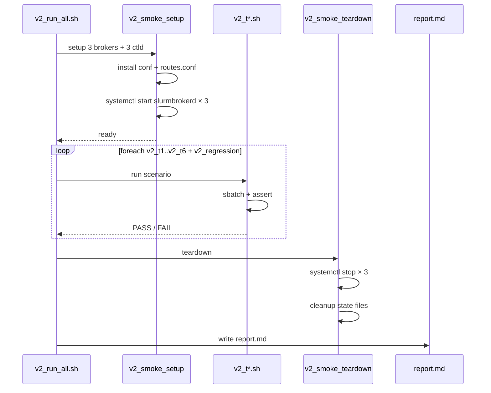

# M17 集成与冒烟测试 Checklist (broker · v2.0) ★ NEW

> 配套: [doc/Broker详细设计文档MVP_v2.md](../Broker详细设计文档MVP_v2.md) §11.3 / §13 / §1849 (v2.0 M19 集成测试)
> 差异蓝图: [doc/跨域调度详设-差异变更说明.md](../跨域调度详设-差异变更说明.md) §3 (端到端验收基线)
> Sprint: S4 W7-W8
> 依赖: **全部 M02-M16 v2.0 完成**（M14 DEPRECATED 除外）+ **ctld v2.0 PR 已合入**（forward_job_msg_t 协议、cd_route_exhausted、partition.cd_allow_remote、SlurmDBD remote_allowed）
> 下游: 现网灰度部署

> **核心定位**：本模块是 v2.0 MVP 的**总入口验收测试**，覆盖 5 大新场景：
> 1. ★ `routes.conf` 热加载（SIGHUP / mtime poll）
> 2. ★ test-only 探测（首个 OK 后选定 / 全部超时 → EXHAUSTED）
> 3. ★ cap_check 软限流边界（单路由满 / 全局满）
> 4. ★ SubmitMode 切换（mapped_user / root_uid）
> 5. ★ ctld→broker 协议瘦身 + 首次包必带 cluster/partition_name

---

## 1. 模块概述与目标

### 1.1 一句话定位

在 staging 环境（A/B/C 三 broker + 各自 ctld）跑一组覆盖 v2.0 全部新增能力的端到端冒烟测试，输出可重放的 pass/fail 报告，作为 v1.5→v2.0 升级的"go/no-go"门禁。

### 1.2 v2.0 MVP 范围

- **6 大测试场景**（详见 §6 任务展开）：
  1. T1: 路由命中 + 首次 test-only OK 全流程（happy path）
  2. T2: routes.conf 热加载（SIGHUP / mtime poll / 错文件不影响在途）
  3. T3: test-only 多候选探测（首候选超时 → 转下一个 / 全部超时 → EXHAUSTED）
  4. T4: cap_check 软限流（单路由满 → CAP_FULL_SOFT_WAIT / 全局满 → OVERLOAD）
  5. T5: SubmitMode 切换（mapped_user → root_uid 重启 broker 后兼容）
  6. T6: 协议契约验证（ctld→broker forward_job 瘦身 / 8003 首次包必带字段 / 8018-8019 wire 格式）
- **基础回归**：v1.5 已有的 6 个核心测试（ENV-FW-CN-CO 完整生命周期 / scancel 反向 / 远端 sbatch 失败 / lookup_software 超时 / 用户映射缺失 / 重启恢复）也必须 PASS（相当于 v2.0 不破 v1.5 兼容性）

### 1.3 不在 MVP 范围

- ~~性能压测（500+ jobs/s）~~：M17 仅功能性 smoke，性能放 v0.2
- ~~故障注入随机化（jepsen 风格）~~：M17 用确定性场景
- ~~跨数据中心高延迟模拟~~：staging 同机房

### 1.4 与 v1.5 测试基线的差异

| 维度 | v1.5 (已落地) | v2.0 (本模块新增) |
|---|---|---|
| 测试场景数 | 6 个 | 6 个回归 + **6 个 v2.0 NEW** = 12 |
| broker 拓扑 | 2 broker (A/B) | **3 broker (A/B/C)** 验证多对端路由 |
| 配置文件 | broker.conf | broker.conf + **routes.conf** |
| 测试用脚本 | `tests/broker/full_lifecycle.sh` 等 6 个 | + **`tests/broker/v2_*.sh` 6 个** |
| CI 集成 | nightly | nightly + **PR 触发**（PR-affected smoke 子集） |

---

## 2. 测试环境契约

### 2.1 拓扑

```
              ┌─────────┐                  ┌──────────┐
              │ ctld-A  │  munge.key  共享  │ ctld-B   │
              └────┬────┘                  └────┬─────┘
                   │                            │
              broker_addr=A:7001          broker_addr=B:7001
                   │                            │
              ┌────┴─────┐                ┌─────┴────┐
              │ broker-A │ ◄────8010─────►│ broker-B │
              └────┬─────┘                └─────┬────┘
                   │                            │
                   │   ┌────8010───────────────┘
                   │   │
              ┌────┴───┴─┐
              │ broker-C │ (★ v2.0 新增, 验证多对端)
              └──────────┘
                   │
                ctld-C
```

### 2.2 集群与分区命名约定

| 集群 | broker | partitions | 用途 |
|---|---|---|---|
| `cluA` | broker-A | `cpu_p1`, `gpu_p1` | 源端（提交 sbatch） |
| `cluB` | broker-B | `cpu_q`, `gpu_q` | 远端默认 |
| `cluC` | broker-C | `cpu_r` | 远端备选（多对端验证） |

### 2.3 用户映射（broker.conf 内联）

```
LocalUser=user1 src_cluster=cluA src_uid=10001 remote_uid=20001    # broker-B 侧
LocalUser=user1 src_cluster=cluA src_uid=10001 remote_uid=30001    # broker-C 侧
LocalUser=user2 src_cluster=cluA src_uid=10002 remote_uid=20002    # 仅 broker-B, broker-C 故意缺
```

### 2.4 routes.conf (broker-A 侧)

```ini
[Route r-cpu-to-B]
Src=cluA:cpu_p1
AllowApps=*
TargetBroker=broker-B:7001
TargetCluster=cluB
TargetPartition=cpu_q
Priority=100
RemoteMaxInflight=4

[Route r-cpu-to-C]
Src=cluA:cpu_p1
AllowApps=lammps,vasp
TargetBroker=broker-C:7001
TargetCluster=cluC
TargetPartition=cpu_r
Priority=50
RemoteMaxInflight=2

[Route r-gpu-to-B]
Src=cluA:gpu_p1
AllowApps=lammps,vasp
TargetBroker=broker-B:7001
TargetCluster=cluB
TargetPartition=gpu_q
Priority=100
RemoteMaxInflight=8
```

---

## 3. 参考代码

| 用途 | 文件 | 说明 |
|---|---|---|
| v1.5 核心 smoke 脚本 | `tests/broker/full_lifecycle.sh` | 复用作为 T1 模板 |
| sacct 字段断言 | `tests/broker/sacct_assert.sh` | 端到端结果校验 |
| `sbatch --uid` 调用 | [src/sbatch/](../../src/sbatch/) | T5 使用 |
| `kill -HUP` 触发 | shell builtin | T2 使用 |

---

## 4. 文件清单

| 文件 | 类型 | 用途 |
|---|---|---|
| `tests/broker/v2_smoke_setup.sh` | ★ 新增 | 拓扑搭建（启 3 broker + 3 ctld + 用户/路由配置） |
| `tests/broker/v2_smoke_teardown.sh` | ★ 新增 | 拓扑回收 |
| `tests/broker/v2_t1_happy_path.sh` | ★ 新增 | 路由命中 + test-only OK 全流程 |
| `tests/broker/v2_t2_routes_reload.sh` | ★ 新增 | SIGHUP / mtime / bad file 三子场景 |
| `tests/broker/v2_t3_test_only_probing.sh` | ★ 新增 | 首候选超时 / 全超时两子场景 |
| `tests/broker/v2_t4_cap_check.sh` | ★ 新增 | 单路由满 / 全局满两子场景 |
| `tests/broker/v2_t5_submit_mode.sh` | ★ 新增 | mapped_user / root_uid 切换 |
| `tests/broker/v2_t6_protocol_contract.sh` | ★ 新增 | wire 协议字段断言 |
| `tests/broker/v2_regression.sh` | ★ 新增 | v1.5 6 个核心场景的 v2.0 重跑 |
| `tests/broker/v2_run_all.sh` | ★ 新增 | 12 场景一键跑 + 报告 |
| `tests/broker/lib/v2_assert.sh` | ★ 新增 | 通用断言辅助（grep 状态机日志、scontrol show job 字段断言等） |
| `tests/broker/fixtures/v2/*.conf` | ★ 新增 | broker.conf / routes.conf 多份测试配置 |
| `.github/workflows/broker-smoke.yml`（如有 CI）| ★ 修改 | nightly + PR 触发 v2_run_all |

---

## 5. 流程



---

## 6. 任务展开

### M17-T0 ★ NEW 拓扑搭建脚本 `v2_smoke_setup.sh` / `v2_smoke_teardown.sh`

- **依赖**: M15 v2.0（install / upgrade scripts）
- **预估**: 1d
- **关键决策**:
  1. 用 docker-compose 或 systemd-nspawn 起 3 个隔离的 broker + ctld 实例（host networking 简化）
  2. 自动写 broker.conf / routes.conf / slurm.conf / users（useradd）
  3. 启动顺序：ctld → broker；停止反向
  4. 提供 `--keep` 选项保留环境用于 debug
- **代码草图**:

```bash
#!/bin/bash
# tests/broker/v2_smoke_setup.sh
set -euo pipefail
BASE_DIR="${BASE_DIR:-/tmp/broker_v2_smoke}"
mkdir -p "$BASE_DIR"/{cluA,cluB,cluC}/{conf,state,log}

for c in cluA cluB cluC; do
    cp tests/broker/fixtures/v2/${c}-broker.conf "$BASE_DIR/$c/conf/broker.conf"
    cp tests/broker/fixtures/v2/${c}-routes.conf "$BASE_DIR/$c/conf/routes.conf" || true
    cp tests/broker/fixtures/v2/${c}-slurm.conf  "$BASE_DIR/$c/conf/slurm.conf"
    SLURM_CONF=$BASE_DIR/$c/conf/slurm.conf slurmctld -D &  # 后台启
    sleep 1
    BROKER_CONF_DIR=$BASE_DIR/$c/conf slurmbrokerd -D &
    sleep 1
done

# 等待全部 listening
for c in cluA cluB cluC; do
    for i in {1..30}; do
        if grep -q "broker.*listening" "$BASE_DIR/$c/log/slurmbrokerd.log" 2>/dev/null; then
            break
        fi
        sleep 1
    done
done

echo "Topology ready: $BASE_DIR"
```

- **DoD**:
  - [ ] setup 完后 3 个 broker + 3 个 ctld 全部 ready
  - [ ] teardown 完后无残留进程 / state 文件
  - [ ] `--keep` 选项保留环境

### M17-T1 ★ NEW 场景 1: 路由命中 + test-only OK 全流程 (happy path)

- **依赖**: T0
- **预估**: 0.5d
- **关键决策**:
  1. user1 提交 sbatch `--allow-remote --app=lammps -p cpu_p1`
  2. 期望命中 `r-cpu-to-C` (priority=50 优先)，test-only OK，stage_in OK，submit OK，COMPLETE
  3. 断言：
     - ctld-A: `scontrol show job <id>` 含 `RouteExhausted=No` + `RemoteCluster=cluC` + `RemotePartition=cpu_r`
     - broker-A: `broker_state.jsonl` 中 `selected_route_id=r-cpu-to-C` + `init_phase=SELECTED` (短暂) → 移除（终态）
     - sacct: `Remote_Cluster=cluC Remote_Partition=cpu_r`
     - broker-C: 远端 squeue 看到 `Account=user1_default`（v2.0 保留 account）
- **代码草图**:

```bash
#!/bin/bash
# tests/broker/v2_t1_happy_path.sh
set -euo pipefail
. tests/broker/lib/v2_assert.sh

JOB_ID=$(sbatch --parsable --allow-remote --app=lammps \
                 -p cpu_p1 -A user1_default \
                 --wrap='echo hello && sleep 5' | tail -1)

assert_ctld_field "$JOB_ID" RouteExhausted No
assert_ctld_field "$JOB_ID" RemoteCluster cluC
assert_ctld_field "$JOB_ID" RemotePartition cpu_r

wait_for_state "$JOB_ID" COMPLETED 60
assert_sacct_field "$JOB_ID" Remote_Cluster cluC
assert_sacct_field "$JOB_ID" Remote_Partition cpu_r

echo "T1 PASS"
```

- **DoD**:
  - [ ] 全流程 < 60s 完成 COMPLETED
  - [ ] 5 个断言全 PASS
  - [ ] broker-A、broker-C 日志无 ERROR

### M17-T2 ★ NEW 场景 2: routes.conf 热加载

- **依赖**: T0, M16-T3
- **预估**: 1d
- **关键决策**:
  1. 子场景 2a: SIGHUP 触发
     - 投 1 个长跑 job（sleep 60）→ stage_in 中，未到 SELECTED
     - 修改 routes.conf（增加 priority=10 的 r-emergency 路由）
     - `kill -HUP $(pgrep slurmbrokerd)`
     - 断言：在途 job 仍走原 r-cpu-to-C；新投 job 命中 r-emergency
  2. 子场景 2b: mtime poll
     - 设 `RoutesReloadMode=sighup_or_mtime`, `RoutesMtimePollSec=2`
     - 修改 routes.conf 不发 SIGHUP
     - 等 3s
     - 断言：日志出现 "mtime changed, reload"
  3. 子场景 2c: 错文件不影响在途
     - 投 1 个 job sleep 60
     - 把 routes.conf 改成 syntax error
     - kill -HUP
     - 断言：reload failed + 旧表保留 + 在途 job 完成 + 新投 job 仍能命中旧表
- **DoD**:
  - [ ] 三子场景全 PASS
  - [ ] reload 耗时日志 < 100ms
  - [ ] 错文件 reload 后 routes_loader version 不变

### M17-T3 ★ NEW 场景 3: test-only 多候选探测

- **依赖**: T0, M09 v2.0 `_on_init_probing`
- **预估**: 1d
- **关键决策**:
  1. 子场景 3a: 首候选超时 → 转下一个
     - 临时 mock broker-C 的 8018 handler 卡住 6s（超 5s 默认 timeout）
     - 提交 job → 期望命中 r-cpu-to-C 失败 → 转 r-cpu-to-B → SUCCESS
     - 断言：broker-A 日志含 `test_only timeout route_id=r-cpu-to-C → try next` + `test_only ok route_id=r-cpu-to-B`
     - 断言：broker_job_t.route_attempted_mask = 0b11
  2. 子场景 3b: 全候选超时 → EXHAUSTED
     - mock broker-B 与 broker-C 的 8018 都卡住
     - 提交 job → 期望 PROBING → EXHAUSTED → ctld 收到 8004 with err=9013
     - 断言：ctld `scontrol show job` 含 `RouteExhausted=Yes` + `Reason=BROKERD_ERR_ALL_ROUTES_EXHAUSTED`
- **DoD**:
  - [ ] 两子场景全 PASS
  - [ ] 单作业最差 PROBING 耗时 ≤ TestOnlyMaxCandidates × TestOnlyTimeoutSec (默认 8×5=40s)
  - [ ] cap_dec 在 EXHAUSTED 时正确执行（不泄漏占用）

### M17-T4 ★ NEW 场景 4: cap_check 软限流边界

- **依赖**: T0, M16-T5
- **预估**: 1d
- **关键决策**:
  1. 子场景 4a: 单路由满 → 转候选 / 全候选满 → CAP_FULL_SOFT_WAIT
     - r-cpu-to-C `RemoteMaxInflight=2`，r-cpu-to-B `RemoteMaxInflight=4`
     - 提交 7 个 job (lammps, cpu_p1)
     - 期望：前 2 个 → r-cpu-to-C；接下来 4 个 → r-cpu-to-B；第 7 个 → CAP_FULL_SOFT_WAIT
     - 断言：ctld 收到第 7 个 job 的 8004 with err=9020 → ctld 下一轮 forward_thread 重试 → 等到 r-cpu-to-C 释放后命中
  2. 子场景 4b: 全局 MaxInFlightJobs 满
     - broker.conf::MaxInFlightJobs=4
     - 提交 5 个 job
     - 期望：前 4 个 OK，第 5 个 → OVERLOAD → ctld 重试
- **DoD**:
  - [ ] 两子场景全 PASS
  - [ ] cap_check filter 边界值正确
  - [ ] 终态 cap_dec 后下个 job 立刻能进
  - [ ] cap_inc/dec 与 broker_state.jsonl replay 一致

### M17-T5 ★ NEW 场景 5: SubmitMode 切换

- **依赖**: T0, M07-T6 v2.0
- **预估**: 0.75d
- **关键决策**:
  1. 子场景 5a: mapped_user 模式（默认）
     - sudo -u user1 sbatch ...
     - 远端 broker-B 用 `sudo -u <remote_user>` 执行 sbatch
  2. 子场景 5b: root_uid 模式
     - 改 broker-B::SubmitMode=root_uid，重启 broker-B（非 ctld）
     - 重启后投 job
     - 远端 broker-B 用 `sbatch --uid=<remote_uid>` 直接执行（无 sudo）
     - 断言：broker-B 日志含 `submit_mode=root_uid uid=20001`
  3. 子场景 5c: root_uid 但 broker-B 非 root → 启动失败
     - broker-B::SubmitMode=root_uid 但运行用户为 slurm（非 root）
     - 期望 broker-B systemctl start 失败（M02-T3 v2.0 校验）
- **DoD**:
  - [ ] 两个成功子场景 PASS
  - [ ] 第三个子场景 broker 启动 fail-stop 日志清晰
  - [ ] 切换后在途作业仍能完成（无需 cancel）

### M17-T6 ★ NEW 场景 6: 协议契约验证

- **依赖**: T0, M04 v2.0
- **预估**: 1d
- **关键决策**:
  1. 子场景 6a: ctld→broker forward_job (8001) payload 瘦身
     - 抓包工具 (broker tcpdump) 捕获 8001 RPC payload
     - 断言：包含 `src_cluster_name`、`src_partition`、`cd_app_name`；不含 `target_cluster`、`target_partition`、`account`、`job_desc`（旧 v1.5 字段）
  2. 子场景 6b: broker→ctld update_remote_state (8003) 首次包必带字段
     - 投 job → 等首次 8003 push
     - 断言：首次 8003 RPC payload 含 `remote_cluster_name=cluC` + `remote_partition_name=cpu_r`
     - 断言：第二次 8003 push 不再重复（broker_job_t.first_state_pushed=true 后续可省略）
  3. 子场景 6c: 8018/8019 wire 格式验证
     - mock broker-C 抓 8018 入站 + 8019 出站
     - 断言：8018 含 trace_id + dst_partition + cd_app_name；8019 含 ok_flag + err_code (若失败)
- **代码草图**:

```bash
#!/bin/bash
# tests/broker/v2_t6_protocol_contract.sh

# 6a: tcpdump + tshark 解析 wire payload
tcpdump -i lo -w /tmp/cap.pcap port 7001 &
PCAP=$!
sleep 1
sbatch --allow-remote --app=lammps -p cpu_p1 --wrap='sleep 1' >/dev/null
sleep 5
kill $PCAP
# 用项目内 wire decoder 工具解析 (M04-T7 落地的 sbroker proto-decode)
sbroker proto-decode /tmp/cap.pcap | grep -E '8001|8003|8018|8019' > /tmp/decoded.txt

grep -q 'src_cluster_name=cluA' /tmp/decoded.txt
grep -q 'src_partition=cpu_p1' /tmp/decoded.txt
grep -q 'cd_app_name=lammps' /tmp/decoded.txt
! grep -q 'target_cluster=' /tmp/decoded.txt
! grep -q 'target_partition=' /tmp/decoded.txt

# 6b: 首次 8003 字段
FIRST_8003=$(grep -m1 '^msg=8003' /tmp/decoded.txt)
echo "$FIRST_8003" | grep -q 'remote_cluster_name=cluC'
echo "$FIRST_8003" | grep -q 'remote_partition_name='

echo "T6 PASS"
```

- **DoD**:
  - [ ] 三子场景全 PASS
  - [ ] decoded.txt 留作回归 baseline，下次 PR 跑出来 diff 应为空

### M17-T7 v2.0 回归: v1.5 6 个核心场景重跑

- **依赖**: T0
- **预估**: 0.5d
- **关键决策**:
  1. 直接复用 v1.5 `tests/broker/full_lifecycle.sh` 等 6 个脚本
  2. 在 v2.0 broker 上跑，确保 100% PASS（v2.0 不破 v1.5 兼容）
  3. 测试集：
     - F1: ENV→FW→CN→CO 完整生命周期
     - F2: scancel 反向（含远端 slurm_kill_job）
     - F3: 远端 sbatch 拒绝（语法错）
     - F4: lookup_software 超时
     - F5: 用户映射缺失
     - F6: broker 重启恢复（kill -9 + restart）
- **DoD**:
  - [ ] 6 个测试全 PASS
  - [ ] 与 v1.5 baseline 输出 diff 仅在新 v2.0 字段（如 RouteExhausted=No）

### M17-T8 ★ NEW `v2_run_all.sh` + 报告生成

- **依赖**: T1-T7
- **预估**: 0.5d
- **关键决策**:
  1. 顺序跑 setup → 12 场景 → teardown
  2. 每场景独立 timeout 5min
  3. 失败时不立即终止，记录后继续
  4. 输出 markdown 报告：场景表格 + log 链接 + 整体 PASS/FAIL
  5. 退出码：0=全 PASS，1=有 FAIL
- **代码草图**:

```bash
#!/bin/bash
# tests/broker/v2_run_all.sh
set -uo pipefail
LOG_DIR="${LOG_DIR:-/tmp/v2_smoke_$(date +%Y%m%d-%H%M%S)}"
mkdir -p "$LOG_DIR"

trap '. tests/broker/v2_smoke_teardown.sh' EXIT

. tests/broker/v2_smoke_setup.sh

declare -a SCENARIOS=(
    v2_t1_happy_path
    v2_t2_routes_reload
    v2_t3_test_only_probing
    v2_t4_cap_check
    v2_t5_submit_mode
    v2_t6_protocol_contract
    v2_regression
)

REPORT="$LOG_DIR/report.md"
echo "# Broker v2.0 Smoke Report" > "$REPORT"
echo "Generated: $(date)" >> "$REPORT"
echo "" >> "$REPORT"
echo "| Scenario | Result | Duration | Log |" >> "$REPORT"
echo "|---|---|---|---|" >> "$REPORT"

FAIL_COUNT=0
for s in "${SCENARIOS[@]}"; do
    LOG="$LOG_DIR/$s.log"
    T0=$(date +%s)
    if timeout 300 bash "tests/broker/${s}.sh" > "$LOG" 2>&1; then
        RES="✅ PASS"
    else
        RES="❌ FAIL"
        FAIL_COUNT=$((FAIL_COUNT + 1))
    fi
    T1=$(date +%s)
    echo "| $s | $RES | $((T1-T0))s | [log](./${s}.log) |" >> "$REPORT"
done

echo "" >> "$REPORT"
echo "## Summary" >> "$REPORT"
echo "Total: ${#SCENARIOS[@]}, Failed: $FAIL_COUNT" >> "$REPORT"

cat "$REPORT"
exit $((FAIL_COUNT > 0 ? 1 : 0))
```

- **DoD**:
  - [ ] 7 场景一键跑通
  - [ ] 报告 markdown 格式正确
  - [ ] 退出码符合预期

### M17-T9 ★ NEW CI 集成

- **依赖**: T8
- **预估**: 0.5d
- **关键决策**:
  1. nightly：跑全部 12 场景（含 regression）
  2. PR 触发：根据 PR 改动文件智能选 PR-affected 场景
     - 改 routes_loader/route/cap_check → T2/T3/T4
     - 改 handler_remote → T5
     - 改 proto.h → T6
     - 改 state_machine → T1/T3
     - 改 stage → T1（含 stage_in）
  3. PR PASS 强制门禁：T1 必跑 + 至少 1 个 v2_t* PASS
  4. CI 失败时上传 `report.md` 与 broker_state.jsonl 作为 artifact
- **DoD**:
  - [ ] PR 提交后 CI 自动跑相关 smoke
  - [ ] nightly 报告归档 30 天
  - [ ] artifact 可下载排错

---

## 7. 整体 DoD（汇总）

- [ ] 9 个子任务全部勾选
- [ ] **★ 12 场景全 PASS**（6 个 v2.0 NEW + 6 个 v1.5 回归）
- [ ] 拓扑搭建一次成功率 ≥ 95%（重试 3 次）
- [ ] **★ 性能基线**：T1 happy path < 60s；T3 全超时 ≤ 40s（TestOnlyMaxCandidates × TestOnlyTimeoutSec）
- [ ] **★ 协议契约（T6）**：wire decoder 输出与 baseline 一致（diff = 0）
- [ ] CI nightly 通过率 ≥ 99% 连续 7 天
- [ ] 报告 markdown 格式无 lint warn
- [ ] valgrind 在 setup→T1→teardown 路径上 clean

## 8. 验证脚本

```bash
# 单场景 dry-run
bash tests/broker/v2_smoke_setup.sh
bash tests/broker/v2_t1_happy_path.sh
bash tests/broker/v2_smoke_teardown.sh

# 全场景一键
bash tests/broker/v2_run_all.sh
echo "exit: $?"
ls /tmp/v2_smoke_*/report.md

# CI 触发模拟（仅 PR-affected）
PR_FILES="src/slurmbrokerd/routes_loader.c" \
    bash tests/broker/v2_run_all.sh --pr-affected
# 期望: T2 + T3 + T4 跑, 其它跳过

# 性能基线对比
bash tests/broker/v2_t1_happy_path.sh --bench --baseline /tmp/baseline.json
# 期望: 与 baseline 偏差 < 30%
```

---

## 9. 风险与回滚

| 风险 | 触发 | 缓解 |
|---|---|---|
| 拓扑搭建慢 / port 冲突 | 多人共用 staging | setup 用 `BASE_DIR` + 端口池随机；CI 用 docker network namespace 隔离 |
| 远端 broker mock 不稳 | 网络抖动 | T3/T6 用本地 socket mock 而非远端 |
| `tcpdump` 需 root | CI runner 权限 | T6 改用 broker 内置 wire trace（M04-T7 sbroker proto-trace） |
| 回归测试与新场景互相污染 | 共用 broker_state.jsonl | 每场景独立 BASE_DIR；teardown 清理 |
| flaky test（间歇失败） | 时序竞态 | wait_for_state 用指数退避 + max 60s |
| ctld v2.0 PR 未合 → T6 协议断言挂 | 上游依赖滞后 | M17 README 标注 ctld v2.0 PR 必须先合 + bot 检查 |
| sbroker proto-decode 工具缺失 | M04-T7 未落地 | T6 退化为手工 strings + grep magic word；新增 TODO 等 M04-T7 |
| docker/nspawn 不可用环境 | bare-metal CI | 提供 `--no-container` 模式直接 fork 进程 |
| smoke 报告噪声大 | 12 场景日志量 | 仅在 FAIL 时上传完整 log；PASS 仅上传摘要 |

回滚（M17 整体回滚）：

> M17 是测试模块，回滚仅影响验证手段，不影响功能本身。

1. `git revert tests/broker/v2_*.sh tests/broker/lib/v2_assert.sh tests/broker/fixtures/v2/*`
2. `git revert .github/workflows/broker-smoke.yml`（如已 PR 触发）
3. CI nightly 退回到 v1.5 6 个 smoke 场景
4. v2.0 上线门禁退回到"M16 单元测试 ≥ 80% + 人工 staging 验证"

降级路径：如个别 v2.0 场景未通过但其他 5 个已通过，可临时把未通过场景标 `SKIP` 上线，并开 issue 跟踪修复。
