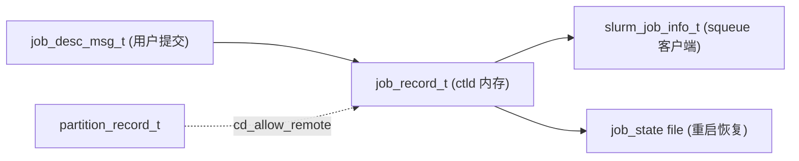

# ctld-M03 跨域数据结构扩展 Checklist (v2.0)

> 配套: [doc/Slurmctld跨域详细设计文档MVP_v2.md](../Slurmctld跨域详细设计文档MVP_v2.md) §3 / §4
> 差异蓝图: [doc/跨域调度详设-差异变更说明.md](../跨域调度详设-差异变更说明.md) §1.4 / §1.5
> 依赖: ctld-M01（payload struct 已有 `forward_job_msg_t` 等）/ ctld-M02（partition 子键解析与 `cd_allow_remote` 字段挂载）
> 下游: ctld-M04 / ctld-M05 / ctld-M07 / ctld-M08 / ctld-M09

> **v1.5 → v2.0 关键变化**:
> 1. **`partition_record_t` 大幅瘦身**：从 v1.5 的 4 个 `cd_*` 字段缩减为 1 个 `cd_allow_remote`（删 `cd_send_to` / `cd_remote_cluster` / `cd_remote_partition` / `cd_allow_apps`）
> 2. **`job_record_t` 新增 `cd_route_exhausted`**（uint8_t）：broker 报告全部远端不可达后置 1，跨域线程扫描时短路跳过；持久化到 state_save + DBD
> 3. **`job_record_t` 决策侧字段补全**：`cd_cancel_propagated` / `cd_terminal_received`（v1.5 砍刀已恢复）
> 4. **`job_record_t` 执行侧字段补全**：`cd_remote_alloc_tres` / `cd_remote_start_time` / `cd_remote_end_time` 等 8 个字段（v1.5 砍刀已恢复）
> 5. **state_save 必须支持** `_dump_job_state` / `_load_job_state`（v1.5 砍刀已恢复）
> 6. **`slurm_job_info_t` 新增 `cd_route_exhausted`**：scontrol 显示 `RouteExhausted=YES/NO`
> 7. **slurmdb_user_rec_t / slurmdb_assoc_rec_t 新增 `remote_allowed`**（uint16_t）：见 ctld-M13
> 8. **`job_desc_msg_t` 新增 `cd_route_exhausted_reset`**（uint8_t，sentinel 0xFF）：scontrol update 重置用，详见 §8 / ctld-M06

---

## 1. 模块目标

把跨域元数据贯穿 4 层数据结构 + 状态文件持久化：



每一层加字段都要同步 init / free / pack / unpack 4 个步骤；state_save 还要同步 `_dump_job_state` / `_load_job_state` 2 个步骤；否则会出现"包未配套"的内存泄漏或解码 buffer underflow。

## 2. 字段表（**单一源头**）

### 2.1 `partition_record_t`（v2.0 大幅瘦身）

| 字段 | 类型 | 说明 |
|---|---|---|
| `cd_allow_remote` | uint8_t | 0=no(默认) / 1=yes；由 ctld-M02 `_cd_partition_init()` 写入 |

**v2.0 已删**: `cd_send_to` / `cd_remote_cluster` / `cd_remote_partition` / `cd_allow_apps`（路由下沉到 broker `routes.conf`）

### 2.2 `job_record_t`

| 字段 | 类型 | 写入方 | 说明 |
|---|---|---|---|
| **请求侧** | | | |
| `cd_cross_region` | uint16_t | sbatch submit | 用户标记 0/1 |
| `cd_app_name` | char* | sbatch submit | --app=xxx 值 |
| **决策侧（ctld 跨域线程）** | | | |
| `cd_forwarded` | uint8_t | cd_thread Step 3 | 转发幂等标志 |
| `cd_cancel_propagated` | uint8_t | cd_send_cancel_to_broker SUCCESS | scancel 反向传播幂等标志 |
| `cd_terminal_received` | uint8_t | handle_broker_terminal_state | TERMINAL_STATE 真幂等标志 |
| `cd_route_exhausted` | uint8_t | cd_revert_forward_hard | ★ v2.0 新增：broker 9010/9011/9013 后置位 |
| `cd_remote_trace_id` | char* | broker 8002 / 8003 | 路由追踪 ID |
| **执行侧（broker 通过 8003/8004 回写）** | | | |
| `cd_remote_cluster_name` | char* | ★ v2.0 broker UPDATE_REMOTE_STATE 首次包 | 不再由 ctld hold 时写 |
| `cd_remote_partition_name` | char* | ★ v2.0 broker UPDATE_REMOTE_STATE 首次包 | 同上 |
| `cd_remote_job_id` | uint32_t | broker 8003 | 远端 jobid |
| `cd_remote_state` | uint32_t | broker 8003/8004 | 复用 JOB_STATE_* |
| `cd_remote_alloc_tres` | char* | broker 8003/8004 | "cpu=32,mem=128G,node=1" |
| `cd_remote_start_time` | time_t | broker 8003/8004 | |
| `cd_remote_end_time` | time_t | broker 8004 | |
| `cd_remote_exit_code` | uint32_t | broker 8004 | |

### 2.3 `slurm_job_info_t`（squeue / scontrol 共用）

| 字段 | 类型 | 说明 |
|---|---|---|
| `cross_region` | uint16_t | 透传 cd_cross_region |
| `app_name` | char* | 透传 cd_app_name |
| `cd_remote_cluster_name` / `cd_remote_partition_name` | char* | broker 决策结果 |
| `cd_remote_job_id` / `cd_remote_state` | uint32_t | |
| `cd_remote_alloc_tres` | char* | |
| `cd_remote_start_time` / `cd_remote_end_time` | time_t | |
| `cd_remote_exit_code` | uint32_t | |
| `cd_remote_trace_id` | char* | |
| `cd_route_exhausted` | uint8_t | ★ v2.0 新增 |

### 2.4 `job_desc_msg_t`

| 字段 | 类型 | 说明 |
|---|---|---|
| `cross_region` | uint16_t | 客户端 sbatch 设 |
| `app_name` | char* | 客户端 sbatch 设 |
| `cd_route_exhausted_reset` | uint8_t | ★ v2.0 新增 sentinel；默认 0xFF=未设；scontrol update 用于重置；详见 ctld-M06 §8.2 |

> **v1.5 砍刀全部恢复**：v2.0 设计明确要求完整字段（含 `cd_cancel_propagated` / `cd_terminal_received` / `cd_remote_alloc_tres` / `cd_remote_start_time` / `cd_remote_end_time` / `cd_remote_exit_code`），并要求 `_dump_job_state` / `_load_job_state` 持久化。`cd_forwarded` 不再 bit1 兼任 cancel_propagated（独立字段）。

---

## 3. 触及文件 + 行号锚点

| 文件 | 锚点 |
|---|---|
| [slurm/slurm.h](../../slurm/slurm.h) | `} job_desc_msg_t;` / `} slurm_job_info_t;` 末尾 |
| [src/slurmctld/slurmctld.h](../../src/slurmctld/slurmctld.h) | `struct job_record { ... };` 末尾 / `struct part_record { ... };` 末尾 |
| [src/common/slurm_protocol_pack.c](../../src/common/slurm_protocol_pack.c) | `_pack_job_desc_msg` / `_unpack_job_desc_msg` / `_pack_job_info_members` / `_unpack_job_info_members` / `slurm_pack_partition_info_members` / `_unpack_partition_info_members` `META_3_2_PROTOCOL_VERSION` 分支末尾 |
| [src/api/job_info.c](../../src/api/job_info.c) | `slurm_free_job_info_members` |
| [src/slurmctld/job_mgr.c](../../src/slurmctld/job_mgr.c) | `_create_job_record` / `_list_delete_job` / `_pack_default_job_info` / `_pack_pending_job_details` / `_dump_job_state` / `_load_job_state` |
| [src/common/slurm_protocol_defs.c](../../src/common/slurm_protocol_defs.c) | `slurm_init_job_desc_msg` / `slurm_free_job_desc_msg` |

---

## 4. Checklist

### 4.1 partition_record_t（与 ctld-M02 对齐）

- [ ] M3-1 [src/slurmctld/slurmctld.h](../../src/slurmctld/slurmctld.h) `struct part_record` 末尾追加 ifdef 块（**1 字段**）：
    ```c
    #ifdef __METASTACK_NEW_CROSS_DOMAIN
        uint8_t   cd_allow_remote;     /* AllowRemote=yes|no */
    #endif
    ```
- [ ] M3-2 [src/common/slurm_protocol_pack.c](../../src/common/slurm_protocol_pack.c) `slurm_pack_partition_info_members` `META_3_2_PROTOCOL_VERSION` 分支末尾：
    ```c
    #ifdef __METASTACK_NEW_CROSS_DOMAIN
        pack8(part->cd_allow_remote, buffer);
        /* v2.0 已删: cd_send_to / cd_allow_apps / cd_remote_cluster / cd_remote_partition 共 4 处 packstr */
    #endif
    ```
- [ ] M3-3 `_unpack_partition_info_members` 同位置 `safe_unpack8`；旧协议版本回退 `cd_allow_remote = 0`

### 4.2 job_desc_msg_t（用户提交层）

- [ ] M3-4 [slurm/slurm.h](../../slurm/slurm.h) `job_desc_msg_t` 末尾追加 ifdef 块（**3 字段**）：
    ```c
    #ifdef __METASTACK_NEW_CROSS_DOMAIN
        uint16_t  cross_region;
        char     *app_name;                  /* 与 v2 设计文档 §4.2 命名一致 */
        uint8_t   cd_route_exhausted_reset;  /* 0xFF=未设 / 0=清除 / 1=钉死; 仅 root/operator */
    #endif
    ```
- [ ] M3-5 [src/common/slurm_protocol_defs.c](../../src/common/slurm_protocol_defs.c) `slurm_init_job_desc_msg` 加默认值：
    ```c
    job_desc_msg->cross_region = 0;
    job_desc_msg->app_name     = NULL;
    job_desc_msg->cd_route_exhausted_reset = 0xFF;   /* sentinel */
    ```
- [ ] M3-6 同文件 `slurm_free_job_desc_msg` 加 `xfree(msg->app_name);`
- [ ] M3-7 [src/common/slurm_protocol_pack.c](../../src/common/slurm_protocol_pack.c) `_pack_job_desc_msg` `META_3_2_PROTOCOL_VERSION` 分支末尾追加：
    ```c
    #ifdef __METASTACK_NEW_CROSS_DOMAIN
        pack16(job_desc_ptr->cross_region, buffer);
        packstr(job_desc_ptr->app_name, buffer);
        pack8(job_desc_ptr->cd_route_exhausted_reset, buffer);
    #endif
    ```
- [ ] M3-8 `_unpack_job_desc_msg` 同位置 `safe_unpack16` / `safe_unpackstr_xmalloc` / `safe_unpack8`；旧协议回退 `cross_region=0` / `app_name=NULL` / `cd_route_exhausted_reset=0xFF`

### 4.3 job_record_t（ctld 内存层，**13 字段**）

- [ ] M3-9 [src/slurmctld/slurmctld.h](../../src/slurmctld/slurmctld.h) `struct job_record` 末尾追加 ifdef 块（**13 字段**，顺序见 §2.2）：
    ```c
    #ifdef __METASTACK_NEW_CROSS_DOMAIN
        /* === 跨域请求侧 === */
        uint16_t  cd_cross_region;
        char     *cd_app_name;
        /* === 跨域决策侧 === */
        uint8_t   cd_forwarded;
        uint8_t   cd_cancel_propagated;       /* ★ v2 恢复 */
        uint8_t   cd_terminal_received;       /* ★ v2 恢复 */
        uint8_t   cd_route_exhausted;         /* ★ v2.0 新增 */
        char     *cd_remote_trace_id;
        /* === 跨域执行侧 (broker 8003/8004 回写) === */
        char     *cd_remote_cluster_name;     /* ★ v2.0: broker 首次状态包写入 */
        char     *cd_remote_partition_name;   /* ★ v2.0: 同上 */
        uint32_t  cd_remote_job_id;
        uint32_t  cd_remote_state;
        char     *cd_remote_alloc_tres;       /* ★ v2 恢复 */
        time_t    cd_remote_start_time;       /* ★ v2 恢复 */
        time_t    cd_remote_end_time;         /* ★ v2 恢复 */
        uint32_t  cd_remote_exit_code;
    #endif
    ```
- [ ] M3-10 [src/slurmctld/job_mgr.c](../../src/slurmctld/job_mgr.c) `_create_job_record` 末尾从 `job_desc` 拷贝（`cross_region` 字段名 v2 改为 `cross_region`，注意与 `cd_cross_region` 区分）：
    ```c
    #ifdef __METASTACK_NEW_CROSS_DOMAIN
        job_ptr->cd_cross_region = job_desc->cross_region;
        job_ptr->cd_app_name     = xstrdup(job_desc->app_name);
        /* 其它字段在初始化时由 xmalloc 自动 0/NULL */
    #endif
    ```
- [ ] M3-11 同文件 `_list_delete_job`（或 `_purge_job_record`）加 5 个 `xfree`：`cd_app_name` / `cd_remote_trace_id` / `cd_remote_cluster_name` / `cd_remote_partition_name` / `cd_remote_alloc_tres`

### 4.4 state_save（ctld 重启持久化，★ v2 关键）

- [ ] M3-12 [src/slurmctld/job_mgr.c](../../src/slurmctld/job_mgr.c) `_dump_job_state` 末尾追加：
    ```c
    #ifdef __METASTACK_NEW_CROSS_DOMAIN
        pack16(dump_job_ptr->cd_cross_region, buffer);
        packstr(dump_job_ptr->cd_app_name, buffer);
        pack8(dump_job_ptr->cd_forwarded, buffer);
        pack8(dump_job_ptr->cd_cancel_propagated, buffer);
        pack8(dump_job_ptr->cd_terminal_received, buffer);
        pack8(dump_job_ptr->cd_route_exhausted, buffer);
        packstr(dump_job_ptr->cd_remote_trace_id, buffer);
        packstr(dump_job_ptr->cd_remote_cluster_name, buffer);
        packstr(dump_job_ptr->cd_remote_partition_name, buffer);
        pack32(dump_job_ptr->cd_remote_job_id, buffer);
        pack32(dump_job_ptr->cd_remote_state, buffer);
        packstr(dump_job_ptr->cd_remote_alloc_tres, buffer);
        pack_time(dump_job_ptr->cd_remote_start_time, buffer);
        pack_time(dump_job_ptr->cd_remote_end_time, buffer);
        pack32(dump_job_ptr->cd_remote_exit_code, buffer);
    #endif
    ```
- [ ] M3-13 同文件 `_load_job_state` 按版本分支：
    ```c
    #ifdef __METASTACK_NEW_CROSS_DOMAIN
        if (protocol_version >= SLURM_24_05_V2_PROTOCOL_VERSION /* v2.0 内部小版本 */) {
            safe_unpack16(&job_ptr->cd_cross_region, buffer);
            safe_unpackstr_xmalloc(&job_ptr->cd_app_name, &uint32_tmp, buffer);
            safe_unpack8(&job_ptr->cd_forwarded, buffer);
            safe_unpack8(&job_ptr->cd_cancel_propagated, buffer);
            safe_unpack8(&job_ptr->cd_terminal_received, buffer);
            safe_unpack8(&job_ptr->cd_route_exhausted, buffer);
            /* ... 其余 8 个远端字段 unpack ... */
        } else if (protocol_version >= SLURM_24_05_PROTOCOL_VERSION) {
            /* v1.5 state 文件: 没有 cd_route_exhausted, 设为 0;
             * cd_cancel_propagated / cd_terminal_received 也回退为 0 */
            safe_unpack16(&job_ptr->cd_cross_region, buffer);
            safe_unpackstr_xmalloc(&job_ptr->cd_app_name, &uint32_tmp, buffer);
            safe_unpack8(&job_ptr->cd_forwarded, buffer);
            job_ptr->cd_cancel_propagated = 0;
            job_ptr->cd_terminal_received = 0;
            job_ptr->cd_route_exhausted = 0;
            /* ... 其余远端字段 unpack ... */
        } else {
            /* < 24.05 state 文件: 跨域字段全 0/NULL */
        }
    #endif
    ```

### 4.5 slurm_job_info_t（squeue / scontrol 客户端层，**11 字段**）

- [ ] M3-14 [slurm/slurm.h](../../slurm/slurm.h) `slurm_job_info_t` 末尾追加 ifdef 块：
    ```c
    #ifdef __METASTACK_NEW_CROSS_DOMAIN
        uint16_t  cross_region;
        char     *app_name;
        char     *cd_remote_cluster_name;
        char     *cd_remote_partition_name;
        uint32_t  cd_remote_job_id;
        uint32_t  cd_remote_state;
        char     *cd_remote_alloc_tres;
        time_t    cd_remote_start_time;
        time_t    cd_remote_end_time;
        uint32_t  cd_remote_exit_code;
        char     *cd_remote_trace_id;
        uint8_t   cd_route_exhausted;     /* ★ v2.0 新增 */
    #endif
    ```
- [ ] M3-15 [src/api/job_info.c](../../src/api/job_info.c) `slurm_free_job_info_members` 加 `xfree`：`app_name` / `cd_remote_cluster_name` / `cd_remote_partition_name` / `cd_remote_alloc_tres` / `cd_remote_trace_id` 共 5 个

### 4.6 job_info_members 协议序列化

- [ ] M3-16 [src/common/slurm_protocol_pack.c](../../src/common/slurm_protocol_pack.c) `_pack_job_info_members` `META_3_2_PROTOCOL_VERSION` 分支末尾追加（**12 字段**，对应 §2.3）：
    ```c
    #ifdef __METASTACK_NEW_CROSS_DOMAIN
        pack16(jp->cd_cross_region, buffer);
        packstr(jp->cd_app_name, buffer);
        packstr(jp->cd_remote_cluster_name, buffer);
        packstr(jp->cd_remote_partition_name, buffer);
        pack32(jp->cd_remote_job_id, buffer);
        pack32(jp->cd_remote_state, buffer);
        packstr(jp->cd_remote_alloc_tres, buffer);
        pack_time(jp->cd_remote_start_time, buffer);
        pack_time(jp->cd_remote_end_time, buffer);
        pack32(jp->cd_remote_exit_code, buffer);
        packstr(jp->cd_remote_trace_id, buffer);
        pack8(jp->cd_route_exhausted, buffer);     /* ★ v2.0 新增 */
    #endif
    ```
- [ ] M3-17 `_unpack_job_info_members` 同位置 unpack（顺序对应；旧协议版本回退全 0/NULL）
- [ ] M3-18 [src/slurmctld/job_mgr.c](../../src/slurmctld/job_mgr.c) `_pack_default_job_info` / `_pack_pending_job_details`（squeue 数据装配路径）把 `job_ptr->cd_*` 装填到 packed buffer

### 4.7 编译与单元验证

- [ ] M3-19 `make -j` 通过；ctld + squeue + sbatch 都能 link
- [ ] M3-20 普通 `sbatch /tmp/job.sh` 提交，`scontrol show job <id>` 不报错（跨域字段不打印）；`squeue --json` 中 `cross_region=0`、`app_name=null`
- [ ] M3-21 重启 ctld，state_save 能 dump/load 跨域字段（停 ctld → 起 ctld → `squeue --json` 跨域字段保持）
- [ ] M3-22 `slurm_pack_partition_info_members` 加字段后 `scontrol show partition` 输出能解析 `AllowRemote=YES/NO`（由 ctld-M09 处理 partition 显示）

---

## 5. 验收标准

1. 普通作业链路完全不受影响（回归 squeue / scontrol / sbatch / scancel 各 1 次）
2. `sbatch --allow-remote --app=test /tmp/job.sh`（M7 完成后）→ `squeue --json` 中 `cross_region=1`、`app_name="test"`
3. ctld 重启后 state_save 中跨域字段全部恢复（包括 `cd_route_exhausted` / `cd_remote_*` 8 字段 / `cd_cancel_propagated` / `cd_terminal_received`）
4. 旧 v1.5 state 文件升级到 v2.0 ctld：`cd_route_exhausted` / `cd_cancel_propagated` / `cd_terminal_received` 默认置 0，作业首次 tick 重新走一遍
5. valgrind 跑 1 次普通 sbatch + scontrol show job + 取消 + 重启恢复，无新泄漏

## 6. 风险

- **风险 1**: 字段命名 `cd_app_name` 与 `__METASTACK_OPT_APP` 块的 `app_name` 视觉接近。**降级**: 严格用 `cd_` 前缀做区分；v2 设计文档 §4.1 / §4.2 中 `job_record_t` 用 `cd_app_name`、`job_desc_msg_t` / `slurm_job_info_t` 用 `app_name`，对照命名以保持设计一致
- **风险 2**: state_save 字段顺序与 `_pack_job_info_members` 不同步 → ctld 重启 `_load_job_state` buffer underflow。**降级**: 引入 `SLURM_24_05_V2_PROTOCOL_VERSION` 内部小版本号；旧版本走 fallback 分支并将新字段全部置 0
- **风险 3**: 新增 `cd_route_exhausted_reset` 与 `job_desc_msg_t` 已有字段排序冲突。**降级**: 严格 append-only 加在末尾；24.05 已有 ~150 字段，加 1 个字节 sentinel 不影响 ABI
- **风险 4**: 字段未补全导致内存泄漏（如 `cd_remote_alloc_tres` 漏 xfree）。**降级**: M3-11 / M3-15 必须 5 个 xfree 全到位；valgrind 验证作业终态后 0 leak
