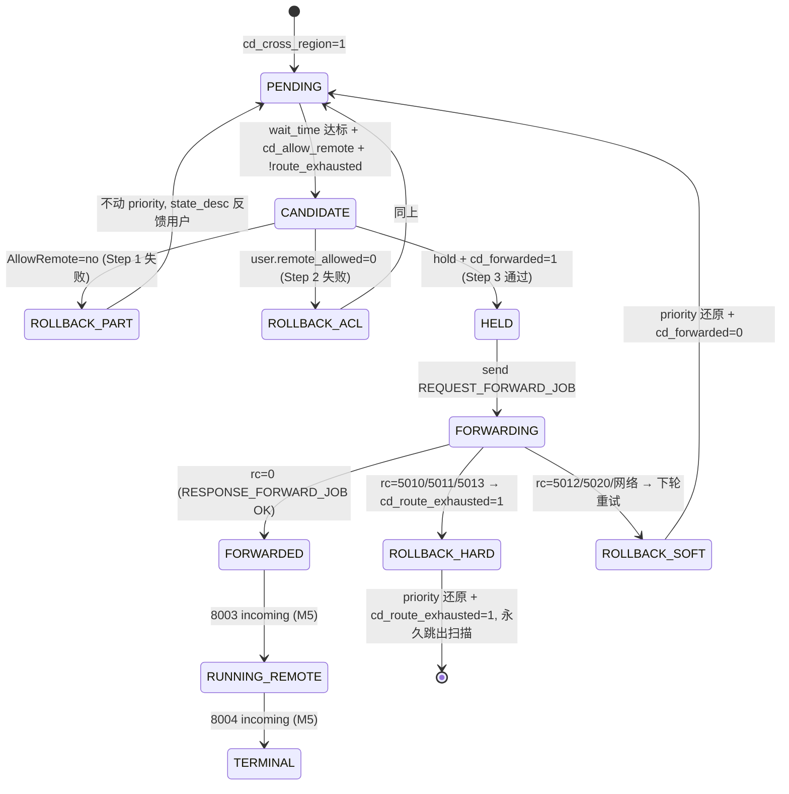

# ctld-M04 跨域转发线程 Checklist (v2.0)

> 配套: [doc/Slurmctld跨域详细设计文档MVP_v2.md](../Slurmctld跨域详细设计文档MVP_v2.md) §6
> 差异蓝图: [doc/跨域调度详设-差异变更说明.md](../跨域调度详设-差异变更说明.md) §1.7
> 依赖: ctld-M01（msg_type / payload）/ ctld-M02（broker_host/port、scan_interval、max_handle 配置 + partition.cd_allow_remote）/ ctld-M03（cd_* 字段含 cd_route_exhausted）
> 下游: ctld-M05 / ctld-M06 / ctld-M11

> **v1.5 → v2.0 关键变化**:
> 1. **模块文件重命名**：`cross_domain.{c,h}` → `cross_region.{c,h}`（与设计文档 §6 一致）
> 2. **删除路由二次校验** Step（broker 承担）；删除 `cd_partition_allows_app` 调用（应用白名单下沉到 broker）；删除 `cd_phys_cross_region_has_capacity` 调用（在途限流下沉到 broker `cap_check.c`）
> 3. **扫描过滤新增** `!cd_route_exhausted` 短路 + 改用 `partition.cd_allow_remote==1`（替代 v1.5 "SendTo 已解析"）
> 4. **Step 顺序重排**：hold (`priority=0`) 推迟到所有 check 通过后才执行；Step 1=`AllowRemote`、Step 2=用户 ACL、Step 3=`hold + cd_forwarded=1`、Step 4/5=无锁 RPC、Step 6=分流回滚
> 5. **`_build_forward_msg` 大幅瘦身**：从 9 字段+`job_desc` clone 缩为 6 个原子字段（删 target_cluster/target_partition/account/job_desc，加 src_cluster_name/src_partition）
> 6. **失败回滚分流**：新增 `cd_revert_forward_hard()`（broker 5010/5011/5013 → 置 `cd_route_exhausted=1`）vs `cd_revert_forward()`（5012/5020 → 软重试）
> 7. **HOLD 时不再写** `cd_remote_cluster_name` / `cd_remote_partition_name`（由 broker 首次状态包回写，见 ctld-M05）
> 8. **生命周期 hook 改名**：`cross_region_init()` / `cross_region_fini()` / `cross_region_reconfig()`

---

## 1. 模块目标

ctld 启动一个后台线程 `cd_thread`：

- **主扫描** 周期可调（默认 5s，由 `CrossRegionScanInterval` 控制），全表扫描候选作业
- **次级 tick** 每 1s 检查 `cd_tick_scan_cancelled`（反向取消，见 ctld-M06）+ `cd_tick_check_orphans`（broker 心跳）

候选作业过滤条件（v2.0）：
```
cd_cross_region == 1
&& !cd_forwarded
&& !cd_route_exhausted          ★ v2.0 新增短路
&& IS_JOB_PENDING && priority > 0
&& wait_time 达标
&& part_ptr->cd_allow_remote == 1   ★ v2.0 (替代 v1.5 SendTo 解析)
```

命中后 hold + 无锁调 broker `REQUEST_FORWARD_JOB(8001)`，等回 `RESPONSE_FORWARD_JOB(trace_id)` 后写回 `cd_remote_trace_id`；按返回码分流硬/软回滚。

## 2. 接口契约

### 2.1 公开头 `src/slurmctld/cross_region.h`

```c
#ifdef __METASTACK_NEW_CROSS_DOMAIN
extern int  cross_region_init(void);
extern void cross_region_fini(void);
extern void cross_region_reconfig(void);

/* RPC handler (M5 实现) */
extern int  handle_broker_update_remote_state(slurm_msg_t *msg);
extern int  handle_broker_terminal_state(slurm_msg_t *msg);

/* update_job 入口拦截 (M6 调) */
extern int  cross_region_check_update_block(job_record_t *job_ptr,
                                             job_desc_msg_t *job_specs,
                                             uid_t caller_uid);
extern int  cross_region_check_update_reset(job_record_t *job_ptr,    /* ★ v2.0 新增 */
                                             job_desc_msg_t *job_specs,
                                             uid_t caller_uid);

/* 工具 */
extern bool cd_user_allows_remote(job_record_t *job_ptr);            /* 读 assoc/user.remote_allowed */
extern void cd_mark_route_exhausted(job_record_t *job_ptr,           /* ★ v2.0 新增 */
                                    const char *reason);

/* v2.0 已删:
 *   bool cd_partition_allows_app(...)       (应用白名单下沉到 broker)
 *   bool cd_phys_cross_region_has_capacity(...) (容量下沉到 broker)
 */

extern char *cd_strerror(int rc);
#endif
```

### 2.2 内部常量

```c
#define CD_DEFAULT_SCAN_INTERVAL_SEC       5
#define CD_DEFAULT_MAX_HANDLE_PER_ROUND    500
#define CD_TICK_INTERVAL_SEC               1   /* 次级 tick (cancel / orphan) */
#define CD_BROKER_RPC_TIMEOUT_SEC          30
```

### 2.3 状态机（v2.0）



### 2.4 Lock 顺序

参考 [src/slurmctld/locks.h](../../src/slurmctld/locks.h)：

- Phase A (`cd_tick_scan_pending`): `job=R, part=R`（读 `cd_allow_remote`）
- Phase B (`cd_handle_pending_job_locked`): `job=W, part=R`（每个 jobid 独立持锁，RPC 调用前必须释锁）

---

## 3. 触及文件

| 文件 | 改动 |
|---|---|
| `src/slurmctld/cross_region.h` | **新增**（v1.5 `cross_domain.h` 改名） |
| `src/slurmctld/cross_region.c` | **新增**（v1.5 `cross_domain.c` 改名 + 大幅重构）约 800 LoC |
| [src/slurmctld/Makefile.am](../../src/slurmctld/Makefile.am) | `slurmctld_SOURCES` 追加 |
| [src/slurmctld/controller.c](../../src/slurmctld/controller.c) | `slurm_thread_create(_purge_files_thread)` 之后调 `cross_region_init()`；`slurmctld_shutdown()` 顶部调 `cross_region_fini()`；reconfig 路径调 `cross_region_reconfig()` |

---

## 4. Checklist

### 4.1 头文件 + 骨架

- [ ] M4-1 新建 `src/slurmctld/cross_region.h`：声明 §2.1 全部 extern + 内部常量；全文用 `#ifdef __METASTACK_NEW_CROSS_DOMAIN` 包裹
- [ ] M4-2 新建 `src/slurmctld/cross_region.c`：file-level header（GPL 头 + 模块说明 + ifdef 块）+ 全局 `cd_thread_id` / `cd_running` / `cd_init_lock`

### 4.2 生命周期

- [ ] M4-3 实现 `cross_region_init()`（详见 v2 设计 §6.3）：
    - 检查 `slurm_conf.cross_region_enabled`，0 则直接 return SUCCESS
    - 检查 `slurm_conf.broker_host` / `broker_port`，缺失则 `error()` + return `SLURM_ERROR`（注意是 error 不是 fatal，避免 ctld 启动失败）
    - `slurm_thread_create(&cd_thread_id, _cd_thread, NULL)`
    - `info("cross_region: thread started, broker=%s:%u, wait_time=%us")`
- [ ] M4-4 实现 `cross_region_fini()`：
    - `cd_running = false`
    - `pthread_join(cd_thread_id, NULL)`（cd_thread 主循环 1s 唤醒一次，最多 1s 退出）
    - `info("cross_region: thread stopped")`
- [ ] M4-5 实现 `cross_region_reconfig()`：
    - `enabled` NO→YES：`cross_region_init()`
    - `enabled` YES→NO：`cross_region_fini()`
    - 其它键 tick 自动采新值

### 4.3 主循环 `_cd_thread`

- [ ] M4-6 实现循环（详见 v2 设计 §6.4）：
    - 每秒唤醒一次：`sleep(CD_TICK_INTERVAL_SEC)`
    - 主扫描周期可调：从 `slurm_conf.cross_region_scan_interval` 读，默认 5s
    - 主扫描达点时调 `cd_tick_scan_pending()`
    - 每秒调 `cd_tick_scan_cancelled()`（M6 实现）+ `cd_tick_check_orphans()`

### 4.4 全表扫描 `cd_tick_scan_pending` (★ v2.0 简化)

- [ ] M4-7 Phase A 持锁 `{job=R, part=R}`（读 `cd_allow_remote` 必须持 part=R）
- [ ] M4-8 遍历 `job_list`，按 §1 6 个过滤条件依次短路：
    ```c
    if (job_ptr->cd_cross_region != 1)   continue;   /* 绝大多数作业 */
    if (job_ptr->cd_forwarded)           continue;
    if (job_ptr->cd_route_exhausted)     continue;   /* ★ v2.0 短路 */
    if (!IS_JOB_PENDING(job_ptr))        continue;
    if (job_ptr->priority == 0)          continue;
    if (!job_ptr->details
        || (now - job_ptr->details->submit_time) < (time_t)wait)
        continue;
    part_record_t *phys = job_ptr->part_ptr;
    if (!phys || !phys->cd_allow_remote) continue;   /* ★ v2.0: 替代 SendTo */
    /* v2.0 已删: SendTo / cd_remote_cluster / cd_remote_partition 三联校验 */
    ```
- [ ] M4-9 命中入 `to_handle` 列表（仅复制 `job_id`，不持锁出循环）；分批上限 `cross_region_max_handle_per_round`（默认 500）
- [ ] M4-10 释 read_lock 后 Phase B 串行处理 `to_handle`，每个调 `cd_handle_pending_job_locked(jid)`
- [ ] M4-11 每处理一个 jobid 检查 `cd_running`，false 时尽早退出（保证 fini 不被拖）

### 4.5 单 job 处理 `cd_handle_pending_job_locked` (★ v2.0 Step 重排)

- [ ] M4-12 write_lock 内 `{job=W, part=R}`：
    - 重新 `find_job_record(jid)` 二次校验：`cd_cross_region==1 && !cd_forwarded && IS_JOB_PENDING && priority>0`
    - 任一不满足则 unlock + return（候选可能在 Phase A→Phase B 间隙被本地起来 / cancel）
- [ ] M4-13 **Step 1**：`find_part_record(job_ptr->partition)` 复检 `cd_allow_remote`：
    ```c
    if (!phys || !phys->cd_allow_remote) {
        unlock_slurmctld(job_write_lock);
        cd_revert_for_partition_disallow(job_id);   /* 不动 priority */
        return;
    }
    ```
- [ ] M4-14 **Step 2**：调 `cd_user_allows_remote(job_ptr)`（读 `assoc->remote_allowed` / `user->remote_allowed`，详见 §4.6）：
    ```c
    if (!cd_user_allows_remote(job_ptr)) {
        unlock_slurmctld(job_write_lock);
        cd_revert_for_acl_failed(job_id);           /* 不动 priority */
        return;
    }
    ```
- [ ] M4-15 **Step 3**：所有 check 通过 → 唯一会动 priority 的点：
    ```c
    job_ptr->priority      = 0;
    job_ptr->state_reason  = WAIT_HELD_USER;
    xfree(job_ptr->state_desc);
    job_ptr->state_desc    = xstrdup("CrossRegionForwarding");
    job_ptr->cd_forwarded  = 1;
    /* ★ v2.0: 此处 NOT 写 cd_remote_cluster_name / cd_remote_partition_name,
     *         由 broker 首次状态包回写 (M5 §7.3) */
    ```
- [ ] M4-16 **Step 4**：调 `_build_forward_msg(job_ptr)` 拷快照（v2 瘦身字段）；释 write_lock；`schedule_job_save()`
- [ ] M4-17 **Step 5**：无锁调 `cd_send_forward_to_broker(req)` → 详见 §4.7
- [ ] M4-18 **Step 6**：按 broker 返回码分流（v2.0 关键变化）：
    ```c
    if (rc != SLURM_SUCCESS) {
        switch (rc) {
        case ESLURM_CR_NO_VIABLE_ROUTE:        /* 5010 */
        case ESLURM_CR_TEST_ONLY_REJECTED:     /* 5011 */
        case ESLURM_CR_ALL_ROUTES_EXHAUSTED:   /* 5013 */
            cd_revert_forward_hard(job_id, rc);   /* ★ 置 cd_route_exhausted=1 */
            break;
        case ESLURM_CR_CAP_FULL_SOFT_WAIT:     /* 5020 */
        case ESLURM_CR_TEST_ONLY_TIMEOUT:      /* 5012 */
        default:
            cd_revert_forward(job_id, rc);        /* 软重试 */
            break;
        }
    }
    ```

### 4.6 用户 ACL `cd_user_allows_remote()` (v2.0 大幅简化)

- [ ] M4-19 实现 `cd_user_allows_remote(job_ptr)`（详见 v2 设计 §6.7.1）：
    - 持 `assoc_mgr_lock` (`assoc=R, user=R`)
    - 优先看 `assoc->remote_allowed`（粒度更细）
    - fallback 看 `user->remote_allowed`（通过 `assoc_mgr_fill_in_user`）
    - 释锁后 return
- [ ] M4-20 **不再读** `user/assoc.comment` 子串；v1.5 `cd_partition_allows_app()` 函数全删（v2 设计 §6.7.2 已删除整节）

### 4.7 `_build_forward_msg` (★ v2.0 大幅瘦身)

- [ ] M4-21 实现 `_build_forward_msg(job_ptr)`（详见 v2 设计 §6.10）：
    ```c
    forward_job_msg_t *req = xmalloc(sizeof(*req));
    req->src_job_id        = job_ptr->job_id;
    req->src_uid           = job_ptr->user_id;
    req->src_gid           = job_ptr->group_id;
    req->src_user_name     = xstrdup(job_ptr->user_name);
    req->src_cluster_name  = xstrdup(slurm_conf.cluster_name);  /* ★ v2.0 新增 */
    req->src_partition     = xstrdup(job_ptr->partition);       /* ★ v2.0: 本地 partition */
    req->src_work_dir      = xstrdup(job_ptr->details ? job_ptr->details->work_dir : "");
    req->script_path       = xstrdup_printf("%s/run.sh.cd_orig", req->src_work_dir);
    req->cd_app_name       = xstrdup(job_ptr->cd_app_name ?: "");
    cd_dump_job_script_locked(job_ptr, req->script_path);
    return req;
    /* v2.0 已删: target_cluster / target_partition / account / job_desc clone */
    ```
- [ ] M4-22 实现 `cd_dump_job_script_locked()`：复用 [src/slurmctld/job_mgr.c](../../src/slurmctld/job_mgr.c) `get_job_script()` 已有逻辑把内存脚本写盘到 `src_work_dir/run.sh.cd_orig`

### 4.8 RPC 出站 `cd_send_forward_to_broker`

- [ ] M4-23 实现 RPC 调用：
    - `slurm_set_addr(&addr, slurm_conf.broker_port, slurm_conf.broker_host)`
    - `slurm_msg_t_init(&req_msg)`；`req_msg.msg_type = REQUEST_FORWARD_JOB`；`req_msg.protocol_version = SLURM_PROTOCOL_VERSION`；`req_msg.data = req`
    - `slurm_send_recv_msg(&addr, &req_msg, &resp_msg, CD_BROKER_RPC_TIMEOUT_SEC)`
    - 校验 `resp_msg.msg_type == RESPONSE_FORWARD_JOB`，否则视为失败
- [ ] M4-24 RPC 成功路径：write_lock 短锁内 `xfree(jp->cd_remote_trace_id); jp->cd_remote_trace_id = xstrdup(resp->trace_id)`
- [ ] M4-25 用完 `slurm_free_msg_members(&resp_msg)`，无内存泄漏

### 4.9 失败回滚（4 个变体，★ v2.0 新增 hard）

- [ ] M4-26 实现 `_cd_revert_locked(job_ptr, mark_exhausted, reason_fmt, ...)` 内部 helper（详见 v2 设计 §6.12.1）：
    - 清 `cd_forwarded=0`
    - 还原 priority：从 `job_ptr->details->priority_array[0]` 恢复，兜底 `priority=1`
    - 写 state_reason / state_desc
    - xfree `cd_remote_cluster_name` / `cd_remote_partition_name` / `cd_remote_trace_id`
    - 若 `mark_exhausted` 则置 `cd_route_exhausted=1`
- [ ] M4-27 实现 `cd_revert_forward(job_id, rc)`：write_lock 内调 `_cd_revert_locked(jp, false, "CrossRegionRejected:%d", rc)`
- [ ] M4-28 实现 `cd_revert_forward_hard(job_id, rc)`（★ v2.0 新增）：
    - write_lock 内调 `_cd_revert_locked(jp, true, "CrossRegionExhausted:%d (broker rejected)", rc)`
    - 调用 `_cd_dbd_modify_route_exhausted(job_id)` 落库（DBD 通道见 ctld-M12）
    - `info("cross_region: job %u marked route_exhausted=1 (rc=%d)")`
- [ ] M4-29 实现 `cd_revert_for_partition_disallow(job_id)`：write_lock 内仅写 `state_desc="CrossRegionPartitionDisallow"`，**不动 priority**
- [ ] M4-30 实现 `cd_revert_for_acl_failed(job_id)`：write_lock 内仅写 `state_desc="CrossRegionAclDenied"`，**不动 priority**
- [ ] M4-31 实现 `cd_mark_route_exhausted(job_ptr, reason)` 公开 API：供 update_job 等其它路径调用，详见 ctld-M06

### 4.10 broker 心跳监控 `cd_tick_check_orphans`

- [ ] M4-32 实现简单 ping：60s 一次 `slurm_open_msg_conn(broker_addr)`，失败累计阈值（`CD_BROKER_DEAD_THRESHOLD_SEC=600`）超时仅 `error()` 日志，**不降级业务**

### 4.11 集成点

- [ ] M4-33 [src/slurmctld/Makefile.am](../../src/slurmctld/Makefile.am) `slurmctld_SOURCES` 追加 `cross_region.c cross_region.h`
- [ ] M4-34 [src/slurmctld/controller.c](../../src/slurmctld/controller.c) `#include "src/slurmctld/cross_region.h"`；在 `slurm_thread_create(_purge_files_thread)` 之后、`_slurmctld_background()` 之前调 `cross_region_init()`
- [ ] M4-35 同文件 `slurmctld_shutdown()` 顶部、`slurm_cond_signal(&shutdown_cond)` 之后调 `cross_region_fini()`
- [ ] M4-36 同文件 reconfig 路径（`_handle_reconfig_req()` / `_run_secondary_signals_thread`）末尾调 `cross_region_reconfig()`

### 4.12 单元自测

- [ ] M4-37 编译通过 + ctld 启动日志看到 `info("cross_region: thread started, broker=127.0.0.1:8442, wait_time=300s")`
- [ ] M4-38 不开 `CrossRegionEnabled` 启动 ctld，cd_thread 不创建（log "cross_region: disabled by slurm.conf"）
- [ ] M4-39 单机自环（M11 联调最简版）：sbatch --allow-remote → 5s 内 `squeue` 看到 `priority=0` + `state_desc=CrossRegionForwarding`
- [ ] M4-40 mock broker 返回 5010 NO_VIABLE_ROUTE：`squeue` 看到 priority 还原 + `state_desc=CrossRegionExhausted:5010`，`scontrol show job` 看到 `RouteExhausted=YES`
- [ ] M4-41 mock broker 返回 5012 TIMEOUT：priority 还原但 `cd_route_exhausted=0`，下轮扫描重试

---

## 5. 验收标准

1. cd_thread 启动 + 关停干净（valgrind 不挂、`pthread_join` 正常返回）
2. broker 不可达时 cd_thread 仍然循环，每个 scan_interval 重试同一作业（`cd_revert_forward` 软重试路径）
3. broker 返回 5010/5011/5013 时 `cd_route_exhausted=1` 一次性钉死，下轮扫描跳过
4. broker 返回 5012/5020 时下轮扫描重试，不置 `cd_route_exhausted`
5. partition `AllowRemote=no` 时作业留在 PENDING + state_desc 反馈用户，priority 不变
6. broker 端 8001 入站日志 + ctld 端 8002 出站日志成对
7. 百万级队列下 Phase A 持锁时间 < 100ms（设计文档 §12.2 性能要求）

## 6. 风险

- **风险 1**: hold 后 RPC 卡 30s 期间内用户取消作业。**降级**: rollback 也走 write_lock + 二次校验 `IS_JOB_PENDING`，不会撞已变 CANCELLED 的作业；scancel 反向传播由 `cd_tick_scan_cancelled` 异步兜底
- **风险 2**: `slurm_send_recv_msg` 对 munge socket 的支持。**降级**: 走 [src/slurmbrokerd/listener.c](../../src/slurmbrokerd/listener.c) 暴露的 8442 端口；若标准 API 走不通，降级为手动 `slurm_open_msg_conn + slurm_msg_sendto + slurm_msg_recvfrom_timeout`
- **风险 3**: v2 删除 `target_cluster` 字段，broker 端旧版本期望该字段会读到空 → 路由失败。**降级**: ctld 与 broker **必须同步升级**，不允许 v1.5 ctld + v2.0 broker 或反之；通过 `protocol_version` 双侧守恒
- **风险 4**: `cd_user_allows_remote()` 走 `assoc_mgr_fill_in_user` 接口在 24.05.8 签名不一致。**降级**: 替换为 `assoc_mgr_get_user_rec_uid()` 或私有 helper；以 `src/common/assoc_mgr.h` 实际签名为准
- **风险 5**: `_build_forward_msg` 写盘 `script_path` 失败（磁盘满）。**降级**: `cd_dump_job_script_locked` 内 `error()` 后视为 RPC 失败走 `cd_revert_forward(SLURM_ERROR)` 软重试
- **风险 6**: `cd_route_exhausted=1` 钉死后无法重投。**降级**: 通过 `scontrol update jobid=<JID> CdRouteExhausted=0` 由 root/operator 重置（详见 ctld-M06 §8.2）
