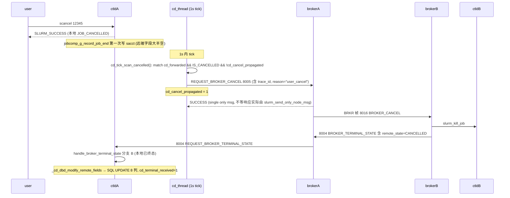

# ctld-M06 scancel 反向传播 + scontrol update 拦截 Checklist (v2.0)

> 配套: [doc/Slurmctld跨域详细设计文档MVP_v2.md](../Slurmctld跨域详细设计文档MVP_v2.md) §6.13 / §8
> 差异蓝图: [doc/跨域调度详设-差异变更说明.md](../跨域调度详设-差异变更说明.md) §1.7 / §1.9
> 依赖: ctld-M01（`REQUEST_BROKER_CANCEL` / `broker_cancel_msg_t` 含 `reason`）/ ctld-M02（broker_host）/ ctld-M03（cd_cancel_propagated 独立字段 + cd_route_exhausted_reset 字段）/ ctld-M04（cross_region.c 已就位）
> 下游: ctld-M11

> **v1.5 → v2.0 关键变化**:
> 1. **反向取消改为异步 tick**：v1.5 在 `update_job_str()` 同步发 RPC，v2.0 改为 `cd_tick_scan_cancelled()` 在跨域线程内每秒一轮异步触发（避免 scancel 同步阻塞用户）
> 2. **`cd_cancel_propagated` 是独立字段**（v1.5 用 `cd_forwarded` bit1 兼任，v2 设计文档 §4.1 已恢复独立字段）
> 3. **`broker_cancel_msg_t` 新增 `reason` 字段**：`"user_cancel"` / `"admin_cancel"` 等
> 4. **新增 `cross_region_check_update_block()`**：拦截 forwarded 作业的 partition/priority/time_limit 修改
> 5. **新增 `cross_region_check_update_reset()`**：处理 `scontrol update jobid=<JID> CdRouteExhausted=0` 重置（仅 root/operator）
> 6. **scancel 路径不动**：原生 `slurm_kill_job_msg()` → `_signal_job()` 改 `JOB_CANCELLED`，由 cd_thread 下轮 tick 异步检测并发 RPC

---

## 1. 模块目标



## 2. 接口契约

### 2.1 触发条件 (cd_tick_scan_cancelled, ★ v2.0 异步)

```c
list_itr_t *itr = list_iterator_create(job_list);
while ((job_ptr = list_next(itr))) {
    if (!IS_JOB_CANCELLED(job_ptr))           continue;
    if (!job_ptr->cd_forwarded)                continue;
    if (job_ptr->cd_cancel_propagated)         continue;   /* ★ 独立字段 */
    if (!job_ptr->cd_remote_trace_id)          continue;
    if (job_ptr->end_time
        && (time(NULL) - job_ptr->end_time) > 7 * 86400)
        continue;       /* 7 天前老作业不重试 */
    /* 收集到 to_cancel 列表 */
}
```

### 2.2 cancel RPC payload

```c
typedef struct {
    uint32_t  src_job_id;
    char     *trace_id;          /* 复用 job_ptr->cd_remote_trace_id */
    char     *reason;            /* "user_cancel" / "admin_cancel" / "timeout" 等 */
} broker_cancel_msg_t;
```

### 2.3 失败处理

- `slurm_send_only_node_msg` 失败：仅 `warning()` 日志，**不**置 `cd_cancel_propagated`，下个 tick 重试
- `slurm_send_only_node_msg` 成功：写 `cd_cancel_propagated = 1`（write_lock 短锁内）

> v2.0 用 `slurm_send_only_node_msg`（不等响应）而不是 `slurm_send_recv_rc_msg_only_one`：scancel 反向是单向通知，broker 端有自己的去重逻辑（trace_id 幂等），不依赖 ctld 同步等待响应。

### 2.4 update_job 拦截规则

```c
/* cross_region_check_update_block: forwarded 作业禁止改 partition / priority / time_limit */
if (job_ptr->cd_forwarded) {
    if (job_specs->partition && xstrcmp(job_ptr->partition, job_specs->partition))
        return ESLURM_NOT_SUPPORTED;
    if (job_specs->priority != NO_VAL && job_specs->priority != 0)
        return ESLURM_NOT_SUPPORTED;
    if (job_specs->time_limit != NO_VAL)
        return ESLURM_NOT_SUPPORTED;
}
return SLURM_SUCCESS;

/* cross_region_check_update_reset (★ v2.0 新增): 处理 CdRouteExhausted=0|1 */
if (caller_uid != 0 && caller_uid != slurm_user_id && !validate_operator(caller_uid))
    return ESLURM_ACCESS_DENIED;
if (job_specs->cd_route_exhausted_reset == 0xFF /* sentinel */)
    return SLURM_SUCCESS;
if (job_specs->cd_route_exhausted_reset == 0 && job_ptr->cd_route_exhausted) {
    job_ptr->cd_route_exhausted = 0;
    state_desc = "CrossRegionRetryByAdmin";
} else if (job_specs->cd_route_exhausted_reset == 1 && !job_ptr->cd_route_exhausted) {
    cd_mark_route_exhausted(job_ptr, "CrossRegionExhaustedByAdmin");
}
```

---

## 3. 触及文件

| 文件 | 改动 |
|---|---|
| `src/slurmctld/cross_region.c` | 实现 `cd_tick_scan_cancelled` / `cd_send_cancel_to_broker` / `cross_region_check_update_block` / `cross_region_check_update_reset` |
| [src/slurmctld/job_mgr.c](../../src/slurmctld/job_mgr.c) | `update_job()` 入口 `find_job_record` 后调 2 个 check helper |
| [src/scontrol/update_job.c](../../src/scontrol/update_job.c)（24.05 已拆分） | `parse_command_line()` 解析 `CdRouteExhausted=0|1` 写入 `job_specs->cd_route_exhausted_reset` |

---

## 4. Checklist

### 4.1 异步反向取消 `cd_tick_scan_cancelled`

- [ ] M6-1 [src/slurmctld/cross_region.c](../../src/slurmctld/cross_region.c) 实现内部数据结构：
    ```c
    typedef struct {
        uint32_t job_id;
        char    *trace_id;     /* xstrdup 出来, 用完 xfree */
    } cd_pending_cancel_t;
    ```
- [ ] M6-2 实现 `cd_tick_scan_cancelled(void)`（详见 v2 设计 §6.13）：
    - 持 `{job=R}` 读锁，遍历 `job_list`，按 §2.1 条件收集到 `to_cancel` 列表
    - 释锁后逐个调 `cd_send_cancel_to_broker(pc)` 并 xfree
- [ ] M6-3 在 `_cd_thread` 主循环（M4-6）中每秒调用 `cd_tick_scan_cancelled()`（已在 M4 列出）

### 4.2 RPC 出站 `cd_send_cancel_to_broker`

- [ ] M6-4 实现 `cd_send_cancel_to_broker(cd_pending_cancel_t *pc)`：
    ```c
    broker_cancel_msg_t req = {
        .src_job_id = pc->job_id,
        .trace_id   = xstrdup(pc->trace_id),
        .reason     = xstrdup("user_cancel"),
    };
    slurm_msg_t msg;
    slurm_msg_t_init(&msg);
    msg.msg_type = REQUEST_BROKER_CANCEL;     /* 8005 */
    msg.data     = &req;
    slurm_addr_t addr;
    slurm_set_addr(&addr, slurm_conf.broker_port, slurm_conf.broker_host);
    int rc = slurm_send_only_node_msg(&msg, &addr);
    xfree(req.trace_id); xfree(req.reason);
    ```
- [ ] M6-5 RPC 成功路径：write_lock `{job=W}` 短锁内 `find_job_record(pc->job_id)`，若存在则 `jp->cd_cancel_propagated = 1`
- [ ] M6-6 RPC 失败：`warning("cross_region: cancel propagation failed: %s")`，**不**置 `cd_cancel_propagated`，下轮重试
- [ ] M6-7 边界：5s 超时后 `slurm_send_only_node_msg` 也会返回（broker 不可达），下轮 tick 重试

### 4.3 update_job 拦截 `cross_region_check_update_block`

- [ ] M6-8 [src/slurmctld/cross_region.c](../../src/slurmctld/cross_region.c) 实现（详见 v2 设计 §8.2）：
    ```c
    extern int cross_region_check_update_block(job_record_t *job_ptr,
                                                job_desc_msg_t *job_specs,
                                                uid_t caller_uid)
    {
        if (caller_uid == 0 || caller_uid == slurm_conf.slurm_user_id)
            return SLURM_SUCCESS;   /* root / SlurmUser 不拦 */
        if (job_specs->partition
            && xstrcmp(job_ptr->partition, job_specs->partition))
            return ESLURM_NOT_SUPPORTED;
        if (job_specs->priority != NO_VAL && job_specs->priority != 0)
            return ESLURM_NOT_SUPPORTED;
        if (job_specs->time_limit != NO_VAL)
            return ESLURM_NOT_SUPPORTED;
        return SLURM_SUCCESS;
    }
    ```
- [ ] M6-9 [src/slurmctld/job_mgr.c](../../src/slurmctld/job_mgr.c) `update_job()` 入口在 `find_job_record` + write_lock 内，加 hook：
    ```c
    #ifdef __METASTACK_NEW_CROSS_DOMAIN
        if (job_ptr && job_ptr->cd_forwarded) {
            int rc = cross_region_check_update_block(job_ptr, job_specs, uid);
            if (rc != SLURM_SUCCESS) {
                unlock_slurmctld(job_write_lock);
                if (send_msg) slurm_send_rc_msg(msg, rc);
                return rc;
            }
        }
    #endif
    ```

### 4.4 ★ v2.0 新增 `cross_region_check_update_reset`

- [ ] M6-10 [src/slurmctld/cross_region.c](../../src/slurmctld/cross_region.c) 实现（详见 v2 设计 §8.2 后半段）：
    ```c
    extern int cross_region_check_update_reset(job_record_t *job_ptr,
                                                job_desc_msg_t *job_specs,
                                                uid_t caller_uid)
    {
        if (caller_uid != 0 && caller_uid != slurm_conf.slurm_user_id
            && !validate_operator(caller_uid))
            return ESLURM_ACCESS_DENIED;
        if (job_specs->cd_route_exhausted_reset == 0xFF)
            return SLURM_SUCCESS;
        if (job_specs->cd_route_exhausted_reset == 0
            && job_ptr->cd_route_exhausted) {
            job_ptr->cd_route_exhausted = 0;
            xfree(job_ptr->state_desc);
            job_ptr->state_desc = xstrdup("CrossRegionRetryByAdmin");
            job_ptr->last_sched_eval = time(NULL);
            info("cross_region: job %u route_exhausted cleared by uid=%u",
                 job_ptr->job_id, caller_uid);
        } else if (job_specs->cd_route_exhausted_reset == 1
                   && !job_ptr->cd_route_exhausted) {
            cd_mark_route_exhausted(job_ptr, "CrossRegionExhaustedByAdmin");
        }
        return SLURM_SUCCESS;
    }
    ```
- [ ] M6-11 `update_job()` 在 M6-9 之后追加 reset hook（顺序：先 block 再 reset）：
    ```c
    #ifdef __METASTACK_NEW_CROSS_DOMAIN
        if (job_ptr) {
            int rc = cross_region_check_update_reset(job_ptr, job_specs, uid);
            if (rc != SLURM_SUCCESS) goto out;
        }
    #endif
    ```

### 4.5 scontrol 客户端解析 `CdRouteExhausted=0|1`

- [ ] M6-12 [src/scontrol/update_job.c](../../src/scontrol/update_job.c) `parse_command_line()` 中新增 keyword 识别：
    ```c
    #ifdef __METASTACK_NEW_CROSS_DOMAIN
        if (!xstrncasecmp(tag, "CdRouteExhausted", MAX(taglen, 4))) {
            if (!xstrcasecmp(val, "0") || !xstrcasecmp(val, "no")
                || !xstrcasecmp(val, "false"))
                job_msg.cd_route_exhausted_reset = 0;
            else if (!xstrcasecmp(val, "1") || !xstrcasecmp(val, "yes")
                     || !xstrcasecmp(val, "true"))
                job_msg.cd_route_exhausted_reset = 1;
            else {
                fprintf(stderr, "Invalid CdRouteExhausted value: %s\n", val);
                return -1;
            }
            update_cnt++;
        }
    #endif
    ```
- [ ] M6-13 scontrol `usage()` 帮助文本追加 `CdRouteExhausted=0|1` 一行说明

### 4.6 边界与测试

- [ ] M6-14 边界：`cd_cancel_propagated` 已置位时 `cd_tick_scan_cancelled` 直接 continue（重复 scancel 幂等）
- [ ] M6-15 边界：`slurm_conf.broker_host == NULL` 时 `cd_tick_scan_cancelled` 跳过（CrossRegionEnabled 关或配置缺失）
- [ ] M6-16 测试：跨域作业 forward 后 scancel，1s 内 ctld 日志看到 `cancel propagation` + `cd_cancel_propagated` 置位；broker 日志看到 8005 入站
- [ ] M6-17 测试：broker stop 时 scancel，原生 cancel 流程仍然成功（用户 squeue 看到 CANCELLED），ctld 日志反复 warning `cancel propagation failed`，下次 broker 起来后 1s 内自动恢复
- [ ] M6-18 测试：跨域作业 `cd_route_exhausted=1` 状态下 `scontrol update jobid=<JID> CdRouteExhausted=0`，下轮 tick 重新走转发流程
- [ ] M6-19 测试：普通用户尝试 `scontrol update jobid=<JID> CdRouteExhausted=0` 被拒（`ESLURM_ACCESS_DENIED`）
- [ ] M6-20 测试：`scontrol update jobid=<JID> partition=otherpart` 在 forwarded 作业上被拒（`ESLURM_NOT_SUPPORTED`）

---

## 5. 验收标准

1. A 端 scancel → 1s 内 broker 8005 入站 → B 端 slurm_kill_job 触发 → B 端 sacct CANCELLED
2. 重复 scancel 同一作业 → 第二次不再发 8005（cd_cancel_propagated 已置 1）
3. broker stop → A 端 scancel 仍然成功（原生 cancel 流程正常），ctld 日志反复 `cancel propagation failed`，broker 起回来后 1s 内自动重试成功
4. scancel 后 broker 8004 到达 → ctld 走分支 B 补写 cd_remote_*（详见 ctld-M05 §4.4 M5-13），sacct 远端字段齐全
5. forwarded 作业 `scontrol update jobid=N partition=other` 被拒
6. forwarded 作业 `scontrol update jobid=N priority=100` 被拒
7. `cd_route_exhausted=1` 作业 `scontrol update jobid=N CdRouteExhausted=0` 后下轮 tick 重新转发

## 6. 风险

- **风险 1**: `cd_tick_scan_cancelled` 持锁时间。**降级**: Phase A 只是 read_lock 收集 `cd_pending_cancel_t` 列表（含 xstrdup trace_id），释锁后才发 RPC；持锁时间预估 < 5ms（除非 CANCELLED 跨域作业数量 > 1k）
- **风险 2**: 7 天阈值 (`now - end_time > 7d`) 配置硬编码。**降级**: v2 设计文档未提到可配置化，本期保持硬编码；下个版本可加 `CrossRegionCancelStaleSec` 配置
- **风险 3**: scancel 抢跑后 broker 8005 到达 → broker 端发现远端作业已不存在 → broker 8004 推 remote_state=CANCELLED → ctld 分支 B 补写。这是设计期望路径
- **风险 4**: `slurm_send_only_node_msg` 不等响应，broker 端可能未实际收到。**降级**: broker 端 8005 handler 必须实现 trace_id 幂等去重（broker 详设 §6 已规定）；ctld 端通过 `cd_terminal_received` 真幂等兜底
- **风险 5**: `validate_operator` 在 24.05 签名变化。**降级**: 直接判 `caller_uid == 0 || caller_uid == slurm_user_id` 简化为只允许 root/SlurmUser，operator 留待下个版本扩展
- **风险 6**: scontrol 端 `CdRouteExhausted=` 与 24.05 已有 `Comment=` 等关键字冲突。**降级**: 严格用 `xstrncasecmp` 全词匹配，长度按 keyword 实际长度
