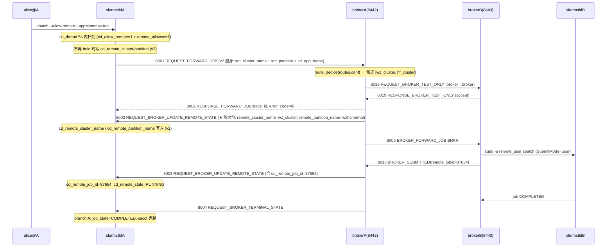

# ctld-M11 端到端联调 Checklist (v2.0)

> 配套: [doc/Slurmctld跨域详细设计文档MVP_v2.md](../Slurmctld跨域详细设计文档MVP_v2.md) §13 / §14
> 配套（broker 部署）: [doc/Broker详细设计文档MVP_v2.md](../Broker详细设计文档MVP_v2.md) §10 / §11
> 差异蓝图: [doc/跨域调度详设-差异变更说明.md](../跨域调度详设-差异变更说明.md) §1.15
> 依赖: ctld-M01..ctld-M10 全部完成 + ctld-M12（DBD job 8 列） + ctld-M13（sacctmgr remote_allowed）+ broker M16-M19（route.c / cap_check.c / test-only）
> 下游: 灰度上线

> **v1.5 → v2.0 关键变化**:
> 1. **slurm.conf 变更**：`CrossRegionEnabled=YES` 等 6 个键；删除 `BrokerForwardCluster` / `BrokerForwardPartition`
> 2. **broker.conf 变更**：新增 `RoutesFile=/etc/slurm-broker/routes.conf` / `SubmitMode=user` / `TestOnlyTimeoutSec=10`；删除 `DefaultRemotePartition`
> 3. **新增 routes.conf** 必须部署到 broker 端 `/etc/slurm-broker/routes.conf`
> 4. **partition 配置改为 `AllowRemote=yes`**（替代 v1.5 `SendTo=`）
> 5. **用户授权改为 sacctmgr `remote_allowed=true`**（替代 v1.5 `comment=allow_remote`）
> 6. **新增异常路径测试**：NO_VIABLE_ROUTE 硬不可达 + sacctmgr remote_allowed 切换 + scontrol update CdRouteExhausted=0

---

## 1. 模块目标

把 ctld + broker 两端跑成一条完整的跨域闭环（v2.0 版），验证：



## 2. 拓扑准备

### 2.1 单机自环（M11.2）

ctld + broker 同机，broker 配 `RemoteBrokerHost=127.0.0.1`、`RemoteBrokerPort=8443`，`8442` 自环，A 集群打回 A 自身。

### 2.2 双机（M11.3）

| 主机 | 角色 |
|---|---|
| A.example.com | slurmctld + slurmd + brokerA |
| B.example.com | slurmctld + slurmd + brokerB |

A 端 broker 配 `RemoteBrokerHost=B.example.com`；B 端 `RemoteBrokerHost=A.example.com`。

### 2.3 配置文件 (v2.0)

`/etc/slurm/slurm.conf`（A 集群额外段，v2.0）：

```
# === 跨域开关 + 调度参数 ===
CrossRegionEnabled=YES
CrossRegionWaitTime=10              # 测试用 10s, 生产用 300s
CrossRegionScanInterval=5
CrossRegionMaxHandlePerRound=500

# === broker 入口 ===
BrokerHost=127.0.0.1
BrokerPort=8442

# === partition 跨域开关 (v2.0 替代 SendTo) ===
PartitionName=xahcnormal Nodes=node[001-100] State=UP \
    AllowRemote=yes
```

`/etc/slurm-broker/broker.conf`（A 集群，v2.0）：

```
ClusterName=clusterA
BrokerNodeName=brokerA

# === 远端 broker (peer) ===
RemoteCluster wz_cluster {
    RemoteBrokerHost = B.example.com
    RemoteBrokerPort = 8443
}

# === ★ v2.0 路由配置 ===
RouteSource=file
RoutesFile=/etc/slurm-broker/routes.conf
RoutesReloadOnSighup=yes
TestOnlyTimeoutSec=10

# === ★ v2.0 远端提交身份 (D2) ===
SubmitMode=user      # user = sudo -n -u remote_user sbatch (默认)
                     # root = sbatch --uid=<remote_uid> --gid=<remote_gid>

# === 持久化与运维 ===
StateSaveLocation=/var/spool/slurm/broker
StageSshKey=/etc/slurm/broker_id_rsa
StageSshUser=slurm
LookupSoftwareScript=/etc/slurm/lookup_software.sh

# === 用户映射 ===
LocalUser alice@clusterB = alice@clusterA
LocalUser bob@clusterB   = bob@clusterA
```

`/etc/slurm-broker/routes.conf`（A 集群，★ v2.0 新增）：

```ini
[Route route_xahc_to_wz]
LocalCluster      = clusterA
LocalPartition    = xahcnormal
RemoteCluster     = wz_cluster
RemotePartitions  = wzhcnormal, wzlarge
AllowApps         = lammps-test, lammps-2Aug2023-intelmpi2018, vasp
Priority          = 200
MaxInflight       = 100

[Route route_xahc_to_hf]
LocalCluster      = clusterA
LocalPartition    = xahcnormal
RemoteCluster     = hf_cluster
RemotePartitions  = hfcnormal
AllowApps         = vasp
Priority          = 100
MaxInflight       = 50
```

`sacctmgr remote_allowed` 配置（★ v2.0 新增，详见 ctld-M13）：

```bash
sacctmgr modify user alice set remote_allowed=true
sacctmgr modify user bob   set remote_allowed=true
sacctmgr show user format=user,account,remote_allowed
```

---

## 3. Checklist

### 3.1 编译验证 (M11.1)

- [ ] M11-1 `cd /Volumes/yuanhao/sugon/版本/3.4/代码/metastack_test && ./configure && make -j` 全树通过
- [ ] M11-2 三个二进制都生成：
    - `src/slurmctld/slurmctld`
    - `src/slurmbrokerd/slurmbrokerd`
    - `src/slurmbrokerd/inject_broker_forward`
- [ ] M11-3 `make install` 通过；`scontrol --version` / `sbatch --version` / `squeue --version` / `slurmbrokerd --help` / `sacctmgr --version` 全部正常
- [ ] M11-4 `sbatch --help | grep -E "allow-remote|^\s+--app="` 看到 2 行帮助
- [ ] M11-5 `squeue --help | grep remote` 看到帮助
- [ ] M11-6 `scontrol --help | grep CdRouteExhausted` 看到帮助
- [ ] M11-7 `sacctmgr --help | grep remote_allowed` 看到帮助（ctld-M13）

### 3.2 单机自环 (M11.2)

- [ ] M11-8 部署 `routes.conf` 到 `/etc/slurm-broker/routes.conf`，权限 `0640 root:slurm`
- [ ] M11-9 启动 ctld + broker（同一节点）：`systemctl start slurmctld slurmbrokerd`
- [ ] M11-10 `journalctl -u slurmctld | grep cross_region` 看到 `cross_region: thread started, broker=127.0.0.1:8442, wait_time=10s`
- [ ] M11-11 `journalctl -u slurmbrokerd | grep -E "listener|route_load"` 看到 8442 / 8443 都监听 + `route_load: loaded 2 routes from /etc/slurm-broker/routes.conf`
- [ ] M11-12 `sacctmgr modify user alice set remote_allowed=true` 设置成功
- [ ] M11-13 提交跨域作业：
    ```bash
    cat > /tmp/cd-hello.sh <<'EOF'
    #!/bin/bash
    #SBATCH --allow-remote
    #SBATCH --app=lammps-test
    echo hello-cross-region
    sleep 30
    EOF
    sbatch /tmp/cd-hello.sh
    ```
- [ ] M11-14 5s 内 `squeue --remote -u alice` 看到 `REMOTE_CLUSTER=wz_cluster REMOTE_PARTITION=wzhcnormal`（自环情况下 forward 回 clusterA 自身的另一个 partition）；ctld 日志看到 `cross_region: forwarded job=N to broker` + broker 日志看到 `route_decide: job N → 1 candidate (wz_cluster)`
- [ ] M11-15 broker 日志看到 8001 入站、8018/8019 test-only 探测、8002 出站 (error_code=0)、8003 出站
- [ ] M11-16 `scontrol show job <id>` 看到完整跨域 6~7 行（含 `RouteExhausted=NO`、`RemoteCluster=wz_cluster`、`RemotePartition=wzhcnormal`、`RemoteJobId` 等）
- [ ] M11-17 30s 后作业 COMPLETED，`squeue` 列表清空，`sacct -j <id> -o JobID,State,Remote_Cluster,Remote_JobId,Remote_State,Remote_AllocTRES,Remote_ExitCode` 看到 COMPLETED + Remote_State=COMPLETED + 完整 8 字段

### 3.3 双机 (M11.3)

- [ ] M11-18 双机 ssh 互通 + munge key 一致 + broker_id_rsa 写入对端 authorized_keys
- [ ] M11-19 双机各自部署 `routes.conf` + `broker.conf` + `slurm.conf` + sacctmgr remote_allowed
- [ ] M11-20 A 端 alice 提交：`sbatch --allow-remote --app=lammps-test /tmp/cd-hello.sh`
- [ ] M11-21 5s 内 A `squeue --remote -u alice` 看到 `REMOTE_CLUSTER=wz_cluster REMOTE_JOBID=<B 端真实 jobid>`
- [ ] M11-22 B 端 `squeue` 看到 alice 的真实作业（brokerB sudo 提交）
- [ ] M11-23 B 端作业完成 → A 端 `squeue --remote -u alice` 看到状态变 COMPLETED；A 端 `scontrol show job <id>` 看到 RemoteEndTime / RemoteExitCode 真实值
- [ ] M11-24 A 端 `sacct -j <id>` 看到完整 8 字段；B 端 `sacct -j <B-id>` 同样 COMPLETED

### 3.4 scancel 反向 (M11.4)

- [ ] M11-25 A 端再次提交跨域作业，等 5s 让其转发到 B 端 + 进入 RUNNING
- [ ] M11-26 A 端 `scancel <A-jobid>` → 1s 内 cd_thread 触发 `cd_tick_scan_cancelled` → ctld 日志看到 `cancel propagation` + `cd_cancel_propagated=1`
- [ ] M11-27 broker A 日志看到 8005 入站；broker B 日志看到 8016 BRKR 帧入站
- [ ] M11-28 B 端 `slurm_kill_job` 触发 → B 端 `sacct -j <B-id>` 看到 CANCELLED
- [ ] M11-29 A 端 `sacct -j <A-id>` 看到 State=CANCELLED + Remote_State=CANCELLED + Remote_ExitCode=15:0（由 broker 8004 注入并通过分支 B 补写远端字段）
- [ ] M11-30 重复 scancel 同一作业 → 第二次 broker 日志不再看到 8005 入站（cd_cancel_propagated 幂等）

### 3.5 ★ v2.0 异常路径

#### 3.5.1 NO_VIABLE_ROUTE (硬不可达)

- [ ] M11-31 删除 routes.conf 中 `route_xahc_to_wz` + `route_xahc_to_hf` 后 `sbroker reload` (broker SIGHUP)
- [ ] M11-32 A 端 sbatch 一个 `--allow-remote --app=lammps-test`，等 5s 让 cd_thread 扫描
- [ ] M11-33 ctld 日志看到 `cross_region: job N marked route_exhausted=1 (rc=5010)`，broker 日志看到 `route_decide: NO_ROUTE for job N (src_cluster=clusterA, src_partition=xahcnormal, app=lammps-test)`
- [ ] M11-34 `scontrol show job <id>` 看到 `RouteExhausted=YES` + `state_desc=CrossRegionExhausted:5010`
- [ ] M11-35 该作业 priority 还原（squeue 看到非 0），但下轮扫描跳过（看 ctld debug2 日志确认 `cd_route_exhausted=1` 短路）
- [ ] M11-36 sacct -j <id> -o JobID,State,Remote_Cluster 看到 State=PENDING + Remote_Cluster 为空（因为从未 forward 成功）

#### 3.5.2 cd_route_exhausted 重置

- [ ] M11-37 恢复 routes.conf 后 `sbroker reload`
- [ ] M11-38 A 端 `scontrol update jobid=<JID> CdRouteExhausted=0`（root 用户）
- [ ] M11-39 ctld 日志看到 `cross_region: job N route_exhausted cleared by uid=0`
- [ ] M11-40 5s 内 cd_thread 重新转发，`squeue --remote` 看到 REMOTE_CLUSTER=wz_cluster

#### 3.5.3 sacctmgr remote_allowed 切换

- [ ] M11-41 `sacctmgr modify user alice set remote_allowed=false`
- [ ] M11-42 alice 提交 `sbatch --allow-remote --app=lammps-test` → cd_thread 扫描 Step 2 ACL 失败
- [ ] M11-43 `scontrol show job <id>` 看到 `state_desc=CrossRegionAclDenied`，priority 不变
- [ ] M11-44 `sacctmgr modify user alice set remote_allowed=true` 后下轮 tick（5s）作业自动转发

#### 3.5.4 partition AllowRemote=no 切换

- [ ] M11-45 `scontrol update partition=xahcnormal AllowRemote=no`
- [ ] M11-46 alice 提交 `sbatch --allow-remote --app=lammps-test` → cd_thread 扫描 Phase A 不命中
- [ ] M11-47 `scontrol update partition=xahcnormal AllowRemote=yes` 后下轮 tick 作业自动转发

#### 3.5.5 broker 不可达时

- [ ] M11-48 broker B stop，A 端 sbatch --allow-remote：cd_thread 转发后 broker 端 test-only 失败（远端 broker 不可达），返回 5012 TIMEOUT
- [ ] M11-49 ctld 日志看到 `cross_region: cd_revert_forward (5012)` 软重试，作业 priority 还原 + `cd_route_exhausted=0`
- [ ] M11-50 broker B 起回来，A 端 5s 内 cd_thread 重新扫描，链路恢复
- [ ] M11-51 broker A stop，A 端 scancel 仍然成功（原生 cancel 流程），ctld 日志反复 warning `cancel propagation failed`，broker A 起回来后 1s 内自动重试成功

### 3.6 SubmitMode 模式切换

- [ ] M11-52 默认 `SubmitMode=user`：B 端 broker 通过 sudo 切换到 alice 提交，B 端 `squeue` 看到 alice 用户
- [ ] M11-53 切到 `SubmitMode=root` (broker 重启)：B 端 broker 以 SlurmUser 身份调 `sbatch --uid=<alice_uid> --gid=<alice_gid>`，B 端 `squeue` 看到 alice 用户

### 3.7 回归

- [ ] M11-54 不带 --allow-remote 提交 100 个普通作业，全部正常完成；`grep cross_region /var/log/slurm/slurmctld.log` 无干扰输出
- [ ] M11-55 `scontrol reconfigure` 后 `CrossRegionScanInterval` 改值实时生效（不重启 ctld）；`AllowRemote=yes/no` 切换实时生效
- [ ] M11-56 `valgrind --leak-check=full slurmctld` 跑 5 分钟跨域作业 + cancel + reconfigure，无新增泄漏（ctld-M03 的 5 个 xfree 都被 hit）
- [ ] M11-57 ctld 重启后 state_save 跨域字段全部恢复（`cd_route_exhausted` / `cd_cancel_propagated` / `cd_terminal_received` / 远端 8 字段）

### 3.8 升级路径验证

- [ ] M11-58 准备 v1.5 数据库（含 `user.comment LIKE '%allow_remote%'` 的用户记录）
- [ ] M11-59 升级 SlurmDBD 到 v2.0：`as_mysql_check_tables()` 自动 ALTER TABLE 加 `remote_allowed` 列
- [ ] M11-60 跑 ctld-M13 §15.3 SQL 迁移脚本，把 v1.5 comment 子串迁移到 v2.0 `remote_allowed` 列
- [ ] M11-61 老用户（comment 仍含 `allow_remote`）现在通过 `assoc/user.remote_allowed=1` 路径授权，作业仍能跨域

---

## 4. 验收标准

1. § 3.1 编译 100% 通过
2. § 3.2 单机自环全部 10 项通过
3. § 3.3 双机全部 7 项通过
4. § 3.4 scancel 反向全部 6 项通过
5. § 3.5 异常路径全部 21 项通过（含 NO_VIABLE_ROUTE 硬钉死、CdRouteExhausted=0 重置、sacctmgr 切换、partition 切换、broker 不可达）
6. § 3.6 SubmitMode user/root 双模式可切换
7. § 3.7 回归 0 退化
8. § 3.8 升级路径 SQL 迁移成功，老用户跨域不中断

## 5. 第二阶段已知不在范围

- broker 端 routes.conf 在线编辑器（V2/V3 平台决策中心，详见 broker 详设 §14.4）
- broker 心跳健康度自动降级（broker 长时间不可达 → 主动 FAILED 跨域作业）
- 远端 broker 故障转移（V2 加入仲裁节点）
- 跨域作业 backfill 优先级影响（v2 仍是 hold + priority=0，不参与 backfill）

## 6. 上线建议

1. 先在 M11.2 单机自环全套跑通
2. 再在 M11.3 双机环境全套跑通
3. § 3.8 升级路径在测试库先跑一次 SQL 迁移
4. 灰度放给 1 个用户的 1 个 partition（`AllowRemote=yes`）+ 1 条 routes.conf 路由，观察 1 周日志
5. 全集群打开 `CrossRegionEnabled=YES` + 多 partition 多 routes 路由
