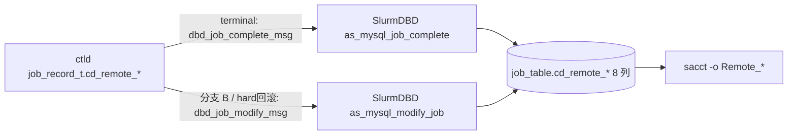

# ctld-M12 SlurmDBD job_table cd_remote_* + sacct Remote_* Checklist (★ v2.0 新增)

> 配套: [doc/Slurmctld跨域详细设计文档MVP_v2.md](../Slurmctld跨域详细设计文档MVP_v2.md) §9.1 / §9.2 / §9.2.1 / §9.3 / §9.4
> 差异蓝图: [doc/跨域调度详设-差异变更说明.md](../跨域调度详设-差异变更说明.md) §1.10
> 依赖: ctld-M03（job_record_t.cd_remote_* 字段 + cd_route_exhausted）/ ctld-M05（_cd_dbd_modify_remote_fields 调用 acct_storage_g_job_modify）
> 下游: ctld-M11（sacct -j 看到完整 8 字段）

> **v1.5 → v2.0 关键变化**:
> v1.5 把 SlurmDBD job_table cd_remote_* 8 列、sacct Remote_* 输出**整段砍刀**到第二阶段。v2.0 把它纳入 MVP 范围，必须实现，原因：
> 1. **broker 端首次状态包写入 cluster/partition** 后必须落库到 DBD，否则 sacct 看不到远端真实位置
> 2. **`_cd_dbd_modify_remote_fields()` 分支 B**（详见 ctld-M05）必须有 SQL UPDATE 通道才能补写远端字段
> 3. **`cd_route_exhausted` 字段**也要落库到 DBD 让 sacct 可见（ctld-M04 `cd_revert_forward_hard` 调 `_cd_dbd_modify_route_exhausted`）

---

## 1. 模块目标

把跨域作业的远端 8 个字段贯穿 SlurmDBD：



要点：
- **schema 升级**：`as_mysql_job.c::_check_table_columns()` 自动 ALTER TABLE
- **dbd_job_complete_msg_t 扩展**：8 字段（终态写入主通道）
- **dbd_job_modify_msg_t 扩展**：9 字段（含 `cd_route_exhausted`，分支 B + hard 回滚补写通道）
- **sacct fields[] 扩展**：8 个 Remote_* 列

## 2. 接口契约

### 2.1 `job_table` schema (v2.0)

```c
/* src/plugins/accounting_storage/mysql/as_mysql_job.c
 * job_table_fields[] 末尾追加 9 列 (含 cd_route_exhausted) */
{ "cd_remote_cluster",   "tinytext"          },
{ "cd_remote_partition", "tinytext"          },
{ "cd_remote_jobid",     "int unsigned default 0" },
{ "cd_remote_state",     "smallint unsigned default 0" },
{ "cd_remote_alloc_tres","text"              },
{ "cd_remote_exit_code", "int unsigned default 0" },
{ "cd_remote_start",     "bigint unsigned default 0" },
{ "cd_remote_end",       "bigint unsigned default 0" },
{ "cd_route_exhausted",  "tinyint unsigned default 0" },   /* ★ v2.0 */
```

> 24.05 schema 升级机制（`as_mysql_check_tables()`）会自动 `ALTER TABLE ... ADD COLUMN` 没有的列，不需要手写 ALTER。

### 2.2 `dbd_job_complete_msg_t` 扩展（终态主通道）

```c
typedef struct {
    /* ... 24.05 已有 ... */
    char     *cd_remote_cluster;
    char     *cd_remote_partition;
    uint32_t  cd_remote_jobid;
    uint16_t  cd_remote_state;
    char     *cd_remote_alloc_tres;
    uint32_t  cd_remote_exit_code;
    time_t    cd_remote_start;
    time_t    cd_remote_end;
    /* cd_route_exhausted 不在 complete 通道; 由 modify 通道独立写 */
} dbd_job_complete_msg_t;
```

### 2.3 `dbd_job_modify_msg_t` 扩展（分支 B + hard 回滚专用）

```c
typedef struct {
    /* ... 24.05 已有 (服务于 scontrol update) ... */
    /* === 跨域 v2.0 新增 === */
    char     *cd_remote_cluster;
    char     *cd_remote_partition;
    uint32_t  cd_remote_jobid;
    uint16_t  cd_remote_state;
    char     *cd_remote_alloc_tres;
    uint32_t  cd_remote_exit_code;
    time_t    cd_remote_start;
    time_t    cd_remote_end;
    uint8_t   cd_route_exhausted;       /* ★ v2.0: hard 回滚专用; 0xFF=不修改 */
} dbd_job_modify_msg_t;
```

### 2.4 `slurmdb_job_rec_t` 扩展（透传给 sacct）

```c
typedef struct {
    /* ... 24.05 已有 ... */
    char     *cd_remote_cluster;
    char     *cd_remote_partition;
    uint32_t  cd_remote_jobid;
    uint16_t  cd_remote_state;
    char     *cd_remote_alloc_tres;
    uint32_t  cd_remote_exit_code;
    time_t    cd_remote_start;
    time_t    cd_remote_end;
    uint8_t   cd_route_exhausted;
} slurmdb_job_rec_t;
```

### 2.5 `as_mysql_modify_job()` 关键差异（"NULL 跳过"原则）

```c
/* scontrol update 提交时 cd_remote_* 字段为 0/NULL → 不写入 */
if (msg->cd_remote_cluster && *msg->cd_remote_cluster) {
    xstrfmtcat(query, ", cd_remote_cluster='%s'", msg->cd_remote_cluster);
}
if (msg->cd_remote_state) {     /* 0 == 未知, 不覆盖 */
    xstrfmtcat(query, ", cd_remote_state=%u", msg->cd_remote_state);
}
if (msg->cd_route_exhausted != 0xFF) {  /* sentinel 不修改 */
    xstrfmtcat(query, ", cd_route_exhausted=%u", msg->cd_route_exhausted);
}
/* ... 其余 7 字段类似 ... */
```

> **副作用约束**：`as_mysql_modify_job()` 单线 SQL UPDATE，不触发 jobcomp 插件，不发 dbd_job_complete_msg，不解锁依赖作业 — 这是 ctld-M05 §4.4 分支 B 选它的核心原因。

---

## 3. 触及文件

| 文件 | 改动 |
|---|---|
| [src/plugins/accounting_storage/mysql/as_mysql_job.c](../../src/plugins/accounting_storage/mysql/as_mysql_job.c) | `job_table_fields[]` 末尾追加 9 列；`as_mysql_job_complete` 末尾追加 SET 子句；`as_mysql_modify_job` 末尾按 NULL 跳过 |
| [src/common/slurmdbd_defs.h](../../src/common/slurmdbd_defs.h) | `dbd_job_complete_msg_t` / `dbd_job_modify_msg_t` 末尾追加字段 |
| [src/common/slurmdbd_defs.c](../../src/common/slurmdbd_defs.c) | `pack_dbd_job_complete_msg` / `unpack_dbd_job_complete_msg` / `pack_dbd_job_modify_msg` / `unpack_dbd_job_modify_msg` 24.05 分支末尾追加 |
| [src/plugins/accounting_storage/mysql/as_mysql_jobacct_process.c](../../src/plugins/accounting_storage/mysql/as_mysql_jobacct_process.c) | `_setup_job_cond_limits` / `_get_job_cond` / `_make_extra_query` / `_get_job_records` SELECT 字段加跨域列 |
| [slurm/slurmdb.h](../../slurm/slurmdb.h) | `slurmdb_job_rec_t` 末尾追加字段 |
| [src/sacct/print.c](../../src/sacct/print.c) | `fields[]` 末尾加 8 个 Remote_* 列 |
| [src/sacct/print.h](../../src/sacct/print.h) | 加 8 个 print 函数原型 |
| [src/slurmctld/job_mgr.c](../../src/slurmctld/job_mgr.c) | `_make_dbd_job_complete_msg`（24.05 实际函数名以源码为准）填充 8 字段 |

---

## 4. Checklist

### 4.1 job_table schema 升级

- [ ] M12-1 [src/plugins/accounting_storage/mysql/as_mysql_job.c](../../src/plugins/accounting_storage/mysql/as_mysql_job.c) `job_table_fields[]` 末尾追加 ifdef 块 9 列（§2.1）
- [ ] M12-2 ctld 启动 + DBD 启动 + 注册集群后 grep 日志 `mysql_query: ALTER TABLE 'jobxxx_job_table' ADD COLUMN cd_remote_cluster ... cd_route_exhausted`
- [ ] M12-3 直接 SQL 验证：`DESCRIBE clusterA_job_table | grep -E "cd_remote_|cd_route_exhausted"` 看到 9 列

### 4.2 dbd_job_complete_msg_t 扩展（终态主通道）

- [ ] M12-4 [src/common/slurmdbd_defs.h](../../src/common/slurmdbd_defs.h) `dbd_job_complete_msg_t` 末尾追加 ifdef 块 8 字段（§2.2）
- [ ] M12-5 [src/common/slurmdbd_defs.c](../../src/common/slurmdbd_defs.c) `pack_dbd_job_complete_msg` 24.05 分支末尾追加：
    ```c
    #ifdef __METASTACK_NEW_CROSS_DOMAIN
    if (protocol_version >= SLURM_24_05_PROTOCOL_VERSION) {
        packstr(msg->cd_remote_cluster, buffer);
        packstr(msg->cd_remote_partition, buffer);
        pack32(msg->cd_remote_jobid, buffer);
        pack16(msg->cd_remote_state, buffer);
        packstr(msg->cd_remote_alloc_tres, buffer);
        pack32(msg->cd_remote_exit_code, buffer);
        pack_time(msg->cd_remote_start, buffer);
        pack_time(msg->cd_remote_end, buffer);
    }
    #endif
    ```
- [ ] M12-6 `unpack_dbd_job_complete_msg` 同位置 unpack（顺序对应）；旧协议回退全 0/NULL
- [ ] M12-7 [src/slurmctld/job_mgr.c](../../src/slurmctld/job_mgr.c) `_make_dbd_job_complete_msg`（或 `jobcomp_g_record_job_end` 调用前的填充路径）：把 `job_ptr->cd_remote_*` 8 字段填到 msg
- [ ] M12-8 [src/plugins/accounting_storage/mysql/as_mysql_job.c](../../src/plugins/accounting_storage/mysql/as_mysql_job.c) `as_mysql_job_complete` SQL UPDATE 末尾追加 SET 子句（v2 设计 §9.2 完整 8 字段）

### 4.3 dbd_job_modify_msg_t 扩展（分支 B + hard 回滚）

- [ ] M12-9 [src/common/slurmdbd_defs.h](../../src/common/slurmdbd_defs.h) `dbd_job_modify_msg_t` 末尾追加 ifdef 块 9 字段（§2.3，注意 `cd_route_exhausted` 是 uint8_t sentinel 0xFF）
- [ ] M12-10 [src/common/slurmdbd_defs.c](../../src/common/slurmdbd_defs.c) `pack_dbd_job_modify_msg` 24.05 分支末尾追加 9 字段 pack（结尾 pack8 cd_route_exhausted）
- [ ] M12-11 `unpack_dbd_job_modify_msg` 同位置 unpack；旧协议回退 cd_route_exhausted=0xFF
- [ ] M12-12 `_make_dbd_job_modify_msg` 初始化（如果有 helper）：`cd_route_exhausted = 0xFF`（sentinel 表示不修改）
- [ ] M12-13 [src/plugins/accounting_storage/mysql/as_mysql_job.c](../../src/plugins/accounting_storage/mysql/as_mysql_job.c) `as_mysql_modify_job` 末尾按 NULL 跳过原则追加 9 个条件 SET 子句（§2.5）

### 4.4 slurmdb_job_rec_t 透传

- [ ] M12-14 [slurm/slurmdb.h](../../slurm/slurmdb.h) `slurmdb_job_rec_t` 末尾追加 ifdef 块 9 字段（§2.4）
- [ ] M12-15 [src/plugins/accounting_storage/mysql/as_mysql_jobacct_process.c](../../src/plugins/accounting_storage/mysql/as_mysql_jobacct_process.c) `_setup_job_cond_limits` 加跨域字段过滤项（如 `--cd-cluster=` 命令行）；`_get_job_records` SELECT 加 9 列；`_get_job_cond` 内部赋值
- [ ] M12-16 `slurmdb_pack_job_rec` / `slurmdb_unpack_job_rec` 同步加 9 字段（24.05 分支末尾）

### 4.5 sacct 输出列

- [ ] M12-17 [src/sacct/print.h](../../src/sacct/print.h) 加 8 个 print 函数原型 ifdef 块：
    ```c
    #ifdef __METASTACK_NEW_CROSS_DOMAIN
    static void _print_remote_cluster(slurmdb_job_rec_t *job, int field_size, bool right);
    static void _print_remote_partition(slurmdb_job_rec_t *job, int field_size, bool right);
    static void _print_remote_jobid(slurmdb_job_rec_t *job, int field_size, bool right);
    static void _print_remote_state(slurmdb_job_rec_t *job, int field_size, bool right);
    static void _print_remote_alloc_tres(slurmdb_job_rec_t *job, int field_size, bool right);
    static void _print_remote_exit_code(slurmdb_job_rec_t *job, int field_size, bool right);
    static void _print_remote_start(slurmdb_job_rec_t *job, int field_size, bool right);
    static void _print_remote_end(slurmdb_job_rec_t *job, int field_size, bool right);
    #endif
    ```
- [ ] M12-18 [src/sacct/print.c](../../src/sacct/print.c) `fields[]` 末尾加 ifdef 块 8 项（v2 设计 §9.4）：
    ```c
    #ifdef __METASTACK_NEW_CROSS_DOMAIN
    {"Remote_Cluster",   "remote_cluster",   _print_remote_cluster   },
    {"Remote_Partition", "remote_partition", _print_remote_partition },
    {"Remote_JobId",     "remote_jobid",     _print_remote_jobid     },
    {"Remote_State",     "remote_state",     _print_remote_state     },
    {"Remote_AllocTRES", "remote_alloc_tres",_print_remote_alloc_tres},
    {"Remote_ExitCode",  "remote_exit_code", _print_remote_exit_code },
    {"Remote_StartTime", "remote_start",     _print_remote_start     },
    {"Remote_EndTime",   "remote_end",       _print_remote_end       },
    #endif
    ```
- [ ] M12-19 实现 8 个 `_print_remote_*` 函数（v2 设计 §9.4.1）；空字段打 `-`；时间用 `slurm_make_time_str`；exit_code 用 `WEXITSTATUS(code):WTERMSIG(code)`
- [ ] M12-20 `src/sacct/options.c::DEFAULT_FIELDS` **不改**（保持兼容）；用户用 `-o JobID,State,Remote_Cluster,...` 显式选

### 4.6 编译与验证

- [ ] M12-21 `make -j` 通过；DBD 重启 + ctld 重启 + 注册集群，自动 ALTER TABLE 完成
- [ ] M12-22 跨域作业终态后 `sacct -j <id> -o JobID,State,ExitCode,Remote_Cluster,Remote_JobId,Remote_AllocTRES,Remote_ExitCode,Remote_StartTime,Remote_EndTime` 看到完整 8 字段
- [ ] M12-23 scancel 抢跑场景下作业终态后再次 sacct 查询，远端字段被 `_cd_dbd_modify_remote_fields` 异步补写齐全（验证 ctld-M05 分支 B 落库）
- [ ] M12-24 broker 5010 NO_VIABLE_ROUTE 后 `sacct -j <id> -o JobID,State,Remote_Cluster` 看到 State=PENDING/CANCELLED + Remote_Cluster='' + 原始数据库 `cd_route_exhausted=1`
- [ ] M12-25 直接 SQL `SELECT job_id, cd_remote_cluster, cd_remote_partition, cd_remote_jobid, cd_remote_state, cd_remote_exit_code, cd_route_exhausted FROM clusterA_job_table WHERE job_id=<JID>` 验证字段值

### 4.7 并发与锁

- [ ] M12-26 `as_mysql_modify_job` SQL 注入安全：`cd_remote_cluster` / `cd_remote_partition` / `cd_remote_alloc_tres` 用 `slurm_add_slash_to_quotes` 处理（24.05 已有 helper）
- [ ] M12-27 同一作业 `_cd_dbd_modify_remote_fields` 并发调用（理论上不会发生，因 cd_terminal_received 真幂等）：DBD 端 SQL 单条 UPDATE 天然原子

---

## 5. 验收标准

1. DBD `_check_table_columns()` 能自动 ALTER TABLE 加 9 列；老 v1.5 数据库升级到 v2.0 不丢数据
2. 跨域作业终态后 `sacct` 能查到 Remote_Cluster / Remote_Partition / Remote_JobId / Remote_State / Remote_AllocTRES / Remote_ExitCode / Remote_StartTime / Remote_EndTime 全部 8 字段
3. scancel 抢跑后远端字段通过 `dbd_job_modify_msg` 异步补写（不重复触发 jobcomp 插件）
4. broker NO_VIABLE_ROUTE 后 `cd_route_exhausted=1` 落库到 DBD（通过 `_cd_dbd_modify_route_exhausted` → `dbd_job_modify_msg::cd_route_exhausted=1`）
5. v2.0 ctld + v1.5 DBD 混部时 ctld 能 fallback（`pack_dbd_job_complete_msg` 旧协议路径不发新字段）；v1.5 ctld + v2.0 DBD 混部正常
6. `sacct -X -j <id> -o ALL | grep Remote_` 看到 8 列

## 6. 风险

- **风险 1**: 24.05 SlurmDBD `_check_table_columns()` 自动 ALTER TABLE 失败（权限不足）。**降级**: 手写 ALTER TABLE 脚本，部署文档 ctld-M11 §3.8 升级路径
- **风险 2**: `dbd_job_modify_msg_t` 已有字段顺序变化导致 ABI 破坏。**降级**: 字段严格 append-only 加在末尾；24.05 已有 ~30 字段，加 9 个仍在末尾
- **风险 3**: `as_mysql_modify_job` 内部 SQL 拼接条数超过限制。**降级**: 24.05 用 `xstrfmtcat` 动态扩展，无固定上限
- **风险 4**: sacct 输出新列在某些场景导致字段对齐错乱。**降级**: 严格用 `field_size` 默认值，参考 v2 设计 §9.4 表格；用户 `-o` 自定义时自行调宽
- **风险 5**: `cd_route_exhausted` 在 modify 通道用 0xFF sentinel 与 dbd 协议默认值（unpack 后 0）冲突。**降级**: 在 `unpack` 后手动 `if (was_unset_in_pack) msg->cd_route_exhausted = 0xFF`，或在 `_make_dbd_job_modify_msg` 初始化时显式设
- **风险 6**: ctld-M05 `_cd_dbd_modify_remote_fields` 在 ctld-M12 完成前不可用。**降级**: ctld-M05 / ctld-M12 同 sprint 推进；M5-15 可临时打日志，M12 完成后切换到真实 DBD 调用
