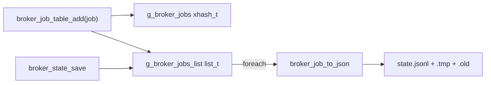

# M03 数据结构与持久化 Checklist

> 配套: [doc/Broker开发任务清单.md](../Broker开发任务清单.md) §M03
> 设计: [doc/Broker详细设计文档MVP.md](../Broker详细设计文档MVP.md) §4 / §11.3
> Sprint: S1
> 依赖: M02-T1
> 下游: M06 / M07 / M08 / M09 / M13 / M14 全部读写 `g_broker_jobs`
> **跨模块单一源头**: 本文档定义 `broker_job_state_t` / `broker_role_t` 枚举，**其它文档只引用不重复**。

---

## 1. 模块概述与目标

### 1.1 一句话定位

提供 `broker_job_t` 内存数据结构、O(1) 查询的 `g_broker_jobs` 全局表、JSONL 三文件原子写 checkpoint，以及启动恢复。是 broker 的"内存数据库 + WAL"。

### 1.2 MVP 范围

- `broker_job_t` 严格按设计文档 §4.1。
- 全局表 = `xhash_t` (key=`trace_id`) + `list_t` (有序遍历) + 全局锁。
- 持久化采用 JSONL：每行一个 job，`job_desc` 用 `pack_job_desc_msg` + base64 嵌入。
- 三文件原子 rename：`<state_file>` / `.tmp` / `.old`。
- 30s 周期 checkpoint + `persist_async_request()` 立即 flush。

### 1.3 不在 MVP 范围

- ~~增量 WAL~~（每次全量 dump 即可，500 jobs × ~5KB/job = ~2.5MB，30s 一次写性能完全不构成瓶颈）
- ~~多版本 schema migration~~（基础字段只增不改）
- ~~崩溃后自动 fsck~~（行级 try/skip-with-warn 已足够）

### 1.4 与 v0.1 的差异

| 维度 | v0.1 | MVP |
|---|---|---|
| 序列化格式 | `pack.c` 二进制 | JSONL（human-readable，便于排障）|
| `job_desc` | 二进制 pack | base64 嵌入 JSON |
| `cancel_*` 字段 | 无 | 新增 `cancel_requested` / `cancel_propagated` |
| `app_type` / `app_version` / `submit_way` | 有 | **删除**（MVP 不解析这些） |

---

## 2. 接口契约

### 2.1 `broker_job_state_t` 枚举（**单一源头**）

```c
/* src/slurmbrokerd/broker_job.h */
typedef enum {
	BROKER_STATE_INIT          = 0,  /* 入表后等待 STAGING_IN */
	BROKER_STATE_STAGING_IN    = 1,  /* rsync 源端 -> 远端 dst_work_dir */
	BROKER_STATE_STAGED_IN     = 2,  /* 极短暂；几乎只在内存中存在 */
	BROKER_STATE_SUBMITTED     = 3,  /* 远端已 sbatch；等待 RUNNING */
	BROKER_STATE_RUNNING       = 4,  /* 远端 squeue 显示 RUNNING */
	BROKER_STATE_STAGING_OUT   = 5,  /* 远端跑完，回写 src_work_dir */
	BROKER_STATE_COMPLETED     = 6,  /* 终态：成功 */
	BROKER_STATE_FAILED        = 7,  /* 终态：失败 */
	BROKER_STATE_CANCELLED     = 8,  /* 终态：被 scancel */
} broker_job_state_t;

typedef enum {
	BROKER_ROLE_ORIGINATOR = 0,
	BROKER_ROLE_RECEIVER   = 1,
} broker_role_t;
```

> 任何其它模块（M07/M08/M09/M13）若引用，**仅 include `broker_job.h`**，不复制定义。

### 2.2 `broker_job_t` 结构（设计文档 §4.1）

字段顺序与设计文档**完全一致**，本文档不重复贴；仅列出"非 obvious 责任划分"：

| 字段类别 | xfree 责任 |
|---|---|
| `char *src_user_name / remote_user_name / account` | `broker_job_destroy` |
| `char *src_cluster / dst_cluster / target_partition` | `broker_job_destroy` |
| `char *src_work_dir / dst_work_dir / script_path` | `broker_job_destroy` |
| `char *state_reason / remote_alloc_tres` | `broker_job_destroy` |
| `job_desc_msg_t *job_desc` | `slurm_free_job_desc_msg(job_desc)` |
| `pthread_mutex_t lock` | `slurm_mutex_destroy` |
| `char trace_id[48]` | 内联，无需 free |

### 2.3 公共 API

```c
/* broker_job.h */
extern int broker_job_table_init(void);
extern void broker_job_table_fini(void);

extern broker_job_t *broker_job_create(void);
extern void broker_job_destroy(broker_job_t *job);

extern int broker_job_table_add(broker_job_t *job);
extern broker_job_t *broker_job_table_get(const char *trace_id);
extern int broker_job_table_remove(const char *trace_id);
extern uint32_t broker_job_table_count(void);

/* 加锁内部迭代（fn 返回非 0 时提前结束）。 */
extern void broker_job_table_foreach(int (*fn)(broker_job_t *, void *),
                                     void *arg);

/* JSON encode/decode 单条 */
extern char *broker_job_to_json(broker_job_t *job);
extern broker_job_t *broker_job_from_json(const char *line);

/* persist.h */
extern int broker_state_save(void);
extern int broker_state_restore(void);

/* 异步：调用方只置位标志，由 persist 后台线程下次 tick 执行。 */
extern void persist_async_request(void);
extern int persist_thread_start(void);
extern void persist_thread_stop(void);
```

### 2.4 全局变量

```c
/* broker_job.c */
xhash_t  *g_broker_jobs;          /* key = trace_id, value = broker_job_t* */
list_t   *g_broker_jobs_list;     /* 有序遍历用 */
pthread_mutex_t g_broker_jobs_lock = PTHREAD_MUTEX_INITIALIZER;

/* persist.c */
static pthread_t persist_tid;
static pthread_cond_t  persist_cond  = PTHREAD_COND_INITIALIZER;
static pthread_mutex_t persist_mutex = PTHREAD_MUTEX_INITIALIZER;
static volatile bool   persist_async_pending = false;
```

### 2.5 文件路径

| 文件 | 用途 |
|---|---|
| `<state_save_location>/<state_file_name>` | 当前 checkpoint（默认 `/var/spool/slurm/broker/broker_state.jsonl`） |
| 同上 + `.tmp` | 写入中，原子 rename 前的中间文件 |
| 同上 + `.old` | 上次 checkpoint，崩溃 fallback 用 |

---

## 3. 参考代码

| 用途 | 文件 | 关键行 |
|---|---|---|
| `xhash_t` API | [src/common/xhash.h](../../src/common/xhash.h) | L70 / L91 / L82 / L110 |
| `list_t` / `list_iterator_t` | [src/common/list.h](../../src/common/list.h) | grep `list_create` |
| `pack_job_desc_msg` 序列化 | [src/common/slurm_protocol_pack.c](../../src/common/slurm_protocol_pack.c) | grep `pack_job_desc_msg` |
| `unpack_job_desc_msg` | 同上 | 配对 |
| base64 编解码 | [src/common/util-net.h](../../src/common/util-net.h) 或 [src/common/data.c](../../src/common/data.c) | grep `base64_encode` |
| `slurm_mutex_lock` / `unlock` | [src/common/macros.h](../../src/common/macros.h) | grep `slurm_mutex_` |
| 状态文件原子 rename 范式 | [src/slurmctld/state_save.c](../../src/slurmctld/state_save.c) | 整体可参考 |
| `pthread_cond_timedwait` 范式 | [src/slurmctld/agent.c](../../src/slurmctld/agent.c) | grep `pthread_cond_timedwait` |

---

## 4. 文件清单

| 文件 | 类型 | 用途 |
|---|---|---|
| [src/slurmbrokerd/broker_job.h](../../src/slurmbrokerd/broker_job.h) | 新增 | 枚举 + struct + table API + JSON API |
| [src/slurmbrokerd/broker_job.c](../../src/slurmbrokerd/broker_job.c) | 新增 | create/destroy/table CRUD + to_json/from_json |
| [src/slurmbrokerd/persist.h](../../src/slurmbrokerd/persist.h) | 新增 | save / restore / async_request API |
| [src/slurmbrokerd/persist.c](../../src/slurmbrokerd/persist.c) | 新增 | 三文件原子 rename + checkpoint 线程 |
| [src/slurmbrokerd/Makefile.am](../../src/slurmbrokerd/Makefile.am) | 修改 | `slurmbrokerd_SOURCES` 加 4 个文件 |
| [src/slurmbrokerd/slurmbrokerd.c](../../src/slurmbrokerd/slurmbrokerd.c) | 修改 | `broker_init` 内调 `broker_job_table_init` / `broker_state_restore` / `persist_thread_start` |

---

## 5. 数据结构关系图



JSON 行示例：

```json
{"trace_id":"xian-12345","src_job_id":12345,"state":3,
 "src_user_name":"test1","remote_user_name":"wz_test1",
 "remote_job_id":8888,"dst_cluster":"wz_cluster",
 "target_partition":"wzhcnormal","state_reason":null,
 "retry_count":0,"state_enter_time":1719999999,
 "submit_time":1719999990,"last_poll_time":1719999998,
 "remote_start_time":0,"remote_end_time":0,
 "remote_alloc_tres":null,"remote_exit_code":0,
 "cancel_requested":false,"cancel_propagated":false,
 "hop_count":0,"role":0,
 "job_desc_b64":"AAAACQAAAAA...(very long base64)..."}
```

---

## 6. 任务展开

### M03-T1 `broker_job_t` 定义与 create/destroy

- **依赖**: M02-T1
- **预估**: 0.5d
- **关键决策**:
  1. 字段顺序与设计文档 §4.1 完全一致，**禁止重排**（影响 JSON schema 字段顺序）
  2. `trace_id` 用 `char[48]` 内联，无 xfree 责任，且适合直接做 hash key
  3. `mutex` 字段用 `slurm_mutex_init` 而非 `pthread_mutex_init`（规则 §4）
- **代码草图**:

```c
broker_job_t *broker_job_create(void)
{
	broker_job_t *job = xmalloc(sizeof(*job));
	slurm_mutex_init(&job->lock);
	job->state = BROKER_STATE_INIT;
	job->state_enter_time = time(NULL);
	job->role = BROKER_ROLE_ORIGINATOR;
	return job;
}

void broker_job_destroy(broker_job_t *job)
{
	if (!job) return;

	xfree(job->src_user_name);
	xfree(job->remote_user_name);
	xfree(job->account);
	xfree(job->src_cluster);
	xfree(job->dst_cluster);
	xfree(job->target_partition);
	xfree(job->src_work_dir);
	xfree(job->dst_work_dir);
	xfree(job->script_path);
	xfree(job->state_reason);
	xfree(job->remote_alloc_tres);

	if (job->job_desc) {
		slurm_free_job_desc_msg(job->job_desc);
		job->job_desc = NULL;
	}

	slurm_mutex_destroy(&job->lock);
	xfree(job);
}
```

- **风险与坑**:
  - 漏掉某个 `char *` 字段不 xfree → valgrind still reachable
  - `slurm_free_job_desc_msg` 是 `slurm.h` 公共 API，OK
- **DoD**:
  - [ ] valgrind: `for (i=0;i<1000;i++) destroy(create())` 0 still reachable
  - [ ] `sizeof(broker_job_t)` 与设计文档对比无超大膨胀（< 512B）

### M03-T2 全局表初始化与 CRUD

- **依赖**: M03-T1
- **预估**: 0.5d
- **关键决策**:
  1. 单全局锁 `g_broker_jobs_lock`，覆盖 hash + list 两个数据结构的所有写入
  2. read 路径也持锁，因为 `broker_job_t` 内部字段还有自己的 `job->lock`，外层锁只保护"表结构"
  3. `foreach` 内部加锁 + 调用回调（注意：回调内不能再锁 `g_broker_jobs_lock`，否则死锁）
- **代码草图**:

```c
int broker_job_table_init(void)
{
	g_broker_jobs = xhash_init(_job_idfunc, _job_freefunc);
	g_broker_jobs_list = list_create(NULL); /* xhash 已 own job, list 不重复 */
	return SLURM_SUCCESS;
}

static void _job_idfunc(void *item, const char **key, uint32_t *len)
{
	broker_job_t *j = item;
	*key = j->trace_id;
	*len = strlen(j->trace_id);
}

static void _job_freefunc(void *item) { broker_job_destroy(item); }

int broker_job_table_add(broker_job_t *job)
{
	int rc = SLURM_SUCCESS;

	slurm_mutex_lock(&g_broker_jobs_lock);
	if (xhash_get_str(g_broker_jobs, job->trace_id)) {
		rc = SLURM_ERROR; /* duplicate */
	} else {
		xhash_add(g_broker_jobs, job);
		list_append(g_broker_jobs_list, job);
	}
	slurm_mutex_unlock(&g_broker_jobs_lock);
	return rc;
}

broker_job_t *broker_job_table_get(const char *trace_id)
{
	broker_job_t *j;
	slurm_mutex_lock(&g_broker_jobs_lock);
	j = xhash_get_str(g_broker_jobs, trace_id);
	slurm_mutex_unlock(&g_broker_jobs_lock);
	return j;
}

int broker_job_table_remove(const char *trace_id)
{
	broker_job_t *j;

	slurm_mutex_lock(&g_broker_jobs_lock);
	j = xhash_get_str(g_broker_jobs, trace_id);
	if (j) {
		list_delete_ptr(g_broker_jobs_list, j);
		xhash_delete_str(g_broker_jobs, trace_id);
		/* xhash freefunc 已经 destroy(j) */
	}
	slurm_mutex_unlock(&g_broker_jobs_lock);
	return j ? SLURM_SUCCESS : SLURM_ERROR;
}

void broker_job_table_foreach(int (*fn)(broker_job_t *, void *), void *arg)
{
	list_itr_t *itr;
	broker_job_t *j;

	slurm_mutex_lock(&g_broker_jobs_lock);
	itr = list_iterator_create(g_broker_jobs_list);
	while ((j = list_next(itr))) {
		if (fn(j, arg)) break;
	}
	list_iterator_destroy(itr);
	slurm_mutex_unlock(&g_broker_jobs_lock);
}
```

- **风险与坑**:
  - **同一 job 在 hash + list 都引用**：`xhash` 拿到 freefunc，`list_create(NULL)` 不释放，避免 double-free
  - `list_delete_ptr` 在 `list.h`：删除指定指针节点
  - foreach 持锁期间回调若慢（如阻塞 IO）会卡住所有读 → 回调必须只做 in-memory 工作，IO 出锁外
- **DoD**:
  - [ ] 多线程 100ms 内并发 1000 次 add/get/remove 不死锁不脏读（写一个 stress test）
  - [ ] 重复 trace_id add 返回 SLURM_ERROR 而不是覆盖
  - [ ] valgrind clean

### M03-T3 `broker_job_to_json` 序列化

- **依赖**: M03-T1
- **预估**: 1d
- **关键决策**:
  1. **MVP 简化**：用 `xstrdup_printf` 手工拼接，不引 json-c / jansson 新依赖
  2. 复杂的 `job_desc` 用 `pack_job_desc_msg` → `base64_encode`，作为 `job_desc_b64` 字段
  3. JSON 字符串 escape：写一个 `_json_escape(const char *)` helper（处理 `"` `\\` `\n` `\r` `\t` 控制字符）
  4. 中文等 UTF-8 字节直接 passthrough，不做 escape
- **代码草图**:

```c
static char *_json_escape(const char *s)
{
	char *out = NULL;
	const char *p;

	if (!s) return xstrdup("null");

	xstrcatchar(out, '"');
	for (p = s; *p; p++) {
		switch (*p) {
		case '"':  xstrcat(out, "\\\""); break;
		case '\\': xstrcat(out, "\\\\"); break;
		case '\n': xstrcat(out, "\\n");  break;
		case '\r': xstrcat(out, "\\r");  break;
		case '\t': xstrcat(out, "\\t");  break;
		default:
			if ((unsigned char)*p < 0x20)
				xstrfmtcat(out, "\\u%04x", *p);
			else
				xstrcatchar(out, *p);
		}
	}
	xstrcatchar(out, '"');
	return out;
}

char *broker_job_to_json(broker_job_t *job)
{
	char *out = NULL;
	char *esc;
	buf_t *buf;
	char *b64;
	uint32_t b64_len;

	xstrcat(out, "{");
	xstrfmtcat(out, "\"trace_id\":\"%s\",",   job->trace_id);
	xstrfmtcat(out, "\"src_job_id\":%u,",     job->src_job_id);
	xstrfmtcat(out, "\"remote_job_id\":%u,",  job->remote_job_id);
	xstrfmtcat(out, "\"role\":%d,",           job->role);
	xstrfmtcat(out, "\"hop_count\":%u,",      job->hop_count);
	xstrfmtcat(out, "\"state\":%d,",          job->state);

	esc = _json_escape(job->src_user_name);
	xstrfmtcat(out, "\"src_user_name\":%s,", esc); xfree(esc);
	/* ...（每个 char* 字段都过 _json_escape） ... */

	xstrfmtcat(out, "\"state_enter_time\":%ld,", (long) job->state_enter_time);
	xstrfmtcat(out, "\"retry_count\":%u,",       job->retry_count);
	xstrfmtcat(out, "\"cancel_requested\":%s,",
	           job->cancel_requested ? "true" : "false");
	xstrfmtcat(out, "\"cancel_propagated\":%s,",
	           job->cancel_propagated ? "true" : "false");

	/* job_desc -> base64 */
	buf = init_buf(BUF_SIZE);
	pack_job_desc_msg(job->job_desc, buf, SLURM_PROTOCOL_VERSION);
	b64 = base64_encode((unsigned char *) get_buf_data(buf),
	                    get_buf_offset(buf), &b64_len);
	xstrfmtcat(out, "\"job_desc_b64\":\"%s\"", b64);
	xfree(b64);
	free_buf(buf);

	xstrcat(out, "}");
	return out;
}
```

- **风险与坑**:
  - `_json_escape` 漏处理 `\b` `\f` 等控制字符 → 解析端可能拒绝
  - base64 输出会很长（10-50KB），单行 JSON 可达 50KB 以上，确认 `fgets` 缓冲区足够（设计文档用 `char line[16384]` 太小，需要扩到 65536）
  - `init_buf`/`pack_job_desc_msg` 失败要 free_buf
- **DoD**:
  - [ ] 含中文 / `"` / `\\` 的 reason 序列化后 `python3 -c 'import json,sys; json.loads(sys.stdin.read())'` 能解析
  - [ ] base64 round-trip：`base64_decode(base64_encode(x)) == x`
  - [ ] valgrind 1000 次 to_json clean

### M03-T4 `broker_job_from_json` 反序列化

- **依赖**: M03-T3
- **预估**: 1d
- **关键决策**:
  1. **优先用 Slurm 已 link 的 `data_t` + `data_g_deserialize("json", ...)`**（[src/common/data.c](../../src/common/data.c)）
  2. 不引第三方 json 库
  3. **字段缺失**：给 0 / NULL 默认值，不 fatal（兼容老版本文件）
  4. 必填字段（`trace_id`、`src_job_id`、`state`、`job_desc_b64`）缺失 → 返回 NULL，调用方 warn 跳过
- **代码草图**:

```c
broker_job_t *broker_job_from_json(const char *line)
{
	data_t *root = NULL;
	broker_job_t *job = NULL;
	char *trace_id = NULL, *b64 = NULL;
	buf_t *buf = NULL;
	unsigned char *raw = NULL;
	uint32_t raw_len;
	int proto_ver = SLURM_PROTOCOL_VERSION;

	if (data_g_deserialize(&root, MIME_TYPE_JSON, line, strlen(line))) {
		warning("broker_job_from_json: invalid JSON, skipping line");
		return NULL;
	}

	job = broker_job_create();

	#define GET_STR(K, DST)  do { \
		data_t *_d = data_key_get(root, K); \
		if (_d && data_get_type(_d) == DATA_TYPE_STRING) \
			DST = xstrdup(data_get_string(_d)); \
	} while (0)
	#define GET_INT(K, DST)  do { \
		data_t *_d = data_key_get(root, K); \
		int64_t _v; \
		if (_d && !data_get_int_converted(_d, &_v)) \
			DST = (typeof(DST)) _v; \
	} while (0)

	GET_STR("trace_id", trace_id);
	if (!trace_id) goto fail;
	strlcpy(job->trace_id, trace_id, sizeof(job->trace_id));
	xfree(trace_id);

	GET_INT("src_job_id",       job->src_job_id);
	GET_INT("remote_job_id",    job->remote_job_id);
	GET_INT("role",             job->role);
	GET_INT("hop_count",        job->hop_count);
	GET_INT("state",            job->state);
	GET_INT("state_enter_time", job->state_enter_time);
	GET_INT("retry_count",      job->retry_count);
	/* ... 其它整型字段 ... */

	GET_STR("src_user_name",    job->src_user_name);
	GET_STR("remote_user_name", job->remote_user_name);
	GET_STR("dst_cluster",      job->dst_cluster);
	GET_STR("target_partition", job->target_partition);
	/* ... 其它字符串字段 ... */

	GET_STR("job_desc_b64", b64);
	if (!b64) goto fail;
	raw = base64_decode((unsigned char *) b64, strlen(b64), &raw_len);
	xfree(b64);
	if (!raw) goto fail;

	buf = create_buf((char *) raw, raw_len);  /* takes ownership */
	if (unpack_job_desc_msg(&job->job_desc, buf, proto_ver)) {
		FREE_NULL_BUFFER(buf);
		goto fail;
	}
	FREE_NULL_BUFFER(buf);

	#undef GET_STR
	#undef GET_INT

	FREE_NULL_DATA(root);
	return job;

fail:
	xfree(trace_id);
	xfree(b64);
	if (buf) FREE_NULL_BUFFER(buf);
	broker_job_destroy(job);
	if (root) FREE_NULL_DATA(root);
	return NULL;
}
```

- **风险与坑**:
  - `data_g_deserialize` 需要 `serializer/json` plugin 已 init（M01 主进程内 slurm 库已 init plugin rack）
  - `unpack_job_desc_msg` 的 protocol_version 必须与 save 时一致；MVP 写死 `SLURM_PROTOCOL_VERSION`，未来跨大版本升级需要保存版本号字段
  - base64 padding `=` 个数错误会 decode 失败
- **DoD**:
  - [ ] save 100 jobs → restart → restore 后表内 100 条，关键字段全部一致（写一个 diff 工具脚本）
  - [ ] 故意篡改某行 base64 → restore 时 warn 并跳过该行，其它行正常
  - [ ] 字段缺失（旧版本文件）→ 默认值合理

### M03-T5 `broker_state_save` 原子写

- **依赖**: M03-T3
- **预估**: 0.5d
- **关键决策**:
  1. 三文件原子 rename：先写 `.tmp`，rename 当前为 `.old`，rename `.tmp` 为当前
  2. 全程持 `g_broker_jobs_lock`（通过 `broker_job_table_foreach`）
  3. 出错路径：unlink `.tmp` 回滚
  4. **fsync** 不光是 fclose，要先 `fflush + fsync(fileno(fp))` 再 close，否则崩溃后内容未落盘
- **代码草图**:

```c
typedef struct {
	FILE *fp;
	int   error;
} _save_ctx_t;

static int _save_one(broker_job_t *j, void *arg)
{
	_save_ctx_t *ctx = arg;
	char *json;
	if (ctx->error) return 1;

	json = broker_job_to_json(j);
	if (fprintf(ctx->fp, "%s\n", json) < 0)
		ctx->error = 1;
	xfree(json);
	return ctx->error;
}

int broker_state_save(void)
{
	char *path_cur = NULL, *path_tmp = NULL, *path_old = NULL;
	_save_ctx_t ctx = { 0 };

	xstrfmtcat(path_cur, "%s/%s",     g_broker_conf.state_save_location,
	                                   g_broker_conf.state_file_name);
	xstrfmtcat(path_tmp, "%s.tmp",    path_cur);
	xstrfmtcat(path_old, "%s.old",    path_cur);

	ctx.fp = fopen(path_tmp, "w");
	if (!ctx.fp) {
		error("broker_state_save: open %s: %m", path_tmp);
		goto fail;
	}

	broker_job_table_foreach(_save_one, &ctx);
	if (ctx.error) {
		error("broker_state_save: write error");
		fclose(ctx.fp);
		unlink(path_tmp);
		goto fail;
	}

	if (fflush(ctx.fp) || fsync(fileno(ctx.fp)) || fclose(ctx.fp)) {
		error("broker_state_save: fsync/close: %m");
		unlink(path_tmp);
		goto fail;
	}

	/* current -> .old (allow ENOENT on first run) */
	if (rename(path_cur, path_old) && errno != ENOENT) {
		error("broker_state_save: rename cur->old: %m");
		goto fail;
	}
	if (rename(path_tmp, path_cur)) {
		error("broker_state_save: rename tmp->cur: %m");
		goto fail;
	}

	debug("broker_state_save: %u jobs persisted", broker_job_table_count());
	xfree(path_cur); xfree(path_tmp); xfree(path_old);
	return SLURM_SUCCESS;

fail:
	xfree(path_cur); xfree(path_tmp); xfree(path_old);
	return SLURM_ERROR;
}
```

- **风险与坑**:
  - foreach 内部已加锁，回调里又调 `broker_job_to_json`，确认 to_json 不需要 `g_broker_jobs_lock`（它只读单个 job 内部字段）→ OK
  - 跨文件系统 `rename` 会失败 EXDEV；要求 `state_save_location` 同一 fs
  - 大表（1000 jobs × 50KB = 50MB）单次写入耗时 ms 级；锁持有时间 < 100ms，可接受
- **DoD**:
  - [ ] 故意在 fclose 前 `kill -9` → 重启用 `.old` 恢复（M03-T6 涵盖）
  - [ ] 故意把 state_save_location 设到只读 → save 返回 SLURM_ERROR，进程不 crash

### M03-T6 `broker_state_restore` 启动加载

- **依赖**: M03-T4 / M03-T5
- **预估**: 0.5d
- **关键决策**:
  1. 优先读 `state.jsonl`，size=0 或不存在 → 读 `.old`，仍无 → 0 jobs 启动
  2. **行级 try/skip-with-warn**：单行损坏不阻塞整体 restore
  3. 计数 + 状态分布日志，便于运维
- **代码草图**:

```c
static int _restore_from(const char *path)
{
	FILE *fp;
	char line[65536];
	uint32_t loaded = 0, skipped = 0;

	fp = fopen(path, "r");
	if (!fp) return -1;

	while (fgets(line, sizeof(line), fp)) {
		broker_job_t *j;
		size_t len = strlen(line);

		if (len > 0 && line[len-1] == '\n') line[len-1] = '\0';
		if (line[0] == '\0') continue; /* empty line */

		j = broker_job_from_json(line);
		if (!j) {
			warning("restore: skipping malformed line %u",
			        loaded + skipped + 1);
			skipped++;
			continue;
		}
		broker_job_table_add(j);
		loaded++;
	}
	fclose(fp);
	info("restore: %s -> loaded=%u skipped=%u", path, loaded, skipped);
	return 0;
}

int broker_state_restore(void)
{
	char *cur = NULL, *old = NULL;
	struct stat st;
	int rc;

	xstrfmtcat(cur, "%s/%s",  g_broker_conf.state_save_location,
	                          g_broker_conf.state_file_name);
	xstrfmtcat(old, "%s.old", cur);

	if (stat(cur, &st) == 0 && st.st_size > 0) {
		rc = _restore_from(cur);
	} else {
		warning("primary state %s missing/empty, falling back to .old",
		        cur);
		rc = _restore_from(old);
		if (rc < 0) {
			info("restore: no state file, starting with 0 jobs");
			rc = 0;
		}
	}

	xfree(cur); xfree(old);
	return rc < 0 ? SLURM_ERROR : SLURM_SUCCESS;
}
```

- **风险与坑**:
  - `line[65536]` 在栈上，大 job_desc 时可能栈溢出 → 改 `xmalloc(65536)` 或调用 `getline`
  - 返回值语义：返回 ERROR 让 main 退出码 2（设计文档 §M01-T2 退出码定义）
- **DoD**:
  - [ ] 删 current 留 old → 启动看到 fallback 日志，jobs 数正确
  - [ ] 故意伤害 1 行 JSON → loaded=N-1, skipped=1，进程正常起

### M03-T7 30s checkpoint 后台线程 + 异步触发

- **依赖**: M03-T5
- **预估**: 0.5d
- **关键决策**:
  1. `pthread_cond_timedwait` 实现：30s timeout 或被 `persist_async_request` 唤醒立刻执行
  2. shutdown 时 join + 强制 save 一次
  3. **不在 save 内置时间限速**：`persist_async_request` 来得密时，最多每秒 save 一次（自带 throttle）
- **代码草图**:

```c
static volatile bool persist_running;
static pthread_t persist_tid;

void persist_async_request(void)
{
	slurm_mutex_lock(&persist_mutex);
	persist_async_pending = true;
	pthread_cond_signal(&persist_cond);
	slurm_mutex_unlock(&persist_mutex);
}

static void *_persist_main(void *arg)
{
	struct timespec ts;
	uint32_t timeout = g_broker_conf.checkpoint_interval;

	while (persist_running) {
		clock_gettime(CLOCK_REALTIME, &ts);
		ts.tv_sec += timeout;

		slurm_mutex_lock(&persist_mutex);
		while (!persist_async_pending && persist_running) {
			if (pthread_cond_timedwait(&persist_cond,
			                           &persist_mutex,
			                           &ts) == ETIMEDOUT)
				break;
		}
		persist_async_pending = false;
		slurm_mutex_unlock(&persist_mutex);

		if (!persist_running) break;

		if (broker_state_save() != SLURM_SUCCESS)
			error("persist: checkpoint failed");
	}

	/* final flush before exit */
	broker_state_save();
	return NULL;
}

int persist_thread_start(void)
{
	persist_running = true;
	slurm_thread_create(&persist_tid, _persist_main, NULL);
	return SLURM_SUCCESS;
}

void persist_thread_stop(void)
{
	slurm_mutex_lock(&persist_mutex);
	persist_running = false;
	pthread_cond_signal(&persist_cond);
	slurm_mutex_unlock(&persist_mutex);
	pthread_join(persist_tid, NULL);
}
```

- **风险与坑**:
  - cond_timedwait 用 `CLOCK_REALTIME`，系统时钟跳变会导致 wait 异常长/短；slurm 一般接受这个权衡
  - shutdown 时 `_persist_main` 末尾再 save 一次：确保 SIGTERM 后内存里的最后一秒变更也落盘
- **DoD**:
  - [ ] handle_forward_job 接到一个 job → ≤ 1s 内 state.jsonl 被刷新（grep 文件 mtime）
  - [ ] kill -TERM → 退出前观测到一次 final save 日志

---

## 7. 整体 DoD（汇总）

- [ ] 7 个子任务全部勾选
- [ ] valgrind: 启动 → restore 100 jobs → save → fini，0 byte still reachable
- [ ] 多线程压测：500 jobs 并发 add/get/remove + 后台 30s checkpoint，无死锁、无数据丢失
- [ ] kill -9 后 .old fallback 自动生效
- [ ] `broker_init` / `broker_fini` 已 wire-up `broker_job_table_init` / `broker_state_restore` / `persist_thread_start`（M01-T6 占位激活）

## 8. 验证脚本

```bash
# 单元测试：序列化/反序列化 round-trip
gcc -I$(top_srcdir) -o /tmp/test_jsonrt \
    src/slurmbrokerd/broker_job.c \
    tests/broker/test_json_roundtrip.c \
    -lslurm
/tmp/test_jsonrt

# 端到端：手工注入 + 重启
sudo install -d /var/spool/slurm/broker
sudo ./src/slurmbrokerd/slurmbrokerd -D -v &
PID=$!
# 通过 mock client（M06 做完后）投 100 个作业
for i in $(seq 1 100); do
    ./tests/broker/inject_forward_job xian-${i}
done

ls -la /var/spool/slurm/broker/
# 期望: broker_state.jsonl 行数=100

sudo kill -9 $PID
sudo rm /var/spool/slurm/broker/broker_state.jsonl       # 模拟主文件丢失
sudo ./src/slurmbrokerd/slurmbrokerd -D -v 2>&1 | grep -E "(restore|fallback)"
# 期望: "primary state ... missing/empty, falling back to .old"
#       "restore: ... loaded=100 skipped=0"
```

---

## 9. 风险与回滚

| 风险 | 触发 | 缓解 |
|---|---|---|
| 单个 job_desc 超 16KB | 大 array job + 长 prolog | 缓冲扩到 64KB；超过则 `getline` 动态分配 |
| 跨 fs rename 失败 | state_save_location 与 spool 不同 fs | 配置时 mkdir 必同 fs；M02-T3 校验 |
| 表锁与持久化串行 | foreach 持锁期间慢 IO | foreach 只 build in-memory 副本，IO 出锁外（如必要 T+1 优化）|
| `data_g_deserialize` 未 init | broker_init 没 init plugin rack | M01-T6 顺序保证 proto_init/serializer 在 restore 前 |

回滚：本模块独立。未上线 → `git revert` 4 文件 + Makefile.am + slurmbrokerd.c 修改。已上线 → 停 systemd，`mv broker_state.jsonl{,.bak}` 后回滚二进制。
