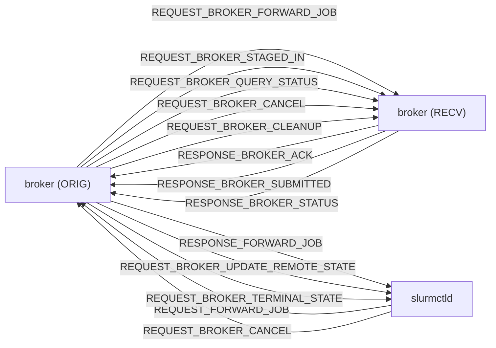

# M04 RPC 协议 pack/unpack Checklist

> 配套: [doc/Broker开发任务清单.md](../Broker开发任务清单.md) §M04
> 设计: [doc/Broker详细设计文档MVP.md](../Broker详细设计文档MVP.md) §6
> Sprint: S1
> 依赖: 无（与 M02/M03 并行）；协调点: ctld 工程师
> 下游: M05 / M06 / M07 / M08 / M13 全部使用本模块定义的 msg_type / payload 结构
> **跨模块单一源头**: 本文档定义所有 11 个 broker `REQUEST_*` / `RESPONSE_*` msg_type 与 payload 字段顺序，**其它文档只引用不重复**。

---

## 1. 模块概述与目标

### 1.1 一句话定位

为 broker 自定义 RPC 申请 msg_type 枚举、定义 payload C 结构、实现 pack/unpack。代码物理位置在 `src/common/slurm_protocol_*` 与 broker 共享，确保 ctld 端能同进程解出。

### 1.2 MVP 范围

- 11 个 msg_type + 9 个 `ESLURM_BROKER_*` 错误码
- 11 套 `*_msg_t` 结构 + `slurm_free_*_msg_t` 释放
- 11 套 `pack_*_msg` / `unpack_*_msg`，加入 `slurm_protocol_pack.c` 大 switch
- broker 进程内的薄封装 `proto.c::proto_init` / `proto_send_recv_to_peer`

### 1.3 不在 MVP 范围

- ~~v0.2 自定义 wire format / mTLS~~（M14/v0.2）
- ~~RPC schema 自动生成~~（按 Slurm 现行手工 pack/unpack 套路）

### 1.4 与 v0.1 的差异

| 维度 | v0.1 | MVP |
|---|---|---|
| RPC 数量 | ~20+（含调度协商）| 11（精简） |
| `comment` 字段污染 | 用 `slurm_update_job(comment)` | **禁用**（用 `REQUEST_BROKER_UPDATE_REMOTE_STATE` 推 ctld）|

---

## 2. 接口契约

### 2.1 msg_type 枚举（**单一源头**）

申请连续段 `8000 ~ 8099`，避开 slurmrestd 的占用范围。在 [src/common/slurm_protocol_defs.h](../../src/common/slurm_protocol_defs.h) 增加：

```c
/* === Cross-domain broker (M04-T1) ===
 * Range 8000-8099 reserved for slurmbrokerd.
 */

/* ctld <-> broker (local munge socket) */
#define REQUEST_FORWARD_JOB                 8001
#define RESPONSE_FORWARD_JOB                8002
#define REQUEST_BROKER_UPDATE_REMOTE_STATE  8003
#define REQUEST_BROKER_TERMINAL_STATE       8004

/* broker <-> broker (peer port) */
#define REQUEST_BROKER_FORWARD_JOB          8010
#define RESPONSE_BROKER_ACK                 8011
#define REQUEST_BROKER_STAGED_IN            8012
#define RESPONSE_BROKER_SUBMITTED           8013
#define REQUEST_BROKER_QUERY_STATUS         8014
#define RESPONSE_BROKER_STATUS              8015
#define REQUEST_BROKER_CANCEL               8016
#define REQUEST_BROKER_CLEANUP              8017
```

> 任何其它模块（M05/M06/M07/M08/M13）若引用，**仅 include `slurm_protocol_defs.h`**，不复制定义。

### 2.2 错误码（**单一源头**）

```c
/* slurm_errno.h, M04-T1 */
#define ESLURM_BROKER_OVERLOAD                  9001  /* > MaxInFlightJobs */
#define ESLURM_BROKER_NO_USER_MAPPING           9002
#define ESLURM_BROKER_USER_MAPPING_MISMATCH     9003
#define ESLURM_BROKER_HOP_EXCEEDED              9004
#define ESLURM_BROKER_LOOKUP_FAILED             9005
#define ESLURM_BROKER_LOOKUP_TIMEOUT            9006
#define ESLURM_BROKER_STAGE_FAILED              9007
#define ESLURM_BROKER_REMOTE_SUBMIT_FAILED      9008
#define ESLURM_BROKER_NOT_FOUND                 9009
```

`slurm_strerror()` 在 [src/common/slurm_errno.c](../../src/common/slurm_errno.c) 增加对应字符串。

### 2.3 11 个 payload 结构

```c
/* slurm_protocol_defs.h - all field order is wire-significant */

typedef struct {
	uint32_t  src_job_id;
	uint32_t  src_uid;
	uint32_t  src_gid;
	char     *src_user_name;
	char     *target_cluster;
	char     *src_work_dir;
	char     *script_path;
	char     *account;
	char     *app_name;            /* 仅供 lookup_software 使用 */
	job_desc_msg_t *job_desc;
} forward_job_msg_t;                /* REQUEST_FORWARD_JOB */

typedef struct {
	uint32_t  error_code;
	char     *trace_id;
} forward_job_resp_msg_t;            /* RESPONSE_FORWARD_JOB */

typedef struct {
	char     *trace_id;
	uint8_t   hop_count;
	char     *src_cluster;
	uint32_t  src_job_id;
	char     *src_user_name;
	char     *remote_user_name;
	char     *target_partition;
	char     *app_name;
	job_desc_msg_t *job_desc;
} broker_forward_job_msg_t;          /* REQUEST_BROKER_FORWARD_JOB */

typedef struct {
	uint32_t  error_code;
	char     *trace_id;
	char     *dst_work_dir;          /* RECEIVER 端创建的目录路径 */
} broker_ack_msg_t;                  /* RESPONSE_BROKER_ACK */

typedef struct {
	char     *trace_id;
} broker_staged_in_msg_t;            /* REQUEST_BROKER_STAGED_IN */

typedef struct {
	uint32_t  error_code;
	char     *trace_id;
	uint32_t  remote_job_id;
} broker_submitted_msg_t;            /* RESPONSE_BROKER_SUBMITTED */

typedef struct {
	uint32_t  trace_id_count;
	char    **trace_ids;
} broker_query_status_msg_t;         /* REQUEST_BROKER_QUERY_STATUS */

typedef struct {
	char     *trace_id;
	uint32_t  remote_state;          /* JOB_PENDING|RUNNING|COMPLETED|... */
	time_t    remote_start_time;
	time_t    remote_end_time;
	char     *remote_alloc_tres;
	int32_t   remote_exit_code;
} broker_status_entry_t;

typedef struct {
	uint32_t  entry_count;
	broker_status_entry_t *entries;
} broker_status_msg_t;               /* RESPONSE_BROKER_STATUS */

typedef struct {
	uint32_t  src_job_id;            /* 来自 ctld 的填这个 */
	char     *trace_id;              /* 来自远端 broker 的填这个 */
} broker_cancel_msg_t;               /* REQUEST_BROKER_CANCEL */

typedef struct {
	char     *trace_id;
} broker_cleanup_msg_t;              /* REQUEST_BROKER_CLEANUP */

typedef struct {
	uint32_t  src_job_id;
	char     *trace_id;
	char     *remote_cluster_name;
	char     *remote_partition_name;
	uint32_t  remote_job_id;
	uint32_t  remote_state;
	char     *remote_alloc_tres;
	time_t    remote_start_time;
} broker_remote_state_msg_t;         /* REQUEST_BROKER_UPDATE_REMOTE_STATE */

typedef struct {
	/* 上者全部字段 + */
	broker_remote_state_msg_t base;
	time_t    remote_end_time;
	int32_t   remote_exit_code;
} broker_terminal_state_msg_t;       /* REQUEST_BROKER_TERMINAL_STATE */
```

### 2.4 broker 内部 wrapper API

```c
/* src/slurmbrokerd/proto.h */
extern int proto_init(void);
extern void proto_fini(void);

/*
 * 同步发送 RPC 给远端 broker，等待响应。
 *
 * msg_type   - REQUEST_BROKER_*
 * req        - payload 结构指针（pack 时写入 wire）
 * timeout_s  - 等待响应的超时秒数
 * resp_type  - 期望的响应 msg_type；不匹配视为协议错误
 * resp_out   - 解出的响应 payload，调用方负责 slurm_free_*
 *
 * 返回 SLURM_SUCCESS / ESLURM_* 错误码。
 */
extern int proto_send_recv_to_peer(uint16_t msg_type, void *req,
                                   int timeout_s,
                                   uint16_t resp_type, void **resp_out);
```

### 2.5 全局变量

| 名称 | 类型 | 用途 |
|---|---|---|
| `working_cluster_rec` | `slurmdb_cluster_rec_t` 单例 | proto_init 时填好 host/port，所有 send 复用 |

---

## 3. 参考代码

| 用途 | 文件 | 说明 |
|---|---|---|
| `slurm_msg_t` 框架 | [src/common/slurm_protocol_api.h](../../src/common/slurm_protocol_api.h) | grep `slurm_msg_t_init` |
| 大 switch pack/unpack | [src/common/slurm_protocol_pack.c](../../src/common/slurm_protocol_pack.c) | grep `case REQUEST_NODE_REGISTRATION_STATUS` 等已有 case |
| `pack_job_desc_msg` | 同上 | grep `pack_job_desc_msg` |
| `slurm_send_recv_node_msg` | [src/common/slurm_protocol_api.c](../../src/common/slurm_protocol_api.c) | broker→broker 用 |
| `slurm_send_recv_controller_rc_msg` | 同上 | broker→ctld 用 |
| `slurm_strerror` 表 | [src/common/slurm_errno.c](../../src/common/slurm_errno.c) | grep `ESLURM_INVALID_TRES` 周边 |
| working_cluster_rec_t | [slurm/slurmdb.h](../../slurm/slurmdb.h) | 跨集群 RPC 路由用 |
| pack8/16/32/64/str | [src/common/pack.h](../../src/common/pack.h) | wire format 原子 |
| Round-trip 单测范式 | [testsuite/slurm_unit/common/slurm_protocol_pack/](../../testsuite/slurm_unit/common/slurm_protocol_pack/) | 已有的 unit test 目录 |

---

## 4. 文件清单

| 文件 | 类型 | 用途 |
|---|---|---|
| [src/common/slurm_protocol_defs.h](../../src/common/slurm_protocol_defs.h) | 修改 | msg_type + payload struct + 错误码 |
| [src/common/slurm_protocol_defs.c](../../src/common/slurm_protocol_defs.c) | 修改 | `slurm_msg_t_init` / `slurm_free_*_msg_t` 增加 case |
| [src/common/slurm_protocol_pack.c](../../src/common/slurm_protocol_pack.c) | 修改 | 11 套 `pack_*_msg` / `unpack_*_msg` + `pack_msg`/`unpack_msg` 大 switch case |
| [src/common/slurm_protocol_pack.h](../../src/common/slurm_protocol_pack.h) | 修改 | extern 声明 |
| [src/common/slurm_errno.c](../../src/common/slurm_errno.c) | 修改 | `ESLURM_BROKER_*` 字符串映射 |
| [src/slurmbrokerd/proto.h](../../src/slurmbrokerd/proto.h) | 新增 | broker wrapper API |
| [src/slurmbrokerd/proto.c](../../src/slurmbrokerd/proto.c) | 新增 | `proto_init` + `proto_send_recv_to_peer` |
| [src/common/test/test_broker_proto.c](../../src/common/test/test_broker_proto.c) | 新增 | round-trip 单测（M04-T3 DoD）|

---

## 5. 数据流图



---

## 6. 任务展开

### M04-T1 申请 msg_type 枚举与错误码

- **依赖**: 无
- **预估**: 0.5d
- **协调**: ctld 工程师同步 review 这段头文件改动
- **关键决策**:
  1. 选 8000-8099 段位避免与 slurmrestd 内部 RPC 冲突
  2. `slurm_strerror()` 表必须为每个 ESLURM_BROKER_* 增加中英文（中文供运维，英文供 grep）
  3. 在 [src/common/slurm_protocol_defs.h](../../src/common/slurm_protocol_defs.h) 顶部加注释段说明保留段位
- **风险与坑**: 与上游 slurm 主线 master 保持距离，下次 rebase 时 conflict 风险已知，专人维护
- **DoD**:
  - [ ] `slurm_strerror(ESLURM_BROKER_OVERLOAD)` 返回非 NULL
  - [ ] ctld 工程师在同 PR 签字
  - [ ] grep `8000` `9001` 在 slurm 全树仅出现一次（互不重复）

### M04-T2 定义 payload C 结构 + init/free

- **依赖**: M04-T1
- **预估**: 1d
- **关键决策**:
  1. 字段顺序与 §2.3 完全一致（wire-significant）
  2. 每个 `*_msg_t` 都有 `slurm_free_*_msg(*_msg_t *)`，用 `xfree` 释放所有 char* 与 nested
  3. `slurm_msg_t_init()`/`free` 路径加 case，集成到现有公共销毁路径
- **代码草图**:

```c
extern void slurm_free_broker_forward_job_msg(broker_forward_job_msg_t *m)
{
	if (!m) return;
	xfree(m->trace_id);
	xfree(m->src_cluster);
	xfree(m->src_user_name);
	xfree(m->remote_user_name);
	xfree(m->target_partition);
	xfree(m->app_name);
	if (m->job_desc) slurm_free_job_desc_msg(m->job_desc);
	xfree(m);
}

extern void slurm_free_broker_status_msg(broker_status_msg_t *m)
{
	if (!m) return;
	for (uint32_t i = 0; i < m->entry_count; i++) {
		xfree(m->entries[i].trace_id);
		xfree(m->entries[i].remote_alloc_tres);
	}
	xfree(m->entries);
	xfree(m);
}
```

`slurm_msg_t_init`/free path（[src/common/slurm_protocol_defs.c](../../src/common/slurm_protocol_defs.c)）现有 switch 增加 case：

```c
case REQUEST_BROKER_FORWARD_JOB:
	slurm_free_broker_forward_job_msg(msg->data);
	break;
/* ... 11 个 case ... */
```

- **风险与坑**:
  - 漏 free char*：valgrind still reachable
  - 多次 free 同一指针：crash → 用 `xfree` 内部置 NULL 防御
- **DoD**:
  - [ ] valgrind: 构造 → free 不漏 1000 次循环
  - [ ] `slurm_free_msg(msg)` 对所有 11 类 msg 都正确路由

### M04-T3 pack/unpack 实现（broker → broker 5 个 + Status entry）

- **依赖**: M04-T2
- **预估**: 1.5d
- **关键决策**:
  1. 严格按字段顺序，每个字段 `pack32` / `pack16` / `packstr` / 嵌套 `pack_job_desc_msg`
  2. unpack 镜像；遇到错误 `goto unpack_error` 释放部分构造的对象
  3. 在 [src/common/slurm_protocol_pack.c](../../src/common/slurm_protocol_pack.c) 大 `switch` 中插入 11 个 case
- **代码草图**:

```c
static void _pack_broker_forward_job_msg(
	const broker_forward_job_msg_t *m, buf_t *buffer, uint16_t proto_ver)
{
	if (proto_ver >= SLURM_25_05_PROTOCOL_VERSION) {
		packstr(m->trace_id, buffer);
		pack8(m->hop_count, buffer);
		packstr(m->src_cluster, buffer);
		pack32(m->src_job_id, buffer);
		packstr(m->src_user_name, buffer);
		packstr(m->remote_user_name, buffer);
		packstr(m->target_partition, buffer);
		packstr(m->app_name, buffer);
		pack_job_desc_msg(m->job_desc, buffer, proto_ver);
	} else {
		fatal("%s: protocol version %u not supported",
		      __func__, proto_ver);
	}
}

static int _unpack_broker_forward_job_msg(
	broker_forward_job_msg_t **out, buf_t *buffer, uint16_t proto_ver)
{
	broker_forward_job_msg_t *m = xmalloc(sizeof(*m));
	uint32_t tmp32;

	if (proto_ver >= SLURM_25_05_PROTOCOL_VERSION) {
		safe_unpackstr(&m->trace_id, buffer);
		safe_unpack8(&m->hop_count, buffer);
		safe_unpackstr(&m->src_cluster, buffer);
		safe_unpack32(&m->src_job_id, buffer);
		safe_unpackstr(&m->src_user_name, buffer);
		safe_unpackstr(&m->remote_user_name, buffer);
		safe_unpackstr(&m->target_partition, buffer);
		safe_unpackstr(&m->app_name, buffer);
		if (unpack_job_desc_msg(&m->job_desc, buffer, proto_ver))
			goto unpack_error;
	}
	*out = m;
	return SLURM_SUCCESS;

unpack_error:
	slurm_free_broker_forward_job_msg(m);
	*out = NULL;
	return SLURM_ERROR;
}

/* 大 switch */
case REQUEST_BROKER_FORWARD_JOB:
	_pack_broker_forward_job_msg(msg->data, buffer, msg->protocol_version);
	break;
/* unpack 同理 */
```

`broker_status_entry_t` 在 `RESPONSE_BROKER_STATUS` 内嵌套打包，需要先 `pack32(entry_count)` 再循环。

- **风险与坑**:
  - protocol_version 跳变时 wire format 不兼容；MVP 只支持当前主线版本，老版本对端会 fatal
  - `safe_unpackstr` 长度溢出会 goto unpack_error，需要保证错误路径释放
- **DoD**:
  - [ ] [src/common/test/test_broker_proto.c](../../src/common/test/test_broker_proto.c) 单测：构造 → pack → unpack → deep equal
  - [ ] 5 个 broker→broker msg + status entry 都过 round-trip
  - [ ] valgrind clean

### M04-T4 pack/unpack 实现（ctld ↔ broker 4 个）

- **依赖**: M04-T3
- **预估**: 1d
- **关键决策**:
  1. 与 T3 同模式
  2. 与 ctld 工程师跨进程对齐：用 mock client 发一条 `REQUEST_FORWARD_JOB` → mock server 解出 → 字段一致
- **DoD**:
  - [ ] 4 个 ctld↔broker msg round-trip 通过
  - [ ] ctld 端 mock handler 收到 `REQUEST_BROKER_UPDATE_REMOTE_STATE` 时 `comment` 字段保持空（不污染）

### M04-T5 broker wrapper `proto.c/.h`

- **依赖**: M04-T3 / M04-T4
- **预估**: 0.5d
- **关键决策**:
  1. `proto_init`：构造一个 `working_cluster_rec_t` 单例，host=`g_broker_conf.remote_broker_host`、port=`g_broker_conf.remote_broker_port`
  2. `proto_send_recv_to_peer` 内部 `slurm_send_recv_node_msg`，自带 munge 鉴权
  3. 超时通过 `slurm_set_timeout` 或 `slurm_msg_t.conn_fd` 上 setsockopt SO_RCVTIMEO
- **代码草图**:

```c
static slurmdb_cluster_rec_t g_peer_rec;

int proto_init(void)
{
	memset(&g_peer_rec, 0, sizeof(g_peer_rec));
	g_peer_rec.name = xstrdup(g_broker_conf.remote_cluster_name);
	g_peer_rec.control_host = xstrdup(g_broker_conf.remote_broker_host);
	g_peer_rec.control_port = g_broker_conf.remote_broker_port;
	return SLURM_SUCCESS;
}

int proto_send_recv_to_peer(uint16_t msg_type, void *req,
                            int timeout_s,
                            uint16_t resp_type, void **resp_out)
{
	slurm_msg_t req_msg, resp_msg;
	int rc;

	slurm_msg_t_init(&req_msg);
	req_msg.msg_type = msg_type;
	req_msg.data = req;
	req_msg.flags = SLURM_GLOBAL_AUTH_KEY; /* munge */

	slurm_msg_t_init(&resp_msg);
	working_cluster_rec = &g_peer_rec;
	rc = slurm_send_recv_node_msg(&req_msg, &resp_msg, timeout_s * 1000);
	working_cluster_rec = NULL;
	if (rc) {
		error("%s: send_recv to %s:%u failed: %s",
		      __func__, g_peer_rec.control_host,
		      g_peer_rec.control_port, slurm_strerror(rc));
		return rc;
	}

	if (resp_msg.msg_type != resp_type) {
		error("%s: expected resp_type %u got %u",
		      __func__, resp_type, resp_msg.msg_type);
		slurm_free_msg_data(resp_msg.msg_type, resp_msg.data);
		return SLURM_PROTOCOL_INVALID_MESSAGE;
	}

	*resp_out = resp_msg.data;
	return SLURM_SUCCESS;
}
```

- **风险与坑**:
  - `working_cluster_rec` 是全局指针，多线程共用容易踩；单 broker MVP 全局锁串行化，或每线程一份 cluster_rec
  - `resp_msg.data` 所有权转给调用方，调用方负责 free
- **DoD**:
  - [ ] `proto_init` + `proto_fini` 空循环 1000 次 valgrind clean
  - [ ] mock peer 关闭端口 → 客户端 timeout 内返回 ESLURM_PROTOCOL_TIMEOUT，不阻塞主线程

---

## 7. 整体 DoD（汇总）

- [ ] 5 个子任务全部勾选
- [ ] 11 套 round-trip 单测全部 pass
- [ ] ctld 工程师跨进程联调通过（mock client → mock ctld）
- [ ] valgrind: pack/unpack 1000 次循环 clean
- [ ] 与 slurm 主线 master rebase 无 wire format 冲突（msg_type 段位独立）

## 8. 验证脚本

```bash
# 单元
make -C src/common/test
./src/common/test/test_broker_proto

# 期望输出：
# [PASS] REQUEST_BROKER_FORWARD_JOB roundtrip
# [PASS] RESPONSE_BROKER_ACK roundtrip
# ... 11/11 ...

# 集成（与 ctld mock）
./tests/broker/proto_xprocess_test.sh
# 起两个 mock：mock_ctld 监听 8442，mock_broker 监听 8443
# mock_ctld 发 REQUEST_FORWARD_JOB
# mock_broker 解析后回 RESPONSE_FORWARD_JOB
# 校验字段
```

---

## 9. 风险与回滚

| 风险 | 触发 | 缓解 |
|---|---|---|
| msg_type 段位与 slurm 主线 master 后续冲突 | 上游同区间分配新 msg | rebase 时改占用号；本模块统一表头管理 |
| protocol_version 跳变 | slurm 大版本升级 | pack/unpack 内 if-else 分支保留两版兼容 |
| `working_cluster_rec` 多线程竞争 | 多个 egress 并发 | 全局锁 or 每线程 cluster_rec 副本 |
| `comment` 字段被某模块误调 `slurm_update_job` | 漏审 PR | grep CI 检查 + 设计文档 §6 黑名单备注 |

回滚：本模块跨 src/common，必须谨慎。回滚步骤：
1. `git revert` slurm_protocol_defs.h / slurm_protocol_pack.c 改动
2. 重建 libslurm.so
3. broker 端不再发对应 RPC（先停 broker）

> **重要**：M04 一旦上线，wire format 变更需要协议版本升级机制，**不能**直接改字段顺序。
