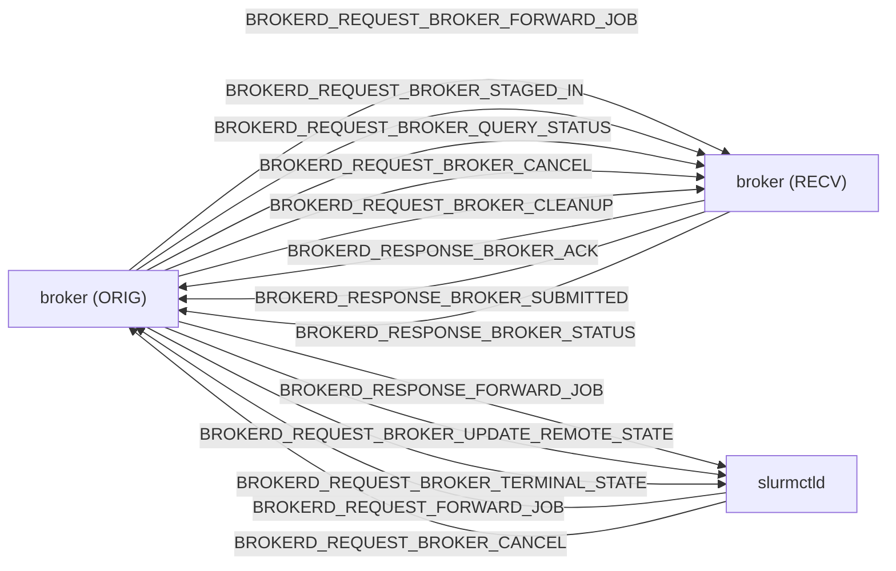

# M04 RPC 协议 pack/unpack Checklist

> 配套: [doc/Broker开发任务清单.md](../Broker开发任务清单.md) §M04
> 设计: [doc/Broker详细设计文档MVP.md](../Broker详细设计文档MVP.md) §6
> Sprint: S1
> 依赖: 无（与 M02/M03 并行）；协调点: ctld 工程师（见 §10）
> 下游: M05 / M06 / M07 / M08 / M13 全部使用本模块定义的 msg_type / payload 结构
> **跨模块单一源头**: 本文档定义所有 11 个 broker `BROKERD_REQUEST_*` / `BROKERD_RESPONSE_*` msg_type 与 payload 字段顺序，**其它文档只引用不重复**。

> **实施纪要 v2（最终设计方向）**:
>
> 经多轮评审，本模块遵循"两边 PR 互不交叉，各改各的文件"原则：
>
> | 通道 | 协议路径 | broker 工程师改 | slurmctld 工程师改 |
> |---|---|---|---|
> | broker ↔ broker（7 个跨集群 RPC）| **broker 自定义 wire frame**（'BRKR' magic）| `src/slurmbrokerd/` 下完整实现 | 不参与 |
> | slurmctld ↔ broker（4 个本机 RPC）| **Slurm 原生 RPC**（`slurm_msg_t` + `pack_msg/unpack_msg` 大 switch + agent 机制）| 仅在 `src/slurmbrokerd/` 下新增**接收 handler** + **发送封装**，参考 slurmd / slurmctld 现有模式 | 在 `src/common/slurm_protocol_*` 注册 4 个 msg_type / payload struct / pack/unpack；ctld 内部新增发送（agent_queue_request）与接收 handler |
>
> 当前 M04 PR 已落地"broker↔broker 自定义协议"全套，并临时为 4 个 ctld↔broker msg_type 提供了 broker 端的自包含 pack/unpack（标记 `LEGACY_M04_TRANSITIONAL`），让 broker 在 ctld PR 落地之前可独立 mock 端到端测试；待 ctld PR 完成 src/common/ 注册后，broker 端 M05 listener PR 切换到 slurm 原生路径并删除该过渡实现。详见 §10 / §11。

---

## 1. 模块概述与目标

### 1.1 一句话定位

为 broker 自定义 RPC 申请 msg_type 段位、定义 payload C 结构、实现 pack/unpack；**完全自包含**于 `src/slurmbrokerd/`。复用 Slurm 公共的 pack 原子函数（`pack8/16/32`、`packstr`、`pack_msg`、`auth_g_pack` 等）但不挂到 Slurm 主线 `pack_msg()` 大 switch；自带 wire frame 让 broker 进程互发的 RPC 不依赖任何 ctld 端改造即可独立编译、单测、部署。

### 1.2 MVP 范围

- 11 个 `BROKERD_*` msg_type 段位（8000-8099）
- 9 个 `BROKERD_ERR_*` 错误码段位（9001-9099）
- 11 套 `brokerd_*_msg_t` 结构 + `brokerd_free_*_msg()` 释放
- 11 套 `_pack_*_msg` / `_unpack_*_msg` + `brokerd_pack_msg` / `brokerd_unpack_msg` dispatcher
- 自定义 wire frame：`[magic 'BRKR'][proto_ver][msg_type][auth_blob][payload]`
- broker 内部 wrapper `proto.c::proto_init` / `proto_send_recv_to_peer`

### 1.3 不在 MVP 范围

- ~~v0.2 自定义 wire format / mTLS~~（M14/v0.2，当前 wire frame 已具备升级位但仅用 munge）
- ~~RPC schema 自动生成~~（按 Slurm 现行手工 pack/unpack 套路）
- ~~复用 `slurm_msg_t.msg_type` 大 switch~~（违背 rule，改自包装）
- ~~`working_cluster_rec` + `slurm_send_recv_node_msg`~~（间接依赖大 switch，改自管理 socket）

### 1.4 与 v0.1 的差异

| 维度 | v0.1 | MVP |
|---|---|---|
| RPC 数量 | ~20+（含调度协商）| 11（精简） |
| msg_type 注册位置 | `src/common/slurm_protocol_defs.h` 大 enum | `src/slurmbrokerd/proto.h` 私有宏（不污染 Slurm 树） |
| pack/unpack 入口 | `pack_msg()` 大 switch 增 11 case | `brokerd_pack_msg()` / `brokerd_unpack_msg()` 私有 dispatcher |
| 错误码 | `slurm_errno.h` 大表 | `proto.h` 私有宏 + `brokerd_strerror()` 自带映射 + 未知码回退 `slurm_strerror()` |
| 收发框架 | `slurm_send_recv_node_msg(working_cluster_rec)` | `slurm_open_msg_conn` + `slurm_msg_sendto` + `slurm_msg_recvfrom_timeout`，自带 wire frame |
| `comment` 字段污染 | 用 `slurm_update_job(comment)` | **禁用**（用 `BROKERD_REQUEST_BROKER_UPDATE_REMOTE_STATE` 推 ctld）|

---

## 2. 接口契约

### 2.1 msg_type 枚举（**单一源头**）

申请连续段 `8000 ~ 8099`。**全部宏定义**在 [src/slurmbrokerd/proto.h](../../src/slurmbrokerd/proto.h)，不再触碰 `slurm_protocol_defs.h`：

```c
/* === src/slurmbrokerd/proto.h ===
 * Range 8000-8099 reserved for slurmbrokerd. Numbers are wire-significant.
 */

/* ctld <-> broker (local munge socket) */
#define BROKERD_REQUEST_FORWARD_JOB                 8001
#define BROKERD_RESPONSE_FORWARD_JOB                8002
#define BROKERD_REQUEST_BROKER_UPDATE_REMOTE_STATE  8003
#define BROKERD_REQUEST_BROKER_TERMINAL_STATE       8004

/* broker <-> broker (peer port) */
#define BROKERD_REQUEST_BROKER_FORWARD_JOB          8010
#define BROKERD_RESPONSE_BROKER_ACK                 8011
#define BROKERD_REQUEST_BROKER_STAGED_IN            8012
#define BROKERD_RESPONSE_BROKER_SUBMITTED           8013
#define BROKERD_REQUEST_BROKER_QUERY_STATUS         8014
#define BROKERD_RESPONSE_BROKER_STATUS              8015
#define BROKERD_REQUEST_BROKER_CANCEL               8016
#define BROKERD_REQUEST_BROKER_CLEANUP              8017
```

> 任何其它 broker 模块（M05/M06/M07/M08/M13）若引用，**仅 include `src/slurmbrokerd/proto.h`**，不复制定义。
> ctld 端工程师按 §10 在自己的本地头里复刻这同一段宏；保证段位号一致即可与 broker 互通。

### 2.2 错误码（**单一源头**）

```c
/* src/slurmbrokerd/proto.h, 9001-9099 reserved for broker */
#define BROKERD_ERR_OVERLOAD                  9001 /* > MaxInFlightJobs */
#define BROKERD_ERR_NO_USER_MAPPING           9002
#define BROKERD_ERR_USER_MAPPING_MISMATCH     9003
#define BROKERD_ERR_HOP_EXCEEDED              9004
#define BROKERD_ERR_LOOKUP_FAILED             9005
#define BROKERD_ERR_LOOKUP_TIMEOUT            9006
#define BROKERD_ERR_STAGE_FAILED              9007
#define BROKERD_ERR_REMOTE_SUBMIT_FAILED      9008
#define BROKERD_ERR_NOT_FOUND                 9009
```

`brokerd_strerror(int rc)` 在 [src/slurmbrokerd/proto.c](../../src/slurmbrokerd/proto.c) 内自带映射（中英文双语），未知 rc 回退到 `slurm_strerror(rc)`。

### 2.3 11 个 payload 结构（字段顺序 wire-significant）

> 全部定义在 [src/slurmbrokerd/proto.h](../../src/slurmbrokerd/proto.h)。结构体名一律 `brokerd_*` 前缀，与设计文档其它章节中"通用语境"的 `forward_job_msg_t` 等是**同一份契约的两种命名约定**——broker 端用前缀名，ctld 端可按 §10 自由命名（字段顺序与类型必须一致）。

```c
typedef struct {
	uint32_t   src_job_id;
	uint32_t   src_uid;
	uint32_t   src_gid;
	char      *src_user_name;
	char      *target_cluster;
	char      *src_work_dir;
	char      *script_path;
	char      *account;
	char      *app_name;          /* fed to lookup_software.sh later */
	job_desc_msg_t *job_desc;
} brokerd_forward_job_msg_t;            /* BROKERD_REQUEST_FORWARD_JOB */

typedef struct {
	uint32_t   error_code;
	char      *trace_id;
} brokerd_forward_job_resp_msg_t;       /* BROKERD_RESPONSE_FORWARD_JOB */

typedef struct {
	char      *trace_id;
	uint8_t    hop_count;
	char      *src_cluster;
	uint32_t   src_job_id;
	char      *src_user_name;
	char      *remote_user_name;
	char      *target_partition;
	char      *app_name;
	job_desc_msg_t *job_desc;
} brokerd_broker_forward_job_msg_t;     /* BROKERD_REQUEST_BROKER_FORWARD_JOB */

typedef struct {
	uint32_t   error_code;
	char      *trace_id;
	char      *dst_work_dir;          /* receiver-created path */
} brokerd_broker_ack_msg_t;             /* BROKERD_RESPONSE_BROKER_ACK */

typedef struct {
	char      *trace_id;
} brokerd_broker_staged_in_msg_t;       /* BROKERD_REQUEST_BROKER_STAGED_IN */

typedef struct {
	uint32_t   error_code;
	char      *trace_id;
	uint32_t   remote_job_id;
} brokerd_broker_submitted_msg_t;       /* BROKERD_RESPONSE_BROKER_SUBMITTED */

typedef struct {
	uint32_t   trace_id_count;
	char     **trace_ids;
} brokerd_broker_query_status_msg_t;    /* BROKERD_REQUEST_BROKER_QUERY_STATUS */

typedef struct {
	char      *trace_id;
	uint32_t   remote_state;
	time_t     remote_start_time;
	time_t     remote_end_time;
	char      *remote_alloc_tres;
	int32_t    remote_exit_code;
} brokerd_broker_status_entry_t;        /* nested inside RESPONSE_BROKER_STATUS */

typedef struct {
	uint32_t   entry_count;
	brokerd_broker_status_entry_t *entries;
} brokerd_broker_status_msg_t;          /* BROKERD_RESPONSE_BROKER_STATUS */

typedef struct {
	uint32_t   src_job_id;        /* set when from ctld */
	char      *trace_id;          /* set when from peer broker */
} brokerd_broker_cancel_msg_t;          /* BROKERD_REQUEST_BROKER_CANCEL */

typedef struct {
	char      *trace_id;
} brokerd_broker_cleanup_msg_t;         /* BROKERD_REQUEST_BROKER_CLEANUP */

typedef struct {
	uint32_t   src_job_id;
	char      *trace_id;
	char      *remote_cluster_name;
	char      *remote_partition_name;
	uint32_t   remote_job_id;
	uint32_t   remote_state;
	char      *remote_alloc_tres;
	time_t     remote_start_time;
} brokerd_broker_remote_state_msg_t;    /* BROKERD_REQUEST_BROKER_UPDATE_REMOTE_STATE */

typedef struct {
	brokerd_broker_remote_state_msg_t base;
	time_t     remote_end_time;
	int32_t    remote_exit_code;
} brokerd_broker_terminal_state_msg_t;  /* BROKERD_REQUEST_BROKER_TERMINAL_STATE */
```

### 2.4 自定义 wire frame

每个 RPC 的请求/响应在 socket 上是一段以 4 字节大端长度前缀打头的字节流（由 `slurm_msg_sendto` 自动加），剥前缀后内容如下：

```text
+-----------------+--------------+--------------+----------------+----------------+
| magic (u32)     | proto_ver    | msg_type     | auth_blob      | payload_blob   |
| 'BRKR'/0x524B5242 | (u16)      | (u16)        | (auth_g_pack)  | (brokerd_pack) |
+-----------------+--------------+--------------+----------------+----------------+
```

- `magic` 错的帧立即丢弃。
- `proto_ver` 当前固定 `SLURM_PROTOCOL_VERSION`，预留协议版本协商位（v0.2 引入跨大版本兼容时使用）。
- `auth_blob` 走 `auth_g_create / auth_g_pack`，对端 `auth_g_unpack + auth_g_verify`，复用 munge plugin（依赖 `slurm_init(NULL)` 已经把 auth plugin rack 拉起）。
- `payload_blob` 由 `brokerd_pack_msg(msg_type, payload, proto_ver, buffer)` 写入；解析路径对称。
- `job_desc_msg_t *` 字段在 payload 内部用"内嵌长度前缀 blob"承载——broker 自己开一个 inner `buf_t`，调 `pack_msg(slurm_msg_t{ msg_type=REQUEST_SUBMIT_BATCH_JOB, data=job_desc })` 走 Slurm 公开 API，再 `packmem` 到外帧；反向用 `unpackmem_xmalloc + create_buf + unpack_msg`。**这是绕开 `_pack_job_desc_msg` 是 file-static 的唯一不动 Slurm 内核的做法**。

### 2.5 broker 内部 wrapper API

```c
/* src/slurmbrokerd/proto.h */
extern int  proto_init(void);
extern void proto_fini(void);

/*
 * 同步发送 RPC 给远端 broker，等待响应。
 *
 * msg_type   - BROKERD_REQUEST_BROKER_*
 * req        - payload 结构指针（caller 持有所有权，调用方负责 free 自己的）
 * timeout_s  - connect+send+recv 整体超时秒数；<=0 走默认 30s
 * resp_type  - 期望的响应 msg_type；不匹配视为协议错误
 * resp_out   - 解出的响应 payload，调用方负责 brokerd_free_msg_data(resp_type, *resp_out)
 *
 * 返回 SLURM_SUCCESS / SLURM_ERROR / BROKERD_ERR_*。
 */
extern int proto_send_recv_to_peer(uint16_t msg_type, void *req,
                                   int timeout_s,
                                   uint16_t resp_type, void **resp_out);

/* free 单个 payload；msg_type 用于 dispatcher。 */
extern void brokerd_free_msg_data(uint16_t msg_type, void *data);

/* 只读 helper：日志友好。 */
extern const char *brokerd_msg_type_str(uint16_t msg_type);
extern const char *brokerd_strerror(int rc);
```

### 2.6 全局变量

| 名称 | 类型 | 用途 | 文件 |
|---|---|---|---|
| `g_peer_addr` | `slurm_addr_t`（static） | proto_init 时按 `g_broker_conf.remote_broker_host:remote_broker_port` 解析填好 | `proto.c` |
| `g_peer_host` / `g_peer_port` | `char *` / `uint16_t`（static） | 日志/错误信息打印用 | `proto.c` |

> **注意**：本 MVP **不再使用** `working_cluster_rec` 全局指针（其依赖 `slurm_send_recv_node_msg` → `pack_msg` 大 switch，会触碰 Slurm 内核）。

---

## 3. 参考代码

| 用途 | 文件 | 说明 |
|---|---|---|
| `slurm_msg_t_init` | [src/common/slurm_protocol_defs.h](../../src/common/slurm_protocol_defs.h) | 初始化嵌套 `slurm_msg_t` for `pack_msg` 时用 |
| `pack_msg` / `unpack_msg` | [src/common/slurm_protocol_pack.h](../../src/common/slurm_protocol_pack.h) | 仅用于 job_desc_msg 间接序列化 |
| `slurm_open_msg_conn` | [src/common/slurm_protocol_api.h](../../src/common/slurm_protocol_api.h) | 创建 TCP 流 socket 并 connect |
| `slurm_msg_sendto` / `slurm_msg_recvfrom_timeout` | [src/common/slurm_protocol_socket.h](../../src/common/slurm_protocol_socket.h) | 自带 4 字节 length-prefix 的 raw 收发 |
| `auth_g_*` | [src/interfaces/auth.h](../../src/interfaces/auth.h) | wire frame 的 munge auth |
| `slurm_set_addr` | [src/common/slurm_protocol_api.h](../../src/common/slurm_protocol_api.h) | host:port → slurm_addr_t |
| `pack8/16/32/str/time` | [src/common/pack.h](../../src/common/pack.h) | wire format 原子 |
| `slurm_strerror` | [slurm/slurm_errno.h](../../slurm/slurm_errno.h) | `brokerd_strerror` 兜底回退 |

---

## 4. 文件清单

| 文件 | 类型 | 用途 |
|---|---|---|
| [src/slurmbrokerd/proto.h](../../src/slurmbrokerd/proto.h) | 新增 | 11 个 msg_type、9 个错误码、11 个 payload struct、所有 free/pack/unpack/wrapper API 声明 |
| [src/slurmbrokerd/proto_pack.c](../../src/slurmbrokerd/proto_pack.c) | 新增 | 11 套 `_pack_*_msg` / `_unpack_*_msg` + nested status entry + `brokerd_pack_msg` / `brokerd_unpack_msg` dispatcher + `brokerd_msg_type_str` |
| [src/slurmbrokerd/proto.c](../../src/slurmbrokerd/proto.c) | 新增 | 12 个 `brokerd_free_*_msg` + `brokerd_free_msg_data` dispatcher + `brokerd_strerror`（中英文）+ wire frame 构建/解析 + `proto_init/fini` + `proto_send_recv_to_peer` |
| [src/slurmbrokerd/Makefile.am](../../src/slurmbrokerd/Makefile.am) | 修改 | `slurmbrokerd_SOURCES` 增加 3 个新文件 |
| [src/slurmbrokerd/slurmbrokerd.c](../../src/slurmbrokerd/slurmbrokerd.c) | 修改 | `broker_init` 增 `slurm_init(NULL)` + `proto_init`，`broker_fini` 增 `proto_fini` + `slurm_fini` |
| `tests/broker/test_proto_roundtrip.c` | 新增（M04-T3 DoD）| 11 套 round-trip 单测；只 link libslurm + broker 三个 .c，无需起 socket |

> ⚠️ **未列**于本表的 `src/common/slurm_protocol_*` 与 `src/common/slurm_errno.*` **均不修改**——这是 broker rule 与本 checklist 的硬性约束。

---

## 5. 数据流图



> ctld → broker / broker → ctld 的 5 个箭头需要 ctld 端按 §10 实现对称 send/recv 才能跑通；broker → broker 的 8 个箭头本 PR 内即可联调。

---

## 6. 任务展开

### M04-T1 申请 msg_type 段位与错误码

- **依赖**: 无
- **预估**: 0.5d
- **关键决策**:
  1. 选 8000-8099 段位避免与 slurmrestd 内部 RPC 段位冲突；本号段定义在 `src/slurmbrokerd/proto.h`，与 Slurm 主线 `slurm_msg_type_t` 互不可见。
  2. `brokerd_strerror()` 表必须为每个 `BROKERD_ERR_*` 写中英文（中文供运维，英文供 grep）。
  3. 在 `proto.h` 顶部加注释段说明保留段位与与 §10 的对接契约。
- **风险与坑**: 无外部协调成本——段位号定义在 broker 自己的头文件里。
- **DoD**:
  - [ ] `brokerd_strerror(BROKERD_ERR_OVERLOAD)` 返回非 NULL 字符串
  - [ ] `grep -r 'BROKERD_REQUEST_FORWARD_JOB ' src/slurmbrokerd/` 仅命中 `proto.h` 一处定义

### M04-T2 定义 payload C 结构 + free

- **依赖**: M04-T1
- **预估**: 1d
- **关键决策**:
  1. 字段顺序与 §2.3 完全一致（wire-significant）
  2. 每个 `brokerd_*_msg_t` 都有 `brokerd_free_*_msg(brokerd_*_msg_t *)`，`xfree` 释放所有 char* 与 nested
  3. `brokerd_free_msg_data(uint16_t msg_type, void *data)` 是 dispatcher，未知 type 走 `warning()` 不 crash
- **代码草图** (实际见 [proto.c](../../src/slurmbrokerd/proto.c))：

```c
void brokerd_free_broker_forward_job_msg(brokerd_broker_forward_job_msg_t *m)
{
	if (!m) return;
	xfree(m->trace_id);
	xfree(m->src_cluster);
	xfree(m->src_user_name);
	xfree(m->remote_user_name);
	xfree(m->target_partition);
	xfree(m->app_name);
	if (m->job_desc) slurm_free_job_desc_msg(m->job_desc);
	xfree(m);
}

void brokerd_free_broker_status_msg(brokerd_broker_status_msg_t *m)
{
	if (!m) return;
	if (m->entries) {
		for (uint32_t i = 0; i < m->entry_count; i++) {
			xfree(m->entries[i].trace_id);
			xfree(m->entries[i].remote_alloc_tres);
		}
		xfree(m->entries);
	}
	xfree(m);
}
```

dispatcher：

```c
void brokerd_free_msg_data(uint16_t msg_type, void *data)
{
	if (!data) return;
	switch (msg_type) {
	case BROKERD_REQUEST_BROKER_FORWARD_JOB:
		brokerd_free_broker_forward_job_msg(data); break;
	/* ... 11 个 case ... */
	default:
		warning("%s: unknown msg_type %hu, leaking payload pointer",
		        __func__, msg_type);
	}
}
```

- **风险与坑**:
  - 漏 free char*：valgrind still reachable
  - 多次 free 同一指针：crash → 用 `xfree` 内部置 NULL 防御
- **DoD**:
  - [ ] valgrind: 11 类 msg 各自 1000 次构造 → free 不漏
  - [ ] `brokerd_free_msg_data(msg_type, data)` 对所有 11 类 msg 都正确路由

### M04-T3 pack/unpack 实现（broker → broker 5 个 + Status entry）

- **依赖**: M04-T2
- **预估**: 1.5d
- **关键决策**:
  1. 严格按字段顺序，每个字段 `pack32` / `pack16` / `pack8` / `packstr` / `pack_time`；`job_desc_msg_t *` 走 §2.4 描述的"内嵌 `pack_msg(REQUEST_SUBMIT_BATCH_JOB)` blob"
  2. unpack 镜像；`safe_unpack*` 失败 `goto unpack_error` 调对应 `brokerd_free_*_msg(m)` 释放部分构造的对象
  3. dispatcher `brokerd_pack_msg(msg_type, payload, pv, buffer)` / `brokerd_unpack_msg(msg_type, &payload_out, pv, buffer)` 内的大 switch 串起 11 个 case
- **代码草图**（实际见 [proto_pack.c](../../src/slurmbrokerd/proto_pack.c)）：

```c
static void _pack_broker_forward_job_msg(
	brokerd_broker_forward_job_msg_t *m, buf_t *buffer, uint16_t pv)
{
	packstr(m->trace_id, buffer);
	pack8(m->hop_count, buffer);
	packstr(m->src_cluster, buffer);
	pack32(m->src_job_id, buffer);
	packstr(m->src_user_name, buffer);
	packstr(m->remote_user_name, buffer);
	packstr(m->target_partition, buffer);
	packstr(m->app_name, buffer);
	_pack_job_desc(m->job_desc, buffer, pv);   /* §2.4 nested blob */
}

static int _unpack_broker_forward_job_msg(
	brokerd_broker_forward_job_msg_t **out, buf_t *buffer, uint16_t pv)
{
	brokerd_broker_forward_job_msg_t *m = xmalloc(sizeof(*m));

	safe_unpackstr(&m->trace_id, buffer);
	safe_unpack8(&m->hop_count, buffer);
	safe_unpackstr(&m->src_cluster, buffer);
	safe_unpack32(&m->src_job_id, buffer);
	safe_unpackstr(&m->src_user_name, buffer);
	safe_unpackstr(&m->remote_user_name, buffer);
	safe_unpackstr(&m->target_partition, buffer);
	safe_unpackstr(&m->app_name, buffer);
	if (_unpack_job_desc(&m->job_desc, buffer, pv))
		goto unpack_error;
	*out = m;
	return SLURM_SUCCESS;

unpack_error:
	brokerd_free_broker_forward_job_msg(m);
	*out = NULL;
	return SLURM_ERROR;
}
```

`brokerd_broker_status_entry_t` 在 `RESPONSE_BROKER_STATUS` 内嵌套打包：先 `pack32(entry_count)` 再循环。

- **风险与坑**:
  - protocol_version 跳变时 wire format 不兼容；MVP 只接受 `>= SLURM_MIN_PROTOCOL_VERSION`，过低对端 dispatcher 直接返回 `SLURM_ERROR`（不 fatal，给 caller 处理空间）
  - `safe_unpackstr` 失败必须 `goto unpack_error` 释放半成品；统一调 free 函数复用清理逻辑
  - `_pack_job_desc` 嵌套 `pack_msg` 失败时回退写入 0-长度 blob，对端可识别为"job_desc 缺失"
- **DoD**:
  - [ ] `tests/broker/test_proto_roundtrip.c` 单测：构造 → `brokerd_pack_msg` → `brokerd_unpack_msg` → deep equal
  - [ ] 5 个 broker→broker msg + status entry 都过 round-trip
  - [ ] valgrind clean

### M04-T4 pack/unpack 实现（ctld ↔ broker 4 个）

- **依赖**: M04-T3
- **预估**: 1d
- **关键决策**:
  1. 与 T3 同模式（同一份 dispatcher、同一种 free 路径）
  2. 与 ctld 工程师跨进程对齐：参见 §10。broker 端 PR 内可用 mock socket pair 跑双向单测，无需等 ctld 端就绪
- **DoD**:
  - [ ] 4 个 ctld↔broker msg round-trip 通过
  - [ ] mock ctld handler 收到 `BROKERD_REQUEST_BROKER_UPDATE_REMOTE_STATE` 时 `comment` 字段保持空（不污染）
  - [ ] mock ctld → broker 走完整 `slurm_open_msg_conn` + wire frame 路径，能解出 `BROKERD_REQUEST_FORWARD_JOB` 全字段

### M04-T5 broker wrapper `proto.c/.h`

- **依赖**: M04-T3 / M04-T4
- **预估**: 0.5d
- **关键决策**:
  1. `proto_init`：从 `g_broker_conf.remote_broker_host:remote_broker_port` 解析 `slurm_addr_t` 并缓存为 `static`；记录 host/port 字符串供日志
  2. `proto_send_recv_to_peer`：自管理 socket 生命周期 —— `slurm_open_msg_conn(&g_peer_addr)` 拿 fd → `_build_wire_frame` → `slurm_msg_sendto` → `slurm_msg_recvfrom_timeout(timeout_ms)` → `_parse_wire_frame` → `close(fd)`
  3. **不**使用 `working_cluster_rec` / `slurm_send_recv_node_msg`（避免触碰大 switch）
  4. `slurm_init(NULL)` 必须在 `proto_init` 之前先调（已在 `broker_init` wire-up 中安排）；否则 `auth_g_create` 会 abort
- **代码草图**（实际见 [proto.c](../../src/slurmbrokerd/proto.c)）：

```c
int proto_init(void)
{
	if (proto_inited) return SLURM_SUCCESS;
	if (!g_broker_conf.remote_broker_host || !g_broker_conf.remote_broker_port)
		return SLURM_ERROR;
	g_peer_host = xstrdup(g_broker_conf.remote_broker_host);
	g_peer_port = g_broker_conf.remote_broker_port;
	slurm_set_addr(&g_peer_addr, g_peer_port, g_peer_host);
	proto_inited = true;
	info("proto: peer endpoint = %s:%u", g_peer_host, g_peer_port);
	return SLURM_SUCCESS;
}

int proto_send_recv_to_peer(uint16_t msg_type, void *req,
                            int timeout_s, uint16_t resp_type, void **resp_out)
{
	int timeout_ms = (timeout_s > 0) ? timeout_s * 1000 : 30000;
	buf_t *send_buf = init_buf(BUF_SIZE);

	if (_build_wire_frame(send_buf, msg_type, req, SLURM_PROTOCOL_VERSION))
		{ FREE_NULL_BUFFER(send_buf); return SLURM_ERROR; }

	int fd = slurm_open_msg_conn(&g_peer_addr);
	if (fd < 0) { FREE_NULL_BUFFER(send_buf); return SLURM_ERROR; }

	ssize_t sent = slurm_msg_sendto(fd, get_buf_data(send_buf),
	                                 get_buf_offset(send_buf));
	FREE_NULL_BUFFER(send_buf);
	if (sent < 0) { close(fd); return SLURM_ERROR; }

	char *raw = NULL; size_t raw_len = 0;
	if (slurm_msg_recvfrom_timeout(fd, &raw, &raw_len, timeout_ms) < 0) {
		close(fd); return SLURM_ERROR;
	}
	close(fd);

	buf_t *recv_buf = create_buf(raw, raw_len);
	uint16_t got_mtype = 0, got_pv = 0;
	void *payload = NULL;
	int rc = _parse_wire_frame(recv_buf, &got_mtype, &got_pv, &payload);
	FREE_NULL_BUFFER(recv_buf);
	if (rc) return SLURM_ERROR;

	if (got_mtype != resp_type) {
		brokerd_free_msg_data(got_mtype, payload);
		return SLURM_ERROR;
	}
	*resp_out = payload;
	return SLURM_SUCCESS;
}
```

- **风险与坑**:
  - `slurm_open_msg_conn` 自身没有 connect 超时；MVP 接受默认 5-30s。若 peer 主机不可达，TCP 重试会拖慢恢复。M14/v0.2 改为 nonblocking connect + `poll(POLLOUT, timeout)`
  - `auth_g_create/pack/unpack/verify` 要求 `slurm_init(NULL)` 已经把 auth plugin rack 拉起；否则 `auth_g_create` 会 abort（xassert）
  - `resp_msg.data` 所有权转给调用方，调用方负责 `brokerd_free_msg_data(resp_type, *resp_out)`
- **DoD**:
  - [ ] `proto_init` + `proto_fini` 1000 次循环 valgrind clean
  - [ ] mock peer 关闭端口 → 客户端在 `timeout_s` 内返回 SLURM_ERROR，不阻塞主线程

---

## 7. 整体 DoD（汇总）

- [ ] 5 个子任务全部勾选
- [ ] 11 套 round-trip 单测全部 pass（无需起 socket，直接 buf_t 驱动）
- [ ] mock ctld（按 §10 范式）跨进程联调通过
- [ ] valgrind: pack/unpack 1000 次循环 clean
- [ ] 与 slurm 主线 master rebase 无 wire format 冲突（msg_type 段位与 errno 段位都在 broker 私有头里，0 冲突点）

---

## 8. 验证脚本

```bash
# 单元（broker 内部 round-trip，不动 socket）
gcc -I. -Isrc -o /tmp/test_proto_roundtrip \
    src/slurmbrokerd/proto.c \
    src/slurmbrokerd/proto_pack.c \
    tests/broker/test_proto_roundtrip.c \
    -lslurm
/tmp/test_proto_roundtrip

# 期望输出：
# [PASS] BROKERD_REQUEST_FORWARD_JOB roundtrip
# [PASS] BROKERD_RESPONSE_FORWARD_JOB roundtrip
# [PASS] BROKERD_REQUEST_BROKER_FORWARD_JOB roundtrip
# ... 11/11 ...

# 集成（与 ctld mock，按 §10 接入指南实现的 mock 进程）
./tests/broker/proto_xprocess_test.sh
# 起两个 mock：mock_ctld 监听 8442，mock_broker 监听 8443
# mock_ctld 发 BROKERD_REQUEST_FORWARD_JOB（按 §10 §3 范式封装）
# mock_broker 解析后回 BROKERD_RESPONSE_FORWARD_JOB
# 校验字段
```

---

## 9. 风险与回滚

| 风险 | 触发 | 缓解 |
|---|---|---|
| msg_type 段位与 slurm 主线 master 后续冲突 | 上游同区间分配新 msg | 段位号定义在 broker 自有头文件，互不可见，理论上无冲突；仅当 ctld 端复刻时同步保持一致即可 |
| protocol_version 跳变 | slurm 大版本升级 | wire frame 已预留 `proto_ver` 字段；pack/unpack 内可加 if-else 分支保留两版兼容 |
| `auth_g_create` 失败 | broker_init 漏调 `slurm_init(NULL)` | broker_init 顺序固化：`broker_conf_init → slurm_init(NULL) → ... → proto_init`，CI 校验 |
| `comment` 字段被某模块误调 `slurm_update_job` | 漏审 PR | grep CI 检查 + 设计文档 §6 黑名单备注；broker 端 RPC 出口已自带"用 `BROKERD_REQUEST_BROKER_UPDATE_REMOTE_STATE`"语义 |
| ctld 端段位号写错 | §10 §1 文档遗漏 | ctld 端 review 时用 `diff` 比对本 checklist §2.1 与 ctld 私有头 |

回滚：本模块完全自包含于 `src/slurmbrokerd/`，回滚步骤：

1. `git revert` proto.h / proto.c / proto_pack.c 三个新文件
2. `git revert` slurmbrokerd.c 中 `proto_init/fini` 与 `slurm_init/fini` 调用
3. `git revert` Makefile.am 中的 SOURCES 增补
4. 重建 broker 二进制；libslurm 不受影响

> **重要**：M04 一旦上线，wire format 变更需要协议版本升级机制，**不能**直接改字段顺序。

---
## 10. 跨进程协议契约（slurm 端 ↔ broker 端，互不交叉的两个 PR）

> 本节是给 **slurm 端工程师**与 **broker 端工程师**的共同契约。两边各自 PR 互不交叉、各改各的文件；本 §10 是字段顺序、msg_type 段位、错误码段位的**单一文档源头**——任何后续字段调整以本文档为准，两侧同步修改各自代码。

### 10.1 设计原则（**最重要，先看这块**）

```text
┌────────────────────────────────────────────────────────────────────┐
│                                                                    │
│  通道 1：broker ↔ broker （跨集群，7 个 RPC）                        │
│  ────────────────────────────────────────────                      │
│  路径：broker 私有 wire frame（'BRKR' magic）+ munge auth          │
│  归属：broker 工程师；全部代码在 src/slurmbrokerd/ 下                │
│  与 slurm 主线无任何交叉；ctld 工程师不感知                          │
│                                                                    │
├────────────────────────────────────────────────────────────────────┤
│                                                                    │
│  通道 2：slurmctld ↔ slurmbrokerd （本机，4 个 RPC）                 │
│  ────────────────────────────────────────────                      │
│  路径：Slurm 原生 RPC                                               │
│         - 走 slurm_msg_t / pack_msg / unpack_msg 大 switch         │
│         - 发送方走 ctld agent 机制 / slurm_send_recv_controller_*   │
│         - 接收方走 slurm_receive_msg_and_forward + dispatch         │
│                                                                    │
│  分工：                                                             │
│         slurmctld 工程师：在 src/common/ 注册 4 个 msg_type、       │
│                            payload struct、pack/unpack；ctld 内部 │
│                            新增发送 + handler                      │
│         broker 工程师：    在 src/slurmbrokerd/ 下新增 listener     │
│                            （参考 slurmd）+ 业务 handler +         │
│                            发送封装（参考 slurmctld→slurmd 的      │
│                            slurm_send_recv_controller_rc_msg）    │
│                                                                    │
│  两个 PR 完全独立提交，凭借本 §10 字段契约对齐                      │
│                                                                    │
└────────────────────────────────────────────────────────────────────┘
```

**绝对原则**：

| 原则 | broker 工程师 | slurmctld 工程师 |
|---|---|---|
| 改动只在自己负责的目录 | `src/slurmbrokerd/` | `src/common/`（msg_type/struct/pack）+ `src/slurmctld/`（业务 handler） |
| 互不修改对方的代码 | 不写一行 ctld 代码 | 不写一行 broker 代码 |
| 共同遵循契约 | 字段顺序/段位号严格按本 §10 | 同 |
| 联调对齐方式 | 双方 PR 落地后共享同一份 libslurm.so，broker 启动时通过 unpack_msg 自动识别 ctld 注册的 msg_type | 同 |

### 10.2 端口拓扑（**与之前版本相比简化了：ctld 只用 6817**）

| 监听方 | 端口 | 配置项 | 谁主动连 |
|---|---|---|---|
| **broker** | 8442 | `broker.conf:CtldPort` | 本机 ctld 主动连 |
| **broker** | 8443 | `broker.conf:PeerPort` | 远端 broker 主动连 |
| **slurmctld** | 6817 | `slurm.conf:SlurmctldPort` | broker 用 `slurm_send_recv_controller_rc_msg` 主动连 |

**ctld 不开新端口、不读 broker.conf**。broker→ctld 走 ctld 现有的 SlurmctldPort 6817，由 ctld 现有 listener accept 后通过 `unpack_msg` 大 switch 识别新注册的 4 个 msg_type 并 dispatch 到新 handler——这是 slurmctld 内部的常规扩展模式，与 slurmctld 收 `REQUEST_NODE_REGISTRATION_STATUS` 等本地 RPC 完全一致。

### 10.3 slurmctld 工程师的 PR 范围（**独立提交，broker 工程师不参与**）

| 文件 | 改动 |
|---|---|
| `src/common/slurm_protocol_defs.h` | 加 4 个 msg_type 段位定义（沿用 8001/8002/8003/8004，**段位号严格对齐 §10.5**）+ 4 个 payload struct（**字段顺序严格对齐 §10.6**） |
| `src/common/slurm_protocol_defs.c` | `slurm_free_msg_data()` switch 加 4 个 case → 调对应 `slurm_free_*_msg(data)` |
| `src/common/slurm_protocol_pack.c` | `pack_msg()` / `unpack_msg()` 大 switch 各加 4 个 case → 调对应 `_pack_*_msg` / `_unpack_*_msg`；新增 4 套 `_pack_*_msg` / `_unpack_*_msg` 静态函数（参考 `_pack_job_desc_msg` 范式） |
| `src/common/slurm_protocol_pack.h` | 4 个 `slurm_free_*_msg` extern 声明 |
| `src/common/slurm_errno.h`（可选）| 9 个 `ESLURM_BROKER_*` 错误码段位（如果 ctld 端处理 broker 推送时希望返回这些 errno 给客户端） |
| `src/common/slurm_errno.c`（可选）| `slurm_strerror()` 增加对应字符串 |
| `src/slurmctld/proc_req.c` | `slurmctld_req()` switch 加 4 个 case → 调 ctld 端新增的 handler |
| `src/slurmctld/<新文件 brokerd_interop.c>` | ctld 端**接收 handler**（写 `job_record_t.remote_*` 字段；不写 `comment`）+ ctld 端**发送封装**（构造 `slurm_msg_t` + `agent_queue_request` 异步发往 broker） |

**ctld 端发送范式**（推荐复用 ctld→slurmd 的 agent 机制）：

```c
/* src/slurmctld/brokerd_interop.c (ctld 工程师维护) */

void ctld_forward_job_to_broker(forward_job_msg_t *fj_msg)
{
	agent_arg_t *agent_arg = xmalloc(sizeof(agent_arg_t));

	agent_arg->msg_type   = REQUEST_FORWARD_JOB;          /* 8001 */
	agent_arg->msg_args   = fj_msg;                       /* 由 agent 释放 */
	agent_arg->retry      = true;
	agent_arg->node_count = 1;
	agent_arg->hostlist   = hostlist_create("localhost"); /* broker 在本机 */
	agent_arg->addr       = xmalloc(sizeof(slurm_addr_t));
	slurm_set_addr(agent_arg->addr, BROKER_CTLD_PORT,    /* 8442 */
	               "localhost");

	agent_queue_request(agent_arg);
	/* agent 线程会异步发，自带重试/超时/forward tree */
}
```

**ctld 端接收范式**（在现有 `slurmctld_req()` switch 加 case）：

```c
/* src/slurmctld/proc_req.c (ctld 工程师维护) */

void slurmctld_req(slurm_msg_t *msg, connection_arg_t *arg)
{
	switch (msg->msg_type) {
	/* ... 已有 case ... */
	case REQUEST_BROKER_UPDATE_REMOTE_STATE:        /* 8003 */
		_handle_broker_update_remote_state(msg);
		break;
	case REQUEST_BROKER_TERMINAL_STATE:             /* 8004 */
		_handle_broker_terminal_state(msg);
		break;
	/* RESPONSE_FORWARD_JOB / RESPONSE_BROKER_* 走 agent 回调路径 */
	}
}

static void _handle_broker_update_remote_state(slurm_msg_t *msg)
{
	broker_remote_state_msg_t *m = msg->data;
	job_record_t *job_ptr;

	/* auth：必须是 SlurmUser (broker 进程身份) */
	if (msg->auth_uid != slurm_conf.slurm_user_id) {
		slurm_send_rc_msg(msg, ESLURM_USER_ID_MISSING);
		return;
	}
	job_ptr = find_job_record(m->src_job_id);
	if (!job_ptr) {
		slurm_send_rc_msg(msg, ESLURM_INVALID_JOB_ID);
		return;
	}
	/* 写独立字段；不写 comment */
	xfree(job_ptr->remote_cluster_name);
	job_ptr->remote_cluster_name = xstrdup(m->remote_cluster_name);
	xfree(job_ptr->remote_partition_name);
	job_ptr->remote_partition_name = xstrdup(m->remote_partition_name);
	job_ptr->remote_job_id     = m->remote_job_id;
	job_ptr->remote_state      = m->remote_state;
	xfree(job_ptr->remote_alloc_tres);
	job_ptr->remote_alloc_tres = xstrdup(m->remote_alloc_tres);
	job_ptr->remote_start_time = m->remote_start_time;

	slurm_send_rc_msg(msg, SLURM_SUCCESS);
}
```

> ctld 工程师 PR 的代码量不大（~500 行），关键是**所有改动只在 ctld 树和 src/common/ 下**，与 broker 端 PR 互不依赖。

### 10.4 broker 工程师的配套 PR 范围（**独立提交，slurmctld 工程师不参与**）

> ⚠️ 当前 M04 PR 已落地"broker↔broker 自定义协议"全套；本节描述的"配套切换"将在 **M05 listener PR** 中完成，**不属于本 M04 PR**。在 ctld PR 落地前，broker 端继续走 §1-§9 描述的自定义 wire frame 路径完成 mock 端到端测试。

| 阶段 | broker 端文件 | 改动 |
|---|---|---|
| **当前 M04 PR**（已完成）| `src/slurmbrokerd/proto.{h,c}` / `proto_pack.c` | 11 套自定义 wire frame；4 个 ctld↔broker msg_type 标 `LEGACY_M04_TRANSITIONAL` |
| **M05 listener PR**（ctld PR 落地后）| `src/slurmbrokerd/listener.c`（新增）| 参考 [src/slurmd/slurmd/slurmd.c::_service_connection](../../src/slurmd/slurmd/slurmd.c) 模式：`slurm_init_msg_engine_port` → `slurm_accept_msg_conn` → `slurm_receive_msg_and_forward` → `brokerd_req(msg)` |
| **M05 listener PR**（同上）| `src/slurmbrokerd/handler.c`（新增）| `brokerd_req(slurm_msg_t *)` switch by `msg->msg_type`：<br>• 4 个 ctld↔broker → 直接拿 `msg->data` 操作 ctld 注册的原生 struct，调业务函数<br>• 7 个 broker↔broker → 走 broker 私有 wire frame（保留 §1-§9 路径） |
| **M05 listener PR**（同上）| `src/slurmbrokerd/egress.c`（M08 范围，提前预告）| broker→ctld 发送用 `slurm_send_recv_controller_rc_msg(slurm_msg_t)` 直发 ctld 6817；不再走 broker 私有 wire frame |
| **M05 listener PR**（同上）| `src/slurmbrokerd/proto.{h,c,_pack.c}` | **删除** 4 个 ctld↔broker 的 `BROKERD_REQUEST_FORWARD_JOB` 等宏 + struct + pack/unpack/free 实现（即所有 `LEGACY_M04_TRANSITIONAL` 标记的代码块）；保留 7 个 broker↔broker 的全套 |

**broker 端接收范式**（M05 listener PR，参考 slurmd）：

```c
/* src/slurmbrokerd/listener.c (broker 工程师维护，M05 PR) */

static void *_service_connection(void *arg)
{
	conn_t *con = arg;
	slurm_msg_t *msg = xmalloc(sizeof(*msg));

	slurm_msg_t_init(msg);
	msg->flags |= SLURM_MSG_KEEP_BUFFER;

	/* 走 slurm 原生 RPC：unpack_msg 会按 ctld 注册的大 switch 识别
	 * 4 个 ctld↔broker msg_type，broker 端无需额外注册。 */
	if (slurm_receive_msg_and_forward(con->fd, con->cli_addr, msg)) {
		slurm_send_rc_msg(msg, SLURM_ERROR);
		goto out;
	}

	/* auth 校验：必须是 SlurmUser（ctld 进程的身份） */
	if (msg->auth_uid != slurm_conf.slurm_user_id) {
		slurm_send_rc_msg(msg, ESLURM_USER_ID_MISSING);
		goto out;
	}

	brokerd_req(msg);

out:
	close(msg->conn_fd);
	slurm_free_msg(msg);
	xfree(con->cli_addr);
	xfree(con);
	return NULL;
}

void brokerd_req(slurm_msg_t *msg)
{
	switch (msg->msg_type) {
	case REQUEST_FORWARD_JOB:           /* 8001, ctld→broker */
		_handle_forward_job(msg);
		break;
	case REQUEST_BROKER_CANCEL:         /* 8016, ctld→broker 或 broker→broker */
		_handle_broker_cancel(msg);
		break;
	/* ... 其它 ctld↔broker msg_type 在此 dispatch ... */

	/* broker↔broker 7 个 msg_type：仍走 broker 私有 wire frame，
	 * 由 PeerPort 8443 的另一个 listener 处理（不进入此 switch）。 */

	default:
		error("brokerd_req: unsupported msg_type %u",
		      msg->msg_type);
		slurm_send_rc_msg(msg, SLURM_ERROR);
	}
}
```

**broker 端发送范式**（M05 listener PR / M08 egress PR）：

```c
/* src/slurmbrokerd/egress.c (broker 工程师维护，M08 PR) */

int egress_push_remote_state_to_ctld(broker_job_t *job)
{
	slurm_msg_t msg;
	broker_remote_state_msg_t payload = {
		.src_job_id            = job->src_job_id,
		.trace_id              = job->trace_id,
		.remote_cluster_name   = job->dst_cluster,
		.remote_partition_name = job->target_partition,
		.remote_job_id         = job->remote_job_id,
		.remote_state          = _broker_state_to_slurm_state(job->state),
		.remote_alloc_tres     = job->remote_alloc_tres,
		.remote_start_time     = job->remote_start_time,
	};
	int rc;

	slurm_msg_t_init(&msg);
	msg.msg_type = REQUEST_BROKER_UPDATE_REMOTE_STATE;   /* 8003 */
	msg.data     = &payload;

	/* 直接连 ctld SlurmctldPort 6817；working_cluster_rec=NULL 走默认。 */
	if (slurm_send_recv_controller_rc_msg(&msg, &rc, NULL)) {
		error("egress: push remote state for %s failed: %m",
		      job->trace_id);
		return SLURM_ERROR;
	}
	if (rc != SLURM_SUCCESS) {
		error("egress: ctld rejected remote state for %s: %s",
		      job->trace_id, slurm_strerror(rc));
		return rc;
	}
	debug("egress: pushed remote state for %s, ctld accepted",
	      job->trace_id);
	return SLURM_SUCCESS;
}
```

### 10.5 msg_type 段位（**两边严格对齐**）

| 段位 | 名称 | 方向 | 注册位置 |
|---|---|---|---|
| 8001 | `REQUEST_FORWARD_JOB` | ctld → broker | ctld PR：`src/common/slurm_protocol_defs.h` |
| 8002 | `RESPONSE_FORWARD_JOB` | broker → ctld | 同 |
| 8003 | `REQUEST_BROKER_UPDATE_REMOTE_STATE` | broker → ctld | 同 |
| 8004 | `REQUEST_BROKER_TERMINAL_STATE` | broker → ctld | 同 |
| 8010 | `BROKERD_REQUEST_BROKER_FORWARD_JOB` | broker → broker | broker PR：`src/slurmbrokerd/proto.h`（保留私有）|
| 8011 | `BROKERD_RESPONSE_BROKER_ACK` | broker → broker | 同 |
| 8012 | `BROKERD_REQUEST_BROKER_STAGED_IN` | broker → broker | 同 |
| 8013 | `BROKERD_RESPONSE_BROKER_SUBMITTED` | broker → broker | 同 |
| 8014 | `BROKERD_REQUEST_BROKER_QUERY_STATUS` | broker → broker | 同 |
| 8015 | `BROKERD_RESPONSE_BROKER_STATUS` | broker → broker | 同 |
| 8016 | `REQUEST_BROKER_CANCEL` | ctld → broker，broker → broker | 双注册：ctld 端在 src/common/，broker 端在 proto.h（broker→broker 路径用，宏名前缀 `BROKERD_` 避免冲突，**段位号一致**）|
| 8017 | `BROKERD_REQUEST_BROKER_CLEANUP` | broker → broker | broker PR：`src/slurmbrokerd/proto.h` |

> 8016 是唯一同时被两边引用的段位号——ctld 端注册无前缀的 `REQUEST_BROKER_CANCEL`，broker 端定义带前缀的 `BROKERD_REQUEST_BROKER_CANCEL`，两个宏的值相等。这样：
> • broker 端用 slurm 原生路径接收 ctld 的 cancel 时，`msg->msg_type == REQUEST_BROKER_CANCEL`（来自 src/common/）；
> • broker 端用私有 wire frame 接收/发送跨集群 cancel 时，`msg_type == BROKERD_REQUEST_BROKER_CANCEL`（来自 proto.h）。
> 两个宏值相等，dispatcher 里用 `case REQUEST_BROKER_CANCEL:`（slurm 原生）或 `case BROKERD_REQUEST_BROKER_CANCEL:`（broker 私有）都能匹配。

### 10.6 Payload 字段顺序对照（**bit-by-bit 必须一致**）

下表是 ctld 端 `_pack_*_msg` / `_unpack_*_msg` 必须复刻的字段顺序与类型；这是 ctld ↔ broker 4 个 RPC 的完整契约。broker 端 `proto_pack.c` 当前 `LEGACY_M04_TRANSITIONAL` 段中的 4 套实现是这 4 个字段表的对称镜像，可作为 ctld 端 PR 的字段顺序参考。

> 字段右侧的 `pack32 / pack16 / pack8 / packstr / pack_time` 是**调用顺序**；任何错位都会让 `unpack` 端解出垃圾数据并 leak。

#### 10.6.1 REQUEST_FORWARD_JOB (8001) — ctld → broker

```text
pack32(src_job_id)
pack32(src_uid)
pack32(src_gid)
packstr(src_user_name)
packstr(target_cluster)
packstr(src_work_dir)
packstr(script_path)
packstr(account)
packstr(app_name)
pack_job_desc_msg(job_desc, ...)   /* ctld 端可直接调，因为是同 src/common/ 内部，不再受 file-static 限制 */
```

#### 10.6.2 RESPONSE_FORWARD_JOB (8002) — broker → ctld

```text
pack32(error_code)
packstr(trace_id)
```

#### 10.6.3 REQUEST_BROKER_UPDATE_REMOTE_STATE (8003) — broker → ctld

```text
pack32(src_job_id)
packstr(trace_id)
packstr(remote_cluster_name)
packstr(remote_partition_name)
pack32(remote_job_id)
pack32(remote_state)             /* JOB_PENDING|RUNNING|... 用 Slurm 现有 enum */
packstr(remote_alloc_tres)
pack_time(remote_start_time)
```

#### 10.6.4 REQUEST_BROKER_TERMINAL_STATE (8004) — broker → ctld

```text
/* base 字段：与 §10.6.3 字节级一致 */
pack32(base.src_job_id)
packstr(base.trace_id)
packstr(base.remote_cluster_name)
packstr(base.remote_partition_name)
pack32(base.remote_job_id)
pack32(base.remote_state)
packstr(base.remote_alloc_tres)
pack_time(base.remote_start_time)

/* terminal-only 追加字段 */
pack_time(remote_end_time)
pack32((uint32_t) remote_exit_code)   /* int32_t reinterpret，对端 unpack32 后 cast 回 int32_t */
```

#### 10.6.5 REQUEST_BROKER_CANCEL (8016) — ctld → broker（也用于 broker → broker，字段相同）

```text
pack32(src_job_id)               /* 来自 ctld 时填这个 */
packstr(trace_id)                /* 来自远端 broker 时填这个 */
```

> **注意**：8016 的字段是 ctld→broker 与 broker→broker 共用的，所以 broker 端在 `proto.h` 里定义 `brokerd_broker_cancel_msg_t` 时字段顺序、类型必须与 ctld 端在 `src/common/` 注册的 `broker_cancel_msg_t` 完全相同——否则 broker→broker 路径解出的字段无法直接传给 ctld→broker 路径的 handler。

### 10.7 hard requirement 清单（**两侧 review 时核对**）

#### 10.7.1 slurmctld 端必须满足

1. [ ] msg_type 段位 8001 / 8002 / 8003 / 8004 / 8016 严格对齐 §10.5；其它 8010-8017 段位**不要**注册（broker 私有，避免污染主线）
2. [ ] payload 结构体字段顺序与 §10.6 一致；用 `static_assert(offsetof(...))` 自查
3. [ ] `int32_t remote_exit_code` 走 `pack32((uint32_t)val)` / `unpack32 + (int32_t) cast` 路径
4. [ ] `slurm_free_msg_data()` switch 加 4 个 case；valgrind 1000 次 send/free 循环 clean
5. [ ] handler 收到 `REQUEST_BROKER_UPDATE_REMOTE_STATE` / `REQUEST_BROKER_TERMINAL_STATE` 时**只**写 `job_record_t.remote_*` 独立字段，**不**写 `job_record_t.comment`
6. [ ] handler 校验 `msg->auth_uid == slurm_conf.slurm_user_id`；非 SlurmUser 立刻返回 `ESLURM_USER_ID_MISSING`
7. [ ] handler 收到 `REQUEST_BROKER_CANCEL` 时按 `src_job_id`（来自 ctld）或 `trace_id`（来自远端 broker）二选一查 `job_record_t`；trace_id 优先
8. [ ] `agent_queue_request` 发送时 `agent_arg.retry=true`，让 agent 自带重试覆盖 broker 进程瞬时不可用
9. [ ] **不**修改 `src/slurmbrokerd/` 下任何文件

#### 10.7.2 broker 端（M05 listener PR）必须满足

1. [ ] listener thread 用 `slurm_init_msg_engine_port(g_broker_conf.ctld_port)` 监听 8442
2. [ ] accept 后用 `slurm_receive_msg_and_forward` 走 slurm 原生 unpack 路径，依赖 `pack_msg/unpack_msg` 大 switch（要求 ctld PR 已落地、libslurm 已 rebuild）
3. [ ] `brokerd_req(msg)` switch 覆盖 4 个 ctld→broker msg_type，业务 handler 读 `msg->data` 的 ctld 注册原生 struct
4. [ ] broker→ctld 发送用 `slurm_send_recv_controller_rc_msg`，目标 ctld 6817，`working_cluster_rec=NULL`
5. [ ] **删除** `proto.{h,c,_pack.c}` 内所有 `LEGACY_M04_TRANSITIONAL` 标记块
6. [ ] **不**修改 `src/common/` 或 `src/slurmctld/` 下任何文件
7. [ ] broker↔broker 7 个 msg_type 仍走私有 wire frame（保留 §1-§9 路径），独立 listener 监听 PeerPort 8443

### 10.8 联调验证脚本（两侧 PR 都落地后）

```bash
# === 配置准备 ===
# /etc/slurm/broker.conf （broker 端，无新字段）
#   CtldPort           = 8442             # broker listen，等本机 ctld 用 agent 连
#   PeerPort           = 8443             # broker listen，等远端 broker 自定义 wire 连
#   RemoteBrokerHost   = wz-broker-01
#   RemoteBrokerPort   = 8443
#
# /etc/slurm/slurm.conf （ctld 端，无新字段）
#   SlurmctldPort      = 6817             # ctld 原有 listener；broker 推送也走这里
#                                          # 由 ctld 工程师 PR 在 src/common/slurm_protocol_*
#                                          # 注册 4 个 msg_type 后，slurmctld_req 自动识别

# 1. 起 broker（M05 listener PR 已落地）
sudo /usr/sbin/slurmbrokerd -D -f /etc/slurm/broker.conf &
ss -lntp | grep -E ':(8442|8443) '
# 期望：broker 进程 listen 在 8442（ctld→broker）与 8443（broker→broker）

# 2. 起 ctld（已含 4 个 ctld↔broker msg_type 注册 + handler）
sudo /usr/sbin/slurmctld -D &
ss -lntp | grep ':6817 '
# 期望：仅 SlurmctldPort 6817，**不开新端口**

# 3. 提交一个跨域作业，观察日志
sbatch --cross-domain --app=lammps -p wzhcnormal_virt run.sh
# 期望 ctld 日志：
#   agent: REQUEST_FORWARD_JOB enqueued -> localhost:8442
#   agent_queue_request: rc=0
# 期望 broker 日志：
#   listener (CtldPort 8442): accepted from 127.0.0.1
#   brokerd_req: REQUEST_FORWARD_JOB received, trace_id=xian-12345
#   handle_forward_job: trace_id=xian-12345 enqueued
#   egress: slurm_send_recv_controller_rc_msg(REQUEST_BROKER_UPDATE_REMOTE_STATE) -> 6817
# 期望 ctld 日志：
#   slurmctld_req: REQUEST_BROKER_UPDATE_REMOTE_STATE from uid=<SlurmUser>
#   _handle_broker_update_remote_state: trace_id=xian-12345 remote_state=PENDING

# 4. 校验 comment 字段未被污染
scontrol show job <jobid> | grep -E '^   Comment='
# 期望：Comment=(null) 或空

# 5. 校验 remote_* 字段已写入
scontrol show job <jobid> | grep -E 'Remote(Cluster|Partition|JobId|State|StartTime)'
# 期望：5 个 Remote* 字段已填充
```

### 10.9 后续演进（v0.2+）

| 项 | 当前 MVP | v0.2 计划 |
|---|---|---|
| broker↔broker 协议 | 自定义 wire frame + munge | 评估上游接受度，决定是否把 7 个 broker↔broker msg_type 也提到 `src/common/`，与 ctld↔broker 走相同的 slurm 原生 RPC 路径 |
| auth | munge | mTLS / JWT；两个通道都可独立升级 |
| connect 超时 | broker→ctld 走 ctld msg_timeout；broker→broker 走 broker 私有 wire frame 默认 30s | 改为可配置 |
| 8016 双注册 | 两侧都定义、宏名不同、值相等 | 评估是否统一到一处 |

> 当 v0.2 把 broker↔broker 也迁回主线时，本节 §10 整体重构为 v0.2 协议文档；当前 broker 端 `proto.{h,c,_pack.c}` 的 7 个 broker↔broker 实现作为最后一批待迁移代码。

---

## 11. broker 端代码切换路径（M04 → M05）

> 本节是给 **broker 工程师未来自己**的备忘，说明当前 M04 PR 中 4 个 `LEGACY_M04_TRANSITIONAL` 标记块在 M05 listener PR 中如何拆除。

### 11.1 当前 M04 PR 已落地状态

| 类别 | 文件 | 是否 LEGACY |
|---|---|---|
| broker↔broker 7 个 msg_type 宏（8010-8017，除 8016）+ struct + pack/unpack/free | `proto.{h,c,_pack.c}` | **永久保留** |
| broker 私有 wire frame（'BRKR' magic + auth + payload）| `proto.c::_build_wire_frame / _parse_wire_frame` | **永久保留**（broker↔broker 路径继续用） |
| `proto_send_recv_to_peer`（broker→broker peer 同步发收） | `proto.c` | **永久保留** |
| `proto_init` / `proto_fini`（peer addr 缓存） | `proto.c` | **永久保留** |
| `brokerd_strerror` + 9 个 `BROKERD_ERR_*` 错误码 | `proto.{h,c}` | **永久保留**（broker 内部错误） |
| `brokerd_msg_type_str` | `proto_pack.c` | **永久保留** |
| 4 个 ctld↔broker msg_type 宏（8001/8002/8003/8004）+ struct + pack/unpack/free | `proto.{h,c,_pack.c}` 内标 `LEGACY_M04_TRANSITIONAL` | **M05 PR 删除** |
| 8016 `BROKERD_REQUEST_BROKER_CANCEL` 宏 + struct + pack/unpack/free | `proto.{h,c,_pack.c}` | **永久保留**（broker→broker 也用） |

### 11.2 M05 PR 删除步骤

1. **proto.h**：删除 `BROKERD_REQUEST_FORWARD_JOB` / `BROKERD_RESPONSE_FORWARD_JOB` / `BROKERD_REQUEST_BROKER_UPDATE_REMOTE_STATE` / `BROKERD_REQUEST_BROKER_TERMINAL_STATE` 4 个宏与对应 4 个 `brokerd_*_msg_t` typedef + 对应 4 个 free/extern 声明。
2. **proto.c**：删除 4 个对应 `brokerd_free_*_msg` 函数；从 `brokerd_free_msg_data` switch 删除 4 个 case；从 `brokerd_msg_type_str` switch 删除 4 个 case（在 proto_pack.c）。
3. **proto_pack.c**：删除 4 套 `_pack_*_msg` / `_unpack_*_msg` 静态函数；从 `brokerd_pack_msg` / `brokerd_unpack_msg` dispatcher 删除 4 个 case。
4. **broker 业务模块**（M05 PR 新增的 `listener.c` / `handler.c`）：4 个 ctld↔broker msg_type 的 dispatcher 改用 ctld 注册的原生 struct 名（如 `forward_job_msg_t` 而不是 `brokerd_forward_job_msg_t`）。

### 11.3 删除前置条件检查

M05 PR 在删除 `LEGACY_M04_TRANSITIONAL` 标记块**之前**，必须确认：

- [ ] ctld 端 PR 已合并、libslurm.so 已 rebuild、broker 编译时 link 的是新 libslurm
- [ ] `nm libslurm.so | grep -E 'pack_(forward_job|broker_remote_state|broker_terminal_state|broker_cancel)_msg'` 输出非空
- [ ] broker 端单元测试切换到 slurm 原生 struct 后，11 套 round-trip 仍 pass
- [ ] 两侧联调（§10.8）跑通

### 11.4 删除后的 proto.h 预期形态

```c
/* M05 PR 落地后 proto.h 的预期形态（仅保留 broker↔broker） */

/* 7 个 broker↔broker msg_type */
#define BROKERD_REQUEST_BROKER_FORWARD_JOB          8010
#define BROKERD_RESPONSE_BROKER_ACK                 8011
#define BROKERD_REQUEST_BROKER_STAGED_IN            8012
#define BROKERD_RESPONSE_BROKER_SUBMITTED           8013
#define BROKERD_REQUEST_BROKER_QUERY_STATUS         8014
#define BROKERD_RESPONSE_BROKER_STATUS              8015
#define BROKERD_REQUEST_BROKER_CANCEL               8016 /* 段位与 ctld 端注册值相等 */
#define BROKERD_REQUEST_BROKER_CLEANUP              8017

/* 9 个 broker 内部错误码 */
#define BROKERD_ERR_OVERLOAD                  9001
/* ... */

/* 7 个 broker↔broker payload struct */
typedef struct { ... } brokerd_broker_forward_job_msg_t;
typedef struct { ... } brokerd_broker_ack_msg_t;
typedef struct { ... } brokerd_broker_staged_in_msg_t;
typedef struct { ... } brokerd_broker_submitted_msg_t;
typedef struct { ... } brokerd_broker_query_status_msg_t;
typedef struct { ... } brokerd_broker_status_msg_t;
typedef struct { ... } brokerd_broker_cancel_msg_t;   /* 字段顺序与 ctld 端 broker_cancel_msg_t 一致 */
typedef struct { ... } brokerd_broker_cleanup_msg_t;

/* API：仅 broker↔broker 路径用 */
extern int  proto_init(void);
extern void proto_fini(void);
extern int  proto_send_recv_to_peer(uint16_t msg_type, void *req,
                                    int timeout_s, uint16_t resp_type,
                                    void **resp_out);
/* ... 其它工具 ... */
```

ctld↔broker 4 个方向的代码全部移到 ctld 树（src/common/ + src/slurmctld/）；broker 端不再持有任何 ctld↔broker 的 pack/unpack 定义，只在 listener handler 里**使用** ctld 注册的原生 struct。
