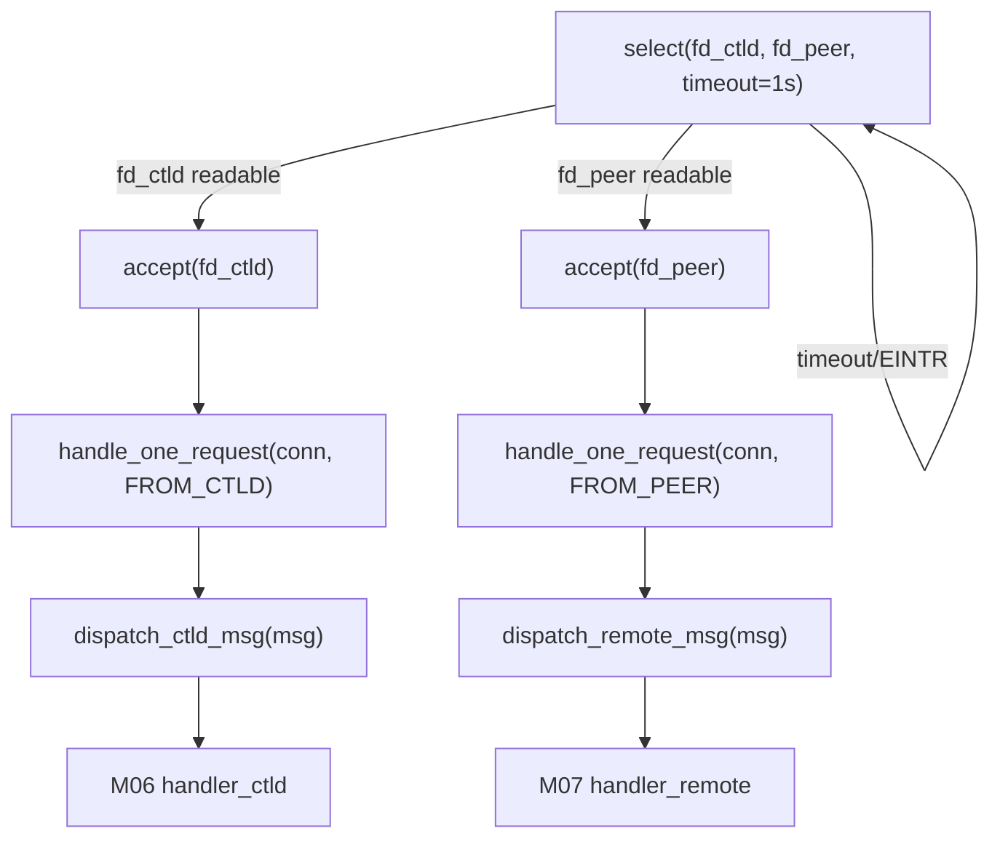

# M05 网络监听与分发 Checklist

> 配套: [doc/Broker开发任务清单.md](../Broker开发任务清单.md) §M05
> 设计: [doc/Broker详细设计文档MVP.md](../Broker详细设计文档MVP.md) §8.3
> Sprint: S1 → S2
> 依赖: M02-T3（端口配置）、M04-T2（dispatch 时识别 msg_type）
> 下游: M06 / M07 通过 dispatch 路由调用

---

## 1. 模块概述与目标

### 1.1 一句话定位

单线程 select 双端口监听 ctld 入站 (`BrokerCtldPort`) 与远端 broker 入站 (`BrokerPeerPort`)，accept 后**同步阻塞处理**单条 RPC，按 msg_type 分发到 M06 (`handler_ctld`) 或 M07 (`handler_remote`)。

### 1.2 MVP 范围

- **单 listener 线程**，不引入 worker pool（500 在途作业 × 10s/条 ≈ 50 RPC/s 远低于单线程上限）。
- 双 fd 由 `select(timeout=1s)` 唤醒，accept 后阻塞 `slurm_recv_msg_blocking`。
- ACL：ctld 端口仅本机 `127.0.0.1`；peer 端口仅 `RemoteBrokerHost` 解析后 IP。
- shutdown 时 close 监听 fd 让 `select` 立即返回。

### 1.3 不在 MVP 范围

- ~~多线程 worker pool / `eio` 框架~~（M05-T5 优化方向，暂不需要）
- ~~mTLS / 自定义 wire 协议~~（v0.2）
- ~~accept 速率限制~~（监听端口已被防火墙保护）

### 1.4 与设计文档差异

设计文档 §8.3 给了完整代码骨架；本文档保持一致。

---

## 2. 接口契约

### 2.1 公共 API

```c
/* src/slurmbrokerd/listener.h */
extern int listener_start(void);
extern void listener_stop(void);
```

### 2.2 全局变量

```c
/* listener.c */
static pthread_t listener_tid;
static int listen_fd_ctld = -1;
static int listen_fd_peer = -1;
static volatile bool listener_running = false;
```

### 2.3 端口绑定

| 端口 | bind 地址 | 来源 | 允许的对端 IP |
|---|---|---|---|
| `g_broker_conf.ctld_port` (默认 8442) | `0.0.0.0` | M02 | `127.0.0.1` 仅本机 |
| `g_broker_conf.peer_port` (默认 8443) | `0.0.0.0` | M02 | `RemoteBrokerHost` 解析后所有 IP |

---

## 3. 参考代码

| 用途 | 文件 | 说明 |
|---|---|---|
| `slurm_init_msg_engine_port` | [src/common/slurm_protocol_api.h](../../src/common/slurm_protocol_api.h) | listen + bind 工具函数（推荐复用，不自己写 socket）|
| `slurm_accept_msg_conn` | 同上 | accept + 返回 conn fd |
| `slurm_receive_msg` | 同上 | 阻塞读一条 slurm_msg_t（含 munge 解密）|
| `slurm_send_node_msg` 回响应 | 同上 | 复用响应路径 |
| select 双 fd 范式 | [src/slurmctld/agent.c](../../src/slurmctld/agent.c) | grep `FD_SET` |
| getpeername ACL | [src/slurmd/slurmd/req.c](../../src/slurmd/slurmd/req.c) | grep `getpeername` 范例 |
| `slurm_thread_create` | [src/common/macros.h](../../src/common/macros.h) | 替代 pthread_create，错误检查内置 |

---

## 4. 文件清单

| 文件 | 类型 | 用途 |
|---|---|---|
| [src/slurmbrokerd/listener.h](../../src/slurmbrokerd/listener.h) | 新增 | start/stop API |
| [src/slurmbrokerd/listener.c](../../src/slurmbrokerd/listener.c) | 新增 | listen / select / accept / dispatch |
| [src/slurmbrokerd/handler_ctld.h](../../src/slurmbrokerd/handler_ctld.h) | 由 M06 新增 | dispatch 跳转目标声明 |
| [src/slurmbrokerd/handler_remote.h](../../src/slurmbrokerd/handler_remote.h) | 由 M07 新增 | dispatch 跳转目标声明 |
| [src/slurmbrokerd/Makefile.am](../../src/slurmbrokerd/Makefile.am) | 修改 | 加 listener.c/.h |

---

## 5. 数据流



---

## 6. 任务展开

### M05-T1 监听 socket 创建 + select 循环

- **依赖**: M02-T3
- **预估**: 1d
- **关键决策**:
  1. **复用 `slurm_init_msg_engine_port()`**（自带 SO_REUSEADDR + bind + listen），不自己 socket()
  2. select timeout 1s，让 listener 在无活动时也能 1s 检查 `listener_running` 标志
  3. shutdown 路径：set `listener_running=false`，主线程对 listen_fd `shutdown(SHUT_RDWR)` 让 select 立即返回（注意 select 不会因为 shutdown 立刻醒，需要 close 或自管道方案；MVP 用 1s timeout 即可，5s 内退出可接受）
- **代码草图**:

```c
static void *_listener_main(void *arg)
{
	while (listener_running) {
		fd_set rfds;
		struct timeval tv = { .tv_sec = 1 };
		int max_fd, n, conn_fd;
		bool from_ctld;

		FD_ZERO(&rfds);
		FD_SET(listen_fd_ctld, &rfds);
		FD_SET(listen_fd_peer, &rfds);
		max_fd = MAX(listen_fd_ctld, listen_fd_peer);

		n = select(max_fd + 1, &rfds, NULL, NULL, &tv);
		if (n == 0) continue;          /* timeout, re-check shutdown */
		if (n < 0) {
			if (errno == EINTR) continue;
			error("listener: select: %m");
			break;
		}

		if (FD_ISSET(listen_fd_ctld, &rfds)) {
			conn_fd = slurm_accept_msg_conn(listen_fd_ctld, NULL);
			if (conn_fd >= 0) {
				_handle_one_request(conn_fd, FROM_CTLD);
				close(conn_fd);
			}
		}
		if (FD_ISSET(listen_fd_peer, &rfds)) {
			conn_fd = slurm_accept_msg_conn(listen_fd_peer, NULL);
			if (conn_fd >= 0) {
				_handle_one_request(conn_fd, FROM_PEER);
				close(conn_fd);
			}
		}
	}
	return NULL;
}

int listener_start(void)
{
	listen_fd_ctld = slurm_init_msg_engine_port(g_broker_conf.ctld_port);
	if (listen_fd_ctld < 0)
		fatal("listener: bind ctld port %u: %m",
		      g_broker_conf.ctld_port);

	listen_fd_peer = slurm_init_msg_engine_port(g_broker_conf.peer_port);
	if (listen_fd_peer < 0)
		fatal("listener: bind peer port %u: %m",
		      g_broker_conf.peer_port);

	listener_running = true;
	slurm_thread_create(&listener_tid, _listener_main, NULL);
	info("listener: listening on ctld=%u peer=%u",
	     g_broker_conf.ctld_port, g_broker_conf.peer_port);
	return SLURM_SUCCESS;
}

void listener_stop(void)
{
	listener_running = false;
	if (listen_fd_ctld >= 0) close(listen_fd_ctld);
	if (listen_fd_peer >= 0) close(listen_fd_peer);
	pthread_join(listener_tid, NULL);
}
```

- **风险与坑**:
  - close fd 时另一个线程已经在 `select` 等待 → glibc 不保证 select 立即醒；用 `pthread_kill(SIGUSR2)` 或自管道更稳
  - 同时收到两个 fd 事件，先处理 ctld 再处理 peer，无饥饿（accept 一次后立即处理）
- **DoD**:
  - [ ] `nc -zv localhost 8442` / `nc -zv localhost 8443` 通
  - [ ] `kill -TERM <pid>` 后 5s 内端口释放（`ss -lntp | grep 8442` 为空）
  - [ ] 进程不 CPU spin（top 中 < 1%）

### M05-T2 单请求处理 `_handle_one_request`

- **依赖**: M04-T2 / M05-T1
- **预估**: 0.5d
- **关键决策**:
  1. 复用 `slurm_receive_msg(conn_fd, &msg, timeout=10s)`，自带 munge_decode + auth_uid 设置
  2. 解出后按"来源端口"分两条 dispatch 链
  3. 处理失败 `slurm_send_rc_msg(&msg, rc)` 回错误码后 close
- **代码草图**:

```c
typedef enum { FROM_CTLD, FROM_PEER } src_t;

static void _handle_one_request(int conn_fd, src_t src)
{
	slurm_msg_t msg;
	int rc;

	slurm_msg_t_init(&msg);
	msg.conn_fd = conn_fd;

	rc = slurm_receive_msg(conn_fd, &msg, 10000 /* 10s */);
	if (rc) {
		error("listener: recv from %s: %s",
		      src == FROM_CTLD ? "ctld" : "peer",
		      slurm_strerror(rc));
		goto done;
	}

	if (src == FROM_CTLD)
		dispatch_ctld_msg(&msg);
	else
		dispatch_remote_msg(&msg);

done:
	slurm_free_msg_members(&msg);
}
```

- **风险与坑**:
  - 慢速恶意客户端可能 hold conn_fd 不发数据 → 10s timeout 已限制
  - msg.data 由 dispatch 分发的 handler 决定何时 free（约定：handler 接管 ownership）
- **DoD**:
  - [ ] 用 mock client 发一条 `REQUEST_PING`（或不存在的 msg_type）→ broker 返回 ESLURM_INVALID_RPC，不 crash
  - [ ] dispatch 路径打 `debug2("dispatch ctld msg_type=%u from %s")` 日志可见

### M05-T3 dispatch 路由表

- **依赖**: M05-T2
- **预估**: 0.5d
- **关键决策**:
  1. 大 switch + handler 函数指针表
  2. 未知 msg_type → `slurm_send_rc_msg(&msg, SLURM_PROTOCOL_INVALID_MESSAGE)` 回错误
  3. 路由前打 `debug2` 日志（含来源 IP），方便排障
- **代码草图**:

```c
extern void dispatch_ctld_msg(slurm_msg_t *msg)
{
	char addr_str[INET6_ADDRSTRLEN] = "";
	slurm_get_addr_string(&msg->address, addr_str, sizeof(addr_str));
	debug2("dispatch ctld msg_type=%u from %s", msg->msg_type, addr_str);

	switch (msg->msg_type) {
	case REQUEST_FORWARD_JOB:
		handle_forward_job(msg);
		break;
	case REQUEST_BROKER_CANCEL:
		handle_cancel_from_ctld(msg);
		break;
	default:
		error("dispatch_ctld: unknown msg_type %u from %s",
		      msg->msg_type, addr_str);
		slurm_send_rc_msg(msg, SLURM_PROTOCOL_INVALID_MESSAGE);
	}
}

extern void dispatch_remote_msg(slurm_msg_t *msg)
{
	char addr_str[INET6_ADDRSTRLEN] = "";
	slurm_get_addr_string(&msg->address, addr_str, sizeof(addr_str));
	debug2("dispatch remote msg_type=%u from %s", msg->msg_type, addr_str);

	switch (msg->msg_type) {
	case REQUEST_BROKER_FORWARD_JOB:
		handle_broker_forward_job(msg);
		break;
	case REQUEST_BROKER_STAGED_IN:
		handle_broker_staged_in(msg);
		break;
	case REQUEST_BROKER_QUERY_STATUS:
		handle_broker_query_status(msg);
		break;
	case REQUEST_BROKER_CANCEL:
		handle_broker_cancel(msg);
		break;
	case REQUEST_BROKER_CLEANUP:
		handle_broker_cleanup(msg);
		break;
	default:
		error("dispatch_remote: unknown msg_type %u from %s",
		      msg->msg_type, addr_str);
		slurm_send_rc_msg(msg, SLURM_PROTOCOL_INVALID_MESSAGE);
	}
}
```

- **风险与坑**:
  - 未知 msg_type 仍要释放 msg.data（slurm_free_msg_members 已处理）
  - default 不调 handler 时不能 abort 或 fatal
- **DoD**:
  - [ ] 未知 msg_type 客户端收到 ESLURM_PROTOCOL_INVALID_MESSAGE
  - [ ] 已知 msg_type 走到对应 mock handler（在 M06/M07 还没实现时用 stub）

### M05-T4 ACL 与来源 IP 校验

- **依赖**: M05-T3
- **预估**: 0.5d
- **Sprint**: S2（M01 后期补做）
- **关键决策**:
  1. accept 后 getpeername，取对端 IP
  2. ctld 端口：仅 `127.0.0.1` / `::1` 通过
  3. peer 端口：解析 `RemoteBrokerHost` 拿到 IP set，匹配
  4. 不通过：close + warn
- **代码草图**:

```c
static int _accept_with_acl(int listen_fd, src_t src)
{
	int conn_fd;
	struct sockaddr_storage peer;
	socklen_t plen = sizeof(peer);
	char ipstr[INET6_ADDRSTRLEN] = "";

	conn_fd = accept(listen_fd, (struct sockaddr *) &peer, &plen);
	if (conn_fd < 0) return -1;

	if (peer.ss_family == AF_INET) {
		inet_ntop(AF_INET, &((struct sockaddr_in *) &peer)->sin_addr,
		          ipstr, sizeof(ipstr));
	} else if (peer.ss_family == AF_INET6) {
		inet_ntop(AF_INET6, &((struct sockaddr_in6 *) &peer)->sin6_addr,
		          ipstr, sizeof(ipstr));
	}

	if (src == FROM_CTLD) {
		if (strcmp(ipstr, "127.0.0.1") && strcmp(ipstr, "::1")) {
			warning("listener: rejecting non-local ctld conn from %s",
			        ipstr);
			close(conn_fd);
			return -1;
		}
	} else {
		if (!_peer_ip_allowed(ipstr)) {
			warning("listener: rejecting peer conn from %s (not %s)",
			        ipstr, g_broker_conf.remote_broker_host);
			close(conn_fd);
			return -1;
		}
	}
	return conn_fd;
}

static bool _peer_ip_allowed(const char *ipstr)
{
	struct addrinfo hints = { .ai_family = AF_UNSPEC,
	                          .ai_socktype = SOCK_STREAM };
	struct addrinfo *res = NULL, *p;
	bool ok = false;

	if (getaddrinfo(g_broker_conf.remote_broker_host, NULL, &hints, &res))
		return false;
	for (p = res; p; p = p->ai_next) {
		char tmp[INET6_ADDRSTRLEN] = "";
		if (p->ai_family == AF_INET)
			inet_ntop(AF_INET,
			          &((struct sockaddr_in *) p->ai_addr)->sin_addr,
			          tmp, sizeof(tmp));
		else if (p->ai_family == AF_INET6)
			inet_ntop(AF_INET6,
			          &((struct sockaddr_in6 *) p->ai_addr)->sin6_addr,
			          tmp, sizeof(tmp));
		if (!strcmp(tmp, ipstr)) { ok = true; break; }
	}
	freeaddrinfo(res);
	return ok;
}
```

- **风险与坑**:
  - DNS 临时不可用导致 `getaddrinfo` 失败 → 短期把所有 peer 都拒绝；建议本地 cache 上次解析结果，DNS 失败时 fallback
  - IPv6 / mapped-v4（`::ffff:127.0.0.1`）特殊处理
- **DoD**:
  - [ ] 异机 `telnet <broker_host> 8442` 立即被拒
  - [ ] 同机 `nc 127.0.0.1 8442` 通
  - [ ] `nc <peer_ip> 8443` 通；`nc <other_ip> 8443` 拒

---

## 7. 整体 DoD（汇总）

- [ ] 4 个子任务全部勾选
- [ ] `listener_start` / `listener_stop` 在 M01-T6 占位激活
- [ ] valgrind: 启动 → 收 100 RPC → stop，0 still reachable
- [ ] kill -TERM ≤ 5s 内端口释放，listener thread join 干净

## 8. 验证脚本

```bash
# 启动
./src/slurmbrokerd/slurmbrokerd -D -v &
PID=$!

# 1) 端口监听
ss -lntp | grep -E "8442|8443"

# 2) ACL: 同机访问 ctld
echo "" | nc -w1 127.0.0.1 8442; echo $?

# 3) ACL: 异机访问 ctld（在另一台机器）
echo "" | nc -w1 <broker_host> 8442; echo $?  # expect: connection-rejected

# 4) ACL: peer
echo "" | nc -w1 <broker_host> 8443; echo $?

# 5) 未知 msg_type
./tests/broker/send_unknown_rpc 127.0.0.1 8442
# 期望：客户端收到 ESLURM_PROTOCOL_INVALID_MESSAGE

# 6) shutdown
kill -TERM $PID
sleep 6
ss -lntp | grep -E "8442|8443"  # expect: empty
```

---

## 9. 风险与回滚

| 风险 | 触发 | 缓解 |
|---|---|---|
| select 不能因 close fd 立即醒 | shutdown 与 select 竞态 | 1s timeout 兜底；接受 ≤ 1s 退出延迟 |
| 慢速对端 hold conn 占用 listener | 恶意客户端 | recv 10s timeout |
| ACL DNS 解析失败 | 网络抖动 | 缓存上次解析结果；持续 5min 失败才 critical |
| 单线程 dispatch 阻塞 | M06/M07 handler 耗时长 | listener 内禁止做 IO（只做内存操作 + persist_async_request 异步 flush）|

回滚：本模块独立。`git revert listener.c/.h + dispatch case 调整`。停 systemd 后回滚二进制即可。
