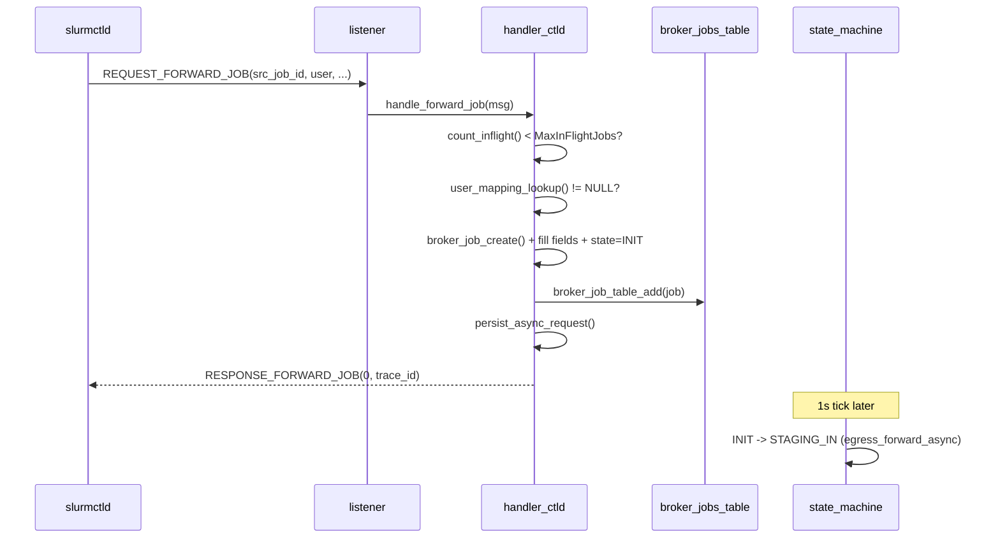

# M06 ctld 入站处理 Checklist

> 配套: [doc/Broker开发任务清单.md](../Broker开发任务清单.md) §M06
> 设计: [doc/Broker详细设计文档MVP.md](../Broker详细设计文档MVP.md) §7.1 / §7.2
> Sprint: S2
> 依赖: M02-T4（user_mapping）、M03-T2（broker_jobs 表）、M04-T2（payload）、M05-T3（dispatch）
> 下游: M09 状态机消费 INIT → STAGING_IN

---

## 1. 模块概述与目标

### 1.1 一句话定位

处理来自本机 slurmctld 的两类 RPC：`REQUEST_FORWARD_JOB`（创建 broker_job）与 `REQUEST_BROKER_CANCEL`（用户 scancel 反向传播）。本模块只做"入表"+"置位"，真正的状态推进交给 M09。

### 1.2 MVP 范围

- `handle_forward_job()`：溢出保护 + user_mapping 校验 + 创建 broker_job + 入表 + 立即 ACK + persist_async_request
- `handle_cancel_from_ctld()`：查表 + 置位 `cancel_requested` + ACK
- ACL：`auth_uid == job.src_uid` 或 root/SlurmUser

### 1.3 不在 MVP 范围

- ~~延迟 ACK（异步处理）~~：MVP 同步 ACK 简化语义，吞吐够用
- ~~Job array 拆分~~：每个 array task 独立的 `src_job_id`，broker 不感知 array

### 1.4 与设计文档差异

设计文档 §7.1 / §7.2 给了完整骨架；保持一致。

---

## 2. 接口契约

### 2.1 公共 API

```c
/* src/slurmbrokerd/handler_ctld.h */
extern int handle_forward_job(slurm_msg_t *msg);
extern int handle_cancel_from_ctld(slurm_msg_t *msg);
```

### 2.2 私有 helper

```c
static uint32_t _count_inflight(void);
```

### 2.3 ACL 规则

| 来源 RPC | auth_uid 必须满足 |
|---|---|
| REQUEST_FORWARD_JOB | `auth_uid == 0` 或 `auth_uid == slurm_conf.slurm_user_id` |
| REQUEST_BROKER_CANCEL（来自 ctld）| `auth_uid == job.src_uid` 或 root / SlurmUser |

---

## 3. 参考代码

| 用途 | 文件 | 说明 |
|---|---|---|
| `slurm_send_response` 回响应 | [src/common/slurm_protocol_api.c](../../src/common/slurm_protocol_api.c) | 含错误码模式 |
| 用 `slurm_msg_t.auth_uid` 鉴权 | [src/sackd/sackd.c](../../src/sackd/sackd.c) L227-L238 | grep `auth_uid` |
| `xstrfmtcat` 拼 trace_id | [src/common/xstring.h](../../src/common/xstring.h) | grep `xstrfmtcat` |
| `count_inflight` 范式 | [src/slurmctld/job_mgr.c](../../src/slurmctld/job_mgr.c) | grep state filter |

---

## 4. 文件清单

| 文件 | 类型 | 用途 |
|---|---|---|
| [src/slurmbrokerd/handler_ctld.h](../../src/slurmbrokerd/handler_ctld.h) | 新增 | API |
| [src/slurmbrokerd/handler_ctld.c](../../src/slurmbrokerd/handler_ctld.c) | 新增 | 两个 handler + count_inflight |
| [src/slurmbrokerd/Makefile.am](../../src/slurmbrokerd/Makefile.am) | 修改 | 加 handler_ctld.c |
| [src/slurmbrokerd/listener.c](../../src/slurmbrokerd/listener.c) | 修改 | dispatch_ctld_msg 接入 |

---

## 5. 流程图



---

## 6. 任务展开

### M06-T1 `handle_forward_job` 主流程

- **依赖**: M02-T4 / M03-T2 / M04-T2 / M05-T3
- **预估**: 1.5d
- **关键决策**:
  1. **溢出保护**：`count_inflight() >= max_inflight` 立即 `ESLURM_BROKER_OVERLOAD`，不入表
  2. **同步 ACK**：handler 内同步回 `RESPONSE_FORWARD_JOB`，不等状态机推进
  3. **trace_id 格式**：`<src_cluster>-<src_job_id>`，例如 `xian_cluster-12345`
  4. **job_desc ownership 转移**：从 `slurm_msg_t` 转到 `broker_job_t`，避免拷贝
- **代码草图**:

```c
int handle_forward_job(slurm_msg_t *msg)
{
	forward_job_msg_t *req = msg->data;
	user_mapping_t *m;
	broker_job_t *job;
	forward_job_resp_msg_t *resp;
	uint32_t inflight;

	/* 1. 溢出保护 */
	inflight = _count_inflight();
	if (inflight >= g_broker_conf.max_inflight) {
		warning("forward_job: rejecting job %u, inflight=%u >= max=%u",
		        req->src_job_id, inflight, g_broker_conf.max_inflight);
		slurm_send_rc_msg(msg, ESLURM_BROKER_OVERLOAD);
		return SLURM_SUCCESS;
	}

	/* 2. user_mapping */
	m = user_mapping_lookup(req->src_user_name, req->target_cluster);
	if (!m) {
		error("forward_job: no user_mapping for %s -> %s",
		      req->src_user_name, req->target_cluster);
		slurm_send_rc_msg(msg, ESLURM_BROKER_NO_USER_MAPPING);
		return SLURM_SUCCESS;
	}

	/* 3. 创建 broker_job */
	job = broker_job_create();
	snprintf(job->trace_id, sizeof(job->trace_id), "%s-%u",
	         g_broker_conf.cluster_name, req->src_job_id);
	job->src_job_id        = req->src_job_id;
	job->src_uid           = req->src_uid;
	job->src_user_name     = xstrdup(req->src_user_name);
	job->src_cluster       = xstrdup(g_broker_conf.cluster_name);
	job->dst_cluster       = xstrdup(req->target_cluster);
	job->target_partition  = xstrdup(g_broker_conf.default_remote_partition);
	job->src_work_dir      = xstrdup(req->src_work_dir);
	job->script_path       = xstrdup(req->script_path);
	job->account           = xstrdup(req->account);
	job->remote_user_name  = xstrdup(m->remote_user);
	job->remote_uid        = m->remote_uid;
	job->remote_gid        = m->remote_gid;
	job->role              = BROKER_ROLE_ORIGINATOR;
	job->hop_count         = 0;
	job->state             = BROKER_STATE_INIT;
	job->state_enter_time  = time(NULL);
	job->submit_time       = job->state_enter_time;

	/* job_desc ownership transfer */
	job->job_desc = req->job_desc;
	req->job_desc = NULL;

	/* 4. 入表 */
	if (broker_job_table_add(job) != SLURM_SUCCESS) {
		error("forward_job: duplicate trace_id %s", job->trace_id);
		broker_job_destroy(job);
		slurm_send_rc_msg(msg, ESLURM_BROKER_NOT_FOUND); /* dup */
		return SLURM_SUCCESS;
	}

	/* 5. 触发 persist */
	persist_async_request();

	/* 6. ACK */
	resp = xmalloc(sizeof(*resp));
	resp->error_code = SLURM_SUCCESS;
	resp->trace_id = xstrdup(job->trace_id);

	slurm_msg_t resp_msg;
	slurm_msg_t_init(&resp_msg);
	resp_msg.msg_type = RESPONSE_FORWARD_JOB;
	resp_msg.data = resp;
	slurm_send_node_msg(msg->conn_fd, &resp_msg);
	slurm_free_forward_job_resp_msg(resp);

	info("forward_job: trace_id=%s src_job_id=%u user=%s -> %s",
	     job->trace_id, job->src_job_id, job->src_user_name,
	     job->dst_cluster);
	return SLURM_SUCCESS;
}

static uint32_t _count_inflight(void)
{
	uint32_t cnt = 0;
	int _cb(broker_job_t *j, void *arg) {
		uint32_t *p = arg;
		switch (j->state) {
		case BROKER_STATE_INIT:
		case BROKER_STATE_STAGING_IN:
		case BROKER_STATE_STAGED_IN:
		case BROKER_STATE_SUBMITTED:
		case BROKER_STATE_RUNNING:
		case BROKER_STATE_STAGING_OUT:
			(*p)++; break;
		default: break;
		}
		return 0;
	}
	broker_job_table_foreach(_cb, &cnt);
	return cnt;
}
```

- **风险与坑**:
  - `job_desc` ownership 转移后，`slurm_free_forward_job_msg(req)` 不能再 free job_desc。验证 `slurm_free_forward_job_msg` 实现，确保 NULL check（M04-T2 中已加 `if (m->job_desc) slurm_free_job_desc_msg(...)`）
  - `_count_inflight` 在 `foreach` 内部已加锁；不能在回调里再 lock。GCC 内嵌函数不是 portable C，建议改成静态函数 + 闭包结构体
- **DoD**:
  - [ ] mock ctld 投 1 个作业，broker 表内 1 条 `state=INIT`，ACK error_code=0
  - [ ] 投 600 个时第 501 起返回 ESLURM_BROKER_OVERLOAD
  - [ ] 缺映射用户的 RPC → ESLURM_BROKER_NO_USER_MAPPING

### M06-T2 `handle_cancel_from_ctld` 主流程

- **依赖**: M03-T2 / M06-T1
- **预估**: 0.5d
- **关键决策**:
  1. 按 `src_job_id` 查表 → 不存在则 `ESLURM_BROKER_NOT_FOUND`（ctld 端做幂等）
  2. 持 `job->lock` 设 `cancel_requested = true`
  3. `persist_async_request()` 立刻 flush（防 broker 立即 crash 后丢失 cancel 信号）
  4. 状态推进与 RPC 转发由 M09 状态机处理（不在本 handler 直接发 cancel）
- **代码草图**:

```c
int handle_cancel_from_ctld(slurm_msg_t *msg)
{
	broker_cancel_msg_t *req = msg->data;
	broker_job_t *job = NULL;
	uint32_t auth_uid = msg->auth_uid;

	/* 按 src_job_id 找 (trace_id 由 broker 内部生成) */
	char trace_id[48];
	snprintf(trace_id, sizeof(trace_id), "%s-%u",
	         g_broker_conf.cluster_name, req->src_job_id);
	job = broker_job_table_get(trace_id);
	if (!job) {
		debug("cancel_from_ctld: trace_id=%s not found", trace_id);
		slurm_send_rc_msg(msg, ESLURM_BROKER_NOT_FOUND);
		return SLURM_SUCCESS;
	}

	/* ACL: M06-T3 */
	if (!_acl_owner_or_root(auth_uid, job)) {
		warning("cancel_from_ctld: uid=%u rejected for job %u (owner=%u)",
		        auth_uid, job->src_job_id, job->src_uid);
		slurm_send_rc_msg(msg, ESLURM_USER_ID_MISSING);
		return SLURM_SUCCESS;
	}

	slurm_mutex_lock(&job->lock);
	job->cancel_requested = true;
	slurm_mutex_unlock(&job->lock);

	persist_async_request();
	info("cancel_from_ctld: trace_id=%s scheduled for cancel", trace_id);

	slurm_send_rc_msg(msg, SLURM_SUCCESS);
	return SLURM_SUCCESS;
}
```

- **风险与坑**:
  - 用户 scancel 的瞬间作业可能正处于 `STAGING_IN`/`STAGING_OUT`（rsync 子进程在跑）→ 状态机 M09-T6 处理
  - 同一 job 被 cancel 两次：`cancel_requested` 已 true，第二次 OK 但无副作用（idempotent）
- **DoD**:
  - [ ] 投 1 个作业到 RUNNING，scancel 后 ≤ 5s broker_job state 变 CANCELLED（与 M09-T6 联动验证）
  - [ ] 不存在的 src_job_id → ESLURM_BROKER_NOT_FOUND，进程不 crash

### M06-T3 ACL 校验

- **依赖**: M06-T2
- **预估**: 0.25d
- **关键决策**:
  1. 取 `slurm_msg_t.auth_uid`（munge 解出后由 listener 设置）
  2. 允许 owner / root / SlurmUser
- **代码草图**:

```c
static bool _acl_owner_or_root(uint32_t auth_uid, broker_job_t *job)
{
	if (auth_uid == 0)
		return true;
	if (auth_uid == slurm_conf.slurm_user_id)
		return true;
	if (auth_uid == job->src_uid)
		return true;
	return false;
}
```

- **DoD**:
  - [ ] 用其他用户的 uid 模拟 cancel → 被拒，返回 ESLURM_USER_ID_MISSING
  - [ ] root cancel → 通过

---

## 7. 整体 DoD（汇总）

- [ ] 3 个子任务全部勾选
- [ ] 联调：mock ctld 投递 100 作业，broker 表内 100 条 INIT
- [ ] 联调：超出 max_inflight 时 OVERLOAD 错误率正确
- [ ] valgrind: 100 forward + 100 cancel + fini，0 still reachable

## 8. 验证脚本

```bash
./src/slurmbrokerd/slurmbrokerd -D -v &
PID=$!

# T1: 投 100 作业
for i in $(seq 1 100); do
    ./tests/broker/inject_forward_job xian_cluster $i wz_cluster
done

# 检查表大小
./tests/broker/dump_broker_table | grep -c "state=INIT"
# expect: 100

# T1 溢出: max_inflight=500，再投 600
for i in $(seq 101 700); do
    ./tests/broker/inject_forward_job xian_cluster $i wz_cluster
done

# T2 cancel
./tests/broker/inject_cancel xian_cluster 50
./tests/broker/dump_broker_table | grep "src_job_id=50" | grep "cancel_requested=true"

# T3 ACL
./tests/broker/inject_cancel --uid 12345 xian_cluster 51
# expect: ESLURM_USER_ID_MISSING

kill -TERM $PID
```

---

## 9. 风险与回滚

| 风险 | 触发 | 缓解 |
|---|---|---|
| forward_job 同 trace_id 重复投递 | ctld 重试 + broker 已存在 | T1 检测重复 → 回 ESLURM_BROKER_NOT_FOUND（幂等约定） |
| `job_desc` ownership 转移漏 | 实现错误 | 单测 + AddressSanitizer 验证 |
| ACL 误拒 | uid 0 检测漏 | 单测 root / SlurmUser / 普通用户三种 |
| `_count_inflight` 在大表性能 O(N) | 1000+ 在途时每次 forward 跑一遍 | MVP OK；后续可缓存计数（每次 transition 更新） |

回滚：handler_ctld 独立。`git revert handler_ctld.c/.h + listener dispatch case`。
