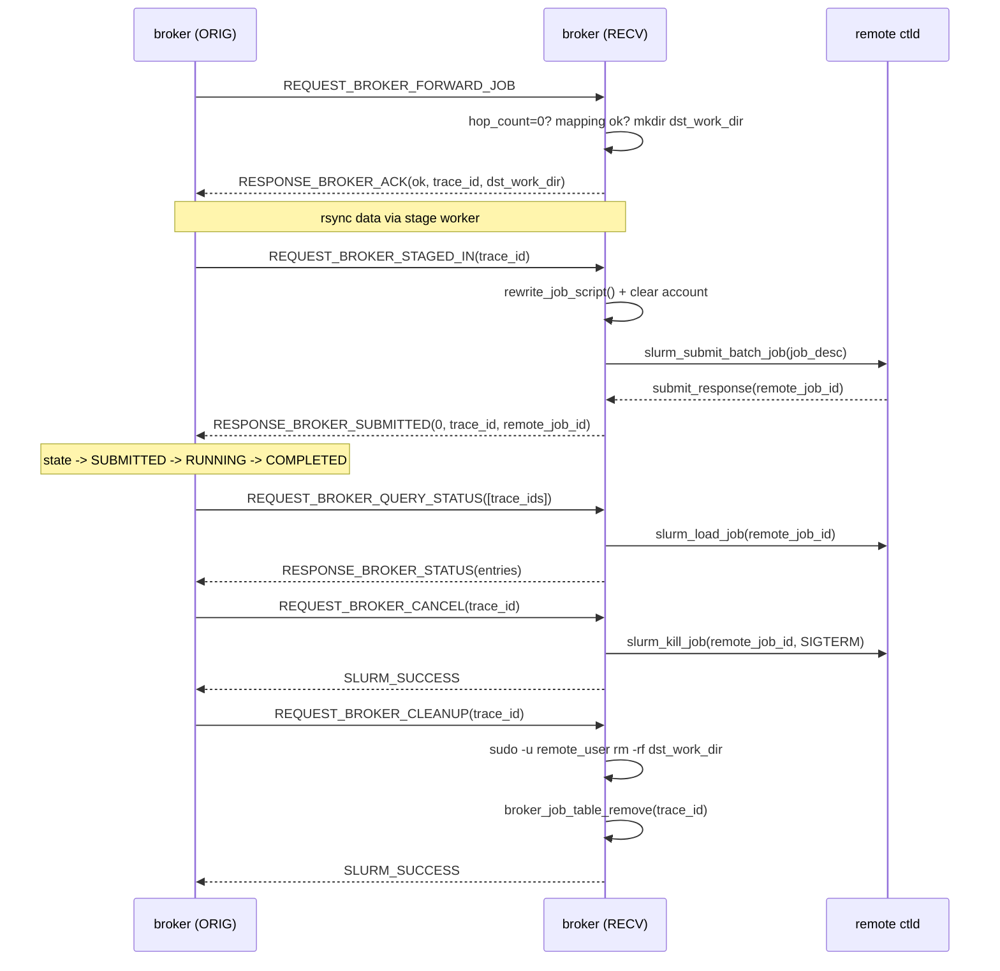

# M07 远端 broker 入站处理 Checklist

> 配套: [doc/Broker开发任务清单.md](../Broker开发任务清单.md) §M07
> 设计: [doc/Broker详细设计文档MVP.md](../Broker详细设计文档MVP.md) §7
> Sprint: S2 → S3
> 依赖: M02-T4 / M03-T2 / M04-T2 / M05-T3、M12-T1（rewrite stub）
> 下游: M09 状态机推进 RECEIVER 端

---

## 1. 模块概述与目标

### 1.1 一句话定位

处理远端 broker 主动发来的 5 类 RPC：`BROKER_FORWARD_JOB` / `BROKER_STAGED_IN` / `BROKER_QUERY_STATUS` / `BROKER_CANCEL` / `BROKER_CLEANUP`。本 broker 在此承担 **RECEIVER** 角色——为远端代提交本地 sbatch、回报状态、删除 dst_work_dir。

### 1.2 MVP 范围

- 5 个 handler，与 M06 同样"入表/置位 + 同步 ACK"模式
- 远端 dst_work_dir：`/work/home/<remote_user>/.burst/<src_cluster>/<src_job_id>`，`sudo -u <remote_user> mkdir -p` + `chmod 700`
- `handle_broker_staged_in` 调 M12 rewrite + `slurm_submit_batch_job`
- 幂等：重复 `BROKER_FORWARD_JOB` 时返回当前状态 ACK 而非创建新 job

### 1.3 不在 MVP 范围

- ~~多 hop 跨域路由~~：`hop_count > 0` 直接拒绝（设计文档明确）
- ~~RECEIVER 端 cancel 反向通知 ORIGINATOR~~：单向 cancel（ORIG → RECV）

### 1.4 与设计文档差异

设计文档 §7.1 / §7.5 给了完整骨架；保持一致，注意 §7.4 的幂等处理示例。

---

## 2. 接口契约

### 2.1 公共 API

```c
/* src/slurmbrokerd/handler_remote.h */
extern int handle_broker_forward_job(slurm_msg_t *msg);
extern int handle_broker_staged_in(slurm_msg_t *msg);
extern int handle_broker_query_status(slurm_msg_t *msg);
extern int handle_broker_cancel(slurm_msg_t *msg);
extern int handle_broker_cleanup(slurm_msg_t *msg);
```

### 2.2 私有 helper

```c
static int  _create_dst_work_dir(broker_job_t *job);
static int  _exec_sudo_rm_rf(const char *user, const char *dir);
static void _send_broker_ack(slurm_msg_t *msg, int err, const char *trace_id,
                             const char *dst_work_dir);
static void _send_broker_submitted(slurm_msg_t *msg, int err,
                                   const char *trace_id, uint32_t remote_job_id);
```

### 2.3 dst_work_dir 路径模板

```
/work/home/<remote_user>/.burst/<src_cluster>/<src_job_id>
```

权限：`0700`，owner = `remote_user:remote_user`。

---

## 3. 参考代码

| 用途 | 文件 | 说明 |
|---|---|---|
| `slurm_submit_batch_job(job_desc, &resp)` | [slurm/slurm.h](../../slurm/slurm.h) | broker→ctld submit API |
| `slurm_load_job(&info, job_id, ...)` | 同上 | query status |
| `slurm_kill_job(job_id, sig, flags)` | 同上 | cancel 远端作业 |
| fork + execv + waitpid 范式 | [src/slurmd/slurmstepd/](../../src/slurmd/slurmstepd/) | grep `execv` |
| `slurm_pid2jobid` 不需要 | - | broker 用 remote_job_id 直接查 |
| `submit_response_msg_t` | slurm.h | sbatch 返回结构 |

---

## 4. 文件清单

| 文件 | 类型 | 用途 |
|---|---|---|
| [src/slurmbrokerd/handler_remote.h](../../src/slurmbrokerd/handler_remote.h) | 新增 | API |
| [src/slurmbrokerd/handler_remote.c](../../src/slurmbrokerd/handler_remote.c) | 新增 | 5 个 handler + dst_dir helper |
| [src/slurmbrokerd/Makefile.am](../../src/slurmbrokerd/Makefile.am) | 修改 | 加 handler_remote.c |
| [src/slurmbrokerd/listener.c](../../src/slurmbrokerd/listener.c) | 修改 | dispatch_remote_msg 接入 |

---

## 5. 流程图



---

## 6. 任务展开

### M07-T1 `handle_broker_forward_job` (RECEIVER 入单)

- **依赖**: M02-T4 / M03-T2 / M04-T2
- **预估**: 1.5d
- **关键决策**:
  1. **hop 限制**：`req->hop_count > 0` → `ESLURM_BROKER_HOP_EXCEEDED`（防环）
  2. **user_mapping 反向匹配**：从源端发过来的 `remote_user_name` 必须存在于本地 user_mapping
  3. **dst_work_dir**：`fork+exec sudo -u <remote_user> mkdir -p <dst_dir> && chmod 700 <dst_dir>`
  4. **幂等处理**：trace_id 已存在 → 返回 ACK + 当前 state，**不**新建
- **代码草图**:

```c
int handle_broker_forward_job(slurm_msg_t *msg)
{
	broker_forward_job_msg_t *req = msg->data;
	broker_job_t *job;

	/* 1. hop limit */
	if (req->hop_count > 0) {
		warning("broker_forward: rejecting trace_id=%s hop_count=%u",
		        req->trace_id, req->hop_count);
		_send_broker_ack(msg, ESLURM_BROKER_HOP_EXCEEDED,
		                 req->trace_id, NULL);
		return SLURM_SUCCESS;
	}

	/* 2. 幂等检查 */
	job = broker_job_table_get(req->trace_id);
	if (job) {
		info("broker_forward: trace_id=%s duplicate, returning existing",
		     req->trace_id);
		_send_broker_ack(msg, SLURM_SUCCESS, req->trace_id,
		                 job->dst_work_dir);
		return SLURM_SUCCESS;
	}

	/* 3. user_mapping 反向匹配 */
	user_mapping_t *m = user_mapping_lookup(req->src_user_name,
	                                        req->src_cluster);
	if (!m || strcmp(m->remote_user, req->remote_user_name)) {
		_send_broker_ack(msg, ESLURM_BROKER_USER_MAPPING_MISMATCH,
		                 req->trace_id, NULL);
		return SLURM_SUCCESS;
	}

	/* 4. 建 broker_job (RECEIVER) */
	job = broker_job_create();
	strlcpy(job->trace_id, req->trace_id, sizeof(job->trace_id));
	job->src_job_id        = req->src_job_id;
	job->src_cluster       = xstrdup(req->src_cluster);
	job->src_user_name     = xstrdup(req->src_user_name);
	job->remote_user_name  = xstrdup(m->remote_user);
	job->remote_uid        = m->remote_uid;
	job->remote_gid        = m->remote_gid;
	job->target_partition  = xstrdup(req->target_partition);
	job->role              = BROKER_ROLE_RECEIVER;
	job->hop_count         = req->hop_count + 1;
	job->state             = BROKER_STATE_INIT;
	job->state_enter_time  = time(NULL);
	job->job_desc          = req->job_desc;
	req->job_desc          = NULL;

	xstrfmtcat(job->dst_work_dir,
	           "/work/home/%s/.burst/%s/%u",
	           job->remote_user_name, job->src_cluster, job->src_job_id);

	/* 5. 创建 dst_work_dir */
	if (_create_dst_work_dir(job) != SLURM_SUCCESS) {
		broker_job_destroy(job);
		_send_broker_ack(msg, ESLURM_BROKER_STAGE_FAILED,
		                 req->trace_id, NULL);
		return SLURM_SUCCESS;
	}

	if (broker_job_table_add(job) != SLURM_SUCCESS) {
		/* race: 其它线程并发同 trace_id 已加入 */
		broker_job_destroy(job);
		_send_broker_ack(msg, SLURM_SUCCESS, req->trace_id, NULL);
		return SLURM_SUCCESS;
	}
	persist_async_request();

	_send_broker_ack(msg, SLURM_SUCCESS, job->trace_id, job->dst_work_dir);
	info("broker_forward: trace_id=%s RECEIVER created, dst=%s",
	     job->trace_id, job->dst_work_dir);
	return SLURM_SUCCESS;
}

static int _create_dst_work_dir(broker_job_t *job)
{
	pid_t pid = fork();
	if (pid == 0) {
		execl("/usr/bin/sudo", "sudo", "-u", job->remote_user_name,
		      "/bin/sh", "-c",
		      "mkdir -p \"$1\" && chmod 700 \"$1\"",
		      "_", job->dst_work_dir, (char *) NULL);
		_exit(127);
	}
	if (pid < 0) return SLURM_ERROR;

	int wstat;
	if (waitpid(pid, &wstat, 0) < 0)
		return SLURM_ERROR;
	if (!WIFEXITED(wstat) || WEXITSTATUS(wstat))
		return SLURM_ERROR;
	return SLURM_SUCCESS;
}
```

- **风险与坑**:
  - sudo 配置必须允许 broker 用户对所有 remote_user 执行 mkdir/chmod（M15-T3 sudoers 模板）
  - `_create_dst_work_dir` 阻塞 listener 主线程；建议异步化（M07-T6 优化方向，MVP 接受）
  - `strlcpy` glibc 不一定有，用 `snprintf(... , "%s", ...)` 更 portable
- **DoD**:
  - [ ] mock 源端发 BROKER_FORWARD_JOB → 远端 broker 表 1 条 RECEIVER，dst_work_dir 实际创建（`ls -la /work/home/.../.burst/...`）
  - [ ] hop_count=1 → ESLURM_BROKER_HOP_EXCEEDED
  - [ ] mapping 不匹配 → ESLURM_BROKER_USER_MAPPING_MISMATCH
  - [ ] 重复 forward_job → 返回当前 state，dst 目录不重建

### M07-T2 `handle_broker_staged_in` (远端代投)

- **依赖**: M07-T1, M12-T1（rewrite stub）
- **预估**: 1d
- **关键决策**:
  1. 查表拿 RECEIVER job
  2. 调 `rewrite_job_script(job, &modified_path)` (M12)
  3. **关键**：`xfree(job_desc->account); job_desc->account = NULL;`（远端走默认 account）
  4. `slurm_submit_batch_job(job->job_desc, &resp)` → 取 `remote_job_id`
  5. 成功：transition SUBMITTED + RESPONSE_BROKER_SUBMITTED(0, trace_id, remote_job_id)
  6. 失败：transition FAILED + RESPONSE_BROKER_SUBMITTED(errno, trace_id, 0)
- **代码草图**:

```c
int handle_broker_staged_in(slurm_msg_t *msg)
{
	broker_staged_in_msg_t *req = msg->data;
	broker_job_t *job = broker_job_table_get(req->trace_id);
	char *modified_path = NULL;
	submit_response_msg_t *resp = NULL;
	int rc;

	if (!job || job->role != BROKER_ROLE_RECEIVER) {
		_send_broker_submitted(msg, ESLURM_BROKER_NOT_FOUND,
		                       req->trace_id, 0);
		return SLURM_SUCCESS;
	}

	if (rewrite_job_script(job, &modified_path) != SLURM_SUCCESS) {
		state_machine_transition(job, BROKER_STATE_FAILED,
		                         "rewrite failed");
		_send_broker_submitted(msg, ESLURM_BROKER_LOOKUP_FAILED,
		                       job->trace_id, 0);
		return SLURM_SUCCESS;
	}

	/* 清空 account 让远端用 sacctmgr default account */
	xfree(job->job_desc->account);
	job->job_desc->account = NULL;

	rc = slurm_submit_batch_job(job->job_desc, &resp);
	if (rc != SLURM_SUCCESS) {
		state_machine_transition(job, BROKER_STATE_FAILED,
		                         slurm_strerror(rc));
		_send_broker_submitted(msg, ESLURM_BROKER_REMOTE_SUBMIT_FAILED,
		                       job->trace_id, 0);
		xfree(modified_path);
		return SLURM_SUCCESS;
	}

	job->remote_job_id = resp->job_id;
	state_machine_transition(job, BROKER_STATE_SUBMITTED, NULL);
	persist_async_request();
	_send_broker_submitted(msg, SLURM_SUCCESS, job->trace_id,
	                       resp->job_id);

	slurm_free_submit_response_response_msg(resp);
	xfree(modified_path);
	info("broker_staged_in: trace_id=%s -> remote_job_id=%u",
	     job->trace_id, job->remote_job_id);
	return SLURM_SUCCESS;
}
```

- **风险与坑**:
  - `slurm_submit_batch_job` 默认走 `localhost`/`slurm.conf`；远端 broker 必须配置自己 ctld 为 localhost（M02 / M15）
  - rewrite 修改 `job->job_desc->script`，确保旧值 `xfree`；M12 内部已处理
- **DoD**:
  - [ ] 端到端 mock：RECEIVER `squeue` 看到 remote_job_id
  - [ ] 远端 ctld submit 失败 → broker 表 state=FAILED + RESPONSE 错误码

### M07-T3 `handle_broker_query_status` 批量回报

- **依赖**: M03-T2
- **预估**: 1d
- **关键决策**:
  1. 解析 `req->trace_ids[]`
  2. 对每个 trace_id 查 RECEIVER job → 不存在或 remote_job_id=0 → 占位 entry `remote_state = JOB_PENDING`
  3. 存在的：`slurm_load_job(&info, remote_job_id, SHOW_DETAIL)`，取 state/start/end/exit/tres
  4. 组装 `broker_status_msg_t resp` 回
- **代码草图**:

```c
int handle_broker_query_status(slurm_msg_t *msg)
{
	broker_query_status_msg_t *req = msg->data;
	broker_status_msg_t *resp = xmalloc(sizeof(*resp));
	resp->entry_count = req->trace_id_count;
	resp->entries = xcalloc(req->trace_id_count, sizeof(*resp->entries));

	for (uint32_t i = 0; i < req->trace_id_count; i++) {
		broker_status_entry_t *e = &resp->entries[i];
		broker_job_t *job;

		e->trace_id = xstrdup(req->trace_ids[i]);

		job = broker_job_table_get(req->trace_ids[i]);
		if (!job || job->role != BROKER_ROLE_RECEIVER ||
		    job->remote_job_id == 0) {
			e->remote_state = JOB_PENDING;
			continue;
		}

		job_info_msg_t *info_msg = NULL;
		if (slurm_load_job(&info_msg, job->remote_job_id, SHOW_DETAIL)
		    || info_msg->record_count == 0) {
			e->remote_state = JOB_PENDING;
			if (info_msg) slurm_free_job_info_msg(info_msg);
			continue;
		}
		slurm_job_info_t *ji = &info_msg->job_array[0];
		e->remote_state       = ji->job_state;
		e->remote_start_time  = ji->start_time;
		e->remote_end_time    = ji->end_time;
		e->remote_exit_code   = ji->exit_code;
		e->remote_alloc_tres  = xstrdup(ji->tres_alloc_str);
		slurm_free_job_info_msg(info_msg);
	}

	slurm_msg_t resp_msg;
	slurm_msg_t_init(&resp_msg);
	resp_msg.msg_type = RESPONSE_BROKER_STATUS;
	resp_msg.data = resp;
	slurm_send_node_msg(msg->conn_fd, &resp_msg);
	slurm_free_broker_status_msg(resp);
	return SLURM_SUCCESS;
}
```

- **风险与坑**:
  - 大批量 query（100 trace_id）每条都 `slurm_load_job` → 100 次 RPC 到本地 ctld，本地 ctld 压力大；优化方向：一次 `slurm_load_jobs` 拿全表筛选（v0.2）
  - `tres_alloc_str` 由 ctld 返回，可能 NULL
- **DoD**:
  - [ ] 单 broker 双角色测试：源端 query, 远端 (mock) 返回正确 state
  - [ ] 100 个 trace_id 一次 query 在 < 1s 内返回

### M07-T4 `handle_broker_cancel`

- **依赖**: M07-T1
- **预估**: 0.5d
- **关键决策**:
  1. 查表拿 RECEIVER job
  2. `slurm_kill_job(remote_job_id, SIGTERM, KILL_FULL_JOB)`
  3. 失败 warn 不阻塞（cancel 最大努力）
  4. 置 `cancel_propagated = true`，transition CANCELLED
- **代码草图**:

```c
int handle_broker_cancel(slurm_msg_t *msg)
{
	broker_cancel_msg_t *req = msg->data;
	broker_job_t *job = broker_job_table_get(req->trace_id);

	if (!job || job->role != BROKER_ROLE_RECEIVER) {
		slurm_send_rc_msg(msg, ESLURM_BROKER_NOT_FOUND);
		return SLURM_SUCCESS;
	}

	if (job->remote_job_id) {
		int rc = slurm_kill_job(job->remote_job_id, SIGTERM,
		                        KILL_FULL_JOB);
		if (rc) {
			warning("broker_cancel: kill remote_job_id=%u: %s",
			        job->remote_job_id, slurm_strerror(rc));
			/* 不阻塞 */
		}
	}

	slurm_mutex_lock(&job->lock);
	job->cancel_propagated = true;
	slurm_mutex_unlock(&job->lock);
	state_machine_transition(job, BROKER_STATE_CANCELLED, "cancel by orig");
	persist_async_request();

	slurm_send_rc_msg(msg, SLURM_SUCCESS);
	return SLURM_SUCCESS;
}
```

- **DoD**:
  - [ ] 远端 squeue 看到作业被 kill
  - [ ] 即使 remote_job_id 已不存在，broker_cancel 仍返回 SUCCESS（幂等）

### M07-T5 `handle_broker_cleanup`

- **依赖**: M07-T1
- **预估**: 0.5d
- **关键决策**:
  1. 查表 RECEIVER job; 不存在视为已清理 → SUCCESS（幂等）
  2. fork+exec `sudo -u <remote_user> /bin/rm -rf <dst_work_dir>`，30s 超时
  3. 删表 + persist_async_request
- **代码草图**:

```c
int handle_broker_cleanup(slurm_msg_t *msg)
{
	broker_cleanup_msg_t *req = msg->data;
	broker_job_t *job = broker_job_table_get(req->trace_id);
	int rc;

	if (!job) {
		slurm_send_rc_msg(msg, SLURM_SUCCESS); /* idempotent */
		return SLURM_SUCCESS;
	}

	rc = _exec_sudo_rm_rf(job->remote_user_name, job->dst_work_dir);
	if (rc != SLURM_SUCCESS) {
		warning("broker_cleanup: rm -rf %s: failed",
		        job->dst_work_dir);
		/* 仍删表，避免占用 inflight 槽位 */
	}

	broker_job_table_remove(req->trace_id);
	persist_async_request();
	slurm_send_rc_msg(msg, SLURM_SUCCESS);
	return SLURM_SUCCESS;
}

static int _exec_sudo_rm_rf(const char *user, const char *dir)
{
	pid_t pid = fork();
	if (pid == 0) {
		execl("/usr/bin/sudo", "sudo", "-u", user,
		      "/bin/rm", "-rf", dir, (char *) NULL);
		_exit(127);
	}
	if (pid < 0) return SLURM_ERROR;
	/* 30s timeout */
	for (int i = 0; i < 300; i++) {
		int wstat;
		pid_t r = waitpid(pid, &wstat, WNOHANG);
		if (r == pid) {
			return (WIFEXITED(wstat) && WEXITSTATUS(wstat) == 0)
			       ? SLURM_SUCCESS : SLURM_ERROR;
		}
		usleep(100000);
	}
	kill(pid, SIGKILL);
	waitpid(pid, NULL, 0);
	return SLURM_ERROR;
}
```

- **风险与坑**:
  - `rm -rf` 路径校验：必须在 dst_work_dir 模板规定的目录下，避免被恶意 RPC 利用删除任意目录。建议 handler 内 `if (strncmp(job->dst_work_dir, "/work/home/", 11)) abort;`
- **DoD**:
  - [ ] dst 目录被实际删除；表条目消失
  - [ ] 不存在 trace_id → SUCCESS

---

## 7. 整体 DoD（汇总）

- [ ] 5 个子任务全部勾选
- [ ] 端到端 mock：源 broker 投一个作业，远端 broker 全程跑通 5 类 RPC
- [ ] valgrind clean
- [ ] sudo / mkdir / rm 命令权限审计无警告

## 8. 验证脚本

```bash
# 远端 broker 启动
ssh broker.wz.example.com 'systemctl start slurmbrokerd'

# 源端 broker 调 mock
./tests/broker/mock_orig_to_recv.sh trace_id=xian-100
# 期望：
# - dst dir /work/home/wz_test1/.burst/xian_cluster/100 创建
# - state machine 推进至 SUBMITTED
# - sleep + status 查询返回 RUNNING
# - cancel 推进 CANCELLED
# - cleanup 删除 dst dir
```

---

## 9. 风险与回滚

| 风险 | 触发 | 缓解 |
|---|---|---|
| sudo 配置错 mkdir 失败 | 运维忘配 sudoers | M15-T3 提供模板 + visudo -c |
| `slurm_submit_batch_job` 走错 ctld | 远端 broker 没配本地 slurm.conf | M02-T3 校验 SLURM_CONF 存在 |
| `rm -rf` 路径越权 | 恶意 RPC 篡改 trace_id 后 dst_work_dir | handler 内强校验 dst_work_dir 前缀 |
| query_status 大表性能 | 100+ trace_id 每条独立 RPC | MVP 可接受；v0.2 用一次 load_jobs 优化 |

回滚：本模块独立。`git revert handler_remote.c/.h + listener dispatch case`。
