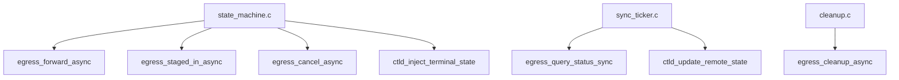

# M08 egress 出站调用 Checklist

> 配套: [doc/Broker开发任务清单.md](../Broker开发任务清单.md) §M08
> 设计: [doc/Broker详细设计文档MVP.md](../Broker详细设计文档MVP.md) §6 / §7.3
> Sprint: S2 → S3
> 依赖: M04-T5（proto wrapper）、M03-T2、M02-T3
> 下游: M09 状态机、M13 sync_ticker、M14 cleanup

---

## 1. 模块概述与目标

### 1.1 一句话定位

封装 broker 主动发起的所有出站 RPC：5 类发给远端 broker（`FORWARD_JOB` / `STAGED_IN` / `QUERY_STATUS` / `CANCEL` / `CLEANUP`）+ 2 类推给本地 ctld（`UPDATE_REMOTE_STATE` / `TERMINAL_STATE`）。统一加超时、重试、日志。

### 1.2 MVP 范围

- 通用 send_recv 包装（含 retry helper）
- 7 个具体 RPC 包装函数
- broker→broker 用 `slurm_send_recv_node_msg` + `working_cluster_rec`
- broker→ctld 用 `slurm_send_recv_controller_rc_msg`

### 1.3 不在 MVP 范围

- ~~异步 IO（io_uring / epoll）~~：MVP 同步阻塞，每个 egress 在调用线程内完成
- ~~批量合并 RPC~~：sync_ticker 已经一次发 N 个 trace_id

### 1.4 与设计文档差异

设计文档 §6.3.1 / §6.3.2 给了 `REQUEST_BROKER_UPDATE_REMOTE_STATE` 字段顺序；与本文档 M04-T2 的 `broker_remote_state_msg_t` 对齐。

---

## 2. 接口契约

### 2.1 公共 API

```c
/* src/slurmbrokerd/egress.h */
extern int egress_init(void);
extern void egress_fini(void);

/* === broker -> broker === */
extern int egress_forward_async(broker_job_t *job);
extern int egress_staged_in_async(broker_job_t *job);
extern int egress_query_status_sync(char **trace_ids, uint32_t n,
                                    broker_status_msg_t **resp_out);
extern int egress_cancel_async(broker_job_t *job);
extern int egress_cleanup_async(const char *trace_id);

/* === broker -> local ctld === */
extern int ctld_update_remote_state(broker_job_t *job);
extern int ctld_inject_terminal_state(broker_job_t *job);
```

### 2.2 私有 helper

```c
static int  _retry_n_times(int (*fn)(void *), void *arg, int n,
                           int initial_backoff_ms);
static int  _send_to_peer(uint16_t msg_type, void *req,
                          uint16_t resp_type, void **resp_out,
                          int timeout_s);
```

### 2.3 全局变量

```c
/* egress.c */
static slurmdb_cluster_rec_t g_peer_cluster;     /* M04-T5 已建 */
```

---

## 3. 参考代码

| 用途 | 文件 | 说明 |
|---|---|---|
| `slurm_send_recv_node_msg` | [src/common/slurm_protocol_api.c](../../src/common/slurm_protocol_api.c) | 跨 broker 发 RPC |
| `slurm_send_recv_controller_rc_msg` | 同上 | 推 ctld |
| `working_cluster_rec` 用法 | [src/squeue/squeue.c](../../src/squeue/squeue.c) | grep `working_cluster_rec` |
| 退避重试范式 | [src/common/slurm_protocol_api.c](../../src/common/slurm_protocol_api.c) | grep `slurm_send_recv` 现有 retry |
| `slurm_msg_t.protocol_version` | [src/common/slurm_protocol_defs.h](../../src/common/slurm_protocol_defs.h) | 默认值已设 |

---

## 4. 文件清单

| 文件 | 类型 | 用途 |
|---|---|---|
| [src/slurmbrokerd/egress.h](../../src/slurmbrokerd/egress.h) | 新增 | API |
| [src/slurmbrokerd/egress.c](../../src/slurmbrokerd/egress.c) | 新增 | 7 个 RPC + send/recv 包装 |
| [src/slurmbrokerd/Makefile.am](../../src/slurmbrokerd/Makefile.am) | 修改 | 加 egress.c |

---

## 5. 调用关系



---

## 6. 任务展开

### M08-T1 `egress_init/fini` + 通用 `_send_to_peer`

- **依赖**: M04-T5
- **预估**: 1d
- **关键决策**:
  1. **同步阻塞**：调用线程承担超时；不引入异步框架
  2. **retry helper**：`_retry_n_times(fn, arg, 3, 200ms)`，指数退避（200, 400, 800ms）
  3. **timeout 单位 ms**，传给 `slurm_send_recv_node_msg`
- **代码草图**:

```c
static slurmdb_cluster_rec_t g_peer_cluster;

int egress_init(void)
{
	memset(&g_peer_cluster, 0, sizeof(g_peer_cluster));
	g_peer_cluster.name         = xstrdup(g_broker_conf.remote_cluster_name);
	g_peer_cluster.control_host = xstrdup(g_broker_conf.remote_broker_host);
	g_peer_cluster.control_port = g_broker_conf.remote_broker_port;
	g_peer_cluster.rpc_version  = SLURM_PROTOCOL_VERSION;
	return SLURM_SUCCESS;
}

void egress_fini(void)
{
	xfree(g_peer_cluster.name);
	xfree(g_peer_cluster.control_host);
}

static int _send_to_peer(uint16_t msg_type, void *req,
                         uint16_t resp_type, void **resp_out,
                         int timeout_s)
{
	slurm_msg_t req_msg, resp_msg;
	int rc;

	slurm_msg_t_init(&req_msg);
	req_msg.msg_type = msg_type;
	req_msg.data = req;

	slurm_msg_t_init(&resp_msg);

	working_cluster_rec = &g_peer_cluster;
	rc = slurm_send_recv_node_msg(&req_msg, &resp_msg, timeout_s * 1000);
	working_cluster_rec = NULL;

	if (rc) {
		debug("_send_to_peer: msg_type=%u failed: %s",
		      msg_type, slurm_strerror(rc));
		return rc;
	}

	if (resp_type && resp_msg.msg_type != resp_type) {
		error("_send_to_peer: expected resp_type %u got %u",
		      resp_type, resp_msg.msg_type);
		slurm_free_msg_data(resp_msg.msg_type, resp_msg.data);
		return SLURM_UNEXPECTED_MSG_ERROR; /* Slurm errno 1000 段位 */
	}

	if (resp_out)
		*resp_out = resp_msg.data;
	else
		slurm_free_msg_data(resp_msg.msg_type, resp_msg.data);

	return SLURM_SUCCESS;
}

typedef struct {
	uint16_t msg_type;
	void    *req;
	uint16_t resp_type;
	void   **resp_out;
	int      timeout_s;
} _send_ctx_t;

static int _send_with_retry_cb(void *arg)
{
	_send_ctx_t *c = arg;
	return _send_to_peer(c->msg_type, c->req, c->resp_type,
	                     c->resp_out, c->timeout_s);
}

static int _retry_n_times(int (*fn)(void *), void *arg, int n,
                          int initial_backoff_ms)
{
	int rc = SLURM_ERROR;
	int wait = initial_backoff_ms;

	for (int i = 0; i < n; i++) {
		rc = fn(arg);
		if (rc == SLURM_SUCCESS) return rc;
		if (i + 1 == n) break;
		usleep(wait * 1000);
		wait *= 2;
	}
	return rc;
}
```

- **风险与坑**:
  - `working_cluster_rec` 是 process-global，多线程并发 egress 会争用 → 加锁 or 每线程一份
  - `slurm_send_recv_node_msg` 内部不一定支持纯 ms 超时；如不支持改 setsockopt
- **DoD**:
  - [ ] mock peer 关闭端口 → `_send_to_peer` 在 timeout 内返回 ESLURM_PROTOCOL_TIMEOUT
  - [ ] retry 3 次 + 退避 200/400/800ms → 总耗时 < 2s

### M08-T2 `egress_forward_async`

- **依赖**: M08-T1
- **预估**: 0.5d
- **关键决策**:
  1. 把 `broker_job_t` 转 `broker_forward_job_msg_t`，**job_desc 浅拷贝指针**（job 仍持有所有权）
  2. 收到 ACK 后 **transition INIT → STAGING_IN** 并触发 `stage_submit_in(job)`
  3. 失败重试 3 次后 transition FAILED + reason="forward rejected: <code>"
- **代码草图**:

```c
int egress_forward_async(broker_job_t *job)
{
	broker_forward_job_msg_t req = {
		.trace_id         = job->trace_id,
		.hop_count        = job->hop_count,
		.src_cluster      = job->src_cluster,
		.src_job_id       = job->src_job_id,
		.src_user_name    = job->src_user_name,
		.remote_user_name = job->remote_user_name,
		.target_partition = job->target_partition,
		.app_name         = NULL, /* 留 hook */
		.job_desc         = job->job_desc, /* 浅拷贝 */
	};

	broker_ack_msg_t *resp = NULL;
	_send_ctx_t ctx = {
		.msg_type  = REQUEST_BROKER_FORWARD_JOB,
		.req       = &req,
		.resp_type = RESPONSE_BROKER_ACK,
		.resp_out  = (void **) &resp,
		.timeout_s = 30,
	};
	int rc = _retry_n_times(_send_with_retry_cb, &ctx, 3, 200);

	if (rc != SLURM_SUCCESS || (resp && resp->error_code)) {
		int err = resp ? resp->error_code : rc;
		state_machine_transition(job, BROKER_STATE_FAILED,
		                         slurm_strerror(err));
		if (resp) slurm_free_broker_ack_msg(resp);
		return err;
	}

	/* RECEIVER 创建的 dst_work_dir 反传回来 */
	if (resp && resp->dst_work_dir) {
		xfree(job->dst_work_dir);
		job->dst_work_dir = xstrdup(resp->dst_work_dir);
	}
	slurm_free_broker_ack_msg(resp);

	state_machine_transition(job, BROKER_STATE_STAGING_IN, NULL);
	stage_submit_in(job);  /* M10 */
	persist_async_request();
	return SLURM_SUCCESS;
}
```

- **DoD**:
  - [ ] 单 job 端到端 forward 成功，远端 dst_work_dir 创建
  - [ ] mock peer 永远返回错误 → 3 次重试后 FAILED

### M08-T3 `egress_staged_in_async`

- **依赖**: M08-T1
- **预估**: 0.5d
- **关键决策**:
  1. stage worker 完成 stage-in 后调用
  2. 等 RESPONSE_BROKER_SUBMITTED 拿 remote_job_id
  3. 成功：transition SUBMITTED + 调 `ctld_update_remote_state(job)` 推送一次
  4. 失败：FAILED
- **代码草图**:

```c
int egress_staged_in_async(broker_job_t *job)
{
	broker_staged_in_msg_t req = { .trace_id = job->trace_id };
	broker_submitted_msg_t *resp = NULL;
	_send_ctx_t ctx = {
		.msg_type  = REQUEST_BROKER_STAGED_IN,
		.req       = &req,
		.resp_type = RESPONSE_BROKER_SUBMITTED,
		.resp_out  = (void **) &resp,
		.timeout_s = 60,
	};
	int rc = _retry_n_times(_send_with_retry_cb, &ctx, 3, 500);

	if (rc != SLURM_SUCCESS || (resp && resp->error_code)) {
		int err = resp ? resp->error_code : rc;
		state_machine_transition(job, BROKER_STATE_FAILED,
		                         slurm_strerror(err));
		if (resp) slurm_free_broker_submitted_msg(resp);
		return err;
	}

	job->remote_job_id = resp->remote_job_id;
	state_machine_transition(job, BROKER_STATE_SUBMITTED, NULL);
	slurm_free_broker_submitted_msg(resp);

	ctld_update_remote_state(job);
	persist_async_request();
	return SLURM_SUCCESS;
}
```

- **DoD**:
  - [ ] 端到端跑通 SUBMITTED 状态；ctld mock 收到 update RPC

### M08-T4 `egress_query_status_sync`

- **依赖**: M08-T1
- **预估**: 0.5d
- **关键决策**:
  1. sync_ticker 用，一次发 N 个 trace_id 拿 entries
  2. 调用方 free entries
- **代码草图**:

```c
int egress_query_status_sync(char **trace_ids, uint32_t n,
                             broker_status_msg_t **resp_out)
{
	broker_query_status_msg_t req = {
		.trace_id_count = n,
		.trace_ids      = trace_ids,
	};
	_send_ctx_t ctx = {
		.msg_type  = REQUEST_BROKER_QUERY_STATUS,
		.req       = &req,
		.resp_type = RESPONSE_BROKER_STATUS,
		.resp_out  = (void **) resp_out,
		.timeout_s = 30,
	};
	return _retry_n_times(_send_with_retry_cb, &ctx, 2, 1000);
}
```

- **DoD**:
  - [ ] 100 个 trace_id 拿到 100 entries，单次 RPC < 1s

### M08-T5 `egress_cancel_async`

- **依赖**: M08-T1
- **预估**: 0.5d
- **关键决策**:
  1. 一次性发 `REQUEST_BROKER_CANCEL { trace_id }`
  2. 不等响应 body，只看 rc
  3. 失败重试 3 次（cancel 必须最大努力）
- **代码草图**:

```c
int egress_cancel_async(broker_job_t *job)
{
	broker_cancel_msg_t req = { .trace_id = job->trace_id };
	_send_ctx_t ctx = {
		.msg_type  = REQUEST_BROKER_CANCEL,
		.req       = &req,
		.resp_type = 0,        /* SLURM_SUCCESS as rc only */
		.resp_out  = NULL,
		.timeout_s = 10,
	};
	int rc = _retry_n_times(_send_with_retry_cb, &ctx, 3, 200);
	if (rc != SLURM_SUCCESS) {
		warning("egress_cancel: trace_id=%s failed after retries: %s",
		        job->trace_id, slurm_strerror(rc));
	} else {
		slurm_mutex_lock(&job->lock);
		job->cancel_propagated = true;
		slurm_mutex_unlock(&job->lock);
	}
	return rc;
}
```

- **DoD**:
  - [ ] 远端收到 CANCEL 并 kill；本端 `cancel_propagated = true`

### M08-T6 `ctld_update_remote_state`

- **依赖**: M08-T1, M04-T4
- **预估**: 0.5d
- **关键决策**:
  1. 字段顺序与设计文档 §6.3.1 一致（M04-T2 已对齐）
  2. `slurm_send_recv_controller_rc_msg`，本地 ctld 默认走 SLURM_CONF
  3. 失败 warn 不阻塞（下一轮 sync 重推）
- **代码草图**:

```c
int ctld_update_remote_state(broker_job_t *job)
{
	broker_remote_state_msg_t req = {
		.src_job_id            = job->src_job_id,
		.trace_id              = job->trace_id,
		.remote_cluster_name   = job->dst_cluster,
		.remote_partition_name = job->target_partition,
		.remote_job_id         = job->remote_job_id,
		.remote_state          = job->state,
		.remote_alloc_tres     = job->remote_alloc_tres,
		.remote_start_time     = job->remote_start_time,
	};

	slurm_msg_t req_msg;
	int rc = SLURM_SUCCESS;

	slurm_msg_t_init(&req_msg);
	req_msg.msg_type = REQUEST_BROKER_UPDATE_REMOTE_STATE;
	req_msg.data = &req;

	if (slurm_send_recv_controller_rc_msg(&req_msg, &rc, NULL))
		warning("ctld_update_remote_state trace_id=%s: %m",
		        job->trace_id);
	return rc;
}
```

- **DoD**:
  - [ ] mock ctld handler 收到，字段对齐 §6.3.1
  - [ ] `comment` 字段保持空（broker 不调 update_job comment）

### M08-T7 `ctld_inject_terminal_state`

- **依赖**: M08-T6
- **预估**: 0.5d
- **关键决策**:
  1. 终态时一次性推完整字段（多 end_time / exit_code）
  2. 失败 error 不阻塞（ctld 跨域线程会重试，由 ctld 工程师保证）
- **代码草图**:

```c
int ctld_inject_terminal_state(broker_job_t *job)
{
	broker_terminal_state_msg_t req = {
		.base = {
			.src_job_id            = job->src_job_id,
			.trace_id              = job->trace_id,
			.remote_cluster_name   = job->dst_cluster,
			.remote_partition_name = job->target_partition,
			.remote_job_id         = job->remote_job_id,
			.remote_state          = job->state,
			.remote_alloc_tres     = job->remote_alloc_tres,
			.remote_start_time     = job->remote_start_time,
		},
		.remote_end_time = job->remote_end_time,
		.remote_exit_code = job->remote_exit_code,
	};

	slurm_msg_t req_msg;
	int rc = SLURM_SUCCESS;

	slurm_msg_t_init(&req_msg);
	req_msg.msg_type = REQUEST_BROKER_TERMINAL_STATE;
	req_msg.data = &req;

	if (slurm_send_recv_controller_rc_msg(&req_msg, &rc, NULL)) {
		error("ctld_inject_terminal_state trace_id=%s: %m",
		      job->trace_id);
		return SLURM_ERROR;
	}
	info("ctld_inject_terminal_state: trace_id=%s state=%d",
	     job->trace_id, job->state);
	return rc;
}
```

- **DoD**:
  - [ ] sacct 写入 Remote_End_Time / Remote_ExitCode（依赖 ctld 端 jobcomp 注入）
  - [ ] 影子作业由 PENDING(Held) 跳变 COMPLETED/FAILED

---

## 7. 整体 DoD（汇总）

- [ ] 7 个子任务全部勾选
- [ ] valgrind: 1000 次 send/recv clean
- [ ] mock peer 不可用时所有 egress 失败重试后 graceful 处理（无阻塞主线程）
- [ ] `comment` 字段不被 broker 任何代码调 `slurm_update_job(comment)`（grep CI 检查）

## 8. 验证脚本

```bash
# T1 单元
./tests/broker/test_egress_send_recv

# T2-T5 端到端：源 broker -> mock peer
./tests/broker/mock_peer.sh &
./tests/broker/inject_forward_job xian_cluster 100 wz_cluster

# T6/T7 ctld 推送
./tests/broker/mock_ctld.sh &
./tests/broker/inject_remote_state_update trace_id=xian-100 state=RUNNING
```

---

## 9. 风险与回滚

| 风险 | 触发 | 缓解 |
|---|---|---|
| `working_cluster_rec` 全局并发 | 多 egress 线程 | 单 egress 线程串行 / 互斥 |
| ctld 同 broker 进程链接到错误 ctld | broker 主机 SLURM_CONF 错 | M02-T3 校验 + boot-time test ping |
| retry 退避吃光线程 | 所有 stage worker 都阻塞重试 | timeout + retry 上限 < 5s 总 |
| `slurm_send_recv_controller_rc_msg` 默认 timeout 太长 | 网络抖动卡住 ctld 推送 | 显式 setsockopt SO_SNDTIMEO/RCVTIMEO |

回滚：本模块独立。`git revert egress.c/.h + state_machine 调用`。
