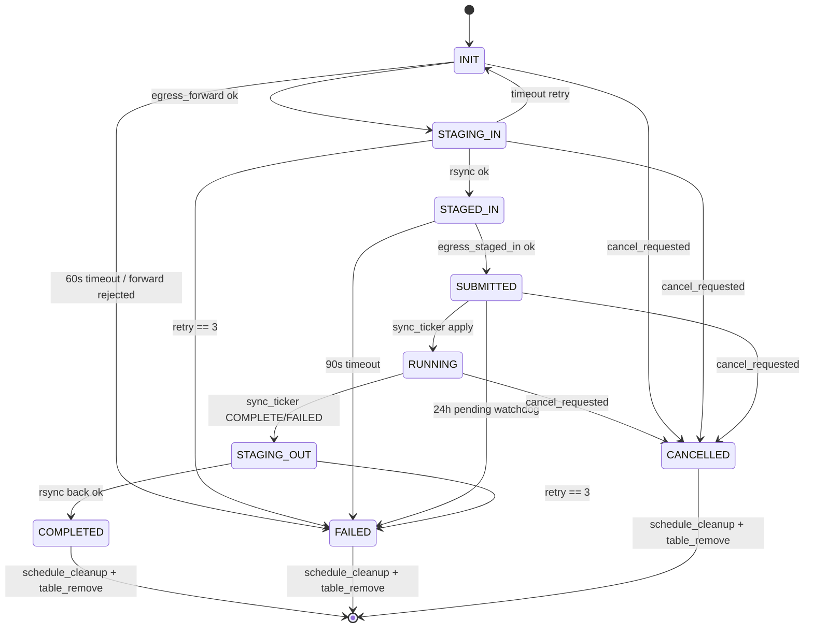

# M09 状态机 Checklist

> 配套: [doc/Broker开发任务清单.md](../Broker开发任务清单.md) §M09
> 设计: [doc/Broker详细设计文档MVP.md](../Broker详细设计文档MVP.md) §5
> Sprint: S2 → S3
> 依赖: M03-T2、M08（多个 egress_*）、M10（stage_*）
> 下游: M07-T2/T4 调 `state_machine_transition`，M13 sync_ticker 调 `apply_remote_status` 间接

---

## 1. 模块概述与目标

### 1.1 一句话定位

全局 1s tick 线程，遍历表，按状态执行：超时检测 → cancel 优先级 → 状态推进 → 终态出表。本模块是 broker 的"心跳"。

### 1.2 MVP 范围

- 单 tick 线程，1s 周期
- 9 个状态对应 9 个分支
- 超时与重试逻辑（INIT 60s、STAGING 按数据量、SUBMITTED 24h 看门狗）
- cancel 优先级：先于状态推进
- 终态：调 `ctld_inject_terminal_state` + `schedule_remote_cleanup` + 出表

### 1.3 不在 MVP 范围

- ~~优先级队列 / 多线程并行~~：单线程足够（500 在途 × 1s tick 可控）
- ~~状态机 DSL / 配置化~~：硬编码 switch 即可

### 1.4 与设计文档差异

设计文档 §5.1 给的是 v0.1 完整图，MVP §5 简化版；本文档保持 MVP 的 9 个状态。

---

## 2. 接口契约

### 2.1 公共 API

```c
/* src/slurmbrokerd/state_machine.h */
extern int state_machine_start(void);
extern void state_machine_stop(void);

/* 由其它模块（M07/M08/M13）调用，安全：内部仅写 job->state + job->state_enter_time */
extern void state_machine_transition(broker_job_t *job,
                                     broker_job_state_t to,
                                     const char *reason);
```

### 2.2 私有 helper

```c
static void *_state_machine_thread(void *arg);
static int  _tick_one(broker_job_t *job, void *arg);
static void _on_init(broker_job_t *job, time_t now);
static void _on_staging_in(broker_job_t *job, time_t now);
static void _on_staged_in(broker_job_t *job, time_t now);
static void _on_submitted(broker_job_t *job, time_t now);
static void _on_running(broker_job_t *job, time_t now);
static void _on_staging_out(broker_job_t *job, time_t now);
static void _on_terminal(broker_job_t *job, time_t now);
static int  _stage_timeout(broker_job_t *job);
```

### 2.3 全局变量

```c
/* state_machine.c */
static pthread_t sm_tid;
static volatile bool sm_running;
static list_t *to_remove_list;  /* 终态出表延迟清理 */
```

---

## 3. 参考代码

| 用途 | 文件 | 说明 |
|---|---|---|
| 1s tick 线程范式 | [src/slurmctld/agent.c](../../src/slurmctld/agent.c) | grep `_agent` |
| `slurm_thread_create` | [src/common/macros.h](../../src/common/macros.h) | thread helper |
| `time(NULL)` 单调性 | - | 注意系统时钟跳变；后续可改 `clock_gettime(CLOCK_MONOTONIC)` |

---

## 4. 文件清单

| 文件 | 类型 | 用途 |
|---|---|---|
| [src/slurmbrokerd/state_machine.h](../../src/slurmbrokerd/state_machine.h) | 新增 | API |
| [src/slurmbrokerd/state_machine.c](../../src/slurmbrokerd/state_machine.c) | 新增 | tick 线程 + 9 个状态分支 |
| [src/slurmbrokerd/Makefile.am](../../src/slurmbrokerd/Makefile.am) | 修改 | 加 state_machine.c |

---

## 5. 状态转移图



### 状态超时表

| 状态 | 超时阈值 | 超时动作 |
|---|---|---|
| INIT | 60s | FAILED reason="INIT timeout" |
| STAGING_IN | `data_GB * StageTimeoutPerGB + 600s` | retry < 3 → INIT 重发；retry == 3 → FAILED |
| STAGED_IN | 30s（每次重发）| 重发 STAGED_IN，3 次 → FAILED |
| SUBMITTED | 24h（pending 看门狗）| FAILED reason="remote pending too long" |
| RUNNING | 不设软超时（等远端 ctld）| - |
| STAGING_OUT | 同 STAGING_IN | 同 |

---

## 6. 任务展开

### M09-T1 状态机线程骨架 + `transition()`

- **依赖**: M03-T2
- **预估**: 0.5d
- **关键决策**:
  1. 1s tick；中间无信号唤醒（与 sync_ticker 同模式）
  2. `transition()` 写新 state + state_enter_time = now + state_reason；info 日志；persist_async_request
  3. tick 末尾批量从全局表 remove 终态 jobs（先收集到 `to_remove_list` 再 remove，避免在 foreach 内 mutate）
- **代码草图**:

```c
int state_machine_start(void)
{
	to_remove_list = list_create(NULL);
	sm_running = true;
	slurm_thread_create(&sm_tid, _state_machine_thread, NULL);
	return SLURM_SUCCESS;
}

void state_machine_stop(void)
{
	sm_running = false;
	pthread_join(sm_tid, NULL);
	FREE_NULL_LIST(to_remove_list);
}

void state_machine_transition(broker_job_t *job, broker_job_state_t to,
                              const char *reason)
{
	slurm_mutex_lock(&job->lock);
	if (job->state == to) {
		slurm_mutex_unlock(&job->lock);
		return;
	}
	info("transition: trace_id=%s %d -> %d (%s)",
	     job->trace_id, job->state, to, reason ? reason : "");
	job->state = to;
	job->state_enter_time = time(NULL);
	xfree(job->state_reason);
	if (reason) job->state_reason = xstrdup(reason);
	slurm_mutex_unlock(&job->lock);
	persist_async_request();
}

static void *_state_machine_thread(void *arg)
{
	while (sm_running) {
		broker_job_table_foreach(_tick_one, NULL);

		/* 出表延迟批量执行 */
		broker_job_t *j;
		list_itr_t *itr = list_iterator_create(to_remove_list);
		while ((j = list_next(itr))) {
			broker_job_table_remove(j->trace_id);
		}
		list_iterator_destroy(itr);
		list_flush(to_remove_list);

		sleep(1);
	}
	return NULL;
}

static int _tick_one(broker_job_t *job, void *arg)
{
	time_t now = time(NULL);

	/* cancel 优先 */
	if (job->cancel_requested && !job->cancel_propagated &&
	    job->state != BROKER_STATE_CANCELLED &&
	    job->state != BROKER_STATE_COMPLETED &&
	    job->state != BROKER_STATE_FAILED) {
		egress_cancel_async(job);
		state_machine_transition(job, BROKER_STATE_CANCELLED,
		                         "user cancelled");
		return 0;
	}

	switch (job->state) {
	case BROKER_STATE_INIT:        _on_init(job, now);        break;
	case BROKER_STATE_STAGING_IN:  _on_staging_in(job, now);  break;
	case BROKER_STATE_STAGED_IN:   _on_staged_in(job, now);   break;
	case BROKER_STATE_SUBMITTED:   _on_submitted(job, now);   break;
	case BROKER_STATE_RUNNING:     /* sync_ticker 推进 */     break;
	case BROKER_STATE_STAGING_OUT: _on_staging_out(job, now); break;
	case BROKER_STATE_COMPLETED:
	case BROKER_STATE_FAILED:
	case BROKER_STATE_CANCELLED:   _on_terminal(job, now);    break;
	}
	return 0;
}
```

- **风险与坑**:
  - tick 内部不能持 `g_broker_jobs_lock` 并触发 egress（egress 内部可能阻塞 30s）→ tick 内只做"决策"，egress 调用要在 foreach 出锁后执行。MVP 接受 tick 持锁阻塞（500 jobs × <1ms 决策时间）；如果 egress 阻塞，要把 RPC 调用移到独立线程。
  - 简化方案：foreach 内部只做"决策记录"（push 到 action queue），foreach 出来后再执行 action。本文档草图为简化版，落地时考虑两阶段。
- **DoD**:
  - [ ] 线程能起停；transition 调用日志可见
  - [ ] valgrind: start/stop 100 次 0 still reachable

### M09-T2 INIT 分支

- **依赖**: M08-T2 / M09-T1
- **预估**: 0.5d
- **关键决策**:
  1. ORIGINATOR：调 `egress_forward_async(job)`（M08 内部已含状态推进）
  2. RECEIVER：等远端 STAGED_IN 触发；INIT 在 RECEIVER 几乎无停留
  3. now - state_enter_time > 60 → FAILED reason="INIT timeout"
- **代码草图**:

```c
static void _on_init(broker_job_t *job, time_t now)
{
	if (job->role == BROKER_ROLE_ORIGINATOR) {
		egress_forward_async(job);  /* 内部 transition STAGING_IN */
	} else {
		/* RECEIVER: 等 STAGED_IN msg 触发；本侧仅看门狗 */
		if (now - job->state_enter_time > 60) {
			state_machine_transition(job, BROKER_STATE_FAILED,
			                         "INIT timeout");
		}
	}
}
```

- **DoD**:
  - [ ] mock peer 不响应 → 60s 后 FAILED

### M09-T3 STAGING_IN / STAGING_OUT 超时与重试

- **依赖**: M10-T1
- **预估**: 1d
- **关键决策**:
  1. `_stage_timeout(job) = data_size_GB * stage_timeout_per_gb + 600`（data_size_GB MVP 暂固定 1）
  2. 超时 + retry < 3 → transition INIT（重发 forward）或重发 stage_submit_out
  3. retry == 3 → FAILED
- **代码草图**:

```c
static int _stage_timeout(broker_job_t *job)
{
	uint32_t gb = 1; /* MVP: TODO M10-T4 du -sb 估算 */
	return gb * g_broker_conf.stage_timeout_per_gb + 600;
}

static void _on_staging_in(broker_job_t *job, time_t now)
{
	if (now - job->state_enter_time < _stage_timeout(job))
		return;

	if (job->retry_count < 3) {
		job->retry_count++;
		state_machine_transition(job, BROKER_STATE_INIT,
		                         "stage retry");
	} else {
		state_machine_transition(job, BROKER_STATE_FAILED,
		                         "stage timeout");
	}
}

static void _on_staging_out(broker_job_t *job, time_t now)
{
	if (now - job->state_enter_time < _stage_timeout(job))
		return;

	if (job->retry_count < 3) {
		job->retry_count++;
		stage_submit_out(job); /* 重发 */
		job->state_enter_time = now;
	} else {
		state_machine_transition(job, BROKER_STATE_FAILED,
		                         "stage out timeout");
	}
}
```

- **DoD**:
  - [ ] 故意杀掉 rsync → 看到 retry，第 3 次 FAILED

### M09-T4 STAGED_IN 等响应超时（30s）

- **依赖**: M08-T3
- **预估**: 0.25d
- **代码草图**:

```c
static void _on_staged_in(broker_job_t *job, time_t now)
{
	if (now - job->state_enter_time < 30) return;

	if (job->retry_count < 3) {
		job->retry_count++;
		egress_staged_in_async(job);
		job->state_enter_time = now;
	} else {
		state_machine_transition(job, BROKER_STATE_FAILED,
		                         "staged_in timeout");
	}
}
```

- **DoD**:
  - [ ] mock peer 不响应 → 90s 后 FAILED

### M09-T5 SUBMITTED 24h pending 看门狗

- **依赖**: M09-T1
- **预估**: 0.25d
- **代码草图**:

```c
static void _on_submitted(broker_job_t *job, time_t now)
{
	if (now - job->state_enter_time > 86400) {
		state_machine_transition(job, BROKER_STATE_FAILED,
		                         "remote pending too long (24h)");
	}
}
```

- **DoD**:
  - [ ] 单测构造旧 state_enter_time → tick 后 FAILED

### M09-T6 cancel 优先级处理

- **依赖**: M08-T5
- **预估**: 0.5d
- **关键决策**: 在 switch 前先判 cancel_requested && !cancel_propagated && !终态 → egress_cancel_async + transition CANCELLED（已在 M09-T1 草图体现）
- **DoD**:
  - [ ] scancel 后 ≤ 5s 状态 CANCELLED

### M09-T7 终态出表 + ctld 注入

- **依赖**: M08-T7, M14-T1
- **预估**: 0.5d
- **代码草图**:

```c
static void _on_terminal(broker_job_t *job, time_t now)
{
	if (job->_terminal_handled) return;
	job->_terminal_handled = true;  /* 添加在 broker_job_t */

	if (job->role == BROKER_ROLE_ORIGINATOR) {
		ctld_inject_terminal_state(job);
	}
	schedule_remote_cleanup(job);  /* M14 */
	list_append(to_remove_list, job);
}
```

> 注：`_terminal_handled` 字段需要在 M03-T1 broker_job_t 中预留（hook 字段；MVP 可以加或不加，加则更安全）。

- **DoD**:
  - [ ] 端到端 1 个 job 跑完后表内消失（或 cleanup 队列里）；sacct 字段写入

---

## 7. 整体 DoD（汇总）

- [ ] 7 个子任务全部勾选
- [ ] 整机端到端：mock peer 全程响应 → 1 个 job INIT → STAGING_IN → STAGED_IN → SUBMITTED → RUNNING → STAGING_OUT → COMPLETED
- [ ] cancel 链路：任意状态 cancel ≤ 5s 内 CANCELLED
- [ ] 故障注入：peer 不可达 → 重试用尽后 FAILED
- [ ] valgrind: start/stop + 100 jobs full lifecycle 0 still reachable

## 8. 验证脚本

```bash
./tests/broker/sm_full_lifecycle.sh xian-100
# 期望：观察日志逐条 transition

./tests/broker/sm_cancel_at_each_state.sh xian-200
# 期望：4 个子用例 (INIT/STAGING_IN/RUNNING/STAGING_OUT) 全部 ≤ 5s CANCELLED
```

---

## 9. 风险与回滚

| 风险 | 触发 | 缓解 |
|---|---|---|
| tick 持锁期间慢 IO 阻塞所有读 | egress 在 foreach 内同步发 | 两阶段 tick：foreach 收集 actions，出锁后执行 |
| 系统时钟回拨导致超时误判 | NTP 调整 | clock_gettime(CLOCK_MONOTONIC) 替代 time() |
| `_terminal_handled` 字段未持久化 | restart 后重复发 ctld_inject_terminal | persist 时一并写入；或用 `state == COMPLETED && state_reason == "injected"` 判定 |
| egress 内部 transition 与本 tick 竞态 | 多线程同时 set state | 严格通过 `state_machine_transition` 接口 + 内部加锁 |

回滚：本模块独立。`git revert state_machine.c/.h + main 调用`。
