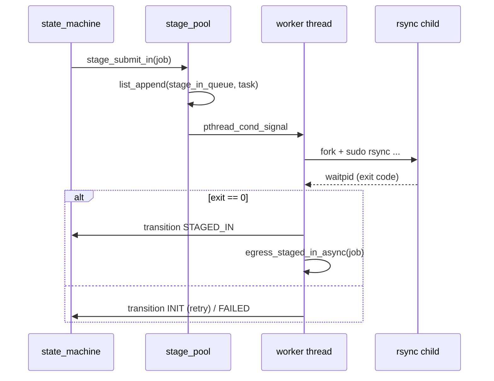

# M10 数据传输 (rsync) Checklist

> 配套: [doc/Broker开发任务清单.md](../Broker开发任务清单.md) §M10
> 设计: [doc/Broker详细设计文档MVP.md](../Broker详细设计文档MVP.md) §9
> Sprint: S2 → S3
> 依赖: M02-T3（StageRsyncBin/StageSshKey/StageSshUser/StageWorkerCount）
> 下游: M08-T3 （stage-in 完成后调 egress_staged_in），M09 状态机

---

## 1. 模块概述与目标

### 1.1 一句话定位

固定大小 worker pool（默认 4 线程）异步执行 `sudo + rsync + ssh` 跨主机数据传输。stage-in（源端 → 远端 dst_work_dir）由 ORIGINATOR 触发，stage-out（远端 → 源端 src_work_dir）由 sync_ticker 检测远端终态后触发。

### 1.2 MVP 范围

- 4 个 worker pthread，pop 任务串行执行 rsync（`waitpid` 阻塞）
- 退出码 0 → 调 transition + 后续 egress；非 0 → 重试 / FAILED
- stdout/stderr 重定向到 `/var/log/slurm/broker_stage/<trace_id>.log`
- `du -sb` 估算字节，超 `MaxStageBytes` 拒绝（M10-T4）

### 1.3 不在 MVP 范围

- ~~并发流控（不让多个大数据 stage 同时跑）~~：MVP 4 worker 即上限
- ~~断点续传 / checksum~~：rsync 本身已 idempotent
- ~~多进程协调（避免同一目录两个 rsync）~~

### 1.4 与设计文档差异

设计文档 §9.1 给完整 rsync 命令；保持一致。

---

## 2. 接口契约

### 2.1 公共 API

```c
/* src/slurmbrokerd/stage.h */
extern int stage_pool_start(void);
extern void stage_pool_stop(void);

extern int stage_submit_in(broker_job_t *job);
extern int stage_submit_out(broker_job_t *job);
```

### 2.2 私有数据结构

```c
typedef enum { STAGE_IN, STAGE_OUT } stage_dir_t;

typedef struct {
	broker_job_t *job;
	stage_dir_t   direction;
} stage_task_t;

static list_t          *stage_in_queue;
static list_t          *stage_out_queue;
static pthread_mutex_t  stage_mutex;
static pthread_cond_t   stage_cond;
static pthread_t       *stage_workers;
static int              n_workers;
static volatile bool    stage_running;
```

### 2.3 rsync 命令模板

**stage-in**（源端 broker 触发，从 src_work_dir 推到 remote_broker_host:dst_work_dir）：

```sh
sudo -u <src_user> /usr/bin/rsync -av --delete \
    -e "ssh -i <stage_ssh_key> -o StrictHostKeyChecking=no \
            -o UserKnownHostsFile=/dev/null \
            -o LogLevel=ERROR" \
    <src_work_dir>/ \
    <stage_ssh_user>@<remote_broker_host>:<dst_work_dir>/
```

**stage-out**（源端 broker 触发，从远端拉回到 src_work_dir）：

```sh
sudo -u <src_user> /usr/bin/rsync -av \
    -e "ssh -i <stage_ssh_key> ..." \
    <stage_ssh_user>@<remote_broker_host>:<dst_work_dir>/ \
    <src_work_dir>/
```

> **注意**：`<stage_ssh_user>` 是远端 broker 主机上的代理用户，在那一侧用 sudoers 切换到 `<remote_user>` 写入 dst_work_dir。详见 [doc/Broker详细设计文档MVP.md](../Broker详细设计文档MVP.md) §9.2 SSH key 流程。

---

## 3. 参考代码

| 用途 | 文件 | 说明 |
|---|---|---|
| fork+execv+waitpid | [src/slurmd/slurmstepd/](../../src/slurmd/slurmstepd/) | grep `execv` |
| pthread worker pool | [src/slurmctld/agent.c](../../src/slurmctld/agent.c) | grep `pthread_create` |
| dup2 重定向 stdout/stderr | [src/common/run_command.c](../../src/common/run_command.c) | grep `dup2` |
| `pthread_cond_wait` 队列 | [src/common/agent.h](../../src/common/agent.h) | 范式 |
| `du -sb` 估算 | shell | `LANG=C du -sb path` |

---

## 4. 文件清单

| 文件 | 类型 | 用途 |
|---|---|---|
| [src/slurmbrokerd/stage.h](../../src/slurmbrokerd/stage.h) | 新增 | API |
| [src/slurmbrokerd/stage.c](../../src/slurmbrokerd/stage.c) | 新增 | worker pool + stage-in/out |
| [src/slurmbrokerd/Makefile.am](../../src/slurmbrokerd/Makefile.am) | 修改 | 加 stage.c |

---

## 5. 数据流



---

## 6. 任务展开

### M10-T1 stage worker pool 启动 + 任务队列

- **依赖**: M02-T3
- **预估**: 1d
- **关键决策**:
  1. `stage_worker_count` 来自 conf（默认 4）
  2. 用 `list_t` + cond/mutex 实现 FIFO 队列
  3. `stage_submit_in` 仅入队，不阻塞调用方
  4. shutdown 时 broadcast cond 唤醒所有 worker，让它们看到 `stage_running=false` 退出
- **代码草图**:

```c
int stage_pool_start(void)
{
	stage_in_queue  = list_create((ListDelF) xfree);
	stage_out_queue = list_create((ListDelF) xfree);
	slurm_mutex_init(&stage_mutex);
	pthread_cond_init(&stage_cond, NULL);

	n_workers = g_broker_conf.stage_worker_count;
	if (n_workers <= 0) n_workers = 4;
	stage_workers = xcalloc(n_workers, sizeof(pthread_t));
	stage_running = true;

	for (int i = 0; i < n_workers; i++) {
		slurm_thread_create(&stage_workers[i], _stage_worker_main,
		                    (void *)(intptr_t) i);
	}
	info("stage: pool started, %d workers", n_workers);
	return SLURM_SUCCESS;
}

void stage_pool_stop(void)
{
	slurm_mutex_lock(&stage_mutex);
	stage_running = false;
	pthread_cond_broadcast(&stage_cond);
	slurm_mutex_unlock(&stage_mutex);

	for (int i = 0; i < n_workers; i++)
		pthread_join(stage_workers[i], NULL);
	xfree(stage_workers);

	FREE_NULL_LIST(stage_in_queue);
	FREE_NULL_LIST(stage_out_queue);
	slurm_mutex_destroy(&stage_mutex);
	pthread_cond_destroy(&stage_cond);
}

int stage_submit_in(broker_job_t *job)
{
	stage_task_t *t = xmalloc(sizeof(*t));
	t->job = job;
	t->direction = STAGE_IN;
	slurm_mutex_lock(&stage_mutex);
	list_append(stage_in_queue, t);
	pthread_cond_signal(&stage_cond);
	slurm_mutex_unlock(&stage_mutex);
	return SLURM_SUCCESS;
}

static void *_stage_worker_main(void *arg)
{
	int wid = (intptr_t) arg;
	while (stage_running) {
		stage_task_t *t = NULL;

		slurm_mutex_lock(&stage_mutex);
		while (stage_running && list_is_empty(stage_in_queue)
		       && list_is_empty(stage_out_queue))
			pthread_cond_wait(&stage_cond, &stage_mutex);
		if (!stage_running) {
			slurm_mutex_unlock(&stage_mutex);
			break;
		}
		t = list_pop(stage_in_queue);
		if (!t) t = list_pop(stage_out_queue);
		slurm_mutex_unlock(&stage_mutex);

		if (t) {
			_run_stage(wid, t);
			xfree(t);
		}
	}
	return NULL;
}
```

- **DoD**:
  - [ ] 启动 4 worker；submit 一个 noop 任务能被消费
  - [ ] valgrind clean

### M10-T2 stage-in 子进程实现

- **依赖**: M10-T1, M11-T1（read_with_timeout 等工具，可选复用）
- **预估**: 1.5d
- **关键决策**:
  1. fork + execv `/usr/bin/sudo`，父进程 `waitpid` 阻塞（worker 线程内自然阻塞）
  2. 退出码 0 → transition STAGED_IN + egress_staged_in_async
  3. 非 0 → 让状态机走 retry（M09-T3）；不在这里直接 FAILED
  4. stdout/stderr → `/var/log/slurm/broker_stage/<trace_id>.log`
- **代码草图**:

```c
static void _run_stage(int wid, stage_task_t *t)
{
	broker_job_t *job = t->job;
	int rc;

	if (t->direction == STAGE_IN) {
		rc = _exec_rsync(job, STAGE_IN);
		if (rc == 0) {
			state_machine_transition(job, BROKER_STATE_STAGED_IN,
			                         NULL);
			egress_staged_in_async(job);
		} else {
			error("stage-in failed trace_id=%s rc=%d",
			      job->trace_id, rc);
			/* state machine M09-T3 will pick this up on next tick */
		}
	} else {
		rc = _exec_rsync(job, STAGE_OUT);
		if (rc == 0) {
			state_machine_transition(job, BROKER_STATE_COMPLETED,
			                         "stage_out ok");
		}
	}
	persist_async_request();
}

static int _exec_rsync(broker_job_t *job, stage_dir_t dir)
{
	char *log_dir = "/var/log/slurm/broker_stage";
	char *log_path = NULL;
	mkdir(log_dir, 0755);
	xstrfmtcat(log_path, "%s/%s.log", log_dir, job->trace_id);

	pid_t pid = fork();
	if (pid == 0) {
		int fd = open(log_path, O_WRONLY|O_CREAT|O_APPEND, 0644);
		if (fd >= 0) { dup2(fd, 1); dup2(fd, 2); close(fd); }
		_build_and_exec_rsync(job, dir);
		_exit(127);
	}
	xfree(log_path);
	if (pid < 0) return -1;

	int wstat;
	if (waitpid(pid, &wstat, 0) < 0) return -1;
	return WIFEXITED(wstat) ? WEXITSTATUS(wstat) : -1;
}

static void _build_and_exec_rsync(broker_job_t *job, stage_dir_t dir)
{
	char *src = NULL, *dst = NULL, *ssh_e = NULL;

	xstrfmtcat(ssh_e,
	           "ssh -i %s -o StrictHostKeyChecking=no "
	           "-o UserKnownHostsFile=/dev/null -o LogLevel=ERROR",
	           g_broker_conf.stage_ssh_key);

	if (dir == STAGE_IN) {
		xstrfmtcat(src, "%s/", job->src_work_dir);
		xstrfmtcat(dst, "%s@%s:%s/",
		           g_broker_conf.stage_ssh_user,
		           g_broker_conf.remote_broker_host,
		           job->dst_work_dir);
	} else {
		xstrfmtcat(src, "%s@%s:%s/",
		           g_broker_conf.stage_ssh_user,
		           g_broker_conf.remote_broker_host,
		           job->dst_work_dir);
		xstrfmtcat(dst, "%s/", job->src_work_dir);
	}

	execl("/usr/bin/sudo", "sudo", "-u", job->src_user_name,
	      g_broker_conf.stage_rsync_bin, "-av",
	      (dir == STAGE_IN) ? "--delete" : "--",
	      "-e", ssh_e, src, dst, (char *) NULL);

	/* execl 失败才会到这里 */
	_exit(127);
}
```

- **风险与坑**:
  - rsync 卡住：sudo timeout 没设；MVP 接受由 M09-T3 状态机超时兜底
  - log 文件权限：日志目录 `/var/log/slurm/broker_stage/` 必须 broker 用户可写（M15 部署做）
  - stdout/stderr 大量输出可能撑爆磁盘；用 logrotate 处理（M15-T6）
- **DoD**:
  - [ ] 真实 1GB 目录跨机 rsync 完成态正确
  - [ ] 故意删 ssh key 跑 → 退出非 0，日志可定位

### M10-T3 stage-out 子进程实现

- **依赖**: M10-T2
- **预估**: 1d
- **关键决策**:
  1. 与 stage-in 镜像，方向反
  2. 触发点是 sync_ticker 的 `apply_remote_status` 检测 COMPLETE/FAILED 时
  3. 完成回调 transition COMPLETED
- **DoD**:
  - [ ] 远端跑完作业，源端 src_work_dir 出现回写文件

### M10-T4 字节限额 MaxStageBytes

- **依赖**: M10-T2
- **预估**: 0.5d
- **关键决策**:
  1. 提交 stage-in 任务前 `du -sb`（sudo -u src_user 跑），估算总字节
  2. 超 `g_broker_conf.max_stage_bytes` → transition FAILED reason="stage size exceeded"
- **代码草图**:

```c
static uint64_t _du_sb(const char *user, const char *path)
{
	int pipefd[2];
	if (pipe(pipefd) < 0) return UINT64_MAX;

	pid_t pid = fork();
	if (pid == 0) {
		dup2(pipefd[1], 1);
		close(pipefd[0]); close(pipefd[1]);
		execl("/usr/bin/sudo", "sudo", "-u", user, "/usr/bin/du",
		      "-sb", path, (char *) NULL);
		_exit(127);
	}
	close(pipefd[1]);

	char buf[64] = {0};
	read(pipefd[0], buf, sizeof(buf) - 1);
	close(pipefd[0]);
	waitpid(pid, NULL, 0);

	uint64_t v;
	if (sscanf(buf, "%" SCNu64, &v) != 1) return UINT64_MAX;
	return v;
}

int stage_submit_in(broker_job_t *job)
{
	uint64_t bytes = _du_sb(job->src_user_name, job->src_work_dir);
	if (bytes > g_broker_conf.max_stage_bytes) {
		error("stage_submit_in: trace_id=%s size %lu exceeds %lu",
		      job->trace_id, bytes, g_broker_conf.max_stage_bytes);
		state_machine_transition(job, BROKER_STATE_FAILED,
		                         "stage size exceeded");
		return SLURM_ERROR;
	}
	/* 入队（同 T1）*/
	stage_task_t *t = xmalloc(sizeof(*t));
	t->job = job;
	t->direction = STAGE_IN;
	slurm_mutex_lock(&stage_mutex);
	list_append(stage_in_queue, t);
	pthread_cond_signal(&stage_cond);
	slurm_mutex_unlock(&stage_mutex);
	return SLURM_SUCCESS;
}
```

- **风险**: `du -sb` 在大目录可能很慢；MVP 接受 < 30s 一次估算
- **DoD**:
  - [ ] 60GB 目录测试拒绝

---

## 7. 整体 DoD（汇总）

- [ ] 4 子任务全部勾选
- [ ] 1GB / 100MB / 1MB 三种 size 实跑通过
- [ ] 故障注入：ssh key 错 / 远端目录不存在 → FAILED + log 可读
- [ ] valgrind clean

## 8. 验证脚本

```bash
# 准备
sudo install -d -o slurm-broker -g slurm-broker /var/log/slurm/broker_stage

# 跑 1MB
./tests/broker/stage_in_smoke.sh /tmp/test1mb
# 检查 log
cat /var/log/slurm/broker_stage/xian-100.log

# 字节限额
dd if=/dev/zero of=/tmp/big.bin bs=1G count=70
./tests/broker/stage_in_smoke.sh /tmp/big.bin
# 期望: ESLURM_BROKER... + FAILED
```

---

## 9. 风险与回滚

| 风险 | 触发 | 缓解 |
|---|---|---|
| sudoers 配错 | 部署 | M15-T3 模板 |
| ssh known_hosts 污染 | 多端 host 互信不一致 | `UserKnownHostsFile=/dev/null` |
| log 撑爆磁盘 | 大量 stage / 长期不清理 | M15-T6 logrotate |
| worker 卡死无超时 | rsync hang | 上层 M09-T3 状态超时兜底 |

回滚：本模块独立。`git revert stage.c/.h + state_machine 调用`。
