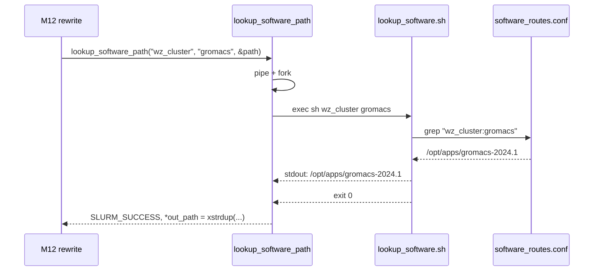

# M11 软件路径解析 Checklist

> 配套: [doc/Broker开发任务清单.md](../Broker开发任务清单.md) §M11
> 设计: [doc/Broker详细设计文档MVP.md](../Broker详细设计文档MVP.md) §8.2.1
> Sprint: S3
> 依赖: 无（独立工具模块）
> 下游: M12 rewrite 调用 `lookup_software_path`

---

## 1. 模块概述与目标

### 1.1 一句话定位

fork+exec 外部 `lookup_software.sh` 脚本，输入 `<cluster> <app>` 拿到软件绝对路径，3s 超时；脚本读取 `software_routes.conf` 由运维管理。broker 不感知 conf 格式，仅消费一行 stdout。

### 1.2 MVP 范围

- `read_with_timeout` / `waitpid_timeout` 通用工具
- `lookup_software_path()` 主函数：pipe + fork + execl 脚本，超时 kill
- 提供 `lookup_software.sh` 模板与示例 `software_routes.conf`

### 1.3 不在 MVP 范围

- ~~LRU 缓存~~：3s × N 次 lookup 在 MVP 量级可接受
- ~~plugin 化（让 lookup 可换实现）~~：设计文档 §14 演进点

### 1.4 与设计文档差异

设计文档 §8.2.1 给完整代码骨架；保持一致。

---

## 2. 接口契约

### 2.1 公共 API

```c
/* src/slurmbrokerd/software.h */

/*
 * 同步调用外部 lookup 脚本，3s 超时。
 *
 * cluster   - 目标集群名（broker.conf 中 RemoteClusterName 或 src_cluster）
 * app       - 应用名（job_desc->name 或 SBATCH --app）
 * out_path  - 成功时返回 xstrdup 的绝对路径，调用方 xfree
 *
 * 返回 SLURM_SUCCESS / ESLURM_BROKER_LOOKUP_TIMEOUT / ESLURM_BROKER_LOOKUP_FAILED
 */
extern int lookup_software_path(const char *cluster, const char *app,
                                char **out_path);
```

### 2.2 私有工具

```c
/* 从 fd 读 N 字节或超时返回 */
static int  _read_with_timeout(int fd, char *buf, size_t bufsz,
                               int timeout_ms);

/* waitpid + 100ms 轮询直到超时 → kill -9 */
static int  _waitpid_timeout(pid_t pid, int *wstatus, int timeout_ms);
```

### 2.3 脚本契约

输入：`argv[1] = <cluster>`、`argv[2] = <app>`
输出：stdout 一行，即软件绝对路径（必须 `/` 开头）
退出码：
- `0` 成功
- `2` 找不到 cluster 或 app
- 其它非 0 → 视为失败

---

## 3. 参考代码

| 用途 | 文件 | 说明 |
|---|---|---|
| `select` 等 fd 可读 | [src/common/fd.c](../../src/common/fd.c) | grep `wait_fd_readable` |
| pipe + fork + execl | [src/common/run_command.c](../../src/common/run_command.c) | 完整范式 |
| `waitpid` + WNOHANG 轮询 | [src/slurmd/slurmstepd/](../../src/slurmd/slurmstepd/) | 同样模式 |
| `access(p, X_OK)` | [src/common/proc_args.c](../../src/common/proc_args.c) | M02-T3 校验 |

---

## 4. 文件清单

| 文件 | 类型 | 用途 |
|---|---|---|
| [src/slurmbrokerd/software.h](../../src/slurmbrokerd/software.h) | 新增 | API |
| [src/slurmbrokerd/software.c](../../src/slurmbrokerd/software.c) | 新增 | lookup_software_path + helper |
| [src/slurmbrokerd/Makefile.am](../../src/slurmbrokerd/Makefile.am) | 修改 | 加 software.c |
| `scripts/lookup_software.sh` | 新增 | 脚本模板（M15-T5 部署到 `/opt/slurm-broker/scripts/`） |
| `etc/slurm-broker/software_routes.conf.example` | 新增 | 运维填表模板 |

---

## 5. 数据流



---

## 6. 任务展开

### M11-T1 `_read_with_timeout` / `_waitpid_timeout` 工具

- **依赖**: 无
- **预估**: 0.5d
- **关键决策**:
  1. `_read_with_timeout`：`select` 等 fd 可读，超时 → -1 errno=ETIMEDOUT
  2. `_waitpid_timeout`：100ms 轮询 + WNOHANG，到时 SIGKILL
  3. 二者都 portable，不依赖 SIGCHLD
- **代码草图**:

```c
static int _read_with_timeout(int fd, char *buf, size_t bufsz, int timeout_ms)
{
	struct timeval tv = {
		.tv_sec  = timeout_ms / 1000,
		.tv_usec = (timeout_ms % 1000) * 1000,
	};
	fd_set rfds;
	FD_ZERO(&rfds);
	FD_SET(fd, &rfds);

	int n = select(fd + 1, &rfds, NULL, NULL, &tv);
	if (n == 0) { errno = ETIMEDOUT; return -1; }
	if (n < 0) return -1;
	return read(fd, buf, bufsz);
}

static int _waitpid_timeout(pid_t pid, int *wstatus, int timeout_ms)
{
	int elapsed = 0;
	while (elapsed < timeout_ms) {
		pid_t r = waitpid(pid, wstatus, WNOHANG);
		if (r == pid) return 0;
		if (r < 0)    return -1;
		usleep(100 * 1000);  /* 100ms */
		elapsed += 100;
	}
	kill(pid, SIGKILL);
	waitpid(pid, wstatus, 0);
	errno = ETIMEDOUT;
	return -1;
}
```

- **DoD**:
  - [ ] 单测：sleep 5 配 1s 超时 → 进程被 kill
  - [ ] 单测：echo "ok" → 0.5s 内读出，无超时

### M11-T2 `lookup_software_path` 主函数

- **依赖**: M11-T1
- **预估**: 1d
- **关键决策**:
  1. pipe + fork：父读 stdout 一行，超时 ETIMEDOUT
  2. waitpid 3s 超时 → ESLURM_BROKER_LOOKUP_TIMEOUT
  3. exit != 0 → ESLURM_BROKER_LOOKUP_FAILED
  4. 输出非 `/` 开头视为非法 → ESLURM_BROKER_LOOKUP_FAILED
  5. 成功 `*out_path = xstrdup(buf)`
- **代码草图**:

```c
int lookup_software_path(const char *cluster, const char *app, char **out_path)
{
	int pipefd[2];
	pid_t pid;
	char buf[PATH_MAX + 1] = { 0 };
	int n, wstat;
	int timeout_s = g_broker_conf.lookup_timeout_sec;

	if (timeout_s <= 0) timeout_s = 3;
	*out_path = NULL;

	if (pipe(pipefd) < 0)
		return ESLURM_BROKER_LOOKUP_FAILED;

	pid = fork();
	if (pid < 0) {
		close(pipefd[0]); close(pipefd[1]);
		return ESLURM_BROKER_LOOKUP_FAILED;
	}

	if (pid == 0) {
		dup2(pipefd[1], 1);
		close(pipefd[0]); close(pipefd[1]);
		execl(g_broker_conf.lookup_software_script,
		      g_broker_conf.lookup_software_script,
		      cluster, app, (char *) NULL);
		_exit(127);
	}

	close(pipefd[1]);
	n = _read_with_timeout(pipefd[0], buf, sizeof(buf) - 1, timeout_s * 1000);
	close(pipefd[0]);

	if (n < 0 && errno == ETIMEDOUT) {
		kill(pid, SIGKILL);
		waitpid(pid, &wstat, 0);
		error("lookup_software: timeout (%ds) cluster=%s app=%s",
		      timeout_s, cluster, app);
		return ESLURM_BROKER_LOOKUP_TIMEOUT;
	}

	if (_waitpid_timeout(pid, &wstat, 1000) < 0) {
		error("lookup_software: waitpid timeout");
		return ESLURM_BROKER_LOOKUP_TIMEOUT;
	}

	if (!WIFEXITED(wstat) || WEXITSTATUS(wstat)) {
		error("lookup_software: exit %d cluster=%s app=%s",
		      WEXITSTATUS(wstat), cluster, app);
		return ESLURM_BROKER_LOOKUP_FAILED;
	}

	/* 截断换行 */
	for (char *p = buf; *p; p++) if (*p == '\n' || *p == '\r') { *p = 0; break; }
	if (buf[0] != '/') {
		error("lookup_software: invalid path '%s' (must be absolute)",
		      buf);
		return ESLURM_BROKER_LOOKUP_FAILED;
	}

	*out_path = xstrdup(buf);
	debug("lookup_software: cluster=%s app=%s -> %s",
	      cluster, app, *out_path);
	return SLURM_SUCCESS;
}
```

- **风险与坑**:
  - 子进程可能 hang 在 stderr 没人读 → MVP 不重定向 stderr，让它打到 broker 的 stderr/syslog
  - PATH_MAX 在某些系统是 4096，但 Linux 上常见 4096，足够
- **DoD**:
  - [ ] mock 脚本 `echo /opt/apps/gromacs && exit 0` → SUCCESS，path 正确
  - [ ] mock 脚本 `sleep 10 && echo ok` → ESLURM_BROKER_LOOKUP_TIMEOUT
  - [ ] mock 脚本 `echo not_a_path && exit 0` → ESLURM_BROKER_LOOKUP_FAILED
  - [ ] mock 脚本 `exit 1` → ESLURM_BROKER_LOOKUP_FAILED

### M11-T3 提供 `lookup_software.sh` 模板与 routes 示例

- **依赖**: 无
- **预估**: 0.5d
- **关键决策**:
  1. 简单 shell：读 conf 文件，grep `<cluster>:<app>`，输出 value
  2. 找不到 → exit 2 + stderr 提示
  3. `set -euo pipefail` 防 silent failure
- **代码草图**:

```bash
#!/bin/bash
# /opt/slurm-broker/scripts/lookup_software.sh
# 用法: lookup_software.sh <cluster> <app>
set -euo pipefail

CLUSTER="${1:-}"
APP="${2:-}"
CONF="${BROKER_CONF_DIR:-/etc/slurm-broker}/software_routes.conf"

if [[ -z "$CLUSTER" || -z "$APP" ]]; then
    echo "Usage: $0 <cluster> <app>" >&2
    exit 2
fi

if [[ ! -r "$CONF" ]]; then
    echo "lookup_software: $CONF not readable" >&2
    exit 2
fi

# 行格式: <cluster>:<app>=<absolute_path>
LINE=$(grep -E "^${CLUSTER}:${APP}=" "$CONF" || true)
if [[ -z "$LINE" ]]; then
    echo "lookup_software: ${CLUSTER}:${APP} not in $CONF" >&2
    exit 2
fi

PATH_OUT="${LINE#*=}"
echo "$PATH_OUT"
```

`software_routes.conf.example`：

```ini
# /etc/slurm-broker/software_routes.conf
# Format: <cluster>:<app>=<absolute_path>

wz_cluster:gromacs=/opt/apps/gromacs-2024.1
wz_cluster:lammps=/opt/apps/lammps-29Aug2024
xian_cluster:gromacs=/opt/apps/gromacs-2024.1
```

- **DoD**:
  - [ ] `./lookup_software.sh wz_cluster gromacs` 输出 `/opt/apps/gromacs-2024.1`
  - [ ] `./lookup_software.sh wz_cluster nonexistent` exit 2
  - [ ] `BROKER_CONF_DIR=/wrong ./lookup_software.sh ...` exit 2

---

## 7. 整体 DoD（汇总）

- [ ] 3 子任务全部勾选
- [ ] 100 次 lookup 单线程总耗时 < 5s（脚本启动开销 ~50ms × 100）
- [ ] 故障注入：脚本 hang → broker 自动 timeout，state_reason 含 `lookup_software`
- [ ] valgrind: 100 次 lookup clean

## 8. 验证脚本

```bash
# T1 单元
./tests/broker/test_read_timeout

# T2 集成
echo '#!/bin/bash
echo /opt/apps/gromacs' > /tmp/mock_lookup.sh
chmod +x /tmp/mock_lookup.sh
./tests/broker/test_lookup_software /tmp/mock_lookup.sh wz gromacs
# 期望: SUCCESS, path=/opt/apps/gromacs

# T3 真脚本
sudo cp scripts/lookup_software.sh /opt/slurm-broker/scripts/
sudo cp etc/slurm-broker/software_routes.conf.example /etc/slurm-broker/software_routes.conf
/opt/slurm-broker/scripts/lookup_software.sh wz_cluster gromacs
```

---

## 9. 风险与回滚

| 风险 | 触发 | 缓解 |
|---|---|---|
| 脚本权限/路径错 | 部署疏漏 | M02-T3 校验 X_OK；M15-T5 部署位置规约 |
| stderr 阻塞 | conf 巨量错误日志 | 不重定向；让 broker 主进程吃住 |
| conf 行注入 | 运维写入恶意 path | 脚本只输出，不 exec；调用方仅嵌入 sbatch script，由远端 sbatch 校验 |
| LRU 缺失导致脚本被频繁 fork | 大并发 forward | 100 forward/s × 50ms = 5s/s，可接受；后续可加缓存 |

回滚：本模块独立。`git revert software.c/.h + scripts/`。
