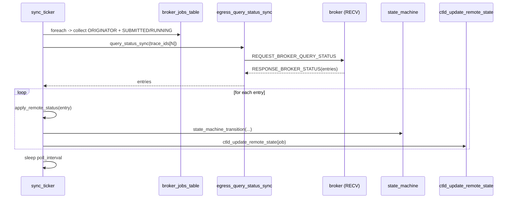

# M13 状态轮询 (sync_ticker) Checklist

> 配套: [doc/Broker开发任务清单.md](../Broker开发任务清单.md) §M13
> 设计: [doc/Broker详细设计文档MVP.md](../Broker详细设计文档MVP.md) §6.2 / §6.3
> Sprint: S3
> 依赖: M03-T2、M08-T4 (egress_query_status_sync)、M08-T6 (ctld_update_remote_state)、M10-T3 (stage_submit_out)
> 下游: 无（直接驱动 state_machine 推进）

---

## 1. 模块概述与目标

### 1.1 一句话定位

ORIGINATOR 角色独有线程：每 10s 收集所有 SUBMITTED/RUNNING 的 trace_id，**一次性** `REQUEST_BROKER_QUERY_STATUS` 拿全量；按返回 entry 推进本地 state、推送 ctld、触发 stage-out。

### 1.2 MVP 范围

- 单 ticker 线程，10s 周期
- 一次 RPC 拿 N 个 trace_id 的 entry
- `apply_remote_status` 状态映射
- 失败重试（连续 PollMaxRetries 轮失败 → 错误日志，不影响其它逻辑）

### 1.3 不在 MVP 范围

- ~~分片轮询（多个 ticker 实例）~~：单 ticker 即可，500 jobs × 1 RPC/10s = 50/min 可控
- ~~事件驱动（远端主动推 RUNNING）~~：v0.2 hook

### 1.4 与设计文档差异

设计文档 §6.2 / §6.3 给完整 apply 表；保持一致。

---

## 2. 接口契约

### 2.1 公共 API

```c
/* src/slurmbrokerd/sync_ticker.h */
extern int sync_ticker_start(void);
extern void sync_ticker_stop(void);
```

### 2.2 私有 helper

```c
static void *_sync_ticker_main(void *arg);
static void  _sync_ticker_run(void);
static int   _collect_trace_id(broker_job_t *j, void *arg);
static void  _apply_remote_status(broker_status_entry_t *e);
```

### 2.3 全局变量

```c
/* sync_ticker.c */
static pthread_t  sync_tid;
static volatile bool sync_running;
static uint32_t   consecutive_failures;
```

### 2.4 远端 state → 本地 state 映射

| 远端 `remote_state` (slurm.h) | 本地 broker_job_state | 动作 |
|---|---|---|
| `JOB_PENDING` | 任意 | `ctld_update_remote_state(job)`（仅推一次 PENDING） |
| `JOB_RUNNING` | SUBMITTED | 写 start_time / alloc_tres → transition RUNNING → ctld_update_remote_state |
| `JOB_COMPLETE` / `JOB_FAILED` / `JOB_TIMEOUT` | RUNNING | 写 end_time / exit_code / alloc_tres → stage_submit_out → transition STAGING_OUT |
| `JOB_CANCELLED` | 任意 | transition CANCELLED |

---

## 3. 参考代码

| 用途 | 文件 | 说明 |
|---|---|---|
| 1s tick + cond_timedwait | [src/slurmctld/agent.c](../../src/slurmctld/agent.c) | 范式 |
| `slurm_job_state_string` | [src/common/slurm_protocol_defs.c](../../src/common/slurm_protocol_defs.c) | 状态字符串 |
| `JOB_PENDING` 等枚举 | [slurm/slurm.h](../../slurm/slurm.h) | grep `JOB_PENDING` |

---

## 4. 文件清单

| 文件 | 类型 | 用途 |
|---|---|---|
| [src/slurmbrokerd/sync_ticker.h](../../src/slurmbrokerd/sync_ticker.h) | 新增 | API |
| [src/slurmbrokerd/sync_ticker.c](../../src/slurmbrokerd/sync_ticker.c) | 新增 | ticker 线程 + apply |
| [src/slurmbrokerd/Makefile.am](../../src/slurmbrokerd/Makefile.am) | 修改 | 加 sync_ticker.c |

---

## 5. 流程



---

## 6. 任务展开

### M13-T1 ticker 线程骨架

- **依赖**: M03-T2
- **预估**: 0.5d
- **代码草图**:

```c
int sync_ticker_start(void)
{
	consecutive_failures = 0;
	sync_running = true;
	slurm_thread_create(&sync_tid, _sync_ticker_main, NULL);
	return SLURM_SUCCESS;
}

void sync_ticker_stop(void)
{
	sync_running = false;
	pthread_join(sync_tid, NULL);
}

static void *_sync_ticker_main(void *arg)
{
	while (sync_running) {
		_sync_ticker_run();
		sleep(g_broker_conf.poll_interval);
	}
	return NULL;
}
```

- **DoD**:
  - [ ] 起停干净，valgrind clean

### M13-T2 收集 + 批量发起查询

- **依赖**: M08-T4, M13-T1
- **预估**: 1d
- **关键决策**:
  1. foreach 收集 ORIGINATOR && state ∈ {SUBMITTED, RUNNING}，push trace_id 到数组
  2. 调 `egress_query_status_sync(trace_ids, n, &resp)`
  3. 对每个 entry → `apply_remote_status`
  4. free trace_ids + resp
- **代码草图**:

```c
typedef struct {
	char    **trace_ids;
	uint32_t  count;
	uint32_t  cap;
} _collect_t;

static int _collect_trace_id(broker_job_t *j, void *arg)
{
	_collect_t *c = arg;
	if (j->role != BROKER_ROLE_ORIGINATOR) return 0;
	if (j->state != BROKER_STATE_SUBMITTED &&
	    j->state != BROKER_STATE_RUNNING) return 0;

	if (c->count == c->cap) {
		c->cap = c->cap ? c->cap * 2 : 16;
		xrealloc(c->trace_ids, c->cap * sizeof(char *));
	}
	c->trace_ids[c->count++] = xstrdup(j->trace_id);
	return 0;
}

static void _sync_ticker_run(void)
{
	_collect_t c = { 0 };
	broker_status_msg_t *resp = NULL;
	int rc;

	broker_job_table_foreach(_collect_trace_id, &c);
	if (c.count == 0) goto done;

	rc = egress_query_status_sync(c.trace_ids, c.count, &resp);
	if (rc != SLURM_SUCCESS || !resp) {
		consecutive_failures++;
		warning("sync_ticker: query failed (#%u): %s",
		        consecutive_failures, slurm_strerror(rc));
		if (consecutive_failures >= g_broker_conf.poll_max_retries)
			error("sync_ticker: peer unreachable for %u rounds",
			      consecutive_failures);
		goto done;
	}
	consecutive_failures = 0;

	for (uint32_t i = 0; i < resp->entry_count; i++)
		_apply_remote_status(&resp->entries[i]);

done:
	for (uint32_t i = 0; i < c.count; i++) xfree(c.trace_ids[i]);
	xfree(c.trace_ids);
	if (resp) slurm_free_broker_status_msg(resp);
}
```

- **风险与坑**:
  - `xrealloc` 在 slurm 是 `xmalloc.h`，签名稍有不同（用 `xrealloc(ptr, sz)`）
  - foreach 内部加锁，回调里调 `xstrdup` 是 in-memory 操作不阻塞
- **DoD**:
  - [ ] 100 个 ORIGINATOR job 时 ticker 每 10s 发一次，peer 收到一条带 100 个 id 的请求

### M13-T3 `_apply_remote_status` 状态分发

- **依赖**: M08-T6, M10-T3
- **预估**: 1d
- **关键决策**:
  1. 按 §2.4 映射表执行
  2. **避免无谓 RPC**：仅 `remote_state` / `remote_alloc_tres` / `remote_start_time` 变化时推 ctld
- **代码草图**:

```c
static void _apply_remote_status(broker_status_entry_t *e)
{
	broker_job_t *job = broker_job_table_get(e->trace_id);
	if (!job) return;

	bool changed = false;

	slurm_mutex_lock(&job->lock);
	if (job->remote_state != e->remote_state) {
		job->remote_state = e->remote_state;
		changed = true;
	}
	if (e->remote_alloc_tres &&
	    (!job->remote_alloc_tres ||
	     strcmp(job->remote_alloc_tres, e->remote_alloc_tres))) {
		xfree(job->remote_alloc_tres);
		job->remote_alloc_tres = xstrdup(e->remote_alloc_tres);
		changed = true;
	}
	if (e->remote_start_time && job->remote_start_time != e->remote_start_time) {
		job->remote_start_time = e->remote_start_time;
		changed = true;
	}
	if (e->remote_end_time && job->remote_end_time != e->remote_end_time) {
		job->remote_end_time = e->remote_end_time;
	}
	if (e->remote_exit_code != job->remote_exit_code) {
		job->remote_exit_code = e->remote_exit_code;
	}
	job->last_poll_time = time(NULL);
	slurm_mutex_unlock(&job->lock);

	switch (e->remote_state) {
	case JOB_PENDING:
		if (changed) ctld_update_remote_state(job);
		break;
	case JOB_RUNNING:
		if (job->state == BROKER_STATE_SUBMITTED) {
			state_machine_transition(job, BROKER_STATE_RUNNING, NULL);
			ctld_update_remote_state(job);
		} else if (changed) {
			ctld_update_remote_state(job);
		}
		break;
	case JOB_COMPLETE:
	case JOB_FAILED:
	case JOB_TIMEOUT:
		if (job->state == BROKER_STATE_RUNNING ||
		    job->state == BROKER_STATE_SUBMITTED) {
			stage_submit_out(job);
			state_machine_transition(job,
			                         BROKER_STATE_STAGING_OUT, NULL);
		}
		break;
	case JOB_CANCELLED:
		state_machine_transition(job, BROKER_STATE_CANCELLED,
		                         "remote cancelled");
		break;
	default:
		debug("sync_ticker: unhandled remote_state=%u trace_id=%s",
		      e->remote_state, e->trace_id);
	}
}
```

- **风险与坑**:
  - `remote_state` 字段需要 broker_job_t 中预留（M03-T1 草图未明确包含；落地时如缺则补）；或者直接用 e->remote_state 比较 e 与 job->state 后映射，不在内部存
  - state_machine_transition 内部已加锁，避免在外层 mutex 内嵌套调用（本草图 unlock 后再调，OK）
- **DoD**:
  - [ ] 远端 job 走完一个生命周期，源端 state.jsonl 看到与远端同步的 state；ctld 收到 update RPC

### M13-T4 重试与降级

- **依赖**: M13-T2
- **预估**: 0.25d
- **关键决策**:
  1. query_status 失败 → warn + 跳过本轮
  2. 连续 `poll_max_retries` 轮失败 → error + 不影响其它逻辑
  3. 不主动 transition FAILED；让 M09-T5 的 24h 看门狗兜底
- **代码草图**: 已并入 T2 草图的 `consecutive_failures` 逻辑
- **DoD**:
  - [ ] peer 临时不可达，几轮内无 crash，恢复后继续
  - [ ] 连续 5 轮失败后 error 日志清晰

---

## 7. 整体 DoD（汇总）

- [ ] 4 子任务全部勾选
- [ ] 端到端：mock peer 全程响应，1 个 job SUBMITTED → RUNNING → STAGING_OUT 全程经 ticker
- [ ] mock peer 5 轮不响应后 error 日志可见，ticker 不退出
- [ ] valgrind clean

## 8. 验证脚本

```bash
./tests/broker/sync_ticker_full_lifecycle.sh xian-100
# 期望日志：
# sync_ticker: query 1 trace_ids
# apply: trace_id=xian-100 PENDING -> ctld update
# apply: trace_id=xian-100 RUNNING -> transition RUNNING -> ctld update
# apply: trace_id=xian-100 COMPLETED -> stage_out -> STAGING_OUT
```

---

## 9. 风险与回滚

| 风险 | 触发 | 缓解 |
|---|---|---|
| 100 trace_id 单次 RPC 超时 | 远端慢 | timeout 30s；若不够调大 |
| ctld 推送延迟连锁 | sync_ticker 持有 broker_job 引用太久 | apply 内部短锁 + 出锁后调 ctld |
| 状态错乱（远端 RUNNING 但本地 STAGING_IN）| 顺序异常 | 本草图 if 检查 job->state，仅当 SUBMITTED 才 -> RUNNING |
| `last_poll_time` 一直不更新 | sync_ticker hang | 用作健康检查指标 |

回滚：本模块独立。`git revert sync_ticker.c/.h + main 调用`。
