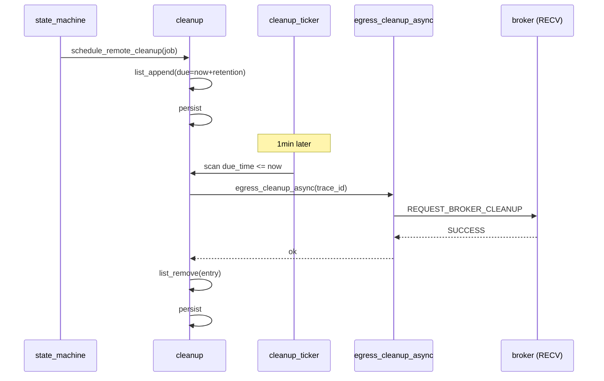

# M14 远端清理与保留 Checklist

> 配套: [doc/Broker开发任务清单.md](../Broker开发任务清单.md) §M14
> 设计: [doc/Broker详细设计文档MVP.md](../Broker详细设计文档MVP.md) §10.1（保留参数）/ §7.5（清理 RPC）
> Sprint: S3
> 依赖: M03-T2、M08-T1（egress 通用）、M07-T5（远端 cleanup handler）
> 下游: 无

---

## 1. 模块概述与目标

### 1.1 一句话定位

终态作业的 dst_work_dir 不能立即删除（用户可能需要回看日志）。MVP 按以下保留策略：
- COMPLETED：保留 24h（`RemoteWorkDirRetentionHours`）
- FAILED：保留 7d（`RemoteWorkDirFailureRetentionDays`）
到期后通过 `REQUEST_BROKER_CLEANUP` 通知远端 broker 删除。

### 1.2 MVP 范围

- 全局延迟队列：`{trace_id, due_time, dst_cluster, role}`
- cleanup ticker（每分钟检查），due 出队 → 发 RPC
- RPC 失败重试 3 次后丢警告（远端目录由运维 cron 兜底清理）

### 1.3 不在 MVP 范围

- ~~按 quota 主动清理~~：MVP 仅按时间
- ~~冷归档（先压缩后删）~~：v0.2

### 1.4 与设计文档差异

设计文档未明确给 cleanup 队列结构；本文档定义。

---

## 2. 接口契约

### 2.1 公共 API

```c
/* src/slurmbrokerd/cleanup.h */

extern int  cleanup_init(void);
extern void cleanup_fini(void);

/*
 * 由 M09-T7 终态时调用：根据 job state 决定 retention，入延迟队列。
 * 内部生成 cleanup_entry_t 并 list_append。
 */
extern void schedule_remote_cleanup(broker_job_t *job);
```

### 2.2 私有数据结构

```c
typedef struct {
	char     *trace_id;
	time_t    due_time;
	char     *dst_cluster;
	uint32_t  retry_count;
} cleanup_entry_t;

static list_t          *g_cleanup_queue;
static pthread_mutex_t  g_cleanup_mutex;
static pthread_t        cleanup_tid;
static volatile bool    cleanup_running;
```

### 2.3 持久化

cleanup_queue **必须**持久化，否则 broker 重启丢失"哪些目录待删"。MVP 选项：
- A. 写入独立文件 `cleanup_queue.jsonl`（与 state 文件并列）
- B. 把 cleanup_entry 信息嵌入 broker_job_t，但终态 job 已出表 → 矛盾
- C. 不出表，加 "tombstone" 状态保留在表里

**MVP 选 A**：独立 JSONL，最小侵入。

---

## 3. 参考代码

| 用途 | 文件 | 说明 |
|---|---|---|
| 1 分钟 ticker | [src/slurmctld/agent.c](../../src/slurmctld/agent.c) | 范式 |
| `list_t` + 时间排序 | [src/common/list.h](../../src/common/list.h) | 简化用 list_for_each |
| JSONL 写法 | [doc/checklists/M03-data-persist.md](M03-data-persist.md) | 复用 _save_one 模式 |

---

## 4. 文件清单

| 文件 | 类型 | 用途 |
|---|---|---|
| [src/slurmbrokerd/cleanup.h](../../src/slurmbrokerd/cleanup.h) | 新增 | API |
| [src/slurmbrokerd/cleanup.c](../../src/slurmbrokerd/cleanup.c) | 新增 | 队列 + ticker + persist |
| [src/slurmbrokerd/Makefile.am](../../src/slurmbrokerd/Makefile.am) | 修改 | 加 cleanup.c |
| [src/slurmbrokerd/state_machine.c](../../src/slurmbrokerd/state_machine.c) | 修改 | M09-T7 调 `schedule_remote_cleanup` |

---

## 5. 流程



---

## 6. 任务展开

### M14-T1 `schedule_remote_cleanup` 数据结构

- **依赖**: M03-T2
- **预估**: 0.5d
- **关键决策**:
  1. 入队：`due_time = now + retention`
  2. 立即 persist 当前 queue 到 `cleanup_queue.jsonl`
  3. queue 顺序按 due_time 升序（list_insert_sorted），简化扫描
- **代码草图**:

```c
int cleanup_init(void)
{
	g_cleanup_queue = list_create((ListDelF) _entry_free);
	slurm_mutex_init(&g_cleanup_mutex);
	_restore_from_disk();
	cleanup_running = true;
	slurm_thread_create(&cleanup_tid, _cleanup_main, NULL);
	return SLURM_SUCCESS;
}

void cleanup_fini(void)
{
	cleanup_running = false;
	pthread_join(cleanup_tid, NULL);
	_save_to_disk();
	FREE_NULL_LIST(g_cleanup_queue);
	slurm_mutex_destroy(&g_cleanup_mutex);
}

void schedule_remote_cleanup(broker_job_t *job)
{
	if (job->role != BROKER_ROLE_ORIGINATOR) return;

	cleanup_entry_t *e = xmalloc(sizeof(*e));
	e->trace_id = xstrdup(job->trace_id);
	e->dst_cluster = xstrdup(job->dst_cluster);
	e->retry_count = 0;

	time_t now = time(NULL);
	uint32_t retention_s;
	if (job->state == BROKER_STATE_COMPLETED) {
		retention_s = g_broker_conf.remote_work_dir_retention_hours
		              * 3600;
	} else {
		retention_s = g_broker_conf.remote_work_dir_failure_retention_days
		              * 86400;
	}
	e->due_time = now + retention_s;

	slurm_mutex_lock(&g_cleanup_mutex);
	list_append(g_cleanup_queue, e);
	slurm_mutex_unlock(&g_cleanup_mutex);

	_save_to_disk();
	info("cleanup: scheduled trace_id=%s due_in=%us",
	     e->trace_id, retention_s);
}

static void _entry_free(void *x)
{
	cleanup_entry_t *e = x;
	xfree(e->trace_id);
	xfree(e->dst_cluster);
	xfree(e);
}

/* 序列化为 JSONL，每行一个 entry，三字段简单 */
static void _save_to_disk(void)
{
	char *path = NULL, *tmp = NULL;
	xstrfmtcat(path, "%s/cleanup_queue.jsonl",
	           g_broker_conf.state_save_location);
	xstrfmtcat(tmp, "%s.tmp", path);

	FILE *fp = fopen(tmp, "w");
	if (!fp) goto done;
	slurm_mutex_lock(&g_cleanup_mutex);
	list_itr_t *itr = list_iterator_create(g_cleanup_queue);
	cleanup_entry_t *e;
	while ((e = list_next(itr))) {
		fprintf(fp, "{\"trace_id\":\"%s\",\"due_time\":%ld,"
		            "\"dst_cluster\":\"%s\",\"retry_count\":%u}\n",
		        e->trace_id, (long) e->due_time, e->dst_cluster,
		        e->retry_count);
	}
	list_iterator_destroy(itr);
	slurm_mutex_unlock(&g_cleanup_mutex);
	fflush(fp); fsync(fileno(fp)); fclose(fp);

	rename(tmp, path);
done:
	xfree(path); xfree(tmp);
}

static void _restore_from_disk(void)
{
	/* 简单 JSONL 反序列化，省略 - 与 M03 同套路 */
}
```

- **DoD**:
  - [ ] 入队后 list_count + 1
  - [ ] cleanup_queue.jsonl 立即写盘
  - [ ] restart 后队列恢复

### M14-T2 cleanup ticker

- **依赖**: M14-T1, M08-T1（egress_cleanup_async）
- **预估**: 0.5d
- **关键决策**:
  1. 每分钟扫一次队列（`sleep(60)`）
  2. due_time <= now 的 pop 出来
  3. 构 `REQUEST_BROKER_CLEANUP { trace_id }` 发送；失败 retry_count++
  4. retry == 3 → 丢警告（远端目录最终由运维 cron 兜底）
- **代码草图**:

```c
static void *_cleanup_main(void *arg)
{
	while (cleanup_running) {
		_tick_cleanup();
		for (int i = 0; i < 60 && cleanup_running; i++) sleep(1);
	}
	return NULL;
}

static void _tick_cleanup(void)
{
	time_t now = time(NULL);
	cleanup_entry_t *e;
	list_t *due_list = list_create(NULL);

	slurm_mutex_lock(&g_cleanup_mutex);
	list_itr_t *itr = list_iterator_create(g_cleanup_queue);
	while ((e = list_next(itr))) {
		if (e->due_time <= now)
			list_append(due_list, e);
	}
	list_iterator_destroy(itr);
	slurm_mutex_unlock(&g_cleanup_mutex);

	itr = list_iterator_create(due_list);
	while ((e = list_next(itr))) {
		int rc = egress_cleanup_async(e->trace_id);
		if (rc == SLURM_SUCCESS) {
			slurm_mutex_lock(&g_cleanup_mutex);
			list_delete_ptr(g_cleanup_queue, e);
			slurm_mutex_unlock(&g_cleanup_mutex);
		} else if (++e->retry_count >= 3) {
			warning("cleanup: trace_id=%s gave up after 3 retries",
			        e->trace_id);
			slurm_mutex_lock(&g_cleanup_mutex);
			list_delete_ptr(g_cleanup_queue, e);
			slurm_mutex_unlock(&g_cleanup_mutex);
		}
	}
	list_iterator_destroy(itr);
	FREE_NULL_LIST(due_list);

	_save_to_disk();
}
```

- **风险与坑**:
  - 大队列（万级）每分钟扫描可能慢；MVP < 1k 在途，无忧
  - `egress_cleanup_async` 实际是同步发 RPC（命名遗留），耗时几秒 × N，cleanup_main 吃住 OK
  - cleanup_main 与 schedule 并发，list_delete_ptr 必须持锁
- **DoD**:
  - [ ] 写一个 retention=60s 测试构造，60s 后远端 dst dir 被删（M07-T5 落地后联调）
  - [ ] 失败重试 3 次后清单弹出 + 警告日志

---

## 7. 整体 DoD（汇总）

- [ ] 2 子任务全部勾选
- [ ] 端到端：1 个 COMPLETED 作业 24h 后 dst_work_dir 删除（验证用 retention 改 1min 加速）
- [ ] FAILED 作业 7d 后删除（同上）
- [ ] broker 重启后 cleanup_queue 恢复
- [ ] valgrind clean

## 8. 验证脚本

```bash
# 修改保留为 60s 加速测试
sed -i 's/RemoteWorkDirRetentionHours=24/RemoteWorkDirRetentionHours=0/' \
    /etc/slurm/broker.conf
sed -i 's/RemoteWorkDirFailureRetentionDays=7/RemoteWorkDirFailureRetentionDays=0/' \
    /etc/slurm/broker.conf
# 注：MVP 不支持小时以下；如需更细粒度，临时把单位改 seconds for test

systemctl restart slurmbrokerd

# 投一个作业到 COMPLETED
./tests/broker/full_lifecycle.sh trace_id=xian-300

# 1 分钟后检查
ssh broker.wz.example.com 'ls -la /work/home/wz_test1/.burst/xian_cluster/'
# 期望：xian-300 目录已被删除
```

---

## 9. 风险与回滚

| 风险 | 触发 | 缓解 |
|---|---|---|
| cleanup_queue.jsonl 损坏 | 磁盘故障 | tmp + rename + .old fallback（与 M03 同套）|
| 远端目录已被人手动删 | 运维误操作 | egress_cleanup 返回错误也视为成功（rm -rf 幂等） |
| 队列爆炸（数百万 entries） | 长期不上 cleanup | MVP 不到这量级；可加 capacity warn |
| schedule 与 fini 竞态 | shutdown 时入队 | fini 先 stop ticker, 再 final save |

回滚：本模块独立。`git revert cleanup.c/.h + state_machine 调用`。
