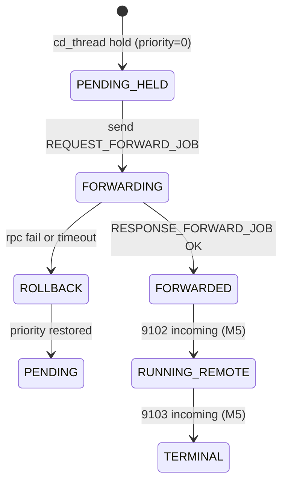

# ctld-M04 跨域转发线程 Checklist

> 配套: [doc/Slurmctld跨域详细设计文档MVP.md](../Slurmctld跨域详细设计文档MVP.md) §5
> 模块化总览: [.cursor/plans/ctld_cross-domain_modular_plan_*.plan.md](../../.cursor/plans/)
> 依赖: ctld-M01（msg_type / payload）、ctld-M02（broker_host/port 配置）、ctld-M03（cd_* 字段）
> 下游: ctld-M11（联调）

> **关键勘误**: 原 plan 的 `slurmctld_init()` / `slurmctld_fini()` 在本仓库 **不存在**。生命周期 hook 改为：
> - 启动：[src/slurmctld/controller.c:770-777](../../src/slurmctld/controller.c) `slurm_thread_create(_purge_files_thread)` 之后、`_slurmctld_background()` 之前
> - 退出：[src/slurmctld/controller.c:3531 slurmctld_shutdown()](../../src/slurmctld/controller.c) 函数顶部

---

## 1. 模块目标

ctld 启动一个后台线程 `cd_thread`，每 5 秒扫描 PENDING + cross_domain + 未转发 + priority>0 的作业，hold 后通过 munge 端口（默认 8442）调 broker `REQUEST_FORWARD_JOB`，等回 `RESPONSE_FORWARD_JOB(trace_id)` 后写回 `cd_remote_trace_id`。

## 2. 接口契约

### 2.1 公开头 `src/slurmctld/cross_domain.h`

```c
#ifdef __METASTACK_NEW_CROSS_DOMAIN
extern int  cross_domain_init(void);
extern void cross_domain_fini(void);
extern void cross_domain_handle_update_remote_state(slurm_msg_t *msg); /* M5 实现 */
extern void cross_domain_handle_terminal_state(slurm_msg_t *msg);     /* M5 实现 */
#endif
```

### 2.2 内部常量

```c
#define CD_SCAN_INTERVAL_SEC  5
#define CD_MAX_PER_ROUND      100
#define CD_RPC_TIMEOUT_SEC   30
#define CD_HOLD_STATE_DESC   "CrossDomainQueued"
```

### 2.3 状态机



### 2.4 Lock 顺序

参考 [src/slurmctld/locks.h](../../src/slurmctld/locks.h)。`_cd_handle_one_job` 严格用 `slurmctld_lock_t job_write_lock = { NO_LOCK, WRITE_LOCK, NO_LOCK, NO_LOCK, NO_LOCK }`，并且 RPC 调用前必须释锁。

---

## 3. 触及文件

| 文件 | 改动 |
|---|---|
| `src/slurmctld/cross_domain.h` | **新增** |
| `src/slurmctld/cross_domain.c` | **新增**（约 250 LoC） |
| [src/slurmctld/Makefile.am](../../src/slurmctld/Makefile.am) | `slurmctld_SOURCES` 追加 |
| [src/slurmctld/controller.c](../../src/slurmctld/controller.c) | 770-777 行附近 init；3531 行 shutdown 顶部 fini |

---

## 4. Checklist

### 4.1 头文件 + 骨架

- [ ] M4-1 新建 `src/slurmctld/cross_domain.h`：声明 4 个 extern + 内部常量；全文用 `#ifdef __METASTACK_NEW_CROSS_DOMAIN` 包裹
- [ ] M4-2 新建 `src/slurmctld/cross_domain.c`：file-level header（GPL 头 + 模块说明 + ifdef 块）

### 4.2 生命周期

- [ ] M4-3 实现 `cross_domain_init()`：
    - 检查 `slurm_conf.cross_domain_enabled`，0 则直接 return SUCCESS
    - 检查 `slurm_conf.broker_host`，NULL 则 `fatal("CrossDomainEnabled but BrokerHost not set")`
    - `slurm_thread_create(&cd_thread_id, _cd_thread, NULL)`
    - 内部 `cd_shutdown_flag = false`
- [ ] M4-4 实现 `cross_domain_fini()`：
    - `cd_shutdown_flag = true`
    - `slurm_cond_signal(&cd_wake_cond)` 唤醒线程
    - `pthread_join(cd_thread_id, NULL)`

### 4.3 主循环 `_cd_thread`

- [ ] M4-5 5s sleep 循环（用 `slurm_cond_timedwait` 而非 `sleep()`，方便 fini 立刻唤醒）
- [ ] M4-6 每轮收集 ≤ 100 个候选 job_id 数组（read_lock 内只复制 `job_id`，不持锁出循环）

### 4.4 单 job 处理 `_cd_handle_one_job`

- [ ] M4-7 write_lock 内：
    - 重新 `find_job_record(job_id)`
    - 二次校验 `IS_JOB_PENDING && cd_cross_domain && !(cd_forwarded & 1)`
    - 备份 `priority_orig = job_ptr->priority`
    - `job_ptr->priority = 0; job_ptr->state_desc = xstrdup(CD_HOLD_STATE_DESC); job_ptr->cd_forwarded |= 1`
    - 拷出 RPC 用字段（`src_job_id, src_uid, src_gid, src_user_name, target_cluster, src_work_dir, script_path, account, cd_app_name`）到栈上 `forward_job_msg_t`
- [ ] M4-8 释锁后调 `_cd_send_forward_to_broker(&req, &resp)`
- [ ] M4-9 RPC 成功：write_lock 内 `xfree(job_ptr->cd_remote_trace_id); job_ptr->cd_remote_trace_id = xstrdup(resp.trace_id)`
- [ ] M4-10 RPC 失败：调 `_cd_rollback(job_id, priority_orig)` 还原 priority、`cd_forwarded &= ~1`、清 state_desc

### 4.5 RPC 出站 `_cd_send_forward_to_broker`

- [ ] M4-11 `slurm_set_addr(&addr, slurm_conf.broker_port, slurm_conf.broker_host)`
- [ ] M4-12 `slurm_msg_t_init(&req_msg)`；`req_msg.msg_type = REQUEST_FORWARD_JOB`；`req_msg.protocol_version = SLURM_PROTOCOL_VERSION`；`req_msg.data = req`
- [ ] M4-13 `slurm_send_recv_msg(&addr, &req_msg, &resp_msg, CD_RPC_TIMEOUT_SEC)`
- [ ] M4-14 校验 `resp_msg.msg_type == RESPONSE_FORWARD_JOB`；其它视为失败
- [ ] M4-15 用完 `slurm_free_msg_members(&resp_msg)`，无内存泄漏

### 4.6 集成点

- [ ] M4-16 [src/slurmctld/Makefile.am](../../src/slurmctld/Makefile.am) `slurmctld_SOURCES` 追加 `cross_domain.c cross_domain.h`
- [ ] M4-17 [src/slurmctld/controller.c](../../src/slurmctld/controller.c) `#include "src/slurmctld/cross_domain.h"`；770-777 行附近、`_acct_update_thread` 后调 `cross_domain_init()`
- [ ] M4-18 同文件 `slurmctld_shutdown()` 函数顶部、`slurm_cond_signal(&shutdown_cond)` 之后调 `cross_domain_fini()`

### 4.7 单元自测

- [ ] M4-19 编译通过 + ctld 启动日志看到 `info("cd_thread: started")`
- [ ] M4-20 不开 `CrossDomainEnabled` 启动 ctld，cd_thread 不创建（`pgrep -fa cd_thread` 无）
- [ ] M4-21 单机自环（M11 联调最简版）：sbatch --cross-domain → 5s 内 `squeue` 看到 `priority=0` + `state_desc=CrossDomainQueued`

---

## 5. 验收标准

1. cd_thread 启动 + 关停干净（valgrind 不挂、`pthread_join` 正常返回）
2. broker 不可达时 cd_thread 仍然循环，每 5s 重试同一作业（`cd_forwarded` bit0 已置 1，所以会被 _cd_handle_one_job 二次校验跳过；rollback 回 0 后下轮重试）
3. broker 端 9100 入站日志 + ctld 端 9101 出站日志成对

## 6. 风险

- **风险 1**: hold 后 RPC 卡 30s 期间内用户取消作业。**降级**: rollback 也走 write_lock + 二次校验 `IS_JOB_PENDING`，不会撞已变 CANCELLED 的作业
- **风险 2**: `slurm_send_recv_msg` 对 munge socket 的支持。**降级**: 走 [src/slurmbrokerd/listener.c](../../src/slurmbrokerd/listener.c) 暴露的 8442 端口（loopback）；若标准 API 走不通，降级为 `slurm_open_msg_conn + slurm_msg_sendto + slurm_msg_recvfrom_timeout` 手动序列
- **风险 3**: target_cluster 字段空。**降级**: `_cd_handle_one_job` 拷字段时若 `target_cluster=NULL`，从 `slurm_conf.broker_forward_cluster` 兜底
