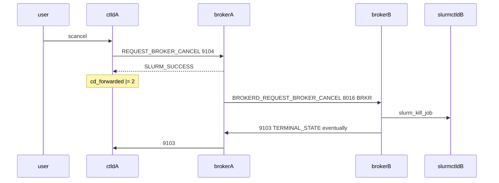

# ctld-M06 scancel 反向传播 Checklist

> 配套: [doc/Slurmctld跨域详细设计文档MVP.md](../Slurmctld跨域详细设计文档MVP.md) §7
> 模块化总览: [.cursor/plans/ctld_cross-domain_modular_plan_*.plan.md](../../.cursor/plans/)
> 依赖: ctld-M01（`REQUEST_BROKER_CANCEL` / `broker_cancel_msg_t`）、ctld-M02（broker_host）、ctld-M03（cd_forwarded）
> 下游: ctld-M11

---

## 1. 模块目标

用户 `scancel <jobid>` 时，ctld 主动向本地 broker 发 9104，broker 内部走 broker→broker 私有 BRKR 帧（8016）通知远端，让 B 集群作业被 `slurm_kill_job` 杀掉。



## 2. 接口契约

### 2.1 触发条件

```c
if (job_specs->job_state == JOB_CANCELLED &&
    (job_ptr->cd_forwarded & 1) &&     /* 已转发 */
    !(job_ptr->cd_forwarded & 2)) {    /* cancel 还没传播 */
    /* 发 9104，成功后置 bit1 */
}
```

### 2.2 失败处理

- RPC 失败 / broker 不可达：仅 `error()` 日志，**不阻塞**原生 cancel 流程；终态以 broker 9103 为准
- broker 返回 `ESLURM_INVALID_JOB_ID`：等价成功，置 bit1（远端可能已经在终态）

### 2.3 超时

5s（远端不可达时不卡用户）。

---

## 3. 触及文件

| 文件 | 锚点 |
|---|---|
| [src/slurmctld/job_mgr.c](../../src/slurmctld/job_mgr.c) | `update_job_str()` 入口；或更精确的 `_signal_job` / `job_signal()` |

> **决策**: 用 `update_job_str()` 而非 `_signal_job()`。理由: scontrol update job state=CANCELLED 与 scancel 都走 `update_job_str` 入口，覆盖面广；`_signal_job()` 还要补 `kill_job_msg_t` 路径。

---

## 4. Checklist

### 4.1 入口插钩

- [ ] M6-1 [src/slurmctld/job_mgr.c](../../src/slurmctld/job_mgr.c) 找到 `update_job_str()` 入口（在 `extern int update_job_str(...)` 函数体顶部，找 `job_specs->job_state` 解析的位置）
- [ ] M6-2 在 `find_job_record(job_id)` + 校验完之后，加 ifdef 块 + 调度 helper：
    ```c
    #ifdef __METASTACK_NEW_CROSS_DOMAIN
        if ((job_specs->job_state & JOB_STATE_BASE) == JOB_CANCELLED &&
            (job_ptr->cd_forwarded & 1) &&
            !(job_ptr->cd_forwarded & 2))
            _cd_propagate_cancel_to_broker(job_ptr);
    #endif
    ```

### 4.2 helper 实现

- [ ] M6-3 加 file-static helper `_cd_propagate_cancel_to_broker(job_record_t *jp)`：
    ```c
    static void _cd_propagate_cancel_to_broker(job_record_t *jp)
    {
        broker_cancel_msg_t cancel = {
            .src_job_id = jp->job_id,
            .trace_id   = NULL,
        };
        slurm_msg_t m;
        slurm_addr_t addr;
        int rc = 0;

        slurm_msg_t_init(&m);
        m.msg_type = REQUEST_BROKER_CANCEL;
        m.protocol_version = SLURM_PROTOCOL_VERSION;
        m.data = &cancel;
        slurm_set_addr(&addr, slurm_conf.broker_port,
                       slurm_conf.broker_host);

        if (slurm_send_recv_rc_msg_only_one(&addr, &m, &rc, 5) >= 0) {
            jp->cd_forwarded |= 2;
            info("cross_domain: cancel propagated to broker, "
                 "job=%u rc=%d", jp->job_id, rc);
        } else {
            error("cross_domain: cancel propagate failed, "
                  "job=%u (will be retried via broker 9103)",
                  jp->job_id);
        }
    }
    ```

### 4.3 边界

- [ ] M6-4 `cd_forwarded & 2` 已置位时直接 return（重复 scancel 幂等）
- [ ] M6-5 `slurm_conf.broker_host == NULL` 时跳过（CrossDomainEnabled 关）
- [ ] M6-6 不持锁调 RPC（caller 已在 write_lock 外或临界区已经释放）；如果 `update_job_str` 调用点持 lock，把 helper 拷字段后解锁再发

### 4.4 测试

- [ ] M6-7 单元：写跨域字段后 scancel，看 ctld 日志 `cancel propagated to broker` + `cd_forwarded` bit1 置位
- [ ] M6-8 broker 故意 stop 时 scancel，原生 cancel 流程仍然成功；用户 squeue 看到 CANCELLED

---

## 5. 验收标准

1. A 端 scancel → broker 9104 入站 → B 端 slurm_kill_job 触发 → B 端 sacct CANCELLED
2. 重复 scancel 同一作业 → 第二次不再发 9104（看 broker 日志计数）
3. broker stop → A 端 scancel 仍然成功（原生 cancel 流程正常），ctld 日志报 `cancel propagate failed`

## 6. 风险

- **风险 1**: `update_job_str` 内 lock 状态。**降级**: 用 `slurm_send_recv_rc_msg_only_one` 同步 5s 超时，并把 helper 内不持 job lock；如果 caller 路径持 lock，重构 helper 拆为"锁内拷字段 + 锁外发 RPC + 锁内置位"
- **风险 2**: 9104 在 broker 端被忽略。**降级**: M10 完成后 broker 端 [src/slurmbrokerd/handler_ctld.c](../../src/slurmbrokerd/handler_ctld.c) 的 `BROKERD_REQUEST_BROKER_CANCEL` 路径会复用，同 case
