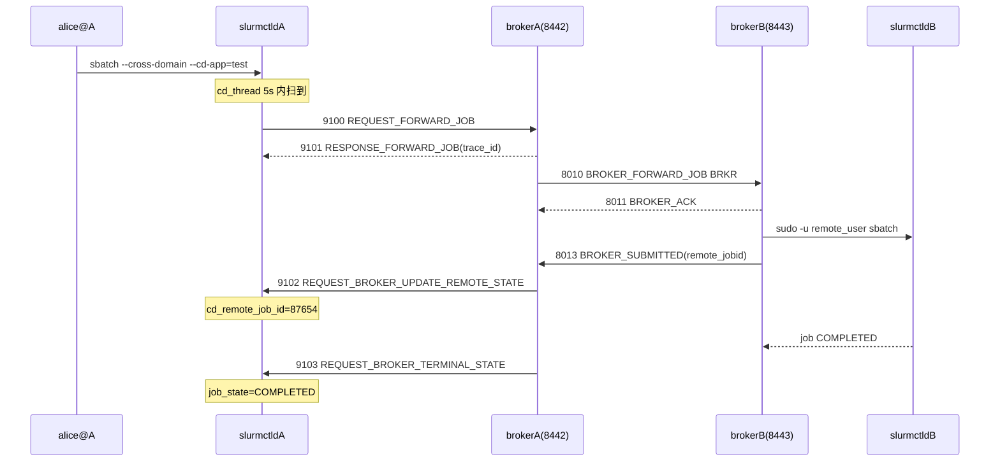

# ctld-M11 端到端联调 Checklist

> 配套: [doc/Slurmctld跨域详细设计文档MVP.md](../Slurmctld跨域详细设计文档MVP.md) §9
> 配套（broker 部署）: [doc/Broker详细设计文档MVP_new.md](../Broker详细设计文档MVP_new.md)
> 模块化总览: [.cursor/plans/ctld_cross-domain_modular_plan_*.plan.md](../../.cursor/plans/)
> 依赖: ctld-M01..ctld-M10 全部完成
> 下游: 第二阶段（持久化、ACL、分区路由）

---

## 1. 模块目标

把 ctld + broker 两端跑成一条完整的跨域闭环，验证：



## 2. 拓扑准备

### 2.1 单机自环（M11.2）

ctld + broker 同机，broker 配 `RemoteBrokerHost=127.0.0.1`、`RemoteBrokerPort=8443`，`8442` 自环，A 集群打回 A 自身。

### 2.2 双机（M11.3）

| 主机 | 角色 |
|---|---|
| A.example.com | slurmctld + slurmd + brokerA |
| B.example.com | slurmctld + slurmd + brokerB |

A 端 broker 配 `RemoteBrokerHost=B.example.com`；B 端 `RemoteBrokerHost=A.example.com`。

### 2.3 配置文件

`/etc/slurm/slurm.conf`（A 集群额外段）：

```
CrossDomainEnabled=YES
BrokerHost=127.0.0.1
BrokerPort=8442
BrokerForwardCluster=clusterB
BrokerForwardPartition=normal
```

`/etc/slurm/broker.conf`（A 集群）：

```
ClusterName=clusterA
BrokerNodeName=brokerA
RemoteClusterName=clusterB
RemoteBrokerHost=B.example.com
RemoteBrokerPort=8443
DefaultRemotePartition=normal
StateSaveLocation=/var/spool/slurm/broker
StageSshKey=/etc/slurm/broker_id_rsa
StageSshUser=slurm
LookupSoftwareScript=/etc/slurm/lookup_software.sh
```

`user_mapping`（broker 用户映射文件）：

```
alice@clusterA  alice@clusterB
bob@clusterA    bob@clusterB
```

---

## 3. Checklist

### 3.1 编译验证 (M11.1)

- [ ] M11-1 `cd /Volumes/yuanhao/sugon/版本/3.4/代码/metastack_test && ./configure && make -j` 全树通过
- [ ] M11-2 三个二进制都生成：
    - `src/slurmctld/slurmctld`
    - `src/slurmbrokerd/slurmbrokerd`
    - `src/slurmbrokerd/inject_broker_forward`
- [ ] M11-3 `make install` 通过；`scontrol --version`、`sbatch --version`、`squeue --version`、`slurmbrokerd --help` 全部正常
- [ ] M11-4 `sbatch --help | grep -E "cross-domain|cd-app"` 看到 2 行帮助
- [ ] M11-5 `squeue --help | grep remote` 看到帮助

### 3.2 单机自环 (M11.2)

- [ ] M11-6 启动 ctld + broker（同一节点）：`systemctl start slurmctld slurmbrokerd`
- [ ] M11-7 `journalctl -u slurmctld | grep cross_domain` 看到 `cd_thread: started, scan_interval=5s`
- [ ] M11-8 `journalctl -u slurmbrokerd | grep listener` 看到 8442 / 8443 都监听
- [ ] M11-9 提交跨域作业：
    ```bash
    cat > /tmp/cd-hello.sh <<'EOF'
    #!/bin/bash
    #SBATCH --cross-domain
    #SBATCH --cd-app=test
    echo hello-cross-domain
    sleep 30
    EOF
    sbatch /tmp/cd-hello.sh
    ```
- [ ] M11-10 5s 内 `squeue --remote` 看到 `REMOTE_CLUSTER=clusterA`（自环情况下 forward 回自己）；ctld 日志看到 `cd_thread: forwarded job=N to broker`
- [ ] M11-11 broker 日志看到 9100 入站、9102/9103 出站
- [ ] M11-12 `scontrol show job <id>` 看到 2 行跨域信息
- [ ] M11-13 30s 后作业 COMPLETED，`squeue` 列表清空，`sacct -j <id>` 看到 COMPLETED + ExitCode=0

### 3.3 双机 (M11.3)

- [ ] M11-14 双机 ssh 互通 + munge key 一致 + broker_id_rsa 写入对端 authorized_keys
- [ ] M11-15 A 端 alice 提交：`sbatch --cross-domain --cd-app=test /tmp/cd-hello.sh`
- [ ] M11-16 5s 内 A `squeue --remote -u alice` 看到 `REMOTE_CLUSTER=clusterB`、`REMOTE_JOBID=<B 端真实 jobid>`
- [ ] M11-17 B 端 `squeue` 看到 alice 的真实作业（brokerB sudo 提交）
- [ ] M11-18 B 端作业完成 → A 端 `squeue --remote -u alice` 看到状态变 COMPLETED
- [ ] M11-19 A 端 `sacct -j <id>` 看到 COMPLETED；B 端 `sacct -j <B-id>` 同样 COMPLETED

### 3.4 scancel 反向 (M11.4)

- [ ] M11-20 A 端再次提交跨域作业，等 5s 让其转发到 B 端 + 进入 RUNNING
- [ ] M11-21 A 端 `scancel <A-jobid>` → ctld 日志看到 `cancel propagated to broker, job=N`
- [ ] M11-22 broker A 日志看到 9104 入站；broker B 日志看到 8016 BRKR 帧入站
- [ ] M11-23 B 端 `slurm_kill_job` 触发 → B 端 `sacct -j <B-id>` 看到 CANCELLED
- [ ] M11-24 A 端 `sacct -j <A-id>` 看到 CANCELLED（由 broker 9103 注入）
- [ ] M11-25 重复 scancel 同一作业 → 第二次 broker 日志不再看到 9104 入站

### 3.5 异常路径

- [ ] M11-26 broker B stop，A 端 sbatch --cross-domain：cd_thread 转发失败，5s 重试一次（broker A 日志看到重连失败）；用户 squeue 看到作业一直在 PENDING + state_desc=CrossDomainQueued
- [ ] M11-27 broker B 起回来，A 端作业 5s 内被转发，链路恢复
- [ ] M11-28 broker A stop，A 端 scancel 仍然成功（原生 cancel 流程），ctld 日志报 `cancel propagate failed`，作业本地变 CANCELLED；broker A 起回来后人工修复（第二阶段补 orphan 监控）

### 3.6 回归

- [ ] M11-29 不带 --cross-domain 提交 100 个普通作业，全部正常完成；`grep cross_domain /var/log/slurm/slurmctld.log` 无干扰输出
- [ ] M11-30 `scontrol reconfigure` 后 cd_thread 不重启（CrossDomainEnabled 未变），不影响新作业
- [ ] M11-31 `valgrind --leak-check=full slurmctld` 跑 5 分钟跨域作业 + cancel，无新增泄漏（M3 的 7 个 xfree 都被 hit）

---

## 4. 验收标准

1. § 3.1 编译 100% 通过
2. § 3.2 单机自环全部 13 项通过
3. § 3.3 双机全部 6 项通过
4. § 3.4 scancel 反向全部 6 项通过
5. § 3.5 异常路径至少 3 项通过（M11-26..28）
6. § 3.6 回归 0 退化

## 5. 第二阶段已知不在范围

- ctld 重启后跨域字段丢失（_dump_job_state / _load_job_state 未改）
- partition `SendTo=` 物理路由 / `AllowApp=` ACL
- DBD `as_mysql_job` schema + sacct `Remote_*` 列
- scontrol show job 完整跨域字段（本期只 2 行）
- squeue 8 个 `%R*` 占位符全集（本期只 2 个 RC/RJ）
- 跨域线程 cancel 反向扫描 / orphan 监控
- reconfigure 实时生效（本期需重启 ctld）

## 6. 上线建议

1. 先在 M11.2 单机环境下全套跑通
2. 再在 M11.3 双机环境下全套跑通
3. 灰度放给 1 个用户的 1 个分区，观察 1 周日志
4. 全集群打开 `CrossDomainEnabled=YES`
